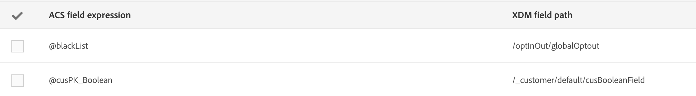

# Mappningsdefinition {#mapping-definition}

>[!IMPORTANT]
>
>Campaign Standard Data-tjänsten är för närvarande i betaversion, som kan komma att uppdateras ofta utan föregående meddelande. Kunderna måste vara värdbaserade på Azure (för närvarande endast betaversioner för Nordamerika) för att få tillgång till dessa funktioner. Kontakta Adobes kundtjänst om du vill ha tillgång till tjänsten.

I det här avsnittet får du lära dig att mappa ett fält av typen Campaign Standard till ett XDM-fält (Experience Data Model).

För att kunna utföra den här uppgiften måste du:

* en XDM-schemadefinition via gränssnittet eller genom att använda REST-API:t som är associerat med XDM
* en datauppsättning som baseras på XDM-schemadefinitionen

1. Gå till **[!UICONTROL Administration]** > **[!UICONTROL Development]** > **[!UICONTROL Platform]** och välj **[!UICONTROL Data mappings]** posten.

1. Klicka på **[!UICONTROL Create]** för att starta en ny XDM-mappning.

   

1. Fyll i de obligatoriska fälten och välj:

   * en **målinriktning**: det här är Campaign Standard-schemat som ska mappas
   * en **datauppsättning**: detta är det datapaket som är kopplat till ett XDM-schema i Adobe Experience Platform.

>[!NOTE]
>
>För att en batch ska kunna hämtas till kundprofil eller identitetstjänst i realtid måste datauppsättningen [aktiveras för kundprofil](https://www.adobe.io/apis/experienceplatform/home/tutorials/alltutorials.html#!api-specification/markdown/narrative/tutorials/data_ingestion_tutorial/data_ingestion_tutorial.md)i realtid.
>
>Om den datauppsättning du väljer redan används i en befintlig datamappning visas en varning om att dina data kan skrivas över på Adobe Experience Platform. Detta kan inträffa när det finns vissa vanliga mottagare i datamappningar som använder samma datamängd.

På följande skärm visas det avsnitt där du kan skapa en ny mappning för varje fält i Campaign Standard-schemat. **[!UICONTROL Field mappings]**

Med **[!UICONTROL Create new field mapping]** knappen kan du välja fältet Campaign Standard och motsvarande fältsökvägsuttryck i XDM-schemat.

Om du inte kan hitta något fält av typen Campaign Standard kan du använda sökfältet för att söka efter fältet. För närvarande fungerar sökningen endast för fält som är öppna i hierarkin.

De utökade resurser som definieras i Campaign Standard mappas som alla inbyggda fält. De definieras i tillägget _customer/default i XDM.

Du kan anpassa XDM-tillägget via API:t och definiera ett eget tillägg så att du får bättre kontroll över mappningen.

Mer information om XDM API finns i [Schemaregistrets API-självstudiekurs](https://www.adobe.io/apis/experienceplatform/home/xdm/xdmservices.html#!api-specification/markdown/narrative/tutorials/schema_registry_api_tutorial/schema_registry_api_tutorial.md) .

Om du vill mappa ett uppräkningsfält måste du använda uttrycksredigeraren för att definiera varje uppräkningsvärde som motsvarar XDM-värdet. Fältet för postadress måste till exempel definieras som:

Om XDM-värdet definieras som en uppräkning i XDM-schemat kan du använda den inbyggda EXDM-funktionen som automatiskt ersätter **lif** -syntaxen.

Om du vill redigera en XDM-mappning öppnar du den, ändrar informationen och sparar den.

>[!IMPORTANT]
>
>Om du för närvarande redigerar ett värde i avsnittet och sedan klickar utanför fältet, visas inte ändringen i gränssnittet förrän du klickar på **[!UICONTROL Field mappings]** **[!UICONTROL Save]** knappen. Detta beteende inträffar endast en gång när redigeringen på **[!UICONTROL Field Mappings]** är den första redigeringen på sidan.
