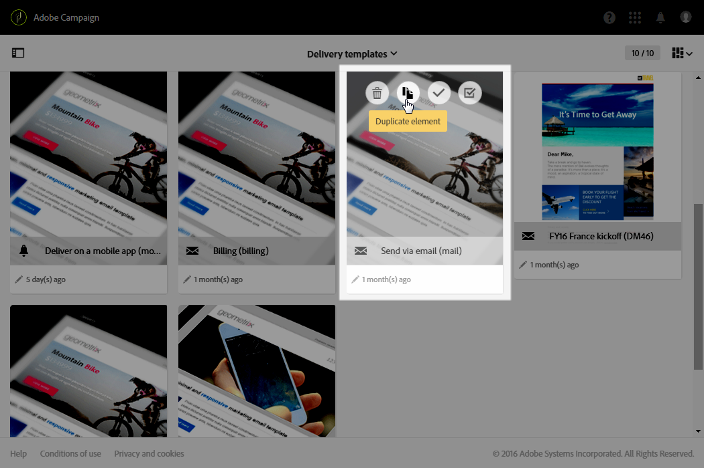
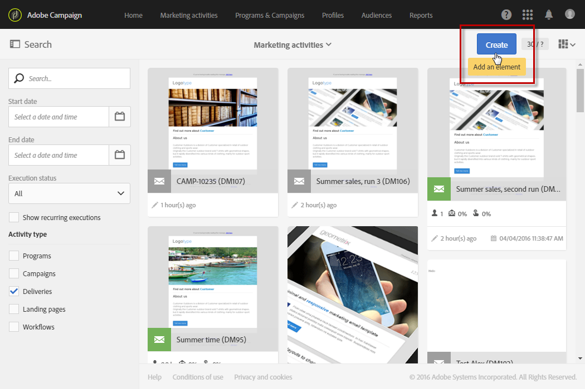

# Varumärke{#branding}

## Om varumärkesidentitet {#about-brand-identity}

Alla företag har grafiska och tekniska riktlinjer. Med Adobe Campaign kan du definiera en uppsättning specifikationer för att presentera ett konsekvent varumärke för dina kunder, från logotyper till tekniska aspekter som e-postavsändare, URL-adress eller domäner.

Tekniska administratörer kan definiera ett eller flera varumärken för att centralt ange parametrar som påverkar ett varumärkes identitet. Detta inkluderar logotypen, domänen för landningssidans åtkomst-URL eller inställningar för meddelandespårning. Med Adobe Campaign kan du skapa dessa varumärken och koppla dem till meddelanden eller landningssidor. Den här konfigurationen hanteras i mallar.

## Konfigurera och använda varumärken {#configuring-and-using-brands}

Huvudprincipen för att konfigurera och använda varumärken är att:

1. skapa och konfigurera varumärket – den här åtgärden kräver specifika behörigheter och utförs av den tekniska administratören för Adobe Campaign. Steg för att få ett nytt varumärke i Campaign är detaljerade [i det här avsnittet](#creating-a-brand).
1. skapa en eller flera mallar för leverans- och landningssidor för det här varumärket. Mer information finns i avsnittet [Skapa en mall](../../start/using/marketing-activity-templates.md).
1. Skapa meddelanden och landningssidor baserade på den här mallen. Se avsnitten [Skapa ett e-postmeddelande](../../channels/using/creating-an-email.md) och [Skapa en landningssida](../../channels/using/designing-a-landing-page.md).

>[!IMPORTANT]
>
>Varumärken kan inte skapas eller ändras av slutanvändare: dessa åtgärder måste utföras av den tekniska administratören för Adobe Campaign. Kontakta Adobes kundtjänst om du har frågor.
>
>Det går inte att använda flera varumärken i samband med transaktionsmeddelanden. Mer information finns i [Transaktionsmeddelanden och varumärke](../../channels/using/transactional-messaging-limitations.md#permissions-and-branding).

Varumärken finns på menyn **[!UICONTROL Administration > Instance settings > Brand configuration]**.

Som standard visas ett nyligen skapat varumärke endast för användare som tilldelats motsvarande behörigheter av administratören.

Ett **varumärke** definieras av följande egenskaper:

* En **identitet**, som definierar och personanpassar varumärket. Det här avsnittet innehåller följande fält:

   

   * **Etikett** som visas i gränssnittet
   * **Varumärkets namn**
   * **Varumärkets webbplats-URL** och **webbplatsetikett**
   * **Varumärkets logotyp**

* **[!UICONTROL Header parameters of sent emails]** som anpassar vad mottagarna av dina kampanjer kommer att se. Det här avsnittet innehåller följande fält:

   

   * **Avsändare (e-postadress)** med varumärkets e-postadress.
   * **Avsändare (namn)** med varumärkets namn.
   * **Skicka svar till (e-postadress)** med den e-postadress som kunden kan svara på.
   * **Skicka svar till (namn)** med varumärkets namn.
   * **Fel (e-postadress)** med den e-postadress som ska användas om ett fel uppstår.

   >[!IMPORTANT]
   >
   >Om avsändarens namn och e-postadress inte har ändrats i det e-postmeddelande som skapas från mallen ska du kontrollera mallens avancerade inställningar när du har uppdaterat rubrikparametrarna för e-postmeddelandena.

* **Server som visas på Internet** definierar de servrar som används för spårning men även för åtkomst till landningssidor. Det här avsnittet innehåller följande fält:

   

   * **Extern URL för den programserver** används som värd och för åtkomst till de olika landningssidor som du skapar.
   * **Extern URL för spårningsservern** används som spårad URL under leveranser.
   * **Extern URL för spegelsidservern** används som standardspegelsida i dina leveranser.

   >[!NOTE]
   >
   >Om du vill visa förhandsgranskningen av landningssidan och återgivningen av spegelsidan i användargränssnittet för Campaign måste URL:erna för programservern och spegelsidservern vara säkra. I så fall ska du använda https:// i stället för http:// när du konfigurerar dessa URL-adresser.

* **[!UICONTROL Tracking URL configuration (Web Analytics)]**, som definierar konfigurationen för spårning av URL:er för ert varumärke.

   De ytterligare parametrar som gör det möjligt att spåra länkar på externa system, som Web Analytics-verktyg som Adobe Analytics eller Google Analytics, definieras här.

   

## Skapa ett nytt varumärke {#creating-a-brand}

Du kan lägga till nya enheter i organisationen i Campaign eller skapa en ny typ av e-post som du måste skicka under en annan underdomän. Gör så här:

1. **Konfigurera en ny underdomän** - För alla nya underdomäner som ska användas av Adobe är det första steget att konfigurera den. Du kan göra detta genom att [Kontrollpanelen för kampanj](https://experienceleague.adobe.com/docs/control-panel/using/subdomains-and-certificates/subdomains-branding.html?lang=sv) eller kontakta Adobe tekniska kontaktpersoner. Läs mer om konfiguration av underdomäner [i den här artikeln](https://experienceleague.adobe.com/docs/deliverability-learn/deliverability-best-practice-guide/additional-resources/campaign/ac-domain-name-setup.html).

   >[!NOTE]
   >
   >Kontrollpanelen är tillgänglig för alla administratörsanvändare. Stegen för att bevilja administratörsåtkomst till en användare finns på [den här sidan](https://experienceleague.adobe.com/docs/control-panel/using/discover-control-panel/managing-permissions.html?lang=sv#discover-control-panel).

1. **Skapa en biljett** - När underdomänen har konfigurerats konfigureras den av Adobe i din produktionsmiljö. För att begära detta [skapa en biljett till kundtjänst](https://helpx.adobe.com/se/enterprise/using/support-for-experience-cloud.html) med följande information:

   * Ämne: ACS Ny varumärkeskonfiguration

   * Innehåll: En ny domän har konfigurerats och vi vill konfigurera den i vår Campaign-plattform

   * Domän: XXX

   * Produktions-URL: XXX.campaign.adobe.com

1. **Skapa en leveransmall** - När det nya varumärket finns tillgängligt är det bästa sättet att skapa minst en ny tom leveransmall som refererar till det nya varumärket. [Läs mer](#linking-a-brand-to-a-template).

1. **Riktlinjer för kontroll av leveransbarhet** - Innan du börjar använda den nya domänen bör strategin diskuteras med Adobe Deliverability-teamet. De hjälper dig att definiera de bästa metoderna om en ny tillhörighet ska skapas för att till exempel dela IP-adresser mellan domäner och/eller om en rampplan ska definieras. Läs mer om god praxis för slutprodukter [i det här avsnittet](../../sending/using/about-deliverability.md).

## Tilldela ett varumärke till ett e-postmeddelande {#assigning-a-brand-to-an-email}

### Länka ett varumärke till en mall {#linking-a-brand-to-a-template}

Om du vill använda de parametrar som definierats för ett varumärke måste det vara kopplat till en leveransmall eller en landningssidmall. Om du vill göra det måste du skapa eller redigera en mall.

>[!NOTE]
>
>Mer information om hur du skapar en mall finns i avsnittet [Skapa en mall](../../start/using/marketing-activity-templates.md).

När mallen har skapats kan du koppla den till ett varumärke. Så här gör du:

1. Klicka på knappen **[!UICONTROL Edit properties]** för att komma åt mallegenskaperna.

   

1. Använd listrutan för att välja det varumärke som du vill koppla till mallen.

   >[!NOTE]
   >
   >Som standard är alternativet **[!UICONTROL Default brand (branding)]** markerat.

   

   Klicka på ikonen **[!UICONTROL Navigate to the detail of the element selected]** för att visa hur det valda varumärket är konfigurerat.

   

1. Bekräfta valet och spara mallen.

Din mall är kopplad till varumärket. I e-postredigeraren kommer element som **e-postadressen till standardavsändaren**, **standardavsändarens namn** eller **logotypen** att använda konfigurerade varumärkesdata.

### Användningsfall för varumärke {#branding-use-case}

I det här exemplet ska vi skapa ett nytt reserelaterat varumärke och använda det i ett e-postmeddelande.

#### Steg 1: Konfigurera ett nytt varumärke {#configure-a-new-brand}

>[!IMPORTANT]
>
>Varumärkeskonfigurationen hanteras endast av Adobe eftersom den kräver särskilda behörigheter och tekniska inställningar.

1. Adobe Campaign-administratören skapar först varumärket från **[!UICONTROL Administration > Instance settings > Brand configuration]** och lägger till **Semester i Tropica** -element och konfigurerar **[!UICONTROL ID]** och **[!UICONTROL Header parameters of sent emails]** av varumärket.

   

1. Administratören konfigurerar sedan URL:en för de(n) **servern/servrarna som visas på Internet** så att landningssidor kan användas och spårnings-URL:er.

   I det här exemplet används verktyget **Web Analytics** som **Google Analytics**. Administratören konfigurerar spårnings-URL enligt följande:

   

Varumärket skapas och konfigureras korrekt. Det kan nu användas av marknadsföringsteamen.

#### Steg 2: Implementera ett nytt varumärke {#implement-a-new-brand}

Som leveranschef ansvarar du för att skapa leveransmallar för det nya varumärket. Följ stegen nedan för att uppnå detta:

1. På den avancerade menyn **[!UICONTROL Resources > Templates > Delivery templates]** duplicerar du en inbyggd mall för att konfigurera en ny leveransmall.

   

1. Om du vill koppla den här mallen till varumärket **Resor i tropikerna** redigerar du mallegenskaperna och väljer varumärket i listrutan.

   

1. Konfigurera den här e-postmallen för att återspegla varumärkesidentiteten.
1. När mallen är klar kan du spara den.

   

   Leveransmallen kan nu användas för att skapa e-postmeddelanden som skickas till en målgrupp.

#### Steg 3: Använd det nya varumärket i en leverans {#use-the-new-brand-in-a-delivery}

Följ stegen nedan för att skapa ett e-postmeddelande som är kopplat till ett varumärke:

1. Klicka på knappen **[!UICONTROL Create]** på menyn **[!UICONTROL Marketing activities]**.

   

1. Markera aktiviteten **[!UICONTROL Email]** och välj sedan den mall som är kopplad till det nya varumärket.

   

1. Din e-postadress har redan konfigurerats. Du kan kontrollera informationen innan du testar den med testprofilerna och sedan skicka den till din målgrupp.

   
