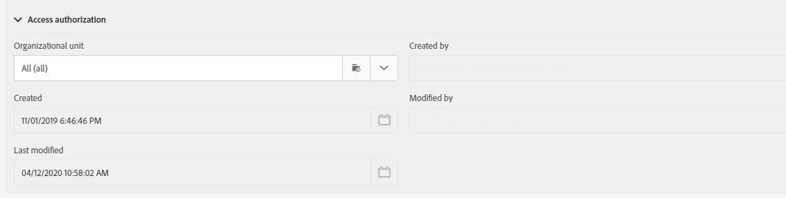

# Konfigurera en mobilapplikation{#configuring-a-mobile-application}

## Konfigurera ett mobilprogram med Adobe Experience Platform SDK {#using-adobe-experience-platform-sdk}

>[!IMPORTANT]
>
> Adobe Experience Platform Launch har omklassificerats som en serie datainsamlingstekniker i Adobe Experience Platform. Som ett resultat av detta har flera terminologiska förändringar införts i produktdokumentationen. Läs mer i [följande dokument](https://experienceleague.adobe.com/docs/experience-platform/tags/term-updates.html) för en konsoliderad hänvisning till terminologiska förändringar.

Observera att push-meddelanden och implementeringar i appen måste utföras av expertanvändare. Kontakta er kontoansvarige på Adobe eller er partner inom Professional Services om du behöver hjälp.

För att skicka push-meddelanden och meddelanden i appen med Experience Platform SDK-programmet måste ett mobilprogram konfigureras i användargränssnittet för datainsamling och konfigureras i Adobe Campaign.

När du har konfigurerat ett mobilprogram kan du hämta de PII-data som samlas in för att skapa eller uppdatera profiler från databasen. Mer information finns i följande avsnitt: [Skapa och uppdatera profilinformation baserat på mobilprogramdata](../../channels/using/updating-profile-with-mobile-app-data.md).

Om du vill veta mer om de olika användningsfall för mobila enheter som stöds i Adobe Campaign Standard med Adobe Experience Platform SDK:er kan du läsa detta [page](../../administration/using/supported-mobile-use-cases.md).

Så här slutför du konfigurationen:

1. Kontrollera att du har åtkomst till följande i Adobe Campaign:
   * **[!UICONTROL Push notification]**
   * **[!UICONTROL In-App message]**
   * **[!UICONTROL Adobe Places]**

   Om inte, kontakta ditt kontoteam.

1. Kontrollera att din användare har nödvändig behörighet i Adobe Campaign Standard och taggar i Adobe Experience Platform.
   * Kontrollera att IMS-användaren är en del av standardproduktprofilerna för användare och administratörer i Adobe Campaign Standard. I det här steget kan användaren logga in på Adobe Campaign Standard, navigera till Experience Platform SDK-mobilappssidan och visa mobilappsegenskaperna som du skapade i användargränssnittet för datainsamling.

   * I användargränssnittet för datainsamling kontrollerar du att IMS-användaren är en del av produktprofilen för Experience Platform Launch.
I det här steget kan användaren logga in på användargränssnittet för datainsamling för att skapa och visa egenskaperna. Mer information om produktprofiler i användargränssnittet för datainsamling finns i [Skapa en produktprofil](https://experienceleague.adobe.com/docs/experience-platform/tags/admin/manage-permissions.html#gain-admin-rights-for-a-tags-product-profile). I produktprofilen bör det inte finnas någon behörighet för företaget eller egenskaperna, men användaren bör fortfarande kunna logga in.

   Om du vill utföra ytterligare åtgärder som att installera ett tillägg, publicera ett program, konfigurera miljöer och så vidare, måste du ange behörigheter i produktprofilen.

1. Skapa en **[!UICONTROL Mobile property]**. Mer information finns i [Konfigurera en mobil egenskap](https://developer.adobe.com/client-sdks/documentation/getting-started/create-a-mobile-property).

1. I användargränssnittet för datainsamling klickar du på **[!UICONTROL Extensions]** flik, gå till **[!UICONTROL Catalog]** och sök efter **[!UICONTROL Adobe Campaign Standard]** tillägg. Mer information finns i [Adobe Campaign Standard](https://developer.adobe.com/client-sdks/documentation/adobe-campaign-standard).

1. Om du vill ha stöd för platsanvändningsfall i Campaign Standard installerar du **[!UICONTROL Places]** i användargränssnittet för datainsamling. Se detta [page](https://developer.adobe.com/client-sdks/solution/places).

1. Konfigurera den mobila egenskap som du skapade i användargränssnittet för datainsamling i Adobe Campaign Standard. Se [Konfigurera ditt Adobe Experience Platform Launch-program i Adobe Campaign](../../administration/using/configuring-a-mobile-application.md#set-up-campaign).

1. Lägg till den kanalspecifika konfigurationen i konfigurationen för mobilprogrammet.
Mer information finns i [Kanalspecifik programkonfiguration i Adobe Campaign](../../administration/using/configuring-a-mobile-application.md#channel-specific-config).

1. Om det behövs kan du ta bort taggegenskapen.
Mer information finns i [Tar bort programmet](../../administration/using/configuring-a-mobile-application.md#delete-app).

## Synkronisera mobilappen AEPSDK från det tekniska arbetsflödet i Launch {#aepsdk-workflow}

När du har skapat och konfigurerat din mobila egenskap i användargränssnittet för datainsamling **[!UICONTROL Sync Mobile app AEPSDK from Launch]** det tekniska arbetsflödet synkroniserar nu de taggegenskaper som importeras i Adobe Campaign Standard.

Som standard startar det tekniska arbetsflödet var 15:e minut. Vid behov kan den startas om manuellt:

1. I Adobe Campaign Standard väljer du **[!UICONTROL Administration]** > **[!UICONTROL Application Settings]** > **[!UICONTROL Workflows]**.
1. Öppna **[!UICONTROL Sync Mobile app AEPSDK from Launch (syncWithLaunch)]** arbetsflöde.

   

1. Klicka på **[!UICONTROL Scheduler]** aktivitet.

1. Välj **[!UICONTROL Immediate execution]**.

   

Arbetsflödet kommer nu att startas om och synkroniseras med de taggegenskaper som importeras i Adobe Campaign Standard.

## Konfigurera programmet i Adobe Campaign {#set-up-campaign}

Om du vill använda en tagg för mobil egenskap i Campaign måste du även konfigurera den här egenskapen i Adobe Campaign. Kontrollera att IMS-användaren är en del av standardproduktprofilerna för användare och administratörer i Adobe Campaign.

Du måste vänta på att det tekniska arbetsflödet ska köras och synkronisera taggens mobila egenskap till Adobe Campaign. Sedan kan du konfigurera det i Adobe Campaign.

Mer information om Synkronisera mobilappen AEPSDK från det tekniska arbetsflödet vid start finns i detta [section](../../administration/using/configuring-a-mobile-application.md#aepsdk-workflow).

>[!NOTE]
>
>Som standard kan administratörer med organisationsenhet inställd på ALL redigera mobilprogrammet.

1. Välj på den avancerade menyn **[!UICONTROL Administration]** > **[!UICONTROL Channels]** > **[!UICONTROL Mobile app (AEP SDK)]**.

   

1. Välj det mobilprogram som du skapade i användargränssnittet för datainsamling.
dess **[!UICONTROL Property Status]** bör **[!UICONTROL Ready to configure]**.

   >[!NOTE]
   >
   >Som standard används det värde som definieras i alternativet NmsServer_URL för att söka efter matchande egenskaper för att hämta listan med mobilprogram som skapats i användargränssnittet för datainsamling.
   >
   >I vissa fall kan Campaign-slutpunkten för ett mobilprogram skilja sig från den som definieras i NmsServer_URL. I så fall definierar du slutpunkten i `Launch_URL_Campaign` alternativ. I Campaign används värdet från det här alternativet för att söka efter matchande egenskaper i användargränssnittet för datainsamling.

   

1. Du kan ändra organisationsenheten för ditt mobilprogram under **[!UICONTROL Access Authorization]** för att begränsa åtkomsten till det här mobilprogrammet till vissa organisationsenheter. Mer information finns på den här sidan.

   Här kan administratören tilldela underorganisationsenheter genom att välja dem i listrutan.

   

1. Om du vill skapa en anslutning mellan Campaign och taggar i Adobe Experience Platform klickar du på **[!UICONTROL Save]**.

1. Verifiera att mobilappens status har ändrats från **[!UICONTROL Ready to Configure]** till **[!UICONTROL Configured]**.

   När Campaign-tillägget visar att nyckeln har konfigurerats korrekt kan du även verifiera att egenskapen har konfigurerats korrekt i Campaign.

   

1. För att den här konfigurationen ska börja gälla måste ändringarna publiceras i användargränssnittet för datainsamling.

   Mer information finns i [Publicera konfiguration](https://developer.adobe.com/client-sdks/documentation/getting-started/create-a-mobile-property/#publish-the-configuration)

## Kanalspecifik programkonfiguration i Adobe Campaign {#channel-specific-config}

Ditt mobilprogram kan nu användas i Campaign för push-meddelanden eller leveranser i appen. Du kan nu konfigurera det ytterligare om det behövs för att skapa händelser som utlöser dina meddelanden i appen och/eller överför push-certifikat.

1. Välj på den avancerade menyn **[!UICONTROL Administration]** > **[!UICONTROL Channels]** > **[!UICONTROL Mobile app (AEP SDK)]**.

1. Välj det mobilprogram du skapade och konfigurerade i användargränssnittet för datainsamling.

1. På **[!UICONTROL Mobile application properties]** kan du börja lägga till händelser som är tillgängliga i ditt mobilprogram för meddelanden i appen.

1. Klicka på **[!UICONTROL Create Element]**.

   

1. Ange ett namn och en beskrivning.

   

1. Klicka på **[!UICONTROL Add]**.

   Din händelse är nu tillgänglig på fliken Utlösare när du skapar ett meddelande i appen. Mer information finns i [Förbereda och skicka ett meddelande i appen](../../channels/using/preparing-and-sending-an-in-app-message.md).

1. I **[!UICONTROL Device-specific settings]** -avsnittet på en kontrollpanel för mobilprogram, för varje enhet, innehåller programinformationen.

   * +++ För iOS

     Ange följande programinformation:

      * **Program-ID (iOS Bundle-ID)**: Se [Apple-dokumentation](https://developer.apple.com/documentation/appstoreconnectapi/bundle_ids) om du vill ha mer information om paket-ID.
      * **iOS-certifikatfil (P8)**: Dra och släpp .p8-autentiseringsnyckeln. Instruktioner om hur du genererar .p8-autentiseringsfilen finns i [Apple utvecklarkonto](https://developer.apple.com/account/ios/authkey/create).
      * **Nyckel-ID**: Se [Apple-dokumentation](https://developer.apple.com/help/account/manage-keys/get-a-key-identifier/) om du vill ha mer information om nyckel-ID.
      * **iOS Team ID**: Se [Apple-dokumentation](https://developer.apple.com/help/account/manage-your-team/locate-your-team-id//) om du vill ha mer information om iOS Team ID.

        
+++

   * +++ För Android

     Ange följande programinformation:

      * **Program-ID (Android-paketnamn)**: Se [Android-dokumentation](https://support.google.com/admob/answer/9972781?hl=en#:~:text=The%20package%20name%20of%20an,supported%20third%2Dparty%20Android%20stores) om du vill ha mer information om paketnamnet.
      * **Android-nyckelfil (Json)**: Dra och släpp .json-filen med den privata nyckeln. Instruktioner om hur du genererar den privata .json-nyckelfilen finns i [Utvecklardokumentation för Firebase](https://firebase.google.com/docs/admin/setup#initialize_the_sdk_in_non-google_environments).

        
+++

1. När ditt certifikat har överförts visas ett meddelande om att överföringen lyckades och certifikatets förfallodatum visas.

1. Klicka på **[!UICONTROL Mobile application subscribers]** om du vill visa en lista över prenumeranter och annan information om dessa prenumeranter, till exempel om de avanmälde sig från dina meddelanden.

## Tar bort programmet {#delete-app}

>[!CAUTION]
>
>Det går inte att ångra borttagningen av programmet.

Om du vill ta bort programmet följer du stegen i [Ta bort mobila egenskaper](https://developer.adobe.com/client-sdks/documentation/adobe-campaign-standard/#deleting-mobile-properties-in-the-data-collection-ui).

När programmet har tagits bort kontrollerar du i Adobe Campaign om programmets egenskapsstatus har uppdaterats korrekt till Borttaget vid start.

Genom att klicka på ditt program i Adobe Campaign kan du välja att helt ta bort det här programmet från Adobe Campaign genom att klicka på Ta bort från Campaign.

