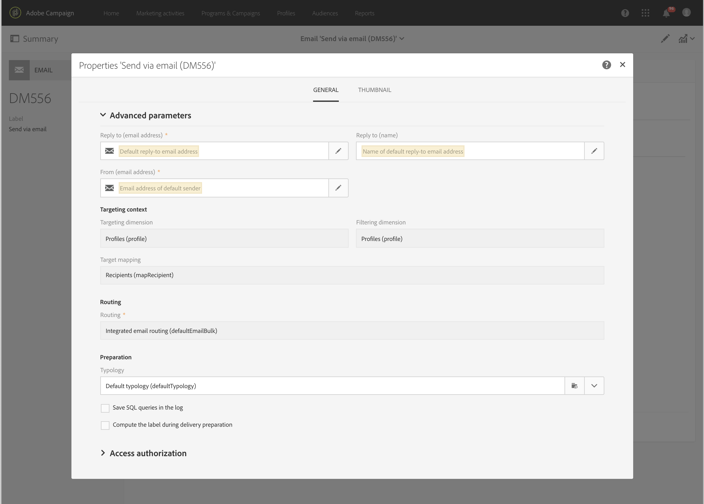

# Konfigurera e-postkanal{#configuring-email-channel}

Som Campaign-[administratör](../../administration/using/users-management.md#functional-administrators) kan du konfigurera inställningar för e-postkanaler. Dessa avancerade inställningar omfattar allmänna parametrar för e-postkanal, e-postdirigeringskonton, regler för e-postbearbetning och e-postegenskaper. På den här sidan får du lära dig hur du redigerar standardvärdena för den allmänna e-postadressen och skickar parametrar.

## E-postkanalsparametrar {#email-channel-parameters}

På skärmen för e-postkonfiguration kan du definiera parametrar för e-postkanalen. Administratörer har åtkomst till dessa konfigurationer på menyn **[!UICONTROL Administration]> [!UICONTROL Channels] > [!UICONTROL Email] >[!UICONTROL Configuration]**.

* **Auktoriserade maskeringsfält**

  I avsnittet **[!UICONTROL Header parameters of sent emails]** visas de auktoriserade e-postadresser som du kan använda för att skicka e-post till dina mottagare (avsändaradress) och för att de ska kunna skicka tillbaka automatiska svar som asynkrona studsar, frånvaromeddelanden, o.s.v. (feladress).  Adobe Campaign kontrollerar att de angivna adresserna är giltiga under fasen för förberedelse av meddelande. Det här operativläget ser till att inga adresser används som kan utlösa levererbarhetsproblem.
   * Både avsändar- och feladresser konfigureras av Adobe. Dessa fält får inte vara tomma.
   * Du kan inte redigera dessa fält. Om du vill uppdatera en adress kontaktar du Adobes kundtjänstteam.
   * Om du vill lägga till ytterligare en adress kan du använda [Kampanjkontrollpanelen](https://experienceleague.adobe.com/docs/control-panel/using/subdomains-and-certificates/setting-up-new-subdomain.html?lang=sv) om du vill konfigurera en ny underdomän, eller kontakta kundtjänstteamet på Adobe. Observera att om flera masker används avgränsas de med kommatecken.
   * Det är en god vana att ange adresser med en stjärna som *@yourdomain.com: det gör att du kan använda alla adresser som slutar med ditt underdomännamn.

* **levererbarhet**

  Dokumentet **[!UICONTROL Delivery reports ID]** tillhandahålls av Adobes kundtjänstteam. Den identifierar varje instans med ett leverans-ID som används i de tekniska levererbarhetsrapporterna.
  <!--The Technical Deliverability report is not accessible through the UI in ACS. It will be replaced with 250ok in the future (project starting).-->

* **Leveransparametrar**

  Adobe Campaign skickar meddelanden som börjar på startdatumet.

  När ett meddelande i en leverans avvisas på grund av ett tillfälligt fel eller ett mjukt avhopp, försöker Campaign att skicka det här meddelandet varje dag. Använd **[!UICONTROL Message delivery duration]** för att ange tidsramen när nya försök kan göras.

  >[!IMPORTANT]
  >
  >**Den här parametern i Campaign används nu bara om den är inställd på 3,5 dagar eller mindre.** Om du anger ett värde som är högre än 3,5 dagar kommer det inte att tas med i beräkningen.

  Fältet **[!UICONTROL Online resources validity duration]** används för överförda resurser, huvudsakligen för spegelsidan och bilder. Resurserna på den här sidan är giltiga under en begränsad tid (för att spara diskutrymme).

* **Återförsök**

  Försök att skicka tillfälligt olevererade meddelanden kan utföras automatiskt. Mer information finns i [Återförsök efter ett tillfälligt leveransfel](../../sending/using/understanding-delivery-failures.md#retries-after-a-delivery-temporary-failure).

  >[!IMPORTANT]
  >
  >Det maximala antalet återförsök och den minsta fördröjningen mellan återförsök baseras nu på hur bra en IP fungerar både historiskt och för närvarande på en viss domän. The **[!UICONTROL Retry period]** och **[!UICONTROL Number of retries]** inställningarna i Campaign ignoreras.

  <!--This section indicates how many retries should be performed the day after the send is started (**Number of retries**) and the minimum delay between retries (**Retry period**). By default, five retries are scheduled for the first day with a minimum interval of one hour, spread out over the 24 hours of the day. One retry per day is programmed after that and until the delivery deadline, which is defined in the **[!UICONTROL Delivery parameters]** section.-->

* **E-postkarantänsparametrar**

  I fältet **[!UICONTROL Time between two significant errors]** anger du ett värde som anger hur lång tid programmet väntar innan felräknaren ökas om ett felmeddelande visas på skärmen. Standardvärdet är **&quot;1d&quot;** för 1 dag.

  När värdet **[!UICONTROL Maximum number of errors before quarantine]** uppnås sätts e-postadressen i karantän. Standardvärdet är **&quot;5&quot;**: adressen sätts i karantän på det femte felet. Detta innebär att kontakten automatiskt utesluts från efterföljande leveranser.
  <!--Actually the way ACS works is that the address is already on the quarantine list on the first bounce, but with a different status meaning that the error count has started.-->

  Mer information om karantäner finns i [Information om karantänhantering](../../sending/using/understanding-quarantine-management.md).

## E-postroutningskonton {#email-routing-accounts}

Det externa **[!UICONTROL Integrated email routing]**-kontot anges som standard. Den innehåller de tekniska parametrar som gör att programmet kan skicka e-post.

Kontotypen måste alltid anges till **[!UICONTROL Routing]**, kanalen till **[!UICONTROL Email]** och leveransläget till **[!UICONTROL Bulk delivery]**.

**Relaterat ämne**:

[Externa konton](../../administration/using/external-accounts.md)

## Regler för e-postbearbetning {#email-processing-rules}

Administratörer **[!UICONTROL Email processing rules]** kan komma åt informationen via menyn **[!UICONTROL Administration > Channels > Email]**.

>[!IMPORTANT]
>
>E-postdomänerna och MX-reglerna hanteras nu automatiskt<!--by the Adobe Campaign Enhanced MTA (Message Transfer Agent)--> och kan inte ändras.

* **DKIM (DomainKeys Identified Mail)** Signering med e-postautentisering utförs för alla meddelanden med alla domäner. Den signerar inte med **Avsändarens ID**, **DomainKeys**, eller **S/MIME**.
* MX-reglerna anpassar automatiskt ditt dataflöde efter domän baserat på ditt eget tidigare anseende och på feedback i realtid från de domäner du skickar e-post till.

<!--Note that the email domains and the MX rules are now managed by the Adobe Campaign Enhanced MTA:
* **DKIM (DomainKeys Identified Mail)** email authentication signing is done by the Enhanced MTA for all messages with all domains. It does not sign with **Sender ID**, **DomainKeys**, or **S/MIME** unless otherwise specified at the Enhanced MTA level.
* The Enhanced MTA uses its own MX rules that allow it to customize your throughput by domain based on your own historical email reputation, and on the real-time feedback coming from the domains where you are sending emails.-->

### Studsa e-post {#bounce-mails}

Asynkrona studsningar är fortfarande kvalificerade av Campaign inMail-processen enligt **[!UICONTROL Bounce mails]**-reglerna.

Dessa regler innehåller en lista med teckensträngar som kan returneras av fjärrservrar och som gör att du kan kvalificera felet (**Hård**, **Mjuk** eller **Ignorerad**).

>[!IMPORTANT]
>
>Synkrona felmeddelanden vid leveransfel har nu kvalificerats av Adobe Campaign Enhanced MTA, som bestämmer studstyp och kvalificering, och skickar tillbaka informationen till Campaign.

Mer information om kvalifikation av studsmeddelanden finns i det här [avsnittet](../../sending/using/understanding-delivery-failures.md#bounce-mail-qualification).

<!--Because they are now managed by the Enhanced MTA, the bounce qualifications in the Campaign **[!UICONTROL Message qualification]** table are no longer used. For more on bounce mail qualification, see this [section](../../sending/using/understanding-delivery-failures.md#bounce-mail-qualification).

### Management of email domains {#managing-email-domains}

The email domains are now managed by the Adobe Campaign Enhanced MTA. The Adobe Campaign **[!UICONTROL Domain management]** rules are no longer used.

**DKIM (DomainKeys Identified Mail)** email authentication signing is done by the Enhanced MTA for all messages with all domains. It does not sign with **Sender ID**, **DomainKeys**, or **S/MIME** unless otherwise specified at the Enhanced MTA level.

### MX management {#mx-management}

The MX rules are now managed by the Adobe Campaign Enhanced MTA. The Adobe Campaign **[!UICONTROL MX management]** delivery throughput rules are no longer used.

The Enhanced MTA uses its own MX rules that allow it to customize your throughput by domain based on your own historical email reputation, and on the real-time feedback coming from the domains where you are sending emails.-->

## Lista över e-postegenskaper {#list-of-email-properties}

I det här avsnittet innehåller listan med parametrar som är tillgängliga på egenskapsskärmen i ett e-postmeddelande eller en e-postmall.

>[!NOTE]
>
>Vissa parametrar är bara tillgängliga i mallar. Parameteråtkomst [beror på dina behörigheter](../../administration/using/users-management.md).

Med knappen **[!UICONTROL Edit properties]** kan du redigera egenskaperna för ett e-postmeddelande eller en e-postmall.

### Allmänna parametrar {#general-parameters}

Identifiera e-postmeddelandet med hjälp av fälten **[!UICONTROL Label]** och **[!UICONTROL ID]** överst i e-postparameterskärmen. Den här informationen visas i gränssnittet men inte för meddelandemottagarna.

>[!IMPORTANT]
>
>ID måste vara unikt.

Använd **[!UICONTROL Brand]** för att välja det varumärke som är kopplat till leveransen. Mer information om hur du använder och konfigurerar varumärken finns i avsnittet [Varumärke](../../administration/using/branding.md).

I **[!UICONTROL Campaign]** anger du kampanjen som är kopplad till e-postmeddelandet.

Du kan också lägga till en **[!UICONTROL Description]** i motsvarande fält och redigera bilden som visas på e-postminiatyrbilden i listorna.

### Skickar parametrar {#sending-parameters}

Avsnittet **[!UICONTROL Send]** är bara tillgängligt för e-postmallar. Den innehåller följande parametrar:

#### Återställer parametrar {#retries-parameters}

Försök att skicka tillfälligt olevererade meddelanden kan utföras automatiskt. Mer information finns i [Återförsök efter ett tillfälligt leveransfel](../../sending/using/understanding-delivery-failures.md#retries-after-a-delivery-temporary-failure).

>[!IMPORTANT]
>
>Den minsta fördröjningen mellan återförsök och det maximala antalet återförsök som ska utföras baseras nu på hur bra en IP fungerar både historiskt och för närvarande på en viss domän. The **[!UICONTROL Retry period]** och **[!UICONTROL Max. number of retries]** inställningarna i Campaign ignoreras.

Inställningen för **leveranstid** (som definieras i avsnittet [Parametrar för giltighetsperiod](#validity-period-parameters)) som **har konfigurerats i Campaign gäller fortfarande, men bara upp till 3,5 dagar**. Då tas alla meddelanden i kön för nya försök bort och skickas tillbaka som en studsning. Mer information om leveransfel finns i det här [avsnittet](../../sending/using/understanding-delivery-failures.md#about-delivery-failures).

#### E-postformatparametrar {#email-format-parameters}

Du kan konfigurera formatet för e-postmeddelanden som ska skickas. Det finns tre alternativ:

* **Använd mottagarinställningar** (standardläge): Meddelandeformatet definieras enligt data som lagras i mottagarprofilen och lagras som standard i fältet **E-postformat** (@emailFormat). Om en mottagare vill ta emot meddelanden i ett visst format är detta det format som skickas. Om fältet inte är ifyllt skickas ett meddelande i flera delar (se nedan).
* **Låt mottagaren av e-postklienten välja det lämpligaste formatet (meddelande i flera delar)**: Meddelandet innehåller båda formaten: text och HTML. Formatet som visas vid mottagning beror på konfigurationen av mottagarens e-postprogramvara (meddelande i flera delar).

  >[!IMPORTANT]
  >
  >Det här alternativet inkluderar båda versionerna av meddelandet. Det påverkar därför leveransflödet eftersom meddelandestorleken är större.

* **Skicka alla meddelanden i textformat**: Meddelandet skickas i textformat. HTML-formatet skickas inte, utan används bara för spegelsidan när mottagaren klickar på länken i meddelandet.

#### SMTP-testläge {#smtp-test-mode}

Använd **[!UICONTROL Enable SMTP test mode]** möjlighet att testa att skicka e-postmeddelanden via en SMTP-anslutning utan att faktiskt skicka meddelanden. Leveransen behandlas upp till anslutning till SMTP-servern men skickas inte: För varje mottagare av leveransen ansluter Campaign till SMTP-providerservern, kör SMTP RCPT TO-kommandot och stänger anslutningen före SMTP DATA-kommandot.

Det här alternativet är tillgängligt för e-postmeddelanden och e-postmallar.

Om du aktiverar alternativet SMTP-testläge för en e-postmall aktiveras det här alternativet för alla e-postmeddelanden som skapas från den här mallen.

>[!IMPORTANT]
>
>När det här alternativet är aktiverat för ett e-postmeddelande skickas inga meddelanden förrän avmarkeras.
>En varning visas i kontrollpanelen för e-postmeddelanden eller e-postmallar.

Mer information om hur du konfigurerar SMTP finns i avsnittet [Lista över SMTP-parametrar för e-post](#list-of-email-smtp-parameters).

### Giltighetsperiodens parametrar {#validity-period-parameters}

Avsnittet **[!UICONTROL Validity period]** innehåller följande parametrar:

* **[!UICONTROL Explicitly set validity dates]**: När den här rutan är avmarkerad måste du ange en varaktighet i fälten **[!UICONTROL Delivery duration]** och **[!UICONTROL Resource validity limit]**.

  Markera den här rutan om du vill definiera datum och klockslag.

  

* **[!UICONTROL Delivery duration]**/**[!UICONTROL Validity limit for sending messages]**: Adobe Campaign skickar meddelanden som börjar på startdatumet. Använd det här fältet för att ange under vilken period som meddelanden kan skickas.

  >[!IMPORTANT]
  >
  >**Du måste definiera ett värde på upp till 3,5 dagar.** Om du anger ett värde som är högre än 3,5 dagar beaktas det inte.
  >
  >Parametern **[!UICONTROL Delivery duration]** gäller inte för transaktionsmeddelanden. Mer information om transaktionsmeddelanden finns i [det här avsnittet](../../channels/using/getting-started-with-transactional-msg.md).

* **[!UICONTROL Resource validity duration]**/**[!UICONTROL Validity limit date for resources]**: Det här fältet används för överförda resurser, huvudsakligen för spegelsidan och bilder. Resurserna på den här sidan är giltiga under en begränsad tid (för att spara diskutrymme).
* **[!UICONTROL Mirror page management]**: Spegelsidan är en HTML-sida som är tillgänglig online via en webbläsare. Innehållet är identiskt med e-postinnehållet. Spegelsidan genereras som standard om länken infogas i postinnehållet. Använd det här fältet om du vill ändra hur sidan genereras:

   * **[!UICONTROL Generate the mirror page if a mirror link appears in the email content]** (standardläge): Spegelsidan genereras om länken infogas i postinnehållet.
   * **Framtvinga generering av spegelsidan**: Spegelsidan skapas även om ingen länk till spegelsidan infogas i meddelandena.
   * **Generera inte spegelsidan**: Ingen spegelsida genereras, även om länken finns i meddelandena.
   * **Generera en spegelsida som bara är tillgänglig med meddelande-ID**: Med det här alternativet kan du komma åt spegelsidans innehåll, med anpassningsinformation, i fönstret för leveransloggen.

  >[!IMPORTANT]
  >
  >Spegelsidan genereras bara om ett HTML-innehåll har definierats för e-postmeddelandet.
  >

### Spårningsparametrar {#tracking-parameters}

Avsnittet **[!UICONTROL Tracking]** innehåller följande parametrar:

* **[!UICONTROL Activate tracking]**: använd det här alternativet om du vill aktivera/inaktivera spårning av meddelande-URL. Om du vill hantera spårning för varje meddelande-URL använder du **[!UICONTROL Links]**-ikonen i åtgärdsfältet för e-postdesignern. Se [Om spårade URL:er](../../designing/using/links.md#about-tracked-urls).
* **[!UICONTROL Tracking validity limit]**: använd det här alternativet för att definiera hur länge spårningen ska aktiveras på URL-adresserna.
* **[!UICONTROL Substitution URL for expired URLs]**: använd det här alternativet om du vill ange en URL till en reservwebbsida: den visas när spårningen har upphört att gälla.
* **[!UICONTROL Use tracking pixel at the top of email]**: använd det här alternativet om du vill flytta spårningspunkten högst upp i e-postmeddelandet i stället för längst ned. Den här pixeln finns som standard längst ned i dina e-postmeddelanden. Om du skickar stora meddelanden bör du överväga att flytta den här pixeln högst upp i e-postmeddelandena i stället för längst ned för att förbättra den öppna spårningen. I annat fall kan spårningspixeln kapas av vissa e-postleverantörer.

### Avancerade parametrar {#advanced-parameters}

Avsnittet **[!UICONTROL Advanced parameters]** innehåller flera parametrar.

I de första fälten kan du ange den information som behövs för att utveckla e-postmeddelanderubriker. Här kan du hantera svarsadressen och texten samt avsändaradressen (som fyller i fältet &quot;Från:&quot;). Den här informationen kan anpassas.

Klicka på knappen till höger om fältet som ska ändras och lägg sedan till anpassningsfältet, innehållsblocket eller den dynamiska texten.

Infogning och användning av anpassningsinnehåll finns i dokumentationen [Anpassning av e-postinnehåll](../../designing/using/personalization.md).

#### Målkontext {#target-context}

Använd målgruppskontexten för att definiera en uppsättning tabeller som ska användas för e-postmarknadsföring (i målgruppsdefinitionsskärmen) och personalisering (definiera personaliseringsfält i HTML innehållsredigeraren).

#### Routning {#routing}

I det här fältet visas det dirigeringsläge som används. Det hänvisar till ett externt konto. Detta kan till exempel användas om du vill använda ett externt konto som innehåller specifika varumärkningskonfigurationer.

>[!NOTE]
>
>Externa konton är tillgängliga via menyn **Administration** > **Programinställningar** > **Externa konton**.

#### Förberedelse {#preparation}

Förberedelse av meddelanden beskrivs i avsnittet [Godkänna meddelanden](../../sending/using/preparing-the-send.md).

* **[!UICONTROL Typology]**: Innan ett meddelande skickas måste det förberedas för att innehållet och konfigurationen ska kunna valideras. De kontrollregler som tillämpas under beredningsfasen definieras i en **typologi**. För e-postmeddelanden omfattar förberedelsen till exempel kontroll av ämnet, URL:er och bilder. Välj den typologi som ska användas i det här fältet.

  >[!NOTE]
  >
  >Typologier, som du kommer åt via menyn **[!UICONTROL Administration]** > **[!UICONTROL Channels]** > **[!UICONTROL Typologies]**, presenteras i [det här avsnittet](../../sending/using/about-typology-rules.md).

* **[!UICONTROL Compute the label during delivery preparation]**: använd det här alternativet för att beräkna e-postens etikettvärde under meddelandeförberedelsefasen med hjälp av anpassningsfält, innehållsblock och dynamisk text.

  Det går också att anpassa leveransetiketten med händelsevariabler som har deklarerats i arbetsflödets externa signalaktivitet. Mer information om detta hittar du i [det här avsnittet](../../automating/using/calling-a-workflow-with-external-parameters.md).

* **[!UICONTROL Save SQL queries in the log]**: använd det här alternativet för att lägga till SQL-frågeloggar i journalen under förberedelsefasen.

#### Korrekturinställningar {#proof-settings}

I det här avsnittet kan du konfigurera standardprefixet som ska användas på ärenderaden i korrekturmeddelandena. Läs mer om korrektur i [det här avsnittet](../../sending/using/sending-proofs.md).

### Lista över SMTP-parametrar för e-post {#list-of-email-smtp-parameters}

Avsnittet **[!UICONTROL SMTP]** innehåller följande parametrar:

* **[!UICONTROL Character encoding]**: Markera rutan **[!UICONTROL Force encoding]** om du vill framtvinga meddelandekodning och markera sedan den kodning som du vill använda.
* **[!UICONTROL Bounce mails]**: Som standard tas studsmeddelanden emot i plattformens felinkorg (definieras i **[!UICONTROL Administration]** > **[!UICONTROL Channels]** > **[!UICONTROL Email]** > **[!UICONTROL Configuration]**). Om du vill definiera en specifik feladress för ett e-postmeddelande anger du adressen i fältet **[!UICONTROL Error address]**.
* **[!UICONTROL Additional SMTP headers]**: Med det här alternativet kan ytterligare SMTP-rubriker läggas till i dina meddelanden. Skriptet som anges i fältet **[!UICONTROL Headers]** måste hänvisa till en rubrik per rad i formatet **name:value**. Värden kodas automatiskt om det behövs.

  >[!IMPORTANT]
  >
  >Tillägg av ett skript för att infoga ytterligare SMTP-rubriker är reserverat för avancerade användare. Syntaxen för det här skriptet måste uppfylla kraven för den här innehållstypen: Inget oanvänt utrymme, ingen tom rad, o.s.v.

### Lista över åtkomstauktoriseringsparametrar {#list-of-access-authorization-parameters}

Avsnittet **[!UICONTROL Access authorization]** innehåller följande parametrar:

* The **[!UICONTROL Organizational unit]** fältet används för att begränsa åtkomsten till det här e-postmeddelandet till vissa användare. De användare som är associerade med den angivna enheten eller överordnade enheter har läs- och skrivåtkomst till det här e-postmeddelandet. Användare som är associerade med underordnade enheter har endast läsåtkomst till det här e-postmeddelandet.

  >[!NOTE]
  >
  >Du kan konfigurera organisationsenheter via menyn **Administration** > **Användare och säkerhet**.

* Fälten **[!UICONTROL Created by]**, **[!UICONTROL Created]**, **[!UICONTROL Modified by]** och **[!UICONTROL Last modified]** fylls i automatiskt.

## Äldre inställningar {#legacy-settings}

Om du **NOT** om du kör den senaste versionen av Campaign gäller fortfarande de parametrar och gränssnittsavsnitt som beskrivs nedan för dig.

### Försök igen {#legacy-retries}

The **[!UICONTROL Retries]** inställningarna i [Konfigurationsmeny](#email-channel-parameters) och i [Skickar parametrar](#retries-parameters) av e-postegenskaperna anger hur många försök som ska utföras dagen efter att sändningen har startats (**[!UICONTROL Number of retries]** / **[!UICONTROL Max. number of retries]**) och minsta fördröjning mellan återförsök (**[!UICONTROL Retry period]**).

Antalet försök kan ändras globalt (kontakta den tekniska administratören för Adobe) eller för varje leverans- eller leveransmall.

Som standard schemaläggs fem återförsök till den första dagen med ett minsta intervall på en timme, som sprids ut över dygnets 24 timmar. Ett nytt försök per dag planeras efter detta och fram till leveransdatumet, som definieras globalt i **[!UICONTROL Delivery parameters]** i **[!UICONTROL Configuration]** eller på **[!UICONTROL Validity period]** på leveransnivå (se [Leveransens varaktighet](#legacy-delivery-duration) nedan).

### Leveransens varaktighet {#legacy-delivery-duration}

Använd **[!UICONTROL Message delivery duration]** -parametern i [Konfigurationsmeny](#email-channel-parameters) för att ange den tidsram inom vilken ett meddelande i leveransen som påträffar ett tillfälligt fel eller en mjuk avhoppning kommer att provas igen.

Använd **[!UICONTROL Delivery duration]** eller **[!UICONTROL Validity limit for sending messages]** -parametern i [Giltighetsperiodens parametrar](#validity-period-parameters) för att ange hur länge meddelanden kan skickas.

### Regler för e-postbearbetning {#legacy-email-processing-rules}

The **[!UICONTROL MX management]**, **[!UICONTROL Bounce mails]** och **[!UICONTROL Domain management]** regler kan nås och ändras av administratörer via **[!UICONTROL Administration > Channels > Email > Email processing rules]** -menyn. [Läs mer](#email-processing-rules).

### E-poststudsar {#legacy-bounce-mail-qualification}

Om du vill visa de olika gränserna och deras associerade feltyper och orsaker klickar du på knappen **Adobe** logotyp, i det övre vänstra hörnet och välj **[!UICONTROL Administration > Channels > Quarantines > Message qualification]**.

Satser kan ha följande kvalificeringsstatusar:

* **[!UICONTROL To qualify]**: studsposten måste kvalificeras. Kvalificering måste utföras av Deliverability-teamet för att säkerställa att plattformens leveransbarhet fungerar korrekt. Så länge som det inte är kvalificerat används studsmeddelandet inte för att utöka listan med regler för e-postbearbetning.
* **[!UICONTROL Keep]**: studsmeddelandet har kvalificerats och kommer att användas av **Uppdatering för leverans** arbetsflöde som ska jämföras med befintliga regler för e-postbearbetning och berika listan.
* **[!UICONTROL Ignore]**: studsmeddelandet kvalificerades men kommer inte att användas av **Uppdatering för leverans** arbetsflöde. Det skickas alltså inte till klientinstanserna.

>[!NOTE]
>
>Om en Internet-leverantör skulle råka ut för ett avbrott markeras e-post som skickas via Campaign felaktigt som studsar. För att korrigera detta måste du uppdatera studskompetens. [Läs mer](../../administration/using/update-bounce-qualification.md).

<!--Bounces are qualified through the **[!UICONTROL Bounce mails]** processing rule. For more on accessing this rule, refer to this [section](#legacy-bounce-mail-qualification).-->

### Levererad indikatorrapportering {#legacy-delivered-status-report}

I **[!UICONTROL Summary]** för varje meddelande, **[!UICONTROL Delivered]** Procentandelen ökar stegvis under hela leveransens giltighetsperiod, när mjuka och hårda studsar rapporteras tillbaka.

Mjuka studsmeddelanden visas som **[!UICONTROL Failed]** första dagen efter leveransen. Dessa meddelanden provas igen varje dag tills giltighetsperioden för leveransen är slut.
