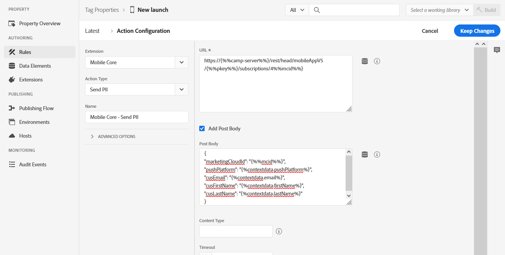

# Konfigurera Launch-regler för att ge stöd för användningsfall i Adobe Campaign Standard {#configuring-rules-launch}

I [!DNL Adobe Experience Platform Launch], skapa dataelement och regler för att skicka PII-filer och andra data från mobilprogram till [!DNL Adobe Campaign Standard].

För att säkerställa att all konfiguration ändras i [!DNL Adobe Experience Platform Launch] måste du publicera ändringarna. Mer information finns i [Publicering](https://aep-sdks.gitbook.io/docs/getting-started/create-a-mobile-property#publish-the-configuration).

Skapa regler i [!DNL Experience Platform Launch]gör du så här:

1. [Skapa dataelement](../../administration/using/configuring-rules-launch.md#create-data-elements)
2. [Skapa regler](../../administration/using/configuring-rules-launch.md#create-data-elements) för de användningsområden som du vill ha stöd för:
   * [PII-postback](../../administration/using/configuring-rules-launch.md#pii-postback)
   * [Spårning i appen - återanslående](../../administration/using/configuring-rules-launch.md#inapp-tracking-postback)
   * [Eftersläpning av push-meddelanden](../../administration/using/configuring-rules-launch.md#push-tracking-postback)
   * [Positionering](../../administration/using/configuring-rules-launch.md#location-postback)

## Skapa dataelement {#create-data-elements}

Här är de dataelement som du bör skapa i [!DNL Experience Platform Launch].
Du kan skapa ytterligare dataelement efter behov.

* **[!UICONTROL Experience Cloud ID]**
* **[!UICONTROL Pkey]**
* **[!UICONTROL Campaign server]**

Så här skapar du dessa dataelement:

1. I [!DNL Experience Platform Launch]klickar du på **[!UICONTROL Data Elements]** -fliken.

1. Skapa **[!UICONTROL Experience Cloud ID]** dataelement, klicka **[!UICONTROL Create New Data Element]**.

1. I **[!UICONTROL Name]** fält, t.ex. in **mcid**.

1. Från **[!UICONTROL Extension]** nedrullningsbar meny, välja **[!UICONTROL Mobile Core]**. Sedan **[!UICONTROL Experience Cloud ID]** i **[!UICONTROL Data element]** nedrullningsbar text.

   

1. Skapa Pkey-dataelementet genom att klicka på **[!UICONTROL Add data element]**.

1. I **[!UICONTROL Name]** fält, t.ex. in **pkey**.

1. Från **[!UICONTROL Extension]** nedrullningsbar meny, välja **[!UICONTROL Adobe Campaign Standard]**. Sedan **[!UICONTROL pkey]** i **[!UICONTROL Data element]** nedrullningsbar text.

1. Om du vill skapa ett Campaign-serverdataelement klickar du på **[!UICONTROL Add data element]**.

1. I **[!UICONTROL Name]** field, type a name, example, **läger-server**.

1. Från **[!UICONTROL Extension]** nedrullningsbar meny, välja **[!UICONTROL Adobe Campaign Standard]**. Sedan **[!UICONTROL Campaign Server]** i **[!UICONTROL Data element]** nedrullningsbar text.

## Skapa regler {#creating-rules}

Du måste skapa regler för följande:

* [PII-postback](../../administration/using/configuring-rules-launch.md#pii-postback)
* [Spårning i appen - återanslående](../../administration/using/configuring-rules-launch.md#inapp-tracking-postback)
* [Eftersläpning av push-meddelanden](../../administration/using/configuring-rules-launch.md#push-tracking-postback)
* [Positionering](../../administration/using/configuring-rules-launch.md#location-postback)

### PII-postback {#pii-postback}

>[!NOTE]
>
>Om du vill skicka PII-information från en mobilapp till Adobe Campaign måste du implementera ett SDK API. Mer information finns på [CollectPII](https://aep-sdks.gitbook.io/docs/using-mobile-extensions/mobile-core/mobile-core-api-reference#collect-pii).

Skicka PII-data till [!DNL Adobe Campaign Standard], skapa en regel i [!DNL Experience Platform Launch]:

1. I [!DNL Experience Platform Launch]klickar du på **[!UICONTROL Rules]** tabba sedan **[!UICONTROL Create New Rule]**.

1. Skriv ett namn, till exempel **Mobile Core - Samla in PII**.

1. I **[!UICONTROL Events]** avsnitt, klicka **[!UICONTROL Add]**.

1. Från **[!UICONTROL Extension]** nedrullningsbar meny, välja **[!UICONTROL Mobile Core]**. Sedan **[!UICONTROL Collect PII]** i **[!UICONTROL Event type]** nedrullningsbar meny.

1. Klicka på **[!UICONTROL Keep changes]**.

1. I **[!UICONTROL Actions]** avsnitt, klicka **[!UICONTROL Add]**.

1. Från **[!UICONTROL Extension]** nedrullningsbar meny, välja **[!UICONTROL Mobile Core]**. Sedan **[!UICONTROL Send PII]** i **[!UICONTROL Action type]** nedrullningsbar meny.

1. I **[!UICONTROL URL]** anger du följande URL:

   ```
   https://{%%camp-server%%}/rest/head/mobileAppV5/{%%pkey%%}/subscriptions/{%%mcid%%}
   ```

1. Välj **[!UICONTROL Add Post Body]** kryssruta.

1. I **[!UICONTROL Post Body]** skriver du följande:

   ```
   {
   "marketingCloudId":
   "{%%mcid%%}",
   "pushPlatform":
   "",
   "cusEmail":
   "",
   "cusFirstName":
   "",
   "cusLastName":
   "" }
   ```

   Med MarketingCloudId kan ni stämma av era appprenumeranter med mottagarna i databasen och därför krävs det. Du kan ange andra nyckelvärdepar efter företagets behov. I exemplet ovan skickas e-post, förnamn och efternamn från appen.

   Nycklarna (till exempel cusEmail, cusFirstName och cusLastName) ska matcha fält-ID:n som definieras i din anpassade resurs i Adobe Campaign Standard-instansen. Värdevariablerna (till exempel email, firstName och LastName) ska matcha nycklarna i JSON-data som skickas från mobilappen när AMS-API:t collectPII anropas från appkoden.

   Du kan också skicka livscykeldata i Samla in PII-återrapportering eller ett annat återanslående beroende på vilka händelseutlösare du använder. Här är ett exempel på JSON för livscykeldata:

   ```
   {
   "marketingCloudId":"{%%mcid%%}",
   "pushPlatform":"",
   "cusDayslastlaunch": "{%%DaysSinceLastUse%%}", 
   "cusDaysfirstlaunch": "{%%DaysSinceFirstUse%%}", 
   "cusLaunches": "{%%Launches%%}"
   }
   ```

   De dataelement som definieras i [!DNL Experience Platform Launch] ska omslutas av dubbla procentsatser, till exempel %%mcid%%, och kontextvariabler från programmet ska omslutas av enstaka procentsatser, till exempel %contextdata.email%.

1. I **[!UICONTROL Content Type]**, typ **application/json**.

1. I **[!UICONTROL Timeout]** väljer du 0.

   

Dina användardata har nu konfigurerats för att skickas till Campaign.

### Spårning i appen - återanslående {#inapp-tracking-postback}

>[!NOTE]
>
>Om du använder Android ACPCore v1.4.0 eller senare/ iOS ACPCore v2.3.0 eller senare behövs ingen konfigurering av återanslående.

Skicka spårningsdata till [!DNL Adobe Campaign Standard] för att få rapporter om hur användarna interagerar med meddelanden i appen i ditt mobilprogram skapar du följande regel i [!DNL Experience Platform Launch]:

1. I [!DNL Experience Platform Launch]väljer du **[!UICONTROL Rules]** och klicka **[!UICONTROL Add Rule]**.

1. Skriv ett namn, till exempel **Adobe Campaign - Klickspårning i appen**.

1. I **[!UICONTROL Events]** avsnitt, klicka **[!UICONTROL Add]**.

1. Från **[!UICONTROL Extension]** nedrullningsbar meny, välja **[!UICONTROL Adobe Campaign Standard]**. Sedan **[!UICONTROL In-App click tracking]** i **[!UICONTROL Event type]** nedrullningsbar meny.

1. Klicka på **[!UICONTROL Keep changes]**.

1. I **[!UICONTROL Actions]** avsnitt, klicka **[!UICONTROL Add]**.

1. Från **[!UICONTROL Extension]** nedrullningsbar meny, välja **[!UICONTROL Mobile Core]**. Sedan **[!UICONTROL Send postback]** i **[!UICONTROL Event type]** nedrullningsbar meny.

1. I **[!UICONTROL URL]** skriver du följande URL:

   ```
   https://{%%camp-server%%}/r/?id=&mcid={%%mcid%%}
   ```

1. Välj **[!UICONTROL Add post body]** kryssruta.

1. Skriv **i **[!UICONTROL Post Body]**{}**.

1. I **[!UICONTROL Content Type]**, typ **application/json**.

1. I **[!UICONTROL Timeout]** väljer du 0.

   

### Eftersläpning av push-meddelanden {#push-tracking-postback}

>[!NOTE]
>
>Om du använder Android ACPCore v1.4.0 eller senare/ iOS ACPCore v2.3.0 eller senare behövs ingen konfigurering av återanslående.

Skicka spårningsdata till [!DNL Adobe Campaign Standard], som hjälper dig att spåra dina leveranser av push-meddelanden och hur användarna interagerar med ditt mobilprogram, måste du skapa en regel i [!DNL Experience Platform Launch].

Mer information om push-spårning finns i [Push-spårning](../../administration/using/push-tracking.md).

Använd API:t trackAction om du vill spåra programåtgärder. Mer information finns i [Spåra appåtgärder](https://app.gitbook.com/@aep-sdks/s/docs/using-mobile-extensions/mobile-core/mobile-core-api-reference#track-app-actions).

1. I [!DNL Experience Platform Launch]klickar du på **[!UICONTROL Rules]** och klicka **[!UICONTROL Add Rule]**.

1. Skriv ett namn, till exempel **Adobe Campaign - spåra push-klick**.

1. I **[!UICONTROL Events]** avsnitt, klicka **[!UICONTROL Add]**.

1. Från **[!UICONTROL Extension]** nedrullningsbar meny, välja **[!UICONTROL Mobile Core]**. Sedan **[!UICONTROL Track Action]** i **[!UICONTROL Event type]** nedrullningsbar meny.

1. Från **[!UICONTROL Action]** nedrullningsbar meny, välja **[!UICONTROL Action]**, markera **[!UICONTROL equals]** och skriv **spårning**.

1. Klicka på **[!UICONTROL Keep changes]**. Sedan i **[!UICONTROL Actions]** avsnitt, klicka **[!UICONTROL Add]**.

1. Från **[!UICONTROL Extension]** nedrullningsbar meny, välja **[!UICONTROL Mobile Core]**. Sedan **[!UICONTROL Send postback]** i **[!UICONTROL Action type]** nedrullningsbar meny.

1. I **[!UICONTROL URL]** anger du följande URL:

   ```
   https://{%%camp-server%%}/r/?id=,,&mcId={%%mcid%%}
   ```

1. Välj **[!UICONTROL Add post body]** kryssruta.

1. Lägg till ditt inlägg, till exempel {}.

1. I **[!UICONTROL Content Type]**, typ **application/json**.

1. I **[!UICONTROL Timeout]** väljer du 0.

### Positionering {#location-postback}

1. I [!DNL Experience Platform Launch]klickar du på **[!UICONTROL Rules]** och klicka **[!UICONTROL Add Rule]**.

1. Skriv ett namn, till exempel **Positionering**.

1. I **[!UICONTROL Events]** avsnitt, klicka **[!UICONTROL Add]**.

1. Skapa en händelse, till exempel Ange POI eller Avsluta POI. Från **[!UICONTROL Extension]** nedrullningsbar meny, välja **Platser - Beta**. Sedan **Ange POI** eller **Avsluta POI** i **[!UICONTROL Event type]** nedrullningsbar meny.

1. Ange ett namn, till exempel **Platser - Beta - Ange POI** eller **Avsluta POI**.

1. I **[!UICONTROL Actions]** avsnitt, klicka **[!UICONTROL Add]**.

1. Från **[!UICONTROL Extension]** nedrullningsbar meny, välja **[!UICONTROL Mobile Core]**. Sedan **[!UICONTROL Send postback]** från **[!UICONTROL Action type]** nedrullningsbar meny.

1. Ange ett namn, till exempel **Mobile Core - Send Location Postback**.

1. I **[!UICONTROL URL]** anger du följande URL:

   ```
   https://{%%camp-server%%}/rest/head/mobileAppV5/{%%pkey%%}/locations/
   ```

1. Välj **[!UICONTROL Add post body]** och lägg till texten i ditt inlägg, till exempel:

   ```
   {
   "locationData": {
       "distances": "{%%Distance%%}",
       "poiLabel": "{%%POILabel%%}",
       "latitude": "{%%Latitude%%}",
       "longitude": "{%%Longitude%%}",
       "appId": "{%%AppId%%}",
       "marketingCloudId": "{%%ECID%%}"
   }
   }
   ```

   >[!NOTE]
   >
   >I exemplet ovan måste dataelementen till höger konfigureras i [!DNL Experience Platform Launch] genom att utnyttja stegen i [Skapa dataelement](../../administration/using/configuring-rules-launch.md#create-data-elements). Dataelementen till vänster stöds i [!DNL Adobe Campaign Standard] och behöver ingen konfiguration. Om du behöver ytterligare data måste du utföra anpassade resurstillägg i [!DNL Adobe Campaign Standard].

1. I **[!UICONTROL Content Type]**, typ **application/json**.

1. I **[!UICONTROL Timeout]** väljer du 5.

   
