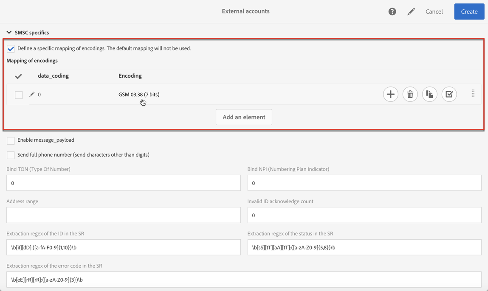

# Konfigurera SMS-kanal{#configuring-sms-channel}

Om du vill skicka SMS-meddelanden måste ett eller flera externa konton konfigureras av en administratör under **[!UICONTROL Administration]** > **[!UICONTROL Channels]** > **[!UICONTROL SMS]** > **[!UICONTROL SMS accounts]** .

Stegen för att skapa och ändra ett externt konto finns i avsnittet [Externa konton](../../administration/using/external-accounts.md) . Nedan hittar du parametrarna som är specifika för externa konton för att skicka SMS-meddelanden.

## Definiera en SMS-routning {#defining-an-sms-routing}

Det externa kontot **[!UICONTROL SMS routing via SMPP]** anges som standard, men det kan vara användbart att lägga till andra konton.

Om du vill använda SMPP-protokollet kan du även skapa ett nytt externt konto. Mer information om SMS-protokoll och inställningar finns i den här [tekniska informationen](https://helpx.adobe.com/campaign/kb/sms-connector-protocol-and-settings.html).

1. Skapa ett nytt externt konto från **[!UICONTROL Administration > Application settings > External accounts]**.
1. Definiera kontotypen som **[!UICONTROL Routing]**, kanalen som **[!UICONTROL Mobile (SMS)]** och leveransläget som **[!UICONTROL Bulk delivery]**.

   

1. Definiera anslutningsinställningarna.

   Om du vill ange anslutningsinställningar som är specifika för att skicka SMS-meddelanden kontaktar du din SMS-tjänstleverantör som förklarar hur du fyller i de olika externa kontofälten.

   

   Med det här **[!UICONTROL Enable TLS over SMPP]** alternativet kan du kryptera SMPP-trafik.

   **[!UICONTROL Enable verbose SMPP traces in the log file]** Med kan du dumpa all SMPP-trafik i loggfiler. Det här alternativet måste vara aktiverat för att felsöka anslutningen och jämföra med den trafik som leverantören ser.

1. Kontakta Adobe som ger dig det värde du vill ange i **[!UICONTROL SMS-C implementation name]** fältet, beroende på vilken leverantör du väljer.
1. Definiera inställningarna för SMPP-kanalen. Du kan läsa mer i avsnittet [SMS-kodning och format](#sms-encoding-and-formats) .

   Aktivera **[!UICONTROL Store incoming MO in the database]** om du vill att alla inkommande SMS ska lagras i tabellen inSMS. Mer information om hur du hämtar inkommande SMS finns i det här [avsnittet](../../channels/using/managing-incoming-sms.md#storing-incoming-sms).

   Med det här **[!UICONTROL Enable Real-time KPI updates during SR processing]** alternativet kan **[!UICONTROL Delivered]** - eller **[!UICONTROL Bounces + Errors]** KPI:er uppdateras i realtid när leveransen är klar. Dessa KPI:er finns i fönstret och beräknas om direkt från den SR (Status Report) som tagits emot av leverantören. **[!UICONTROL Deployment]**

   

1. Definiera **[!UICONTROL Throughput and timeouts]** parametrarna.

   Du kan ange maximal genomströmning för utgående meddelanden (&quot;MT&quot;, Mobile Terminated) i MT per sekund. Om du anger &quot;0&quot; i motsvarande fält är dataflödet obegränsat.

   Värdena för alla fält som motsvarar varaktighet måste fyllas i i sekunder.

1. Definiera de SMS-C-specifika parametrarna om du behöver definiera en specifik kodmappning. Mer information finns i avsnittet [SMSC-specifikationer](#smsc-specifics) .

   Aktivera **[!UICONTROL Send full phone number (send characters other than digits)]** alternativet om du inte vill följa SMPP-protokollet och överföra **[!UICONTROL +]** prefixet till SMS-providerns server (SMS-C).

   Eftersom vissa leverantörer kräver att **[!UICONTROL +]** prefixet används bör du kontakta leverantören och föreslå att du aktiverar det här alternativet om det behövs.

1. Definiera vid behov automatiska svar för att utlösa åtgärder baserat på innehållet i ett svar. For more on this, refer to [this section](../../channels/using/managing-incoming-sms.md#managing-stop-sms).
1. Spara konfigurationen för det externa SMS-routningskontot.

Nu kan du använda din nya routning för att skicka SMS-meddelanden med Adobe Campaign.

## SMS-kodning och format {#sms-encoding-and-formats}

### SMS-kodning, längd och transkribering {#sms-encoding--length-and-transliteration}

Som standard uppfyller antalet tecken i ett SMS-meddelande GSM-standarden (Global System for Mobile Communications).

SMS-meddelanden som använder GSM-kodning får innehålla högst 160 tecken eller 153 tecken per SMS för meddelanden som skickas i flera delar.

>[!NOTE]
>
>Vissa tecken räknas som två (klammerparenteser, eurosymbolen osv.). En lista över tillgängliga GSM-tecken finns i avsnittet [Teckentabell - GSM-standard](#table-of-characters---gsm-standard) .

Om du vill kan du godkänna teckenomläsning genom att markera motsvarande ruta.

Translitterering består i att ersätta ett tecken i ett SMS med ett annat om det tecknet inte beaktas av GSM-standarden.

* Om translitterering är **tillåten** ersätts varje tecken som inte beaktas av ett GSM-tecken när meddelandet skickas. Bokstaven&quot;ë&quot; ska till exempel ersättas med&quot;e&quot;. Meddelandet ändras därför något, men teckengränsen är densamma.
* När transkriberingen **inte är godkänd** skickas varje meddelande som innehåller tecken som inte beaktas i binärt format (Unicode): alla tecken skickas därför som de är. SMS-meddelanden som använder Unicode är dock begränsade till 70 tecken (eller 67 tecken per SMS för meddelanden som skickas i flera delar). Om det maximala antalet tecken överskrids skickas flera meddelanden, vilket kan medföra extra kostnader.

>[!IMPORTANT]
>
>Om du infogar anpassningsfält i innehållet i SMS-meddelandet kan det medföra tecken som GSM-kodningen inte tar hänsyn till. Ett exempel på innehåll finns i avsnittet [Anpassa SMS-meddelanden](../../channels/using/personalizing-sms-messages.md) .

Som standard är teckentranslitterering inaktiverat. Om du vill att alla tecken i SMS-meddelanden ska behållas som de är, bör du inte aktivera det här alternativet om du inte vill ändra egennamn.

Om dina SMS-meddelanden innehåller många tecken som genererar Unicode-meddelanden kan du välja att aktivera det här alternativet för att begränsa kostnaderna för att skicka meddelanden.

### Teckentabell - GSM-standard {#table-of-characters---gsm-standard}

I det här avsnittet beskrivs de tecken som GSM-standarden tar hänsyn till. Alla tecken som infogats i meddelandetexten, förutom de som nämns nedan, konverterar hela meddelandet till binärt format (Unicode) och begränsar det därför till 70 tecken. Mer information finns i avsnittet [SMS-kodning, längd och transkribering](#sms-encoding--length-and-transliteration) .

**Grundläggande tecken**

<table> 
 <tbody> 
  <tr> 
   <td> @  </td> 
   <td>    </td> 
   <td> SP  </td> 
   <td> 0  </td> 
   <td> ¡  </td> 
   <td> P  </td> 
   <td> ¿  </td> 
   <td> P  </td> 
  </tr> 
  <tr> 
   <td> £  </td> 
   <td> _  </td> 
   <td> !  </td> 
   <td> 1  </td> 
   <td> A  </td> 
   <td> Q  </td> 
   <td> a  </td> 
   <td> q  </td> 
  </tr> 
  <tr> 
   <td> $  </td> 
   <td>    </td> 
   <td> "  </td> 
   <td> 2  </td> 
   <td> B  </td> 
   <td> R  </td> 
   <td> b  </td> 
   <td> r  </td> 
  </tr> 
  <tr> 
   <td> ¥  </td> 
   <td>    </td> 
   <td> #  </td> 
   <td> 3  </td> 
   <td> C  </td> 
   <td> S  </td> 
   <td> c  </td> 
   <td> s  </td> 
  </tr> 
  <tr> 
   <td> É  </td> 
   <td>    </td> 
   <td> ¤  </td> 
   <td> 4  </td> 
   <td> D  </td> 
   <td> T  </td> 
   <td> d  </td> 
   <td> t  </td> 
  </tr> 
  <tr> 
   <td> é  </td> 
   <td>    </td> 
   <td> %  </td> 
   <td> 5  </td> 
   <td> E  </td> 
   <td> U  </td> 
   <td> e  </td> 
   <td> u  </td> 
  </tr> 
  <tr> 
   <td> ñ  </td> 
   <td>    </td> 
   <td> &amp;  </td> 
   <td> 6  </td> 
   <td> F  </td> 
   <td> V  </td> 
   <td> f  </td> 
   <td> v  </td> 
  </tr> 
  <tr> 
   <td> Maximum  </td> 
   <td>    </td> 
   <td> '  </td> 
   <td> 7  </td> 
   <td> G  </td> 
   <td> B  </td> 
   <td> g  </td> 
   <td> w  </td> 
  </tr> 
  <tr> 
   <td> systemkrav  </td> 
   <td>    </td> 
   <td> (  </td> 
   <td> 8  </td> 
   <td> H  </td> 
   <td> X  </td> 
   <td> h  </td> 
   <td> x  </td> 
  </tr> 
  <tr> 
   <td> else  </td> 
   <td>    </td> 
   <td> )  </td> 
   <td> 9 </td> 
   <td> I  </td> 
   <td> Y  </td> 
   <td> i  </td> 
   <td> y  </td> 
  </tr> 
  <tr> 
   <td> LF  </td> 
   <td>    </td> 
   <td> *  </td> 
   <td> :  </td> 
   <td> J  </td> 
   <td> Z  </td> 
   <td> j  </td> 
   <td> z  </td> 
  </tr> 
  <tr> 
   <td> Ø  </td> 
   <td> ESC  </td> 
   <td> +  </td> 
   <td> ;  </td> 
   <td> K  </td> 
   <td> Ä  </td> 
   <td> k  </td> 
   <td> ä  </td> 
  </tr> 
  <tr> 
   <td> ø  </td> 
   <td> AE  </td> 
   <td> ,  </td> 
   <td> &lt;  </td> 
   <td> L  </td> 
   <td> Ö  </td> 
   <td> l  </td> 
   <td> ö  </td> 
  </tr> 
  <tr> 
   <td> CR  </td> 
   <td> æ  </td> 
   <td> -  </td> 
   <td> = </td> 
   <td> M  </td> 
   <td> Ð  </td> 
   <td> m  </td> 
   <td> ñ  </td> 
  </tr> 
  <tr> 
   <td> Å  </td> 
   <td> ß  </td> 
   <td> .  </td> 
   <td> &gt;  </td> 
   <td> N  </td> 
   <td> Ü  </td> 
   <td> n  </td> 
   <td> ä  </td> 
  </tr> 
  <tr> 
   <td> å  </td> 
   <td> É  </td> 
   <td> /  </td> 
   <td> ?  </td> 
   <td> O  </td> 
   <td> §  </td> 
   <td> o  </td> 
   <td> à  </td> 
  </tr> 
 </tbody> 
</table>

SP: Blanksteg

ESC: Escape

LF: Radmatning

CR: Radretur

**Avancerade tecken (två gånger)**

^ { } [ ~ ] | €

### SMSC-specifikationer {#smsc-specifics}

>[!NOTE]
>
>Dessa alternativ gör att du kan anpassa anslutningen så att den fungerar med SMSC som inte är standard (d.v.s. inte följer exakt SMPP 3.4-specifikationen) eller särskilda kodningskrav och bör endast konfigureras av avancerade användare.

När du skickar ett SMS-meddelande kan Adobe Campaign använda en eller flera textkodningar. Varje kodning har en egen specifik teckenuppsättning och avgör antalet tecken som får plats i ett SMS-meddelande.

I **[!UICONTROL DATA_CODING]** fältet kan Adobe Campaign kommunicera med SMS-C som kodning används.

>[!NOTE]
>
>Mappningen mellan **data_coding** -värdet och den kodning som faktiskt används är standardiserad. Vissa SMS-C har dock en egen specifik mappning: I det här fallet måste **Adobe Campaign** -administratören deklarera mappningen. Kontakta din leverantör för mer information.

Med **[!UICONTROL Define a specific mapping of encodings]** funktionen kan du deklarera **data_codings** och tvinga fram kodningen om det behövs: Om du vill göra det anger du en enda kodning i tabellen.

**Konfiguration**

* När **[!UICONTROL Define a specific mapping of encodings]** funktionen inte är markerad får kopplingen ett allmänt beteende:

   * Den försöker använda GSM-kodning som den tilldelar värdet **data_coding = 0**.
   * Om GSM-kodningen misslyckas används **UCS2** -kodning som värdet **data_coding = 8** tilldelas till.

   

* När **[!UICONTROL Define a specific mapping of encodings]** funktionen är markerad kan du definiera de kodningar som du vill använda samt de länkade **[!UICONTROL data_coding]** fältvärdena. Adobe Campaign kommer att försöka använda den första kodningen i listan och därefter följande, om den första kodningen inte är möjlig.

   Deklarationsordningen är viktig: Vi rekommenderar att du placerar listan i stigande ordning **för kostnader** för att kunna välja kodningar så att du får plats med så många tecken som möjligt i varje SMS.

   Deklarera bara de kodningar som du vill använda. Om vissa av kodningarna som tillhandahålls av SMS-C inte stämmer överens med ditt användningsändamål, deklarera dem inte i listan.

   

### Automatiskt svar skickat till flerlägesobjektet {#automatic-reply-sent-to-the-mo}

När en profil svarar på ett SMS-meddelande som skickades via Campaign kan ni konfigurera meddelanden som automatiskt skickas tillbaka till honom eller henne samt vilken åtgärd som ska utföras.

For more information, refer to [this section](../../channels/using/managing-incoming-sms.md).

## Konfigurera SMS-egenskaper {#configuring-sms-properties}

I det här avsnittet finns en lista med parametrar som är unika för SMS på egenskapsskärmen för en SMS-leverans eller en SMS-mall.

De specifika parametrarna för att skicka SMS-meddelanden grupperas i **[!UICONTROL Send]** och i **[!UICONTROL Advanced parameters]** avsnitten.

Från **[!UICONTROL Advanced parameters]** avsnittet:

* Med det här **[!UICONTROL From]** alternativet kan du anpassa namnet på SMS-meddelandets avsändare med en teckensträng. Det här namnet visas som avsändarnamn för SMS-meddelandet på mottagarens mobiltelefon.

   Om det här fältet är tomt är det källnumret som anges i det externa kontot som ska användas. Om inget källnummer anges används den korta koden. Det externa kontot som är specifikt för SMS-leverans visas i avsnittet [Definiera en SMS-routning](#defining-an-sms-routing) .

   

   >[!IMPORTANT]
   >
   >Kontrollera lagstiftningen i ditt land angående ändring av avsändaradressen. Du bör också höra med din SMS-tjänstleverantör om de erbjuder den här funktionen.

Från avsnittet **[!UICONTROL Send]** i en SMS-mall:

* Med det här **[!UICONTROL Maximum number of SMS per message]** alternativet kan du definiera antalet SMS-meddelanden som ska användas för att skicka ett meddelande. Om det här antalet överskrids skickas inte meddelandet.

   >[!IMPORTANT]
   >
   >Om du har infogat anpassningsfält eller villkorlig text i innehållet i SMS-meddelandet kan längden på meddelandet och därmed antalet SMS-meddelanden som ska skickas variera från en mottagare till en annan. Mer information finns i avsnittet [Anpassa SMS-meddelanden](../../channels/using/personalizing-sms-messages.md) .

   

* I **[!UICONTROL Transmission mode]** fältet kan du bestämma leveransmetoden för SMS-meddelanden:

   * **[!UICONTROL Saved on SIM card]**: meddelandet lagras på mottagarens SIM-kort via telefon.
   * **[!UICONTROL Saved on mobile]**: meddelandet lagras på telefonens interna minne.
   * **[!UICONTROL Flash]**: meddelandet visas på mottagarens mobiltelefon som ett meddelande och försvinner utan att sparas.
