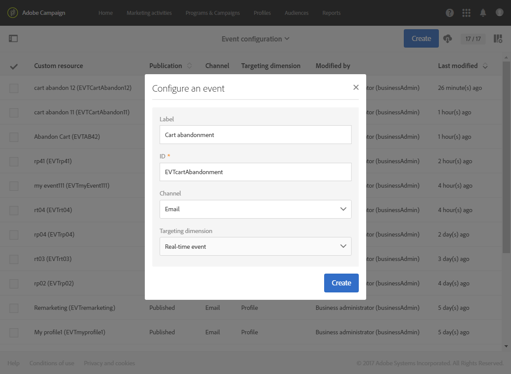
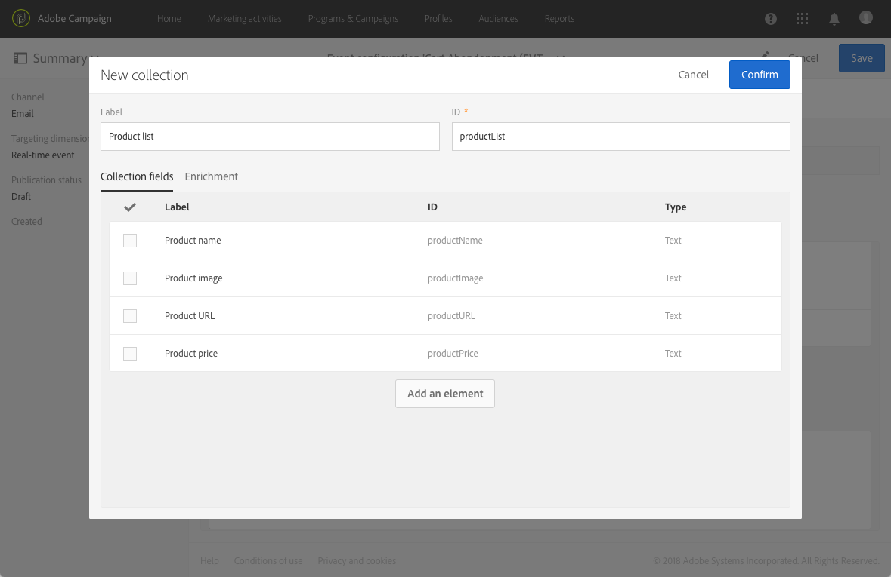

# Konfigurera transaktionsmeddelanden{#configuring-transactional-messaging}

Om du vill skicka ett transaktionsmeddelande med Adobe Campaign måste du först beskriva strukturen för händelsedata.

Händelsekonfigurationen måste utföras av en **administratör** enligt följande steg:

Konfigurationen kan variera beroende på vilken typ av transaktionsmeddelande du vill skicka. Mer information om detta finns i [Transactional Event-specifika konfigurationer](#transactional-event-specific-configurations)

När händelsen har publicerats skapas motsvarande transaktionsmeddelande automatiskt. Mer information om transaktionsmeddelanden finns på [den här sidan](../../channels/using/about-transactional-messaging.md).

## Skapa en händelse {#creating-an-event}

Börja med att skapa den händelse som passar dina behov.

1. Klicka på **[!UICONTROL Adobe Campaign]** logotypen i det övre vänstra hörnet och välj sedan **[!UICONTROL Marketing plans]** > **[!UICONTROL Transactional messages]** > **[!UICONTROL Event configuration]**.
1. Klicka på **[!UICONTROL Create]** knappen.
1. Ge evenemanget ett **[!UICONTROL Label]** och ett **[!UICONTROL ID]** till. Fältet är obligatoriskt och ska börja med prefixet &quot;EVT&quot;. **[!UICONTROL ID]** Om du inte använder det här prefixet läggs det till automatiskt när du klickar **[!UICONTROL Create]**.

   

   >[!IMPORTANT]
   >
   >ID:t får inte vara längre än 64 tecken, inklusive EVT-prefixet.

1. Välj den kanal som ska användas för att skicka transaktionsmeddelanden **[!UICONTROL Email]** eller **[!UICONTROL Mobile (SMS)]** **[!UICONTROL Mobile application]** (push-meddelanden).

   >[!NOTE]
   >
   >Endast en kanal kan användas för varje händelsekonfiguration. När händelsen har skapats kan du inte ändra kanalen.

1. Välj den måldimension som motsvarar den önskade händelsekonfigurationen och klicka på **[!UICONTROL Create]**.

   Händelsebaserade transaktionsmeddelanden måldata i själva händelsen, medan profilbaserade transaktionsmeddelanden måldata i Adobe Campaign-databasen. Mer information finns i [Transactional Event-specifika konfigurationer](#transactional-event-specific-configurations).

## Definiera händelseattributen {#defining-the-event-attributes}

I **[!UICONTROL Fields]** avsnittet definierar du de attribut som ska integreras i händelseinnehållet och sedan kan användas för att anpassa transaktionsmeddelandet.

Stegen för att lägga till och ändra fält är desamma som för [anpassade resurser](../../developing/using/configuring-the-resource-s-data-structure.md#adding-fields-to-a-resource).

>[!NOTE]
>
>Om du vill skapa ett flerspråkigt transaktionsmeddelande definierar du ett ytterligare händelseattribut med **[!UICONTROL AC_language]** -ID:t. Detta gäller endast händelsetransaktionsmeddelanden. När händelsen har publicerats är stegen för att redigera innehållet i ett flerspråkigt transaktionsmeddelande samma som för ett flerspråkigt standardmeddelande. Se [Skapa ett flerspråkigt e-postmeddelande](../../channels/using/creating-a-multilingual-email.md).

## Definiera datainsamlingar {#defining-data-collections}

Du kan lägga till en samling element i händelseinnehållet, där varje element innehåller flera attribut.

Den här samlingen kan användas i ett transaktionsmejl för att lägga till produktlistor till innehållet i meddelandet, till exempel en lista med produkter - med pris, referensnummer, kvantitet osv. för varje produkt i listan.

1. Klicka på **[!UICONTROL Collections]** knappen i **[!UICONTROL Create element]** avsnittet.

   

1. Lägg till en etikett och ett ID för din samling.
1. Lägg till alla fält som du vill visa i transaktionsmeddelandet för varje produkt i listan.

   I det här exemplet har följande fält lagts till:

   

När händelsen och meddelandet har publicerats kan du använda den här samlingen i ditt transaktionsmeddelande.

Här är API-förhandsvisningen för det här exemplet:

**Relaterade ämnen:**

* [Förhandsgranska och publicera evenemanget](#previewing-and-publishing-the-event)
* [Använda produktlistor i ett transaktionsmeddelande](../../channels/using/event-transactional-messages.md#using-product-listings-in-a-transactional-message)

## Förbättra transaktionens meddelandeinnehåll {#enriching-the-transactional-message-content}

Genom att förbättra transaktionsmeddelandets innehåll med information från Adobe Campaign-databasen kan ni personalisera era meddelanden. Från efternamnet eller CRM-ID:t för var och en av mottagarna kan du till exempel återställa data som adress eller födelsedatum eller andra anpassade fält som lagts till i profiltabellen, för att anpassa informationen som skickas till dem.

Det går att utöka transaktionsmeddelandets innehåll med information från utökade **[!UICONTROL Profile]** resurser eller **[!UICONTROL Service]** resurser.

Den här informationen kan också lagras i nya resurser. I så fall måste resursen länkas till **[!UICONTROL Profile]** eller **[!UICONTROL Service]** resurser antingen direkt eller via en annan tabell. I konfigurationen nedan är det till exempel möjligt att utöka transaktionsmeddelandeinnehållet med information från **[!UICONTROL Product]** resursen, som produktkategorin eller ID, om **[!UICONTROL Product]** resursen är länkad till **[!UICONTROL Profile]** resursen.

Mer information om att skapa och publicera resurser finns på [den här sidan](../../developing/using/key-steps-to-add-a-resource.md).

1. Klicka på **[!UICONTROL Enrichment]** knappen i **[!UICONTROL Create element]** avsnittet.

   

1. Välj den resurs som du vill länka meddelandet med. Välj i så fall **[!UICONTROL Profile]** resursen.

   

1. Använd **[!UICONTROL Create element]** knappen för att länka ett fält från den markerade resursen till ett av de fält som du tidigare lade till i händelsen (se [Definiera händelseattributen](#defining-the-event-attributes)).

   

1. I det här exemplet förenar vi fälten **[!UICONTROL Last name]** och **[!UICONTROL First name]** med motsvarande fält i **[!UICONTROL Profile]** resursen.

   

   Du kan också utöka transaktionsmeddelandets innehåll med **[!UICONTROL Service]** resursen. Mer information om tjänster finns i det här [avsnittet](../../audiences/using/creating-a-service.md).

1. Om du skapar eller redigerar en profilbaserad händelse väljer du den anrikning som ska användas som meddelandemål under leveranskörningen i **[!UICONTROL Targeting enrichment]** avsnittet.

   

   >[!NOTE]
   >
   >För profilbaserade händelser är det obligatoriskt att välja en målgruppsanpassning baserat på **[!UICONTROL Profile]** resursen.

När händelsen och meddelandet har publicerats kan du med den här länken utöka innehållet i transaktionsmeddelandet.

**Relaterade ämnen:**

* [Förhandsgranska och publicera evenemanget](#previewing-and-publishing-the-event).
* [Anpassa ett transaktionsmeddelande](../../channels/using/event-transactional-messages.md#personalizing-a-transactional-message).

## Förhandsgranska och publicera evenemanget {#previewing-and-publishing-the-event}

Innan du kan använda händelsen måste du förhandsgranska och publicera den.

1. Klicka på **[!UICONTROL API preview]** knappen för att se en simulering av REST API som kommer att användas av webbplatsutvecklaren innan den publiceras. När händelsen har publicerats kan du med den här knappen även se en förhandsgranskning av API:t som är i produktion. Se [Integrera händelseutlösaren på en webbplats](#integrating-the-triggering-of-the-event-in-a-website).

   

   >[!NOTE]
   >
   >REST API varierar beroende på den valda kanalen och den valda måldimensionen. Mer information om de olika konfigurationerna finns i [Transactional-händelsespecifika konfigurationer](#transactional-event-specific-configurations).

1. Klicka **[!UICONTROL Publish]** för att starta publikationen.

   

1. Du kan visa publikationsloggarna på motsvarande flik.

   

>[!NOTE]
>
>Varje gång du ändrar händelsen måste du klicka **[!UICONTROL Publish]** igen för att generera det uppdaterade REST API som kommer att användas av webbplatsutvecklaren.

När händelsen har publicerats skapas automatiskt ett transaktionsmeddelande som är länkat till den nya händelsen. För att den här händelsen ska kunna utlösa att ett transaktionsmeddelande skickas måste du ändra och publicera det meddelande som precis skapades. Se [Transaktionsmeddelanden](../../channels/using/event-transactional-messages.md)för händelser.

Du kommer åt transaktionsmeddelandet som skapades direkt från länken i det vänstra området.

Du måste även integrera den här utlösande händelsen på din webbplats. Se [Integrera händelseutlösaren på en webbplats](#integrating-the-triggering-of-the-event-in-a-website).

<!-->>[!NOTE]
>Om du vill läsa tidigare publikationer klickar du på **[!UICONTROL Latest transactional events]** länken under **[!UICONTROL History]** avsnittet till vänster.—>
>
### Avpublicera en händelse {#unpublishing-an-event}

Med **[!UICONTROL Unpublish]** knappen kan du avbryta publiceringen av händelsen, vilket innebär att den resurs som motsvarar händelsen som du skapade tas bort från REST-API:t. Även om händelsen utlöses via din webbplats skickas inte längre motsvarande meddelanden och de lagras inte i databasen.

>[!NOTE]
Om du redan har publicerat motsvarande transaktionsmeddelande avbryts även publikationen för transaktionsmeddelandet. Se [Avpublicera ett transaktionsmeddelande](../../channels/using/event-transactional-messages.md#unpublishing-a-transactional-message).

Klicka på **[!UICONTROL Publish]** knappen för att generera ett nytt REST API.

### Ta bort en händelse {#deleting-an-event}

När en händelse har avpublicerats, eller om en händelse inte har publicerats ännu, kan du ta bort den från händelsekonfigurationslistan. Så här gör du:

1. Klicka på **[!UICONTROL Adobe Campaign]** logotypen i det övre vänstra hörnet och välj sedan **[!UICONTROL Marketing plans]** > **[!UICONTROL Transactional messages]** > **[!UICONTROL Event configuration]**.
1. Håll muspekaren över den händelsekonfiguration du vill använda och välj **[!UICONTROL Delete element]** knappen.

   

   >[!NOTE]
   Kontrollera att händelsekonfigurationen har **[!UICONTROL Draft]** status, annars kan du inte ta bort den. Statusen gäller för en händelse som ännu inte har publicerats eller som har **[!UICONTROL Draft]** avpublicerats .

1. Klicka på **[!UICONTROL Confirm]** knappen.

   

>[!IMPORTANT]
Om du tar bort en händelsekonfiguration som har publicerats och redan använts tas även motsvarande transaktionsmeddelande(n) och dess avsändande och spårningsloggar bort.

## Integrera händelseutlösaren på en webbplats {#integrating-the-triggering-of-the-event-in-a-website}

När du har skapat en händelse måste du integrera den som utlöser händelsen på webbplatsen.

I det exempel som beskrivs i avsnittet om [transaktionsmeddelandets](../../channels/using/about-transactional-messaging.md#transactional-messaging-operating-principle) principer vill du att en händelse om att kunden överger kundvagnen ska utlösas när någon av dina kunder lämnar webbplatsen innan de köper produkterna i kundvagnen. För att göra detta måste webbutvecklaren använda REST API:t för Adobe Campaign Standard.

Se [REST API-dokumentationen](../../api/using/managing-transactional-messages.md) .

## Transactional event specific configurations {#transactional-event-specific-configurations}

Konfiguration av transaktionshändelser kan variera beroende på vilken typ av transaktionsmeddelande som du vill skicka (händelse eller profil) och vilken kanal som ska användas.

I följande avsnitt beskrivs vilken specifik konfiguration som ska ställas in enligt önskat transaktionsmeddelande. Mer information om de allmänna stegen för att konfigurera en händelse finns i [Skapa en händelse](#creating-an-event).

### Händelsebaserade transaktionsmeddelanden {#event-based-transactional-messages}

Om du vill skicka ett händelsebaserat transaktionsmeddelande måste du först skapa och konfigurera en händelse som riktar sig till data som finns i själva händelsen.
Mer information finns i [Engaging with transactional messaging](https://helpx.adobe.com/campaign/kb/simplify-campaign-management.html#Managedatatofuelengagingexperiences).

1. När du skapar händelsekonfigurationen ska du välja **[!UICONTROL Real-time event]** måldimensionen (se [Skapa en händelse](#creating-an-event)).
1. Lägg till fält i händelsen för att kunna anpassa transaktionsmeddelandet (se [Definiera händelseattribut](#defining-the-event-attributes)).
1. Fyll i transaktionens meddelandeinnehåll om du vill använda ytterligare information från Adobe Campaign-databasen (se [Förbättra transaktionens meddelandeinnehåll](#enriching-the-transactional-message-content)).

   >[!NOTE]
   Händelsebaserade transaktionsmeddelanden ska bara använda de data som finns i den skickade händelsen för att definiera mottagaren och meddelandets innehållspersonalisering. Ni kan dock utöka innehållet i transaktionsmeddelandet med information från Adobe Campaign-databasen.

1. Förhandsgranska och publicera händelsen (se [Förhandsgranska och publicera händelsen](#previewing-and-publishing-the-event)).

   När händelsen förhandsgranskas innehåller REST API ett attribut som anger e-postadressen eller mobiltelefonen enligt den valda kanalen.

   När händelsen har publicerats skapas automatiskt ett transaktionsmeddelande som är länkat till den nya händelsen. För att händelsen ska kunna utlösa att ett transaktionsmeddelande skickas måste du ändra och publicera det meddelande som precis skapades, se [Transaktionsmeddelanden](../../channels/using/event-transactional-messages.md)för händelser.

1. Integrera händelsen på webbplatsen (se [Integrera händelseutlösaren på en webbplats](#integrating-the-triggering-of-the-event-in-a-website)).

### Profilbaserade transaktionsmeddelanden {#profile-based-transactional-messages}

Om du vill skicka ett profilbaserat transaktionsmeddelande måste du först skapa och konfigurera data för händelseanpassning i Adobe Campaign-databasen.

1. När du skapar händelsekonfigurationen ska du välja **[!UICONTROL Profile event]** måldimensionen (se [Skapa en händelse](#creating-an-event)).
1. Lägg till fält i händelsen för att kunna anpassa transaktionsmeddelandet (se [Definiera händelseattribut](#defining-the-event-attributes)). Du måste lägga till minst ett fält för att skapa en anrikning. Du behöver inte skapa andra fält som **Förnamn** och **Efternamn** eftersom du kan använda anpassningsfält från Adobe Campaign-databasen.
1. Skapa en berikning för att länka händelsen till **[!UICONTROL Profile]** resursen (se [Förbättra transaktionens meddelandeinnehåll](#enriching-the-transactional-message-content)). Det är obligatoriskt att skapa en berikning när du använder en **[!UICONTROL Profile]** målinriktningsdimension.
1. Förhandsgranska och publicera händelsen (se [Förhandsgranska och publicera händelsen](#previewing-and-publishing-the-event)).

   När händelsen förhandsgranskas innehåller REST API inte något attribut som anger e-postadressen eller mobiltelefonen så som den hämtas från **[!UICONTROL Profile]** resursen.

   När händelsen har publicerats skapas automatiskt ett transaktionsmeddelande som är länkat till den nya händelsen. För att händelsen ska kunna utlösa att ett transaktionsmeddelande skickas måste du ändra och publicera det meddelande som precis skapades, se [Skicka ett profiltransaktionsmeddelande](../../channels/using/profile-transactional-messages.md#sending-a-profile-transactional-message).

1. Integrera händelsen på webbplatsen (se [Integrera händelseutlösaren på en webbplats](#integrating-the-triggering-of-the-event-in-a-website)).

### Händelsebaserade push-meddelanden för transaktioner {#event-based-transactional-push-notifications}

Om du vill kunna skicka push-meddelanden via transaktion måste du konfigurera Adobe Campaign i enlighet med detta. Se [Push-konfiguration](https://helpx.adobe.com/campaign/kb/configuring-app-sdkv4.html).

Om du vill skicka ett anonymt transaktionspush-meddelande till alla användare som har valt att ta emot meddelanden från ditt mobilprogram, måste du först skapa och konfigurera en händelse som har de data som finns i själva händelsen som mål. Motsvarande steg visas nedan.

Händelsen måste innehålla följande tre element:

* En **registreringstoken**, som är användar-ID för ett mobilprogram och en enhet. Den kanske inte motsvarar någon profil från Adobe Campaign-databasen.
* Ett **mobilprogramnamn** (ett för alla enheter - Android och iOS). Detta är ID:t för mobilprogrammet som konfigurerats i Adobe Campaign och som ska användas för att ta emot push-meddelanden på användarnas enheter. Mer information finns på den här [sidan](https://helpx.adobe.com/campaign/kb/configuring-app-sdkv4.html)
* En **push-plattform** (&quot;gcm&quot; för Android eller&quot;apns&quot; för iOS).

1. När du skapar händelsekonfigurationen ska du välja **[!UICONTROL Mobile application]** kanal och **[!UICONTROL Real-time event]** måldimension (se [Skapa en händelse](#creating-an-event)).
1. Lägg till fält i händelsen för att kunna anpassa transaktionsmeddelandet (se [Definiera händelseattribut](#defining-the-event-attributes)).
1. Fyll i transaktionens meddelandeinnehåll om du vill använda ytterligare information från Adobe Campaign-databasen (se [Förbättra transaktionens meddelandeinnehåll](#enriching-the-transactional-message-content)).

   >[!NOTE]
   Händelsebaserade transaktionsmeddelanden ska bara använda de data som finns i den skickade händelsen för att definiera mottagaren och meddelandets innehållspersonalisering. Ni kan dock utöka innehållet i transaktionsmeddelandet med information från Adobe Campaign-databasen.

1. Förhandsgranska och publicera händelsen (se [Förhandsgranska och publicera händelsen](#previewing-and-publishing-the-event)).

   När du förhandsgranskar händelsen innehåller REST API:t attributen registrationToken, application och pushPlatform som ska användas som mål för leveransen.

   

   När händelsen har publicerats skapas automatiskt ett transaktionspush-meddelande som är länkat till den nya händelsen. Information om hur du ändrar och publicerar det meddelande som precis skapades finns i [Skicka ett transaktionspush-meddelande som riktar sig mot en händelse](../../channels/using/transactional-push-notifications.md#transactional-push-notifications-targeting-an-event).

1. Integrera händelsen på webbplatsen (se [Integrera händelseutlösaren på en webbplats](#integrating-the-triggering-of-the-event-in-a-website)).

### Profilbaserade push-meddelanden för transaktioner {#profile-based-transactional-push-notifications}

Om du vill skicka ett transaktionsmeddelande till de Adobe Campaign-profiler som har prenumererat på ditt mobilprogram måste du först skapa och konfigurera en händelse för Adobe Campaign-databasen.

1. När du skapar händelsekonfigurationen ska du välja **[!UICONTROL Mobile application]** kanal och **[!UICONTROL Profile]** måldimension (se [Skapa en händelse](#creating-an-event)).

   Som standard skickas transaktionsmeddelandet till alla mobilprogram som mottagarna prenumererar på. Om du vill skicka push-meddelandet till ett visst mobilprogram markerar du det i listan. De andra mobilapparna kommer att adresseras av meddelandet, men kommer inte att kunna skickas.

   

1. Lägg till fält i händelsen om du vill anpassa transaktionsmeddelandet (se [Definiera händelseattribut](#defining-the-event-attributes)).

   >[!NOTE]
   Du måste lägga till minst ett fält för att skapa en anrikning. Du behöver inte skapa andra fält som **Förnamn** och **Efternamn** eftersom du kan använda anpassningsfält från Adobe Campaign-databasen.

1. Skapa en berikning för att länka händelsen till **[!UICONTROL Profile]** resursen (se [Förbättra transaktionens meddelandeinnehåll](#enriching-the-transactional-message-content)). Det är obligatoriskt att skapa en berikning när du använder en **[!UICONTROL Profile]** målinriktningsdimension.
1. Förhandsgranska och publicera händelsen (se [Förhandsgranska och publicera händelsen](#previewing-and-publishing-the-event)).

   När händelsen förhandsgranskas innehåller REST API inte något attribut som anger registreringstoken, programnamn och push-plattform så som de hämtas från **[!UICONTROL Profile]** resursen.

   När händelsen har publicerats skapas automatiskt ett transaktionspush-meddelande som är länkat till den nya händelsen. Information om hur du ändrar och publicerar det meddelande som precis skapades finns i [Skicka ett transaktionspush-meddelande med en målprofil](../../channels/using/transactional-push-notifications.md#transactional-push-notifications-targeting-a-profile)som mål.

1. Integrera händelsen på webbplatsen (se [Integrera händelseutlösaren på en webbplats](#integrating-the-triggering-of-the-event-in-a-website)).

### Konfigurera en händelse för att skicka ett uppföljningsmeddelande {#configuring-an-event-to-send-a-follow-up-message}

Ett uppföljningsmeddelande är en fördefinierad leveransmall för marknadsföring som kan användas i ett arbetsflöde för att skicka meddelanden till mottagarna av ett visst transaktionsmeddelande. Mer information finns i [Uppföljningsmeddelanden](../../channels/using/follow-up-messages.md).

1. Använd samma händelsekonfiguration som du skapade för att skicka ett händelsetransaktionsmeddelande. Se [Händelsebaserade transaktionsmeddelanden](#event-based-transactional-messages).
1. När du konfigurerar händelsen markerar du **[!UICONTROL Create follow-up delivery template for this event]** rutan innan du publicerar händelsen.

   

1. Förhandsgranska och publicera händelsen (se [Förhandsgranska och publicera händelsen](#previewing-and-publishing-the-event)).

   När händelsen har publicerats skapas automatiskt ett transaktionsmeddelande och en uppföljningsleveransmall som är länkad till den nya händelsen. Mer information om hur du använder uppföljningsmeddelanden finns i [Skicka ett uppföljningsmeddelande](../../channels/using/follow-up-messages.md#sending-a-follow-up-message).

## Användningsfall: konfigurera en händelse för att skicka ett transaktionsmeddelande {#use-case--configuring-an-event-to-send-a-transactional-message}

I det här exemplet vill vi konfigurera en händelse för att skicka bekräftelsemeddelanden efter varje köp på vår webbplats med följande villkor:

Eftersom vi vill identifiera kunden via sitt CRM-ID måste du först se till att **[!UICONTROL Profile]** resursen har utökats med det nya fältet.

På samma sätt måste en anpassad resurs som motsvarar inköp ha skapats och publicerats, och den måste vara länkad till **[!UICONTROL Profile]** resursen. På så sätt kan du hämta information från den här resursen för att utöka meddelandeinnehållet.

Mer information om att skapa och publicera resurser finns på [den här sidan](../../developing/using/key-steps-to-add-a-resource.md).

1. Skapa en ny händelse med **[!UICONTROL Email]** kanalen och **[!UICONTROL Profile]** måldimensionen (se [Skapa en händelse](#creating-an-event)).
1. Definiera de attribut som ska vara tillgängliga för att anpassa transaktionsmeddelandet. I det här fallet lägger du till fälten CRM-ID och Product identifier (se [Definiera händelseattribut](#defining-the-event-attributes)).

   

1. Om du vill utöka meddelandeinnehållet med information om klientens tidigare inköp skapar du en berikning som riktar sig till **[!UICONTROL Purchase]** resursen (se [Förbättra transaktionens meddelandeinnehåll](#enriching-the-transactional-message-content)).

   

1. Skapa ett kopplingsvillkor mellan fältet&quot;Produktidentifierare&quot; som tidigare lades till i meddelandet och motsvarande fält från **[!UICONTROL Purchase]** resursen

   

1. Förhandsgranska och publicera händelsen (se [Förhandsgranska och publicera händelsen](#previewing-and-publishing-the-event)).
1. Integrera händelsen på webbplatsen (se [Integrera händelseutlösaren på en webbplats](#integrating-the-triggering-of-the-event-in-a-website)).

