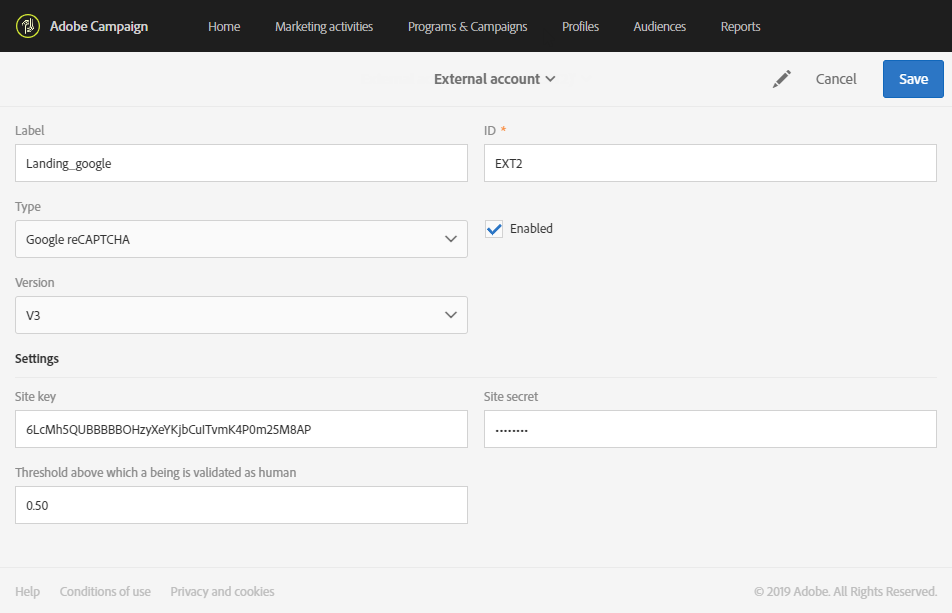
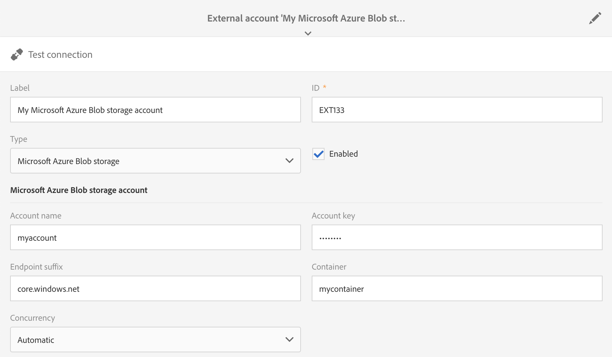

# Externa konton{#external-accounts}

Ett externt konto är en konfiguration som gör att du kan konfigurera och testa åtkomsten till en server utanför Adobe Campaign.

Dessa externa konton kan användas i Campaign-arbetsflöden för att få åtkomst till och hantera data.

Du kan ställa in följande typer av externa konton:

* SFTP. Mer information om detta finns i [det här avsnittet](#sftp-external-account).
* Amazon Storage Service (S3). Mer information om detta finns i [det här avsnittet](#amazon-s3-external-account).
* Adobe Experience Manager. Mer information om detta finns i [det här avsnittet](#adobe-experience-manager-external-account).
* Adobe Analytics. Mer information om detta finns i [det här avsnittet](../../integrating/using/configure-campaign-analytics-integration.md).
* Google reCAPTCHA. Mer information om detta finns i [det här avsnittet](#google-recaptcha-external-account).
* Microsoft Azure Blob-lagring. Mer information om detta finns i [det här avsnittet](#microsoft-azure-external-account).
* OAuth 2.0. Mer information finns i [det här avsnittet](#oauth-account).

>[!NOTE]
>
>Andra typer av externa konton används av Adobe under processen för produktetablering. Från och med Campaign Standard 17.9 kan FTP-externa konton fortfarande definieras, men de kan inte längre användas i nya arbetsflödesaktiviteter. Om du redan har konfigurerat en anslutning är den fortfarande aktiverad.

Externa konton kan konfigureras av administratörer på menyn **[!UICONTROL Administration > Application settings > External accounts]**.

## Skapa ett externt konto {#creating-an-external-account}

Adobe Campaign innehåller en uppsättning fördefinierade externa konton. Om du vill skapa anslutningar till externa system, t.ex. FTP-servrar som används för filöverföringar, kan du skapa egna externa konton.

Externa konton används av tekniska processer som tekniska arbetsflöden eller Campaign-arbetsflöden. När du konfigurerar en filöverföring i ett arbetsflöde eller ett datautbyte med något annat program (Adobe Target, Experience Manager, o.s.v.) måste du välja ett externt konto.

1. Klicka på knappen **[!UICONTROL Create]**.
1. Ange en etikett. Etiketten och ID:t används när du väljer externa konton i arbetsflöden.
1. Välj vilken typ av konto du vill skapa.
1. Konfigurera åtkomsten till kontot genom att ange autentiseringsuppgifter, serveradress, portnummer och nycklar när det är relevant.

   Den nödvändiga informationen tillhandahålls vanligtvis av leverantören för den server som du ansluter till.

1. Spara ditt konto.

Det externa kontot skapas och läggs till i kontolistan. Den är nu tillgänglig för dina data-/filöverföringar eller dirigeringskonfigurationer i arbetsflödesaktiviteter och leveransegenskaper.

## Externt SFTP-konto {#sftp-external-account}

Olika externa kontotyper kräver att annan information anges.

Ange följande information för ett externt SFTP-konto:

* Serveradress. Till exempel **ftp.domain.com**.
* Portnummer. Till exempel **22**.
* Autentiseringsuppgifter för SFTP-server: Kontonamn och lösenord som används för att ansluta till servern.

### Adobe SFTP-serverrekommendationer {#adobe-hosted-sftp-server-recommendations}

När du hanterar filer och data för ETL-ändamål lagras dessa filer på en SFTP-värdserver som tillhandahålls av Adobe. Denna SFTP är avsedd att vara ett tillfälligt lagringsutrymme där du kan styra lagring och borttagning av filer.

Om utrymmet inte används eller övervakas korrekt kan det snabbt fylla det fysiska utrymmet på servern och orsaka allvarliga problem. Det kan leda till dataförluster eller skador på din plattform.

Adobe rekommenderar att du följer god praxis nedan för att undvika sådana problem:

* Bibehåll minsta möjliga data.
* Använd nyckelbaserad autentisering för att undvika att lösenordet förfaller. Format som stöds är endast **OpenSSH** och **SSH2**. Du måste ange den offentliga nyckeln till Adobes supportteam för att få den överförd till Campaign-servern.
* Behåll data så länge som nödvändigt. 15 dagar är den maximala tidsgränsen.
* Använd arbetsflöden för att ta bort data på rätt sätt (hantera lagring från arbetsflöden som förbrukar data).
* Använd batchbearbetning i SFTP-överföringar och i arbetsflöden.
* Hantera fel/undantag.
* Det kan hända att du loggar in på SFTP för att direkt kontrollera vad som finns där.
* Kom ihåg att SFTP-diskhantering i första hand är ditt ansvar.

Observera också att de offentliga IP-adresserna som du försöker initiera SFTP-anslutningen från måste läggas till i tillåtelselista i Campaign-instansen. Du kan begära att få lägga till IP-adresser till tillåtelselista via en [supportbiljett](https://helpx.adobe.com/se/enterprise/using/support-for-experience-cloud.html), tillsammans med den offentliga nyckeln som ska användas för autentisering.

SFTP-servrar kan hanteras från kontrollpanelen. Mer information finns i dokumentationen för [Kontrollpanelen](https://docs.adobe.com/content/help/sv-SE/control-panel/using/sftp-management/about-sftp-management.html).

>[!NOTE]
>
>Kontrollpanelen är bara tillgänglig för administratörer som använder AWS som värd.
>
>Kontrollera om din instans finns på AWS [här](https://docs.adobe.com/content/help/sv-SE/control-panel/using/faq.html#ims-org-id).

## OAuth 2.0-konto {#oauth-account}

Ange följande information för ett externt OAuth 2.0-konto:

* A **Typ av bidrag**: endast **klientautentiseringsuppgifter** stöds.
* En **säker API-URL**: Ange slutpunkten för auktoriseringen.
* **OAuth 2.0-känsliga autentiseringsuppgifter**: Det här avsnittet är avsett för autentiseringsuppgifter som är känsliga till sin natur. Autentiseringsvärden maskeras på skärmen när de har lagts till, då inte går att läsa eller redigera. Om auktoriseringsslutpunkten kräver att en viss autentiseringsuppgift infogas i HTTP-auktoriseringshuvudet i stället för i POSTENS body-parameter, kan du markera alternativet Include i header för den autentiseringen.
* **OAuth 2.0 icke-känsliga autentiseringsuppgifter**: Det här avsnittet är avsett för autentiseringsuppgifter som är icke-känsliga till sin natur. Autentiseringsvärden visas på skärmen när de har lagts till. de kan också redigeras.  Om auktoriseringsslutpunkten kräver att en viss autentiseringsuppgift infogas i HTTP-auktoriseringshuvudet i stället för i POSTENS body-parameter, kan du markera alternativet Include i header för den autentiseringen.

När du har angett kontoinformationen klickar du på **Testa anslutningen** för att verifiera att det externa kontot har konfigurerats korrekt.


>[!NOTE]
>
>Autentiseringsuppgifterna&quot;Content-Type: application/x-www-form-urlencoded och &quot;grant_type=client_credentials&quot; läggs automatiskt till i API-anropet. Därför behöver du inte lägga till dem i avsnittet med autentiseringsuppgifter.

## Externt Amazon S3-konto {#amazon-s3-external-account}

Serverfältet för Amazon S3 ska fyllas i enligt följande:

```
<S3 bucket name>.s3.amazonaws.com/<s3 object path>
```

Markera kryssrutan **[!UICONTROL Keep files in S3 encrypted]** om du vill lagra filen i S3-krypterat läge.


Den nödvändiga informationen tillhandahålls vanligtvis av leverantören för den server som du ansluter till.

Ange slutpunkten som är associerad med **[!UICONTROL AWS Region]**. Du kan kontrollera vilka regioner och signaturversioner som stöds i den officiella [Amazon S3-dokumentationen](https://docs.aws.amazon.com/general/latest/gr/rande.html#s3_region).

>[!NOTE]
>
>Din **[!UICONTROL Receiver server]** ska ange din adress utan din AWS-region. Den läggs sedan automatiskt till i din URL.

### Kontorekommendationer för Amazon S3 {#amazon-s3-account-recommendations}

Vi rekommenderar att du följer dessa rekommendationer för att hjälpa dig att konfigurera ditt Amazon S3-konto:

* Skapa en strikt bucketprincip för att begränsa åtkomsten till S3-bucket. Bucketprincipen kan konfigureras när en bucket skapas. Mer information finns i [Amazon S3-dokumentationen](https://docs.aws.amazon.com/AmazonS3/latest/dev//example-bucket-policies.html).
* När du skapar ett externt konto aktiverar du krypteringen för att lagra känsliga data i S3-bucket genom att markera rutan **[!UICONTROL Keep files in S3 encrypted]**.
* Bevilja bucketbehörigheter för att ange vem som får åtkomst till objektet i en bucket. Mer information om bucketbehörighet finns i [Amazon S3-dokumentationen](https://docs.aws.amazon.com/AmazonS3/latest/dev//access-control-overview.html).

## Externt Adobe Experience Manager-konto {#adobe-experience-manager-external-account}

Externa Adobe Experience Manager-konton används vid integrering av Campaign med Experience Manager.

Processer och krav som rör den här integreringen är tillgängliga i [det här dokumentet](../../integrating/using/get-started-campaign-integrations.md).

När du konfigurerar det nya externa kontot måste du ange följande information:

* Server: Ange webbadressen till Adobe Experience Manager-servern. Exempel:

   ```
   http://aem.domain.com:4502
   ```

* Autentiseringsuppgifter för AEM-konto: Använd det konto som kommer att få åtkomst till Adobe Experience Manager-instansen. Det ska vara ett konto i Campaign-fjärrgruppen i Experience Manager.

## Externt Google reCAPTCHA-konto {#google-recaptcha-external-account}

>[!NOTE]
>
>Google reCAPTCHA-konfigurationen kräver ett Google-konto.

Med Google reCAPTCHA-mekanismen kan du skydda din landningssida mot skräppost och missbruk som orsakas av bottar. Detta är icke-störande för kunderna eftersom det inte kräver någon interaktion från dem och baseras på interaktioner med webbplatsen. Om du vill registrera webbplatsen ska du läsa den här [sidan](https://www.google.com/recaptcha/admin/create). Du måste välja typen V3 reCAPTCHA.

Om du vill lägga till Google reCAPTCHA V3 på landningssidan måste du först konfigurera den på ditt externa konto. Mer information om hur du lägger till den på landningssidan finns i det här [avsnittet](../../channels/using/configuring-landing-page.md#setting-google-recaptcha).

Ange följande information för ett externt Google reCAPTCHA V3-konto:

* En **[!UICONTROL Label]** och **[!UICONTROL ID]** på för ditt externa konto
* **[!UICONTROL Type]**: Google reCAPTCHA
* Din **[!UICONTROL Site key]** och **[!UICONTROL Site secret]**
* En **[!UICONTROL Threshold]** mellan 0 och 1

   Värdet 0,0 **[!UICONTROL Threshold]** innebär att det troligtvis är en bott och 1,0 troligtvis en bra interaktion. Som standard kan du använda ett tröskelvärde på 0,5.



## Externt konto för Microsoft Azure Blob Storage {#microsoft-azure-external-account}

>[!NOTE]
>
>Information som behövs för att konfigurera ditt externa konto i Adobe Campaign Standard finns i Azure Portal genom att välja **[!UICONTROL Settings]** > **[!UICONTROL Access keys]**.

Azure Blob Storage Connector kan användas för att importera eller exportera data till Adobe Campaign med hjälp av en **[!UICONTROL Transfer file]**-arbetsflödesaktivitet. Mer information om detta finns i [det här avsnittet](../../automating/using/transfer-file.md#azure-blob-configuration-wf).

Ange följande information för ett externt Microsoft Azure Blob Storage-konto:

* En **[!UICONTROL Label]** och **[!UICONTROL ID]** på för ditt externa konto
* **[!UICONTROL Type]**: Microsoft Azure Blob Storage
* Din **[!UICONTROL Account name]** och **[!UICONTROL Account key]**. Besök den här [sidan](https://docs.microsoft.com/en-us/azure/storage/common/storage-account-keys-manage) för information om var du hittar kontonamn och nyckeln.
* Din **[!UICONTROL Endpoint suffix]**. Den finns i din **[!UICONTROL Connection string]** på menyn **[!UICONTROL Access keys]** i Azure Portal. Mer information om detta finns på den här [sidan](https://docs.microsoft.com/en-us/azure/storage/common/storage-account-keys-manage).
* Ditt **[!UICONTROL Container]**-namn. Om du planerar att använda mer än en behållare måste du skapa lika många externa konton som det finns behållare.
* Med alternativet **[!UICONTROL Concurrency]** kan du finjustera hastigheten på filöverföringar.



När konfigurationen är klar klickar du på **[!UICONTROL Test connection]** för att koppla Adobe Campaign till Microsoft Azure Blob Storage.

### Rekommendationer för Microsoft Azure Blob Storage {#azure-blob-recommendations}

**Kryptering**

Adobe Campaign använder en säker anslutning (HTTPS) för att komma åt ditt Microsoft Azure Blob Storage-konto.

**Kontonyckel**

När du konfigurerar ditt externa konto måste du använda något av de **[!UICONTROL Account key]** tillgängliga alternativen i Azure Portal. Mer information om var du hittar dina kontonycklar finns på den här [sidan](https://docs.microsoft.com/en-us/azure/storage/common/storage-account-keys-manage#view-access-keys-and-connection-string).

**Optimera filöverföringshastigheten**

Med alternativet **[!UICONTROL Concurrency]** kan du finjustera hastigheten på filöverföringar.
Det representerar antalet trådar som ska användas för att utföra filöverföringen. Var och en av dessa trådar laddar ned ungefär 1 MB från blobben. De köas sedan för att skrivas till disken. Observera att om du ökar antalet trådar ökar du även belastningen på de resurser som används av programmet under filöverföringen.

När filöverföringen är klar finner du prestandamätvärden i arbetsflödesloggarna.

**Återförsök**

Som standard har filöverföringen för Azure Blob upp till fyra återförsök.  Om Azure Storage-tjänsten returnerar en felkod som t.ex. 503 (servern är upptagen) eller 500 (timeout för åtgärden), kan det betyda att du närmar dig eller överskrider skalbarheten för ditt lagringskonto. Det här kan hända om du använder ett nytt konto eller utför tester.

Om felet kvarstår kan du öka antalet försök genom att skapa ett alternativ under den avancerade menyn **[!UICONTROL Administration]** > **[!UICONTROL Application Settings]** > **[!UICONTROL Options]**.

Om det implementeras måste alternativet skapas på följande sätt:

```
ID:        AzureBlob_Max_Retries
Date type: Integer
Default:   <the number of retries needed>
```
