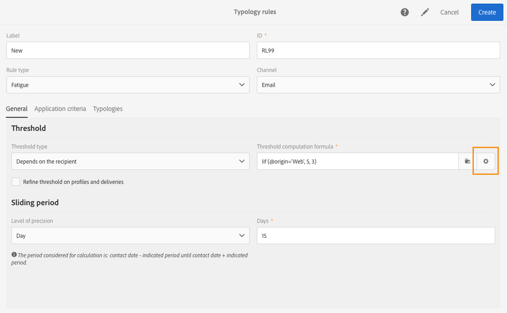

# Trötthetsregler{#fatigue-rules}

## Om trötthetsregler {#about-fatigue-rules}

Trötthetsregler gör det möjligt för marknadsförare att ange globala affärsregler för flera kanaler som automatiskt utesluter överbegärda profiler från kampanjer.

Om du vill implementera trötthetsregler definierar du ett maximalt antal meddelanden per profil och väljer en period som regeln ska gälla för. Vid leveransförberedelsen exkluderas profiler från leveransen, om tillämpligt, beroende på hur många meddelanden som redan har skickats till dem.

>[!NOTE]
>
>För att trötthetsregler ska gälla måste du definiera ett kontaktdatum för leveransen. Om du väljer att skicka meddelanden direkt kommer trötthetsregeln inte att tillämpas.

Relaterade ämnen:

* [Förberedelse](../../administration/using/configuring-email-channel.md#preparation)
* [Hantera typologier](../../administration/using/about-typology-rules.md#managing-typologies)
* [Typologiregler](../../administration/using/about-typology-rules.md#typology-rules)
* [Optimera kommunikationsfrekvensen för att förhindra kontakttrötthet](https://helpx.adobe.com/campaign/kb/simplify-campaign-management.html#Engageyourcustomersateverystep)

## Skapa en utmattningsregel {#creating-a-fatigue-rule}

Så här skapar och konfigurerar du en **[!UICONTROL Fatigue]** typologiregel:

1. Klicka på Adobe Campaign-logotypen i det övre vänstra hörnet av gränssnittet och välj sedan **[!UICONTROL Administration]** > **[!UICONTROL Channels]** > **[!UICONTROL Typologies]** > **[!UICONTROL Typology rules]**.

   

1. Klicka på i listan med typologiregler **[!UICONTROL Create]**.

   

1. Markera i **[!UICONTROL Rule type]** fältet **[!UICONTROL Fatigue]**.

   

1. I **[!UICONTROL Channel]** fältet väljer du vilken kanal regeln ska gälla för. Du kan antingen välja en kanal (e-post, SMS, direktreklam, mobilprogram) eller välja **[!UICONTROL All channels]**. Se [Välja kanal](#choosing-the-channel).

   

1. Definiera metoden för beräkning av maximalt antal meddelanden per profil på fliken **[!UICONTROL General]** . Du kan välja ett konstant tröskelvärde eller en variabel. Du kan också förfina tröskelvärdet för profiler och leveranser. Mer information finns i [Definiera tröskelvärdet](#defining-the-threshold).

   

1. Välj en **[!UICONTROL Sliding period]** som typologiregeln ska gälla för. Mer information finns i [Ställa in skjutningsperioden](#setting-the-sliding-period).

   

   I det här exemplet (se tidigare skärmbilder) väljer vi att skicka maximalt fyra meddelanden under en glidande period på 15 dagar.

1. På **[!UICONTROL Application criteria]** fliken kan du välja att tillämpa den här regeln på alla leveranser eller begränsa regelns tillämplighet enligt meddelandet som ska skickas. Regeln körs bara om programvillkoret uppfylls. Du kan t.ex. bara tillämpa regeln på meddelanden med en etikett som börjar med ett visst ord eller med ett ID som innehåller vissa bokstäver. Se [Begränsa tillämpligheten för en filtreringsregel](../../administration/using/filtering-rules.md#restricting-the-applicability-of-a-filtering-rule).

   

1. Markera fliken och länka din typologiregel till den typologi som används för dina leveranser. **[!UICONTROL Typologies]** Se [Hantera typologier](../../administration/using/about-typology-rules.md#managing-typologies) och [typologiregler](../../administration/using/about-typology-rules.md#typology-rules).

   

   >[!NOTE]
   >
   >Typologin kan definieras i leveransmallen som automatiskt ska tillämpas på alla leveranser som skapas med den här mallen.

Vid färdigställande av leveransen utesluts profiler från leveransen, om tillämpligt, beroende på hur många leveranser som redan har skickats till dem. Du kan visa resultaten av körningen av utmattningsregeln i leveransloggarna. Se [Visa resultaten](#viewing-the-fatigue-results)av trötthet.

>[!IMPORTANT]
>
>För att trötthetsregler ska fungera måste du definiera ett kontaktdatum för leveransen. Om du väljer att skicka meddelanden direkt kommer trötthetsregeln inte att tillämpas.

## Välja kanal {#choosing-the-channel}

Trötthetsregler är tillgängliga för olika kanaler. Kanalen definieras i fältet **[!UICONTROL Channel]** för typologiregelinställningarna. Du kan antingen välja en kanal eller markera **[!UICONTROL All channels]**.

**Tillgängliga kanaler**

Följande kanaler är tillgängliga:

* E-post
* Mobil (SMS)
* Direktreklam
* Mobilprogram: Med den här kanalen kan du skicka push-meddelanden till profiler eller till appprenumeranter. Om du väljer att skicka meddelanden till profiler är de kompatibla med flerkanalsregler för trötthet.

   >[!IMPORTANT]
   >
   >Trötthetsregler är inte kompatibla med push-meddelanden som skickas till programprenumeranter. Om du skickar meddelanden till programprenumeranter gäller inte trötthetsregler.

* Alla kanaler: Med det här alternativet kan du tillämpa regeln på alla kanaler. Du kan till exempel bestämma dig för att skicka högst tre meddelanden per månad i valfri kanal. Om du skickade två e-postmeddelanden till en profil förra veckan och du försöker skicka ett push-meddelande idag, kommer samma profil att uteslutas.

**Leveranstyper**

Trötthetsregler är kompatibla med alla leveranstyper: engångsleveranser, återkommande leveranser, arbetsflöden och transaktionsmeddelanden.

**Transaktionsmeddelanden** kan användas för att skicka tjänstmeddelanden som riktar sig mot en händelse (rtEvent) samt marknadsföringsmeddelanden (målprofiler), till exempel ett återmarknadsföringsmeddelande. Trötthetsregler är endast kompatibla med marknadsföringsmeddelanden (målgruppsprofiler). Händelsetransaktionsmeddelanden innehåller ingen profilinformation och är därför inte kompatibla med trötthetsregler (även om det gäller en anrikning med profiler). Tack vare stöd för marknadsföringsmeddelanden i transaktionsmeddelanden kan ni **tillämpa en trötthetsregel på alla kanaler, inklusive marknadsföringsmeddelanden**.

## Definiera tröskelvärdet {#defining-the-threshold}

Varje trötthetsregel definierar ett tröskelvärde, det vill säga det maximala antalet meddelanden som kan skickas till en profil under en viss period. När denna tröskel har uppnåtts kan inga fler leveranser göras förrän efter utgången av skadeundersökningsperioden. Med den här processen kan du automatiskt utesluta en profil från en leverans om ett meddelande överskrider det angivna tröskelvärdet och på så sätt undvika överdriven begäran.

Tröskelvärden kan vara antingen konstanta eller variabla. Detta innebär att tröskelvärdena för en viss period kan variera från en profil till en annan eller till och med för samma profil.

**Använda ett fast tröskelvärde**

Tröskelvärdet är det högsta antalet meddelanden som kan skickas till en profil under den aktuella perioden.

Som standard är tröskelvärdet konstant och du måste ange ett maximalt antal meddelanden som tillåts av regeln.

**Använda ett variabelt tröskelvärde**

Om du vill definiera ett variabeltröskelvärde väljer du **[!UICONTROL Depends on the recipient]** värdet i **[!UICONTROL Threshold type]** fältet.

Sedan finns det två alternativ:

* välj ett profilfält: Tröskelvärdet varierar för varje profil enligt det valda fältet. Om du t.ex. har utökat profilresursen med fältet Kommunikationsfrekvens klickar du på knappen till höger om **[!UICONTROL Threshold computation formula]** fältet och väljer fältet. För varje profil kommer tröskelvärdet att motsvara värdet i fältet Kommunikationsfrekvens.

   

* definiera en formel: Klicka på den andra knappen till höger om **[!UICONTROL Threshold computation formula]** fältet för att definiera en avancerad beräkningsformel för tröskelvärde. Du kan till exempel indexera antalet auktoriserade meddelanden enligt det segment som profilen tillhör. Det innebär att en profil som tillhör segmentet &#39;Webb&#39; kan ta emot fler meddelanden än andra profiler. En **[!UICONTROL Iif (@origin='Web', 5, 3)]** typformel tillåter leverans av 5 meddelanden till profiler i webbsegmentet och 3 för andra segment.

   

**Förfina tröskelvärdet för profiler och leveranser**

Som standard tas alla meddelanden med i beräkningen av tröskelvärdet. Markera **[!UICONTROL Refine Threshold on profiles and deliveries]** kryssrutan för att filtrera de profiler och leveranser som ska räknas när leveransen förbereds.

I följande exempel räknas bara manliga profiler och endast leveranser med en etikett som börjar med **nyhetsbrev** räknas.

Att förfina tröskelvärdet för leveranser skiljer sig från att begränsa tillämpligheten för hela regeln ( **[!UICONTROL Application criteria]** tabb):

* **[!UICONTROL Application criteria]**: du väljer att köra regeln eller inte enligt specifika villkor. Om ditt programvillkor till exempel är &quot;Etikett börjar med nyhetsbrev&quot;, gäller regeln bara för leveranser som uppfyller det här villkoret. Om leveransetiketten börjar med &quot;Kampanj&quot; kommer regeln inte att köras alls.
* **[!UICONTROL Refine threshold on profiles and deliveries > Deliveries to count]**: alla leveranser som använder den här typologiregeln kommer att köra regeln, men du bestämmer bland de tidigare och schemalagda leveranserna vilka du vill räkna. Om begränsningen till exempel är &quot;Etikett börjar med nyhetsbrev&quot; kommer regeln att köras även om leveransetiketten börjar med &quot;Kampanj&quot;. Under den valda glidperioden räknas antalet leveranser vars etikett börjar med &quot;Nyhetsbrev&quot;.

## Ange glidperiod {#setting-the-sliding-period}

Trötthetsregler definieras i vardagar. Perioden konfigureras i **[!UICONTROL Sliding period]** avsnittet, till exempel 2 veckor, 7 dagar eller 5 timmar.

När regeln körs beaktas både tidigare leveranser och schemalagda leveranser. Detta garanterar att tröskelvärdet aldrig överskrids under en viss glidperiod.

Om du till exempel definierar en 48-timmarsperiod kommer systemet att leta 48 timmar **före kontaktdatumet** och 48 timmar **efter kontaktdatumet**. Den valda perioden fördubblas för att möjliggöra integrering av såväl framtida leveranser som tidigare leveranser.

Om du vill begränsa antalet leveranser som beaktas till en tvåveckorsperiod anger du **Dag** och **7** eller 1 vecka i avsnittet **Glidande period** . Leveranser som skickas upp till 7 dagar före leveransdatumet och som schemaläggs upp till 7 dagar efter leveransdatumet då regeln tillämpas kommer att tas med i beräkningen.

## Visa resultaten av trötthet {#viewing-the-fatigue-results}

Vid färdigställande av leveransen utesluts profiler från leveransen, om tillämpligt, beroende på hur många leveranser som redan har skickats till dem. Klicka på knappen längst ned till höger i **[!UICONTROL Deployment]** blocket om du vill visa resultaten av trötthetsregelkörningen.

Det finns tre flikar som visar information om resultaten av trötthetskörningen, inklusive namnet på den regel som tillämpades:

* Leveransloggar:

   

* Uteslutningsloggar:

   

* Uteslutningsorsaker:

   

## Visa sammanfattningsrapporten om trötthetsregler {#viewing-the-fatigue-rule-summary-report}

Adobe Campaign innehåller en dedikerad rapport om trötthetsregler som hjälper er att förstå hur de tillämpas på era kampanjer. På så sätt kan ni lära er hur era kampanjer påverkar varandra och göra rätt justeringar.

Du kommer åt **[!UICONTROL Fatigue rules summary]** rapporten med hjälp av **[!UICONTROL Reports]** knappen längst upp till höger i varje program, kampanj och meddelande.

I den vänstra delen av skärmen kan du filtrera rapportdata på leveransens kontaktdatum. Som standard börjar den markerade perioden 15 dagar före dagens datum och slutar 15 dagar efter. Du kan också filtrera efter en viss trötthetsregel.

I cirkeldiagrammet visas följande information om den valda perioden:

* **[!UICONTROL Total targeted]**: det totala målet före meddelandeförberedelse
* **[!UICONTROL Excluded]**: det totala antalet undantag på grund av tillämpning av trötthetsregel
* **[!UICONTROL Other exclusions]**: det totala antalet uteslutningar till följd av andra typologiregler
* **[!UICONTROL To deliver]**: det totala antalet meddelanden som ska levereras efter meddelandeförberedelsen ( **[!UICONTROL To deliver]** = **[!UICONTROL Total targeted]** - **[!UICONTROL Excluded]** - **[!UICONTROL Other exclusions]** )

Till höger om diagrammet hittar du antalet undantag, uppdelade efter trötthetsregel.

Den nedre tabellen visar alla leveranser inom den valda perioden. För varje leverans kan du se vilka trötthetsregler som gäller och motsvarande undantag. Leveranser som inte har något kontaktdatum visas också i tabellen.

* **[!UICONTROL 0]** innebär att trötthetsregeln tillämpades, men inget undantag gjordes.
* **[!UICONTROL -N]** betyder att det inte förekom några undantag.
* ett tomt fält innebär att trötthetsregeln inte tillämpades.

>[!NOTE]
>
>De data som visas är inte kontextuella till det program, det meddelande eller den kampanj som du kommer åt rapporten från. Den här rapporten innehåller alla trötthetsregler och -leveranser för alla organisationsenheter. På så sätt kan ni få en global bild av alla leveranser för att förstå hur era kampanjer påverkas av andra.

## Exempel {#examples}

Det finns många möjligheter när det gäller genomförandet av trötthetshantering. Här är några exempel på vad du kan göra:

* Skapa en trötthetsregel med ett **konstant tröskelvärde** som gäller för **alla kanaler**:

   Låt oss säga att du skapar en flerkanalsregel med ett konstant tröskelvärde på 3 under en glidande period på 7 dagar.

   Förra veckan fick dina premiumprofiler ett e-postmeddelande om erbjudanden och ett e-postmeddelande om transaktionsåtermarknadsföring. Du har också schemalagt ett SMS som ska skickas nästa vecka. Idag bestämmer du dig för att skicka ett push-meddelande för alla dina profiler. Premiumprofilerna kommer inte att ingå i dagens push-process eftersom det maximala antalet meddelanden under en tvåveckorsperiod redan har uppnåtts.

   

* Skapa en trötthetsregel med hjälp av ett **variabelt tröskelvärde** baserat på ett **profilfält**:

   Du har utökat profilresursen med ett &#39;kommunikationsgräns&#39;-fält för att definiera olika tröskelvärden för varje profil. I trötthetsregeln definierar du ett variabeltröskelvärde baserat på det här fältet och väljer en glidande period på 2 dagar. Låt oss ta två exempel på profiler: John har en kommunikationsgräns på 1 och David har ett tröskelvärde på 2. Båda har redan fått ett nyhetsbrev i går. Du bestämmer dig för att skicka ett e-postmeddelande till dem idag. Bara David kommer att få det, eftersom John har uteslutits från målet.

   

* Skapa en trötthetsregel med en **beräkningsformel** för tröskelvärde:

   Du vill ändra tröskelvärdet baserat på åldern på dina profiler. Om en profil är under 40 vill du definiera en gräns på 4 och för äldre profiler en gräns på 2. I stället för att definiera det här tröskelvärdet för varje profil med ett utökat fält kan du skapa en formel direkt i utmattningsregeln för att beräkna tröskelvärdet utifrån profilens ålder. I vårt exempel är formeln **[!UICONTROL Iif (@age<40, 4, 2)]**.

   

   >[!NOTE]
   >
   >I det här avsnittet finns också ett steg-för-steg-exempel på en trötthetsberäkningsformel.

* Skapa en trötthetsregel som **förfinar tröskelvärdet** för profiler och leveranser:

   Du har utökat profilresursen med ett poängfält och du har även utökat leveransresursen med ett Type-fält. Du vill definiera ett konstant tröskelvärde på 3, men du vill exkludera alla leveranser av typen &quot;Varning&quot; eller &quot;Black Friday&quot; och alla profiler med ett poängvärde på mer än 10. När regeln ska köras räknas alla leveranser som inte är av typen &quot;Varning&quot; eller &quot;Black Friday&quot;, bland tidigare och schemalagda leveranser, som skickas till profiler vars poäng är mindre än 10.

   

Här följer ett stegvis exempel på en trötthetsregel som använder en beräkningsformel för tröskelvärde.

I det här fallet vill vi skapa en typologiregel för att förhindra att fler än 2 meddelanden per vecka skickas till premiumprofiler och 2 meddelanden per vecka till standardprofiler.

För att identifiera kunder och potentiella kunder utökade vi profilresursen med **[!UICONTROL Status]** fältet, som innehåller 0 för premiumprofiler och 1 för standardprofiler.

Så här skapar du regeln:

1. Skapa en ny typologiregel för **trötthet** .
1. I **[!UICONTROL Threshold]** avsnittet vill vi skapa en formel för att beräkna tröskeln beroende på varje profil. Markera **[!UICONTROL Depends on the recipient]** värdet i **[!UICONTROL Threshold type]** fältet och klicka sedan på ikonen för den andra knappen till höger om **[!UICONTROL Threshold computation formula]** fältet.

   

1. Dubbelklicka på **[!UICONTROL List of functions]** Iif **-funktionen i** **[!UICONTROL Others]** noden i avsnittet.

   

1. Välj sedan profilens **status** i **[!UICONTROL Available fields]** avsnittet.

   

1. Ange önskade värden för att skapa följande formel: **Iif(@status=0,2,4)**

   

   Med den här formeln kan du tilldela värdet 2 om statusen är lika med 0 och värdet 4 för alla andra statusvärden.

1. Klicka **[!UICONTROL Confirm]** för att godkänna formeln.
1. Ange **[!UICONTROL Sliding period]** på vilken regel gäller: 7 dagar i detta fall för att begränsa de leveranser som beaktas till en tvåveckorsperiod.

   

1. Länka nu den regel du just har skapat till en typologi för att använda den på dina leveranser. Det gör du genom att välja **[!UICONTROL Typologies]** fliken, klicka **[!UICONTROL Create element]** och välja den typologi som ska användas för leveranserna.

   

1. Spara regeln för att godkänna skapandet.

Regeln tillämpas på alla leveranser baserat på typologi.
