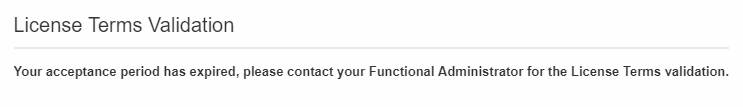

# Licenser{#licenses}

I **[!UICONTROL Licenses]** fönstret kan du visa de installerade licenserna på din instans och annan information om den, t.ex. build-nummer, releaseversion eller om avtalsvillkoren har godkänts och av vem.

Med ett nytt bygge eller en ny funktion kan licensvillkoren ändras och måste accepteras av en funktionell administratör för instansen.

Följande fönster visas för standardanvändare när de har loggat in. Ingen åtgärd krävs från deras sida. De kan fortfarande arbeta med Adobe Campaign genom att klicka på **[!UICONTROL OK]** knappen .

En administratör måste läsa och bekräfta de nya villkoren för avtalet inom 30 dagar efter bygginstallationen genom att kontrollera **[!UICONTROL I accept the terms from the license agreement]** och klicka på **[!UICONTROL Confirm]**.

Dessa 30 dagar har gått, om avtalet inte godkänns, kan inga användare använda den här instansen. Standardanvändarna kommer inte att kunna komma åt Adobe Campaign-funktioner och kommer bara att se följande meddelande tills en funktionell administratör godkänner avtalsvillkoren.

