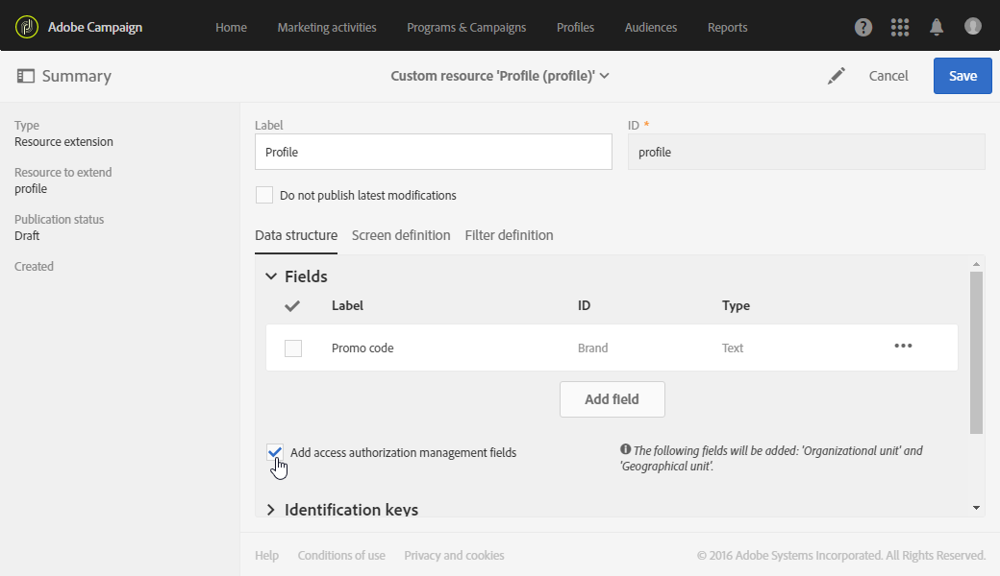

# Organisationsenheter{#organizational-units}

## Om enheter {#about-units}

Varje objekt och användare av plattformen är länkade till en organisationsenhet. Den här enheten gör att en hierarkisk struktur kan definieras för att ge användarna en filtrerad vy. En användares enhet definierar sin åtkomstnivå för olika plattformsobjekt.

>[!IMPORTANT]
>
>Om en användare inte är länkad till någon enhet kommer den användaren inte att kunna ansluta till Adobe Campaign. Om du vill begränsa åtkomsten för en viss användare eller grupp av användare ska du inte länka den till enheten **[!UICONTROL All]**. Vi rekommenderar att du lägger till alternativet **Hanteringsfält för åtkomstbehörighet** innan du importerar några profiler. Mer information om detta hittar du i det här [avsnittet](../../administration/using/organizational-units.md#partitioning-profiles).
>
>**[!UICONTROL All (all)]** Organisationsenheten tilldelas som standard till **[!UICONTROL Administrators]** säkerhetsgruppen.  Den är skrivskyddad och kan inte ändras.

En användare har skrivskyddad åtkomst till alla objekt i de överordnade enheterna. Han har läs- och skrivåtkomst till alla sina objekt i sin enhet och sina underordnade enheter. En användare har inte åtkomst till objekt i parallella grenar.

Som standard är bara **[!UICONTROL All]** enheter tillgängliga.

När användaren tilldelas en organisationsenhet används alltid den här enheten på de objekt som användaren skapade.

>[!NOTE]
>
>När en användare finns i flera grupper som är länkade till olika enheter används vissa regler. Mer information finns i avsnittet [Hantera grupper och användare](../../administration/using/managing-groups-and-users.md).

## Skapa och hantera enheter {#creating-and-managing-units}

Med organisationsenheter kan du filtrera instansen beroende på vilken organisation användarna är länkade till. Den här enheten kan representera en region, ett land eller till och med ett varumärke i din instans.

Här har vi tidigare skapat säkerhetsgrupper med olika roller för två användare: en användare har tilldelats säkerhetsgrupperna Administratörer och Geometrixx, den andra användaren tillhör säkerhetsgrupperna Standard-användare och Geometrixx Se [Skapa en säkerhetsgrupp och tilldela användare](../../administration/using/managing-groups-and-users.md#creating-a-security-group-and-assigning-users) för det fullständiga exemplet.

Nu måste vi skapa organisationsenheter för Geometrixx- och Geometrixx säkerhetsgrupper:

1. På Adobe kampanjens avancerade meny väljer du **[!UICONTROL Administration]** > **[!UICONTROL Users & security]** > **[!UICONTROL Organizational units]**.
1. Klicka på **[!UICONTROL Create]** för att börja konfigurera din organisationsenhet.

   

1. Ändra standardvärdena för **[!UICONTROL Label]** och **[!UICONTROL ID]** till Geometrixx.
1. Länka sedan den här enheten till en överordnad enhet. Här väljer vi **[!UICONTROL All]**.

   

1. Klicka slutligen på **[!UICONTROL Create]** för att börja tilldela din nya organisationsenhet till säkerhetsgruppen.
1. Följ samma procedur för enheten Geometrixx Clothes, förutom att dess överordnade enhet måste vara den tidigare skapade enheten, Geometrixx.

   

För att se effekten av att tilldela olika enheter till olika säkerhetsgrupper skapar den användare som tilldelats administratörs- och Geometrixx-grupperna två e-postmallar för att se vad den andra användaren som tilldelats standardanvändare och Geometrixx kan eller inte kan komma åt.

1. Välj **[!UICONTROL Resources]** > **[!UICONTROL Templates]** > **[!UICONTROL Delivery Templates]** på den avancerade menyn.
1. Duplicera en befintlig mall och anpassa den efter behov. Mer information finns i avsnittet [Om mallar](../../start/using/marketing-activity-templates.md).
1. När mallen skapas väljer du ikonen **[!UICONTROL Edit properties]** för att tilldela enheter till mallen.

   

1. Välj organisationsenhet i listrutan **[!UICONTROL Access authorization]**.

   Här ska vi skapa en mall med den tidigare skapade Geometrixx för organisationsenheter.

   

1. Följ samma procedurer för att skapa den andra mallen som tilldelats den tidigare skapade organisationsenheten för Geometrixx.

Användaren som är tilldelad standardgrupperna för användare och Geometrixx kan se båda mallarna. På grund av organisationsenheternas hierarkiska struktur har han läs- och skrivåtkomst till den mall som är länkad till Geometrixx Color-enheten och endast skrivskyddad åtkomst till den mall som är länkad till Geometrixx.

Eftersom enheten för Geometrixx är en underordnad enhet till Geometrixx visas följande meddelande när användaren försöker ändra Geometrixx:

Organisationsenheter kan begränsa åtkomsten till olika funktioner som profiler. Om våra Geometrixx-användare till exempel har åtkomst till fliken **[!UICONTROL Profiles]** kan de få fullständig åtkomst till och ändra profilerna med organisationsenheten för Geometrixx.

Profilerna med organisationsenheten för Geometrixx kommer att vara skrivskyddade, men följande fel visas om användaren försöker ändra en profil: **[!UICONTROL You do not have the rights needed to modify the 'profile' resource of ID]**.

## Partitionsprofiler {#partitioning-profiles}

>[!IMPORTANT]
>
>Vi rekommenderar att du lägger till det här alternativet innan du importerar några profiler eftersom användare inte kan komma åt profiler utan organisationsenheter.
>
>Om du redan har importerat din kunddatabas måste du uppdatera den för att kunna ange organisationsenhetsvärden för de redan importerade profilerna.

Om din organisation behöver isolera profilerna som kontaktas av alla dina olika varumärken kan du partitionera profilerna efter deras organisationsenheter.

Som standard är organisationsenhetsfälten inte tillgängliga i dina profiler och behöver läggas till.

1. På den avancerade menyn, via Adobe Campaign logotyp, väljer du **Administration > Utveckling > Anpassade resurser**.
1. Välj **Profil** eller skapa en ny anpassad resurs för att utöka profilerna. Mer information om hur du utökar profilerna finns på den här [sidan](../../developing/using/extending-the-profile-resource-with-a-new-field.md#step-1--extend-the-profile-resource).
1. Markera rutan **Lägg till åtkomstbehörighetshanteringsfält** för att lägga till organisationsenheter i tillägget **Profil**.

   

1. Klicka på **[!UICONTROL Save]**.
1. Uppdatera strukturen genom att publicera om anpassade resurser. Mer information om publiceringsprocessen finns i [Uppdatera avsnittet struktur](../../developing/using/updating-the-database-structure.md).

Fältet för organisationsenhet läggs till i dina profiler i **[!UICONTROL Access authorization]**-avsnittet.

**Relaterade ämnen**:

* [Om enheter](../../administration/using/organizational-units.md#about-units)
* [Om åtkomsthantering](../../administration/using/about-access-management.md)
