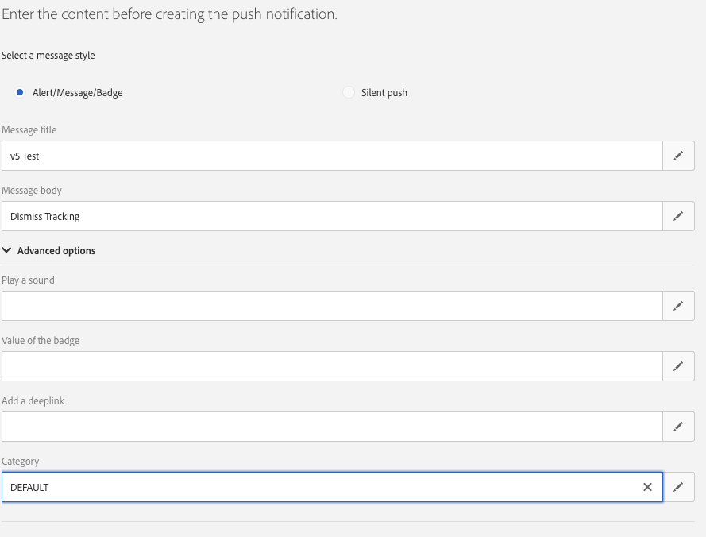

# Implementera push-spårning {#push-tracking}

## Om push-spårning {#about-push-tracking}

För att säkerställa att push-meddelandet har utvecklats fullt ut måste du se till att spårningsdelen har implementerats korrekt eftersom inte alla push-meddelanden har spårning aktiverat. För att kunna aktivera detta måste utvecklare identifiera vilka leveranser som har spårning aktiverat. Adobe Campaign Standard skickar en flagga med namnet `_acsDeliveryTracking` med två värden **den** eller **av**. Apputvecklaren bör bara skicka en spårningsbegäran för leveranser som har variabeln inställd på **den**.

>[!IMPORTANT]
>
>Den här variabeln är inte tillgänglig för leveranser som angetts före version 21.1 eller leveranser med anpassade mallar.

Push-spårning är indelad i tre typer:

* **Push Impressions** - När ett push-meddelande har levererats till enheten finns det i meddelandecentret utan någon användarinteraktion.

* **Tryck på klicka** - När ett push-meddelande har levererats till enheten och användaren har klickat på enheten.  Användaren ville antingen visa meddelandet (som i sin tur går till Push Open tracking) eller stänga meddelandet.

* **Push Open** - När ett push-meddelande har levererats till enheten och användaren har klickat på meddelandet som får programmet att öppnas. Det här liknar kommandot Push Click (Push-klicka), förutom att Push Open (Push Open) inte aktiveras om meddelandet stängs.

För att implementera spårning för Campaign Standard måste mobilappen innehålla Adobe Experience Platform SDK:er. Dessa SDK:er är tillgängliga i [dokumentationen för Adobe Experience Platform SDK](https://github.com/Adobe-Marketing-Cloud/acp-sdks).

Om du vill skicka spårningsinformation finns det tre variabler som måste skickas. Två som är en del av data som har tagits emot från Campaign Standarden och en åtgärdsvariabel som anger om det är en **Impression**, **Click** eller **Open**.

| Variabel | Värde |
|:-:|:-:|
| broadlogId | _mId från data |
| deliveryId | _dId från data |
| åtgärd | &quot;1&quot; för Open, &quot;2&quot; för Click och &quot;7&quot; för Impression |

## Implementering för Android {#implementation-android}

### Så här implementerar du spårning av push-intrycken {#push-impression-tracking-android}

För att kunna spåra ett intryck måste du skicka värdet 7 för åtgärden när du anropar funktionerna `collectMessageInfo()` eller `trackAction()`.

För leveranser som skapats före version 21.1 eller leveranser med en anpassad mall, se [avsnittet](../../administration/using/push-tracking.md#about-push-tracking).

```
@Override
public void onMessageReceived(RemoteMessage remoteMessage) {
....{Handle push messages}....
  if (data.size() > 0) {
    String deliveryId = data.get("_dId");
    String messageId = data.get("_mId");
    String acsDeliveryTracking = data.get("_acsDeliveryTracking");
 
    /*
    This is to handle deliveries created before 21.1 release or deliveries with custom template
    where acsDeliveryTracking is not available.
    */
    if( acsDeliveryTracking == null ) {
        acsDeliveryTracking = "on";
    }
 
    HashMap<String, String> contextData = new HashMap<>();
    if( deliveryId != null && messageId != null && acsDeliveryTracking.equals("on")) {
      contextData.put("deliveryId", deliveryId);
      contextData.put("broadlogId", messageId);
      contextData.put("action", "7");

    //If you are using ACPCore v1.4.0 or later, use the next line.
      
      MobileCore.collectMessageInfo(contextData);
      
    //Else comment out the above line and uncomment the line below
        
    //MobileCore.trackAction("tracking", contextData) ;
    }
  }
}
```

### Så här implementerar du klickspårning {#push-click-tracking-android}

För klickspårning måste du skicka värdet &quot;2&quot; för åtgärd när du anropar `collectMessageInfo()`- eller `trackAction()`-funktioner.
Om du vill spåra klickningar måste två scenarier hanteras:

* Användaren ser meddelandet men rensar det.
* Användaren ser meddelandet och klickar på det för att göra det till en öppen spårning.

För att kunna hantera detta måste du använda två metoder: en för att klicka på meddelandet och en annan för att stänga meddelandet.

För leveranser som skapats före version 21.1 eller leveranser med en anpassad mall, se [avsnittet](../../administration/using/push-tracking.md#about-push-tracking).

**[!UICONTROL MyFirebaseMessagingService.java]**

```
private void sendNotification(Map<String, String> data) {
    Intent openIntent = new Intent(this, CollectPIIActivity.class);
    Intent dismissIntent = new Intent(this, NotificationDismissedReceiver.class);
    openIntent.addFlags(Intent.FLAG_ACTIVITY_CLEAR_TOP);
  
    //put the data map into the intent to track clickthroughs
    Bundle pushData = new Bundle();
    Set<String> keySet = data.keySet();
    for (String key : keySet) {
        pushData.putString(key, data.get(key));
    }
    openIntent.putExtras(pushData);
    dissmissIntent.putExtras(pushData);
  
  
    PendingIntent pendingIntent = PendingIntent.getActivity(this, 0, openIntent,
        PendingIntent.FLAG_UPDATE_CURRENT);
    PendingIntent onDismissPendingIntent = PendingIntent.getBroadcast(this.getApplicationContext(), 0, dismissIntent, 0);
  
    //<BUILD NOTIFICATION using notification builder>
    //Add both Intents to the notification
    notificationBuilder.setContentIntent(pendingIntent);
    notificationBuilder.setDeleteIntent(onDismissPendingIntent);
}
```

För att **[!UICONTROL BroadcastReceiver]** ska fungera måste du registrera den för **[!UICONTROL AndroidManifest.xml]**

```
<manifest>
    <application>
        <receiver android:name=".NotificationDismissedReceiver">
        </receiver>
    </application>
</manifest>
```

NotificationDismessedReceiver.java

```
public class NotificationDismissedReceiver extends BroadcastReceiver {
    private static final String TAG = NotificationDismissedReceiver.class.getSimpleName();
    @Override
    public void onReceive(Context context, Intent intent) {
        Bundle data = intent.getExtras();
        String deliveryId = data.getString("_dId");
        String messageId = data.getString("_mId");
        String acsDeliveryTracking = data.get("_acsDeliveryTracking");
         
        /*
        This is to handle deliveries created before 21.1 release or deliveries with custom template
        where acsDeliveryTracking is not available.
        */
        if( acsDeliveryTracking == null ) {
            acsDeliveryTracking = "on";
        }
 
        HashMap<String, Object> contextData = new HashMap<>();
 
        //We only send the click tracking since the user dismissed the notification
        if (deliveryId != null && messageId != null && acsDeliveryTracking.equals("on")) {
            contextData.put("deliveryId", deliveryId);
            contextData.put("broadlogId", messageId);
            contextData.put("action", "2");
            
        //If you are using ACPCore v1.4.0 or later, use the next line.
        
            MobileCore.collectMessageInfo(contextData);
            
        //Else comment out the above line and uncomment the line below
        
            //MobileCore.trackAction("tracking", contextData);
        }
    }
}
```

### Implementera öppen spårning {#push-open-tracking-android}

Du måste skicka&quot;1&quot; och&quot;2&quot; eftersom användaren måste klicka på meddelandet för att kunna öppna appen. Om appen inte startas/öppnas via push-meddelanden inträffar inga spårningshändelser.

För att kunna spåra öppning måste du skapa återgivning. Med återgivningsobjekt kan Android OS anropa din metod när vissa åtgärder är klara. I det här fallet klickar du på meddelandet för att öppna programmet.

Den här koden baseras på implementeringen av klickningsvisningsspårning. När **[!UICONTROL Intent]** har angetts måste du skicka spårningsinformation tillbaka till Adobe Campaign Standard. I det här fallet måste du ställa in **[!UICONTROL Open Intent]** så att den öppnas för en viss vy i din app. Detta anropar metoden onResume med meddelandedata i **[!UICONTROL Intent Object]**.

För leveranser som skapats före version 21.1 eller leveranser med en anpassad mall, se [avsnittet](../../administration/using/push-tracking.md#about-push-tracking).

```
@Override
protected void onResume() {
    super.onResume();
    handleTracking();
}
 
 
private void handleTracking() {
    //Check to see if this view was opened based on a notification
    Intent intent = getIntent();
    Bundle data = intent.getExtras();
 
    if (data != null) {
        //This was opened based on the notification, you need to get the tracking that was passed on.
        String deliveryId = data.getString("_dId");
        String messageId = data.getString("_mId");
        String acsDeliveryTracking = data.get("_acsDeliveryTracking");
        /*
        This is to handle deliveries created before 21.1 release or deliveries with custom template
        where acsDeliveryTracking is not available.
        */
        if( acsDeliveryTracking == null) {
            acsDeliveryTracking = "on";
        }
 
        HashMap<String, String> contextData = new HashMap<>();
 
        if (deliveryId != null && messageId != null && acsDeliveryTracking.equals("on")) {
            contextData.put("deliveryId", deliveryId);
            contextData.put("broadlogId", messageId);
            contextData.put("action", "2");
            
            //Send Click Tracking since the user did click on the notification
              
                //If you are using ACPCore v1.4.0 or later, use the next line.

                MobileCore.collectMessageInfo(contextData);
                  
                //Else comment out the above line and uncomment the line below
        
                //MobileCore.trackAction("tracking", contextData);
 
                //Send Open Tracking since the user opened the app
            
                contextData.put("action", "1");
                
                //If you are using ACPCore v1.4.0 or later, use the next line.

                MobileCore.collectMessageInfo(contextData);
                //Else comment out the above line and uncomment the line below
        
                //MobileCore.trackAction("tracking", contextData);
        }
    }
}
```

## Implementering för iOS {#implementation-iOS}

### Så här implementerar du spårning av push-intrycken {#push-impression-tracking-iOS}

För att kunna spåra ett intryck måste du skicka värdet 7 för åtgärden när du anropar funktionerna `collectMessageInfo()` eller `trackAction()`.

För att förstå hur iOS-meddelanden fungerar måste appens tre lägen vara detaljerade:

* **Förgrund**: När appen är aktiv och finns på skärmen (i förgrunden).
* **Bakgrund**: När det är en app som inte visas men processen inte är stängd. När du dubbelklickar på hemknappen visas vanligtvis alla program som finns i bakgrunden.
* **Av/stängd**: en app vars process har avslutats.

För att **[!UICONTROL Impression]** fortfarande ska kunna spåras när appen är i bakgrunden måste vi skicka **[!UICONTROL Content-Available]** för att meddela appen att en spårning måste göras.

>[!CAUTION]
>
> Om ett program stängs kommer Apple inte att anropa programmet förrän appen har startats om. Det innebär att du inte kan veta när meddelandet har tagits emot på iOS. </br> På grund av det här kan det bero på att iOS visningsspårning inte är korrekt och inte bör betraktas som tillförlitlig.

För leveranser som skapats före version 21.1 eller leveranser med en anpassad mall, se [avsnittet](../../administration/using/push-tracking.md#about-push-tracking).

Följande kod har bakgrundsprogrammet som mål:

```
// In didReceiveRemoteNotification event handler in AppDelegate.m
 
//In order to handle push notification when only in background with content-available: 1
func application(_ application: UIApplication, didReceiveRemoteNotification userInfo: [AnyHashable : Any], fetchCompletionHandler completionHandler: @escaping (UIBackgroundFetchResult) -> Void) {
 
        //Check if the app is not in the foreground right now
        if(UIApplication.shared.applicationState != .active) {
            let deliveryId = userInfo["_dId"] as? String
            let broadlogId = userInfo["_mId"] as? String
            let acsDeliveryTracking = userInfo["_acsDeliveryTracking"] as? String
            /*
            This is to handle deliveries created before 21.1 release or deliveries with custom template where acsDeliveryTracking is not available.
            */
            if( acsDeliveryTracking == nil ) {
                acsDeliveryTracking = "on";
            }
            if (deliveryId != nil && broadlogId != nil && acsDeliveryTracking?.caseInsensitiveCompare("on") == ComparisonResult.orderedSame) {

            //If you are using ACPCore v2.3.0 or later, use the next line.

                ACPCore.collectMessageInfo(["deliveryId": deliveryId!, "broadlogId": broadlogId!, "action":"7"])
                
            //Else comment out the above line and uncomment the line below
        
                //ACPCore.trackAction("tracking", data: ["deliveryId": deliveryId!, "broadlogId": broadlogId!, "action":"7"])
            }
        }
        completionHandler(UIBackgroundFetchResult.noData)
    }
```

Följande kod riktar sig till förgrundsprogrammet:

```
// This will get called when the app is in the foreground
 
func userNotificationCenter(_ center: UNUserNotificationCenter, willPresent notification: UNNotification, withCompletionHandler completionHandler: @escaping (UNNotificationPresentationOptions) -> Void) {
 
 
        let userInfo = notification.request.content.userInfo
        let deliveryId = userInfo["_dId"] as? String
        let broadlogId = userInfo["_mId"] as? String
        let acsDeliveryTracking = userInfo["_acsDeliveryTracking"] as? String
        /*
        This is to handle deliveries created before 21.1 release or deliveries with custom template where acsDeliveryTracking is not available.
        */
        if( acsDeliveryTracking == nil ) {
            acsDeliveryTracking = "on";
        }
        if (deliveryId != nil && broadlogId != nil && acsDeliveryTracking?.caseInsensitiveCompare("on") == ComparisonResult.orderedSame) {

            //If you are using ACPCore v2.3.0 or later, use the next line.

                ACPCore.collectMessageInfo(["deliveryId": deliveryId!, "broadlogId": broadlogId!, "action":"7"])
                
            //Else comment out the above line and uncomment the line below
        
                //ACPCore.trackAction("tracking", data: ["deliveryId": deliveryId!, "broadlogId": broadlogId!, "action":"7"])        
            }
        completionHandler([.alert,.sound])
    }
```

### Så här implementerar du klickspårning {#push-click-tracking-iOS}

För klickspårning måste du skicka värdet &quot;2&quot; för åtgärd när du anropar `collectMessageInfo()`- eller `trackAction()`-funktioner.
För leveranser som skapats före version 21.1 eller leveranser med en anpassad mall, se [avsnittet](../../administration/using/push-tracking.md#about-push-tracking).

```
// AppDelegate.swift
...
import os.log
import UserNotifications
...
  
func registerForPushNotifications() {
        let center = UNUserNotificationCenter.current()
        center.delegate = notificationDelegate
        //Here we are creating a new Category that allows us to handle Dismiss Actions
        let defaultCategory = UNNotificationCategory(identifier: "DEFAULT", actions: [], intentIdentifiers: [], options: .customDismissAction)
        //Add it to our array of Category, in this case we only have one
        center.setNotificationCategories([defaultCategory])
        center.requestAuthorization(options: [.alert, .sound, .badge]) {
            (granted, error) in
            os_log("Permission granted: %{public}@", type:. debug, granted.description)
            if error != nil {
                return
            }
            if granted {
                os_log("Notifications allowed", type: .debug)
            }
            else {
                os_log("Notifications denied", type: .debug)
            }
  
            // 2. Attempt registration for remote notifications on the main thread
            DispatchQueue.main.async {
                UIApplication.shared.registerForRemoteNotifications()
            }
        }
    }
```

Nu när du skickar push-meddelanden måste du lägga till en kategori. I det här fallet kallade vi det&quot;DEFAULT&quot;.



Om du sedan vill hantera **[!UICONTROL Dismiss]** och skicka en spårningsinformation måste du lägga till följande:

```
func userNotificationCenter(_ center: UNUserNotificationCenter, didReceive response: UNNotificationResponse, withCompletionHandler completionHandler: @escaping () -> Void) {
        let userInfo = response.notification.request.content.userInfo
        switch response.actionIdentifier {
        case UNNotificationDismissActionIdentifier:
            print("Dismiss Action")
            let deliveryId = userInfo["_dId"] as? String
            let broadlogId = userInfo["_mId"] as? String
            let acsDeliveryTracking = userInfo["_acsDeliveryTracking"] as? String
            /*
            This is to handle deliveries created before 21.1 release or deliveries with custom template where acsDeliveryTracking is not available.
            */
            if( acsDeliveryTracking == nil ) {
                acsDeliveryTracking = "on";
            }
            if (deliveryId != nil && broadlogId != nil && acsDeliveryTracking?.caseInsensitiveCompare("on") == ComparisonResult.orderedSame) {

            //If you are using ACPCore v2.3.0 or later, use the next line.

                ACPCore.collectMessageInfo(["deliveryId": deliveryId!, "broadlogId": broadlogId!, "action":"2"])
                
            //Else comment out the above line and uncomment the line below
        
                //ACPCore.trackAction("tracking", data: ["deliveryId": deliveryId!, "broadlogId": broadlogId!, "action":"2"])   
            }
        default:
            ////MORE CODE
        }
        completionHandler()
    }
```

### Implementera öppen spårning {#push-open-tracking-iOS}

Du måste skicka&quot;1&quot; och&quot;2&quot; eftersom användaren måste klicka på meddelandet för att kunna öppna appen. Om appen inte startas/öppnas via push-meddelanden inträffar inga spårningshändelser.

För leveranser som skapats före version 21.1 eller leveranser med en anpassad mall, se [avsnittet](../../administration/using/push-tracking.md#about-push-tracking).

```
import Foundation
import UserNotifications
import UserNotificationsUI
 
class NotificationDelegate: NSObject, UNUserNotificationCenterDelegate {
 
    // Called when user clicks the push notification or also called from willPresent()
    func userNotificationCenter(_ center: UNUserNotificationCenter, didReceive response: UNNotificationResponse, withCompletionHandler completionHandler: @escaping () -> Void) {
 
        let userInfo = response.notification.request.content.userInfo
        os_log("App push data %{public}@, in userNotificationCenter:didReceive()", type: .debug, userInfo)
        switch response.actionIdentifier {
        case UNNotificationDismissActionIdentifier:
            //This is to handle the Dismiss Action
            let deliveryId = userInfo["_dId"] as? String
            let broadlogId = userInfo["_mId"] as? String
            let acsDeliveryTracking = userInfo["_acsDeliveryTracking"] as? String
            /*
            This is to handle deliveries created before 21.1 release or deliveries with custom template where acsDeliveryTracking is not available.
            */
            if( acsDeliveryTracking == nil ) {
                acsDeliveryTracking = "on";
            }
            if (deliveryId != nil && broadlogId != nil && acsDeliveryTracking?.caseInsensitiveCompare("on") == ComparisonResult.orderedSame) {

            //If you are using ACPCore v2.3.0 or later, use the next line.

                ACPCore.collectMessageInfo(["deliveryId": deliveryId!, "broadlogId": broadlogId!, "action":"2"])
                
            //Else comment out the above line and uncomment the line below
        
                //ACPCore.trackAction("tracking", data: ["deliveryId": deliveryId!, "broadlogId": broadlogId!, "action":"2"])

            }
        default:
            //This is to handle the tracking when the app opens
            let deliveryId = userInfo["_dId"] as? String
            let broadlogId = userInfo["_mId"] as? String
            let acsDeliveryTracking = userInfo["_acsDeliveryTracking"] as? String
            /*
            This is to handle deliveries created before 21.1 release or deliveries with custom template where acsDeliveryTracking is not available.
            */
            if( acsDeliveryTracking == nil ) {
                acsDeliveryTracking = "on";
            }
            if (deliveryId != nil && broadlogId != nil && acsDeliveryTracking?.caseInsensitiveCompare("on") == ComparisonResult.orderedSame) {
            //If you are using ACPCore v2.3.0 or later, use the next line.

                ACPCore.collectMessageInfo(["deliveryId": deliveryId!, "broadlogId": broadlogId!, "action":"2"])
                
            //Else comment out the above line and uncomment the line below
        
                //ACPCore.trackAction("tracking", data: ["deliveryId": deliveryId!, "broadlogId": broadlogId!, "action":"2"])                
                
            //If you are using ACPCore v2.3.0 or later, use the next line.

                ACPCore.collectMessageInfo(["deliveryId": deliveryId!, "broadlogId": broadlogId!, "action":"1"])
                
            //Else comment out the above line and uncomment the line below
        
                //ACPCore.trackAction("tracking", data: ["deliveryId": deliveryId!, "broadlogId": broadlogId!, "action":"1"])
                
            }
        }
        completionHandler()
    }
}
```
