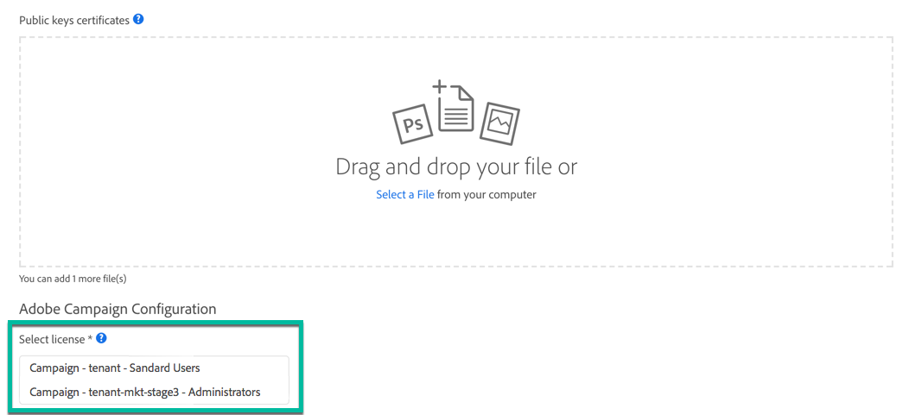

# Konfigurera API-åtkomst {#setting-up-api-access}

Adobe Campaign Standard API-åtkomst konfigureras enligt stegen nedan. Vart och ett av dessa steg beskrivs i dokumentationen [för](https://www.adobe.io/authentication/auth-methods.html#!AdobeDocs/adobeio-auth/master/AuthenticationOverview/ServiceAccountIntegration.md)Adobe IO.

>[!IMPORTANT]
>
>Om du vill hantera certifikat i Adobe IO måste du ha <b>systemadministratörsbehörighet</b> för organisationen eller ett [utvecklarkonto](https://helpx.adobe.com/enterprise/using/manage-developers.html)</a> i Admin Console.

1. **Kontrollera att du har ett digitalt certifikat** eller skapa ett om det behövs. De offentliga och privata nycklarna som tillhandahålls med certifikatet behövs i följande steg.
1. **Skapa en ny integrering av Adobe Campaign Service** i Adobe IO och konfigurera den. Dina autentiseringsuppgifter genereras sedan (API-nyckel, klienthemlighet...).
1. **Skapa en JSON Web Token (JWT)** utifrån de inloggningsuppgifter som tidigare genererats och signera den med din privata nyckel. JWT kodar all identitets- och säkerhetsinformation som Adobe behöver för att verifiera din identitet och ge dig åtkomst till API:t.
1. **Byt ut din JWT-fil mot en åtkomsttoken** via en POST-förfrågan. Denna Access Token måste användas i varje rubrik för dina API-begäranden.

Om du vill skapa en säker tjänst-till-tjänst-API-session mellan Adobe måste varje begäran till en Adobe-tjänst innehålla informationen nedan i auktoriseringshuvudet.

```
-X GET https://mc.adobe.io/<ORGANIZATION>/campaign/profileAndServices/profile \
-H 'Content-Type: application/json' \
-H 'Authorization: Bearer <ACCESS_TOKEN>' \
-H 'Cache-Control: no-cache' \
-H 'X-Api-Key: <API_KEY>'
```

* **&lt;ORGANISATION>**: Detta är ditt personliga organisations-ID, och Adobe tillhandahåller ett organisations-ID för varje instans:

   * &lt;ORGANISATION>: din produktionsinstans,
   * &lt;ORGANIZATION-mkt-stage>: din sceninstans.

   Kontakta din administratör eller din Adobe tekniska kontakt för att få ditt organisations-ID-värde. Du kan även hämta den till Adobe när du skapar en ny integrering i licenslistan (se dokumentationen <a href="https://www.adobe.io/authentication.html">för</a>Adobe IO).

* **&lt;ACCESS_TOKEN>**: Din personliga åtkomsttoken, som hämtades när din JSON-webbtoken byttes ut via en POST.

* **&lt;API_KEY>**: din egen API-nyckel. Det tillhandahålls i Adobe I/O efter att en ny integrering med Adobe Campaign Service har skapats.

   

## Felsökning

Om följande fel uppstår under AdobeIO-integreringen:

```
{ 
"code": 502, 
"message": "Oops. Something went wrong. Check your URI and try again." 
}
```


Kontakta administratören eller den tekniska kontaktpersonen på Adobe för att kontrollera om CNAME-parametern har skapats på rätt sätt.