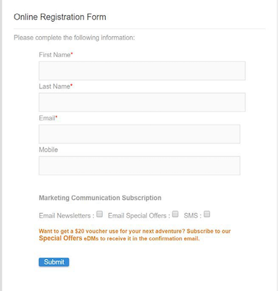

# Varför använda Campaign Standard-API:er {#why-using-campaign-standard-apis}

Adobe Campaign Standard tillhandahåller API:er som gör att befintliga system kan integreras med Campaign-plattformen för att lösa problem i realtid.

Offentliga webbplatser som anmälnings- eller avanmälningssidan måste ansluta till serverdelssystem för att lagra profilinformation. Backend-system som Adobe Campaign har flexibiliteten och kraften att importera profildata till och utföra anpassade åtgärder på dem.

Här är några exempel:

* Prospects online registration.
* Befintlig hantering av kundprofil och marknadskommunikation.
* Händelsebaserad transaktionskommunikation som utlöser - orderbekräftelse, bokningslogik, lösenordsåterställning osv.
* Till och med e-postkommunikation om att kunden överger en varukorg.

Genom att registrera landningssidor kan kunder och presumtiva kunder registrera sina namn och e-postadresser. När Campaign Standarden hämtar in profilinformationen och inställningarna kan den skicka personaliserade meddelanden utifrån personens intressen.

De byggs med elementen nedan:

1. Ett registreringsformulär med kampanjens API-avlyssnare.

   

1. Anpassade åtgärder som ska vidtas baserat på kryssrutor. En kund som väljer&quot;Specialerbjudanden via e-post&quot; får ett annat mejl med en presentkupong jämfört med den normala registreringsprocessen.

   

1. En profil kan ändra sin information efter att ha klickat på länken &quot;Uppdatera detaljer&quot; i e-postmeddelandet. Då visas profilen på sidan&quot;Uppdatera din profil och dina inställningar&quot;. För att utföra åtgärden skickas profilinformationen (Pkey) till Campaign-servern och profilen hämtas och representeras. När profilen klickar på Uppdatera uppdateras informationen till systemet (via ett PATCH-kommando).

   

Det finns en samling förfrågningar som du kan använda för att bekanta dig med Campaign Standard-API:er. Den här samlingen i JSON-format innehåller fördesignade API-begäranden som representerar vanliga användningsfall.

Stegen nedan beskriver ett stegvis användningsfall för att importera och använda samlingen för att skapa en profil i en Campaign Standard-databas.

>[!NOTE]
>
>I vårt exempel används Postman. Du kan dock använda din REST-klient.

1. Hämta JSON-samlingen genom att klicka [här](https://helpx.adobe.com/content/dam/help/en/campaign/kb/working-with-acs-api/_jcr_content/main-pars/download_section/download-1/KB_postman_collection.json.zip).

1. Öppna Postman och välj sedan menyn **Arkiv** / **Importera**.

1. Dra och släpp den hämtade filen i fönstret. Fördesignad API-begäran visas, klar att användas.

   

1. Markera **Skapa en profil**-begäran och uppdatera sedan begäran om POST och fliken **Sidhuvuden** med din egen information (&lt;ORGANIZATION>, &lt;API_KEY>, &lt;ACCESS_TOKEN>). Mer information om detta finns i [det här avsnittet](../../api/using/setting-up-api-access.md).

   

1. Fyll i fliken **Body** med den information du vill lägga till i den nya profilen och klicka sedan på knappen **Skicka** för att utföra begäran.

   

1. När ett objekt har skapats kopplas en primärnyckel (PKey) till det. Den visas i det begärda svaret och i andra attribut.

   

1. Öppna din Campaign Standard-instans och kontrollera sedan att profilen har skapats, med all information från nyttolasten.

   
