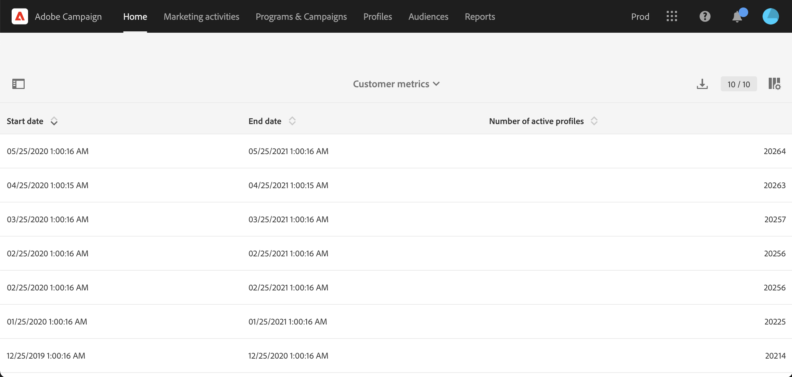

# Aktiva profiler{#active-profiles}

Du kan komma åt information om aktiva profiler från rapporten **[!UICONTROL Customer metrics]**. Den här rapporten är endast tillgänglig för funktionsadministratörer för Campaign. Du öppnar den här rapporten genom att klicka på Adobe Campaign-ikonen längst upp till vänster i [användargränssnittet](../../start/using/interface-description.md#advanced-menu) och bläddra till **[!UICONTROL Administration > Customer metrics]**.

Den här rapporten genereras varje månad av det tekniska arbetsflödet för **[!UICONTROL Billing]** och visar antalet **aktiva profiler**. Läs mer om tekniska arbetsflöden på [den här sidan](../../administration/using/technical-workflows.md).

En &quot;profil&quot; är ett register över information som representerar en slutkund, potentiell kund eller lead. Profiler betraktas som **aktiva** om de har riktats mot en kampanjleverans under de senaste 12 månaderna via någon kanal.

Enligt ert kontrakt har var och en av era Campaign-instanser ett visst antal aktiva profiler. Se licensavtalet för information om antalet köpta aktiva profiler.

* De profiler som uteslöts under leveransförberedelsen (t.ex. efter typologiregler eller karantänmekanism) beaktas inte.

* Mottagare av transaktionsmeddelanden räknas som aktiva profiler.

* En profil som har valts av flera leveranser räknas bara en gång.

* Den här rapporten är bara informativ, den har ingen direkt inverkan på faktureringen.

Längst ned på sidan visas måldimensionerna med antalet profiler för varje. Mottagare av transaktionsmeddelanden är kopplade till dimensionen **Anonym**.

>[!NOTE]
>
>Som administratör kan du också övervaka antalet aktiva profiler som används på dina instanser direkt från Kontrollpanelen. Mer information finns i dokumentationen för [Kontrollpanelen](https://experienceleague.adobe.com/docs/control-panel/using/performance-monitoring/active-profiles-monitoring.html).
>
