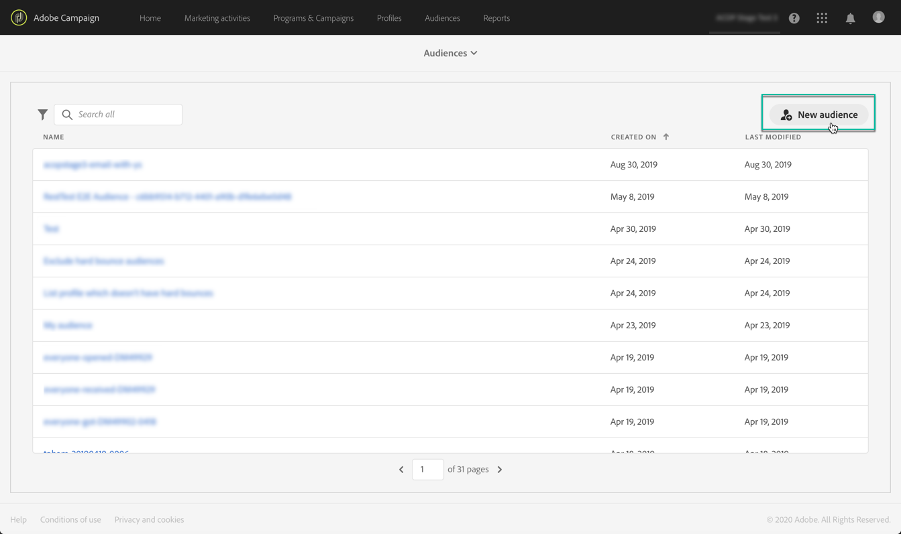

# Hantera Adobe Experience Platform-målgrupper {#about-audiences}

>[!IMPORTANT]
>
>Målgruppstjänsten är för närvarande i betaversion, som kan uppdateras ofta utan föregående meddelande. Kunderna måste vara värdbaserade på Azure (för närvarande endast betaversioner för Nordamerika) för att få tillgång till dessa funktioner. Kontakta Adobe kundtjänst om du vill ha tillgång till tjänsten.

## Åtkomst till Adobe Experience Platform-målgrupper

Om du vill komma åt Adobe Experience Platform segmentbyggare går du till startsidan för **[!UICONTROL Audiences]** kortet på Campaign Standarden (eller till **[!UICONTROL Audiences]** länken i sidhuvudet) och väljer sedan **[!UICONTROL Adobe Experience Platform]** miljö.

Du dirigeras först till Adobe Experience Platform segmentlistsida där du kan komma åt befintliga Adobe Experience Platform-segment för ytterligare redigering.

Det finns ett sökfält och filter som hjälper dig att hitta det önskade Adobe Experience Platform-segmentet.

## Skapa Adobe Experience Platform-målgrupper

Så här skapar du en Adobe Experience Platform-publik direkt i Campaign Standarden:

1. Klicka på knappen i det högra hörnet på listsidan för Adobe Experience Platform-segment. **[!UICONTROL New audience]**

   

1. Segmentverktyget bör nu visas på arbetsytan. Det gör att ni kan skapa ett segment med hjälp av data från Adobe Experience Platform som så småningom kommer att användas för att skapa er målgrupp.

1. Namnge segmentet i den högra rutan och ange en beskrivning (valfritt).

   

1. För att lyckas skapa ett segment måste du välja en **sammanfogningsprincip** som matchar ditt marknadsföringssyfte för det här segmentet.

   I inställningsfönstret är en standardprincip för sammanfogning av plattform vald. Mer information om kopplingsprofiler finns i det dedikerade avsnittet i användarhandboken för [Segment Builder](https://docs.adobe.com/content/help/en/experience-platform/segmentation/ui/overview.html).

   

1. Definiera reglerna som identifierar de profiler som ska hämtas hos er målgrupp.

   Det gör du genom att dra önskade attribut och/eller händelser från den vänstra rutan till arbetsytan, definiera motsvarande regler och sedan klicka på **[!UICONTROL Create segment]** knappen för att spara segmentet (se [Använda segmentverktyget](../../audiences/using/aep-using-segment-builder.md)).

   

Publiken är nu redo att aktiveras, du kan använda den som mål för dina kampanjer (se [Målgruppsanpassa Adobe Experience Platform-målgrupper](../../automating/using/aep-targeting-audiences.md)).

## Redigera målgrupper

Om du vill redigera en målgrupp öppnar du den och ändrar reglerna efter behov i gränssnittet i Segment Builder (se [Använda segmentverktyget](../../audiences/using/aep-using-segment-builder.md)).

När ändringarna är klara klickar du på **[!UICONTROL Save segment]** knappen för att uppdatera målgruppen.

