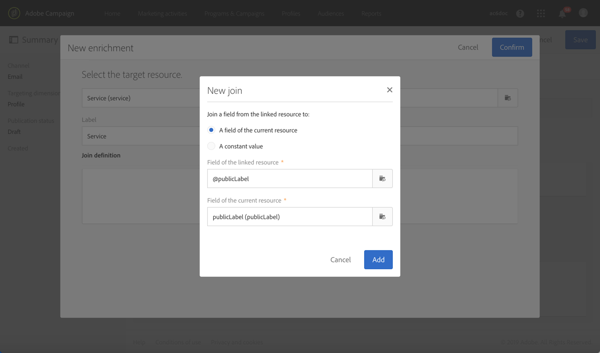

# Bekräfta prenumeration på en tjänst{#confirming-subscription-to-a-service}

## Om att skicka prenumerationsbekräftelse {#sending-subscription-confirmation}

I det här avsnittet beskrivs hur du skickar ett automatiskt anpassat bekräftelsemeddelande via e-post till de profiler som prenumererar på en viss tjänst.

När du vill skicka ett bekräftelsemeddelande för en prenumeration (eller för att ta bort en prenumeration) till en tjänst kan du använda standardmeddelandet eller ett anpassat meddelande. Stegen för att välja ett bekräftelsemeddelande visas i avsnittet [Skapa en tjänst](../../audiences/using/creating-a-service.md) .

Om du väljer att använda standardmeddelandet kan du redigera dess innehåll med följande begränsningar:
* Du kan bara anpassa meddelandeinnehållet med begränsade fält från händelsekontexten.
* Det här meddelandet är detsamma för alla tjänster som använder standardläget.

Om du vill skicka ett specifikt bekräftelsemeddelande för en viss tjänst kan du skapa ett anpassat meddelande där du även kan använda personaliseringsfält från andra resurser. För att kunna göra detta måste du skapa och konfigurera ett transaktionsmeddelande. Det går att referera till det här meddelandet:
* Från själva tjänsten. Mer information finns i [Konfigurera bekräftelsemeddelande från en tjänst](#configuring-confirmation-message-from-service).
* Från en prenumerationsstartsida. Mer information finns i [Konfigurera bekräftelsemeddelande från en landningssida](#configuring-confirmation-message-from-landing-page).

## Konfigurera bekräftelsemeddelande från en tjänst {#configuring-confirmation-message-from-service}

Du vill till exempel automatiskt skicka ett bekräftelsemeddelande till besökarna på webbplatsen när de prenumererar på ert varumärkesnyhetsbrev.

Du måste konfigurera ett transaktionsmejl och referera till det meddelandet från den önskade tjänsten (prenumeration på ditt varumärkesnyhetsbrev i det här fallet). För att utöka transaktionsmeddelandet med tjänstinformation kan du definiera en avstämning när du skapar händelsen.

När den konfigureras från tjänsten skickas bekräftelsemeddelandet endast första gången varje besökare prenumererar på tjänsten. Om en profil redan prenumererar skickas inget bekräftelsemeddelande igen till den profilen.

### Steg 1: Skapa bekräftelsemeddelandet {#step-1--create-the-confirmation-email-1}

Ett bekräftelsemeddelande skickas automatiskt till varje profil som prenumererar på nyhetsbrevet (via en landningssida eller på något annat sätt). Prenumerationen betraktas som en händelse och e-postmeddelandet är ett [transaktionsmeddelande](../../channels/using/about-transactional-messaging.md) som riktar sig till varje profil som prenumererar på tjänsten.

Hur du skapar bekräftelsemeddelandet beskrivs nedan. Du måste skapa det först när transaktionsmeddelandet refereras till i tjänsten.

#### Skapa händelsen {#create-the-event-1}

Bekräftelsemeddelandet är ett transaktionsmeddelande när det reagerar på en händelse: prenumerationen på en tjänst. Det här meddelandet skickas för att bekräfta prenumerationen på ditt nyhetsbrev.

1. Skapa en händelse från menyn **[!UICONTROL Marketing plans]** > **[!UICONTROL Transactional messages]** > **[!UICONTROL Event configuration]** , som du kommer åt via Adobe Campaign-logotypen.
1. Ange en etikett, välj en måldimension och klicka **[!UICONTROL Create]**.

   Konfigurationsstegen beskrivs i avsnittet [Konfigurera transaktionsmeddelanden](../../administration/using/configuring-transactional-messaging.md) .

1. Klicka på **[!UICONTROL Fields]** och lägg **[!UICONTROL Create element]** till i datastrukturen i **[!UICONTROL publicLabel]** avsnittet för att aktivera avstämning.

   

   >[!NOTE]
   >
   >Fältet **[!UICONTROL publicLabel]** är obligatoriskt. Om du inte lägger till det i händelsedatastrukturen kommer Adobe Campaign inte att kunna utföra avstämning med tjänsten. När du prenumererar på en tjänst fylls det här fältet med namnet **[!UICONTROL Service label]** på motsvarande tjänst.

1. Klicka på **[!UICONTROL Enrichment]** och välj **[!UICONTROL Create element]** målresursen i **[!UICONTROL Service]** avsnittet.

   

1. I **[!UICONTROL Join definition]** avsnittet mappar du **[!UICONTROL publicLabel]** fältet för **[!UICONTROL Service]** resursen med **[!UICONTROL publicLabel]** fältet för händelsekonfigurationen.

   

   >[!NOTE]
   >
   >Detta gör att du kan använda personaliseringsfält från **[!UICONTROL Service]** resursen i transaktionsmeddelandet.

1. Spara händelsekonfigurationen och klicka på **[!UICONTROL Publish]** för att publicera händelsen.

Händelsen är klar. Nu kan du utforma e-postmeddelandet för transaktioner.

#### Utforma bekräftelsemeddelandet {#design-the-confirmation-message-1}

Bekräftelsemeddelandet är ett transaktionsmeddelande baserat på den händelse som du just publicerade.

1. Välj **[!UICONTROL Marketing plans]** > **[!UICONTROL Transactional messages]** och klicka på Adobe Campaign-logotypen **[!UICONTROL Transactional messages]**.
1. Välj den transaktionsbaserade e-postadress som motsvarar händelsen som du just publicerade.

1. Klicka på **[!UICONTROL Content]** avsnittet och välj en e-postmall. Mer information om hur du redigerar ett transaktionsmeddelandeinnehåll finns i [Transaktionsmeddelanden](../../channels/using/event-transactional-messages.md)för händelser.
1. När du har direktåtkomst till alla fält från **[!UICONTROL Service]** resursen kan du anpassa innehållet genom att välja valfritt fält från noden **[!UICONTROL Context]** > **[!UICONTROL Real-time event (rtEvent)]** > **[!UICONTROL Event context (ctx)]** >**[!UICONTROL Service]** .

   

   Mer information om hur du anpassar ett transaktionsmeddelande finns i [det här avsnittet](../../channels/using/event-transactional-messages.md#personalizing-a-transactional-message).

1. Förhandsgranska meddelandet med en testprofil. Mer information finns i [Definiera en testprofil i ett transaktionsmeddelande](../../channels/using/event-transactional-messages.md#defining-a-test-profile-in-a-transactional-message).

1. Klicka **[!UICONTROL Save & close]** för att spara innehållet.
1. Publicera transaktionsmeddelandet. Se [Publicera ett transaktionsmeddelande](../../channels/using/event-transactional-messages.md#publishing-a-transactional-message).

### Steg 2: Skapa och konfigurera tjänsten {#step-2--create-and-configure-the-service-1}

1. Skapa en tjänst på den avancerade menyn **Profiler och målgrupper** > **Tjänster** via logotypen Adobe Campaign.
1. Gå till **[!UICONTROL Service properties]** avsnittet som du kommer åt via  knappen på kontrollpanelen för tjänster.
1. Fyll i **[!UICONTROL Service label]** fältet.

   

   >[!NOTE]
   >
   >Du måste fylla i det här fältet för att aktivera avstämning med transaktionsmeddelandet.

1. I **[!UICONTROL Confirmation messages]** avsnittet väljer du **[!UICONTROL Custom message]**: I det här läget kan du referera till ett specifikt bekräftelsemeddelande för profiler som prenumererar på tjänsten.
1. Markera det **[!UICONTROL Custom subscription event configuration]** som är kopplat till det transaktionsmeddelande som du har skapat.

   

1. Klicka **[!UICONTROL Confirm]** och spara tjänsten.

Varje gång en profil prenumererar på den här tjänsten får han det transaktionsmeddelande som du har definierat, med anpassade fält mappade till den valda tjänsten.

>[!NOTE]
>
>Ett meddelande skickas endast första gången användaren prenumererar.

## Konfigurera bekräftelsemeddelande från en landningssida {#configuring-confirmation-message-from-landing-page}

Du kan också referera till bekräftelsemeddelandet från en prenumerationsstartsida genom att använda **[!UICONTROL Start sending messages]** alternativet från **[!UICONTROL Job]** avsnittet på landningssidan.

När bekräftelsemeddelandet från landningssidan refereras till, skickas ett meddelande varje gång landningssidan skickas (även om profilen redan prenumererar).

### Steg 1: Skapa bekräftelsemeddelandet {#step-1--create-the-confirmation-email-2}

Ett bekräftelsemeddelande skickas automatiskt till varje profil som prenumererar på nyhetsbrevet via en landningssida. Prenumerationen betraktas som en händelse och e-postmeddelandet är ett [transaktionsmeddelande](../../channels/using/about-transactional-messaging.md) som riktar sig till varje profil som prenumererar på tjänsten.

Steg för att skapa dessa element beskrivs nedan. Eftersom transaktionsmeddelandet kommer att refereras på landningssidan måste du skapa det först.

#### Skapa händelsen {#create-the-event-2}

Bekräftelsemeddelandet är ett [transaktionsmeddelande](../../channels/using/about-transactional-messaging.md) när det reagerar på en händelse: prenumerationen på en tjänst. Det här meddelandet skickas för att bekräfta prenumerationen på ditt nyhetsbrev.

1. Skapa en händelse från menyn **[!UICONTROL Marketing plans]** > **[!UICONTROL Transactional messages]** > **[!UICONTROL Event configuration]** , som du kommer åt via Adobe Campaign-logotypen.
1. Ange en etikett, välj en måldimension och klicka **[!UICONTROL Create]**.

   Konfigurationsstegen beskrivs i avsnittet [Konfigurera transaktionsmeddelanden](../../administration/using/configuring-transactional-messaging.md) .

1. Klicka på **[!UICONTROL Fields]** och lägg **[!UICONTROL Create element]** till i datastrukturen i **[!UICONTROL serviceName]** avsnittet för att aktivera avstämning.

   

   >[!NOTE]
   >
   >Fältet **[!UICONTROL serviceName]** är obligatoriskt. Om du inte lägger till det i händelsedatastrukturen kan Adobe Campaign inte utföra avstämning med den prenumererade tjänsten.

1. Klicka på **[!UICONTROL Enrichment]** och välj **[!UICONTROL Create element]** målresursen i **[!UICONTROL Service]** avsnittet.
1. I **[!UICONTROL Join definition]** avsnittet mappar du **[!UICONTROL serviceName]** fältet för **[!UICONTROL Service]** resursen med **[!UICONTROL name]** fältet för händelsekonfigurationen.

   

   >[!NOTE]
   >
   >Detta gör att du kan använda personaliseringsfält från [!UICONTROL Service] resursen i transaktionsmeddelandet.

#### Utforma bekräftelsemeddelandet {#design-the-confirmation-message-2}

Stegen för att utforma transaktionsmeddelandet beskrivs i det här [avsnittet](#design-the-confirmation-message-1).

### Steg 2: Skapa och konfigurera tjänsten {#step-2--create-and-configure-the-service-2}

1. Skapa en tjänst på den avancerade menyn **[!UICONTROL Profiles & audiences]** > **[!UICONTROL Services]** via Adobe Campaign-logotypen.
1. Gå till **[!UICONTROL Service properties]** avsnittet som du kommer åt via  knappen på kontrollpanelen för tjänster.
1. Fyll i **[!UICONTROL Service label]** fältet. Den här etiketten visas i bekräftelsemeddelandet och på prenumerationens landningssida.
1. Klicka **[!UICONTROL Confirm]** och spara tjänsten.

### Steg 3: Skapa och konfigurera landningssidan {#step-3--create-and-configure-the-landing-page}

Skapa en prenumerationslandsida som kommer att publiceras på din webbplats.

Följ stegen nedan för att skapa och konfigurera den här landningssidan:

1. Utforma en [ny landningssida](../../channels/using/getting-started-with-landing-pages.md) som bygger på **[!UICONTROL Subscription]** mallen.
1. Redigera egenskaperna för landningssidan. I avsnittet **[!UICONTROL Job]** > **[!UICONTROL Specific actions]** markerar du **[!UICONTROL Specific service]** alternativet och väljer den tjänst du just skapade i listrutan.

   

1. Markera **[!UICONTROL Start sending message]** alternativet och välj det transaktionsmeddelande som du just skapade i listrutan.

   

1. Anpassa innehållet på landningssidan.

1. [Testa och publicera](../../channels/using/testing-publishing-landing-page.md) landningssidan.

Varje gång en profil prenumererar på ditt nyhetsbrev genom att skicka in landningssidan får han ett bekräftelsemeddelande som du har definierat med anpassade fält mappade till tjänsten.

>[!NOTE]
>
>Ett meddelande skickas varje gång landningssidan skickas, även om profilen redan prenumererar.
