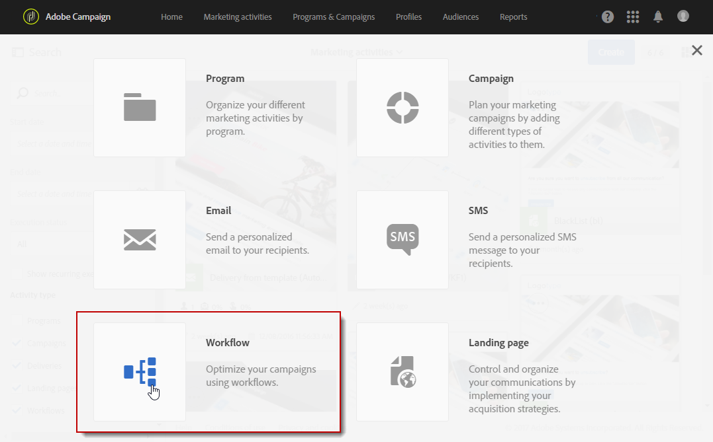

# Skapa målgrupper{#creating-audiences}

## Skapa förfrågningsmålgrupper {#creating-query-audiences}

I det här avsnittet beskrivs hur du skapar en **förfrågnings** målgrupp.                                Du kan också skapa målgrupper genom att importera en fil eller målinriktning i ett [arbetsflöde](../../automating/using/get-started-workflows.md).

Från målgruppslistan kan du skapa målgrupper genom att utföra förfrågningar i Adobe Campaign-profiler eller importera en Adobe Experience Cloud-målgrupp.

1. Gå till målgruppslistan via **[!UICONTROL Audiences]** fliken eller kortet.

   

1. Välj **[!UICONTROL Create]** för att få åtkomst till skärmen för att skapa en ny publik.

   

1. Ge målgruppen ett namn.  Målgruppsetiketten används i listan över målgrupper och i paletten för förfrågningsverktyget.
1. Välj en **[!UICONTROL Query]** målgruppstyp: de målgrupper som definieras av en förfrågan beräknas om vid varje ytterligare användning.

   

1. Välj sedan den **[!UICONTROL Targeting dimension]** som du vill använda för att filtrera kunderna.  Varje målgrupp består av en enda målinriktningsdimension.    Du kan till exempel inte skapa en målgrupp som består av både profiler, testprofiler och prenumeranter.    Mer information om målinkriktningsdimensioner finns i [det här avsnittet](../../automating/using/query.md#targeting-dimensions-and-resources).
1. Skapa förfrågan för att definiera antalet i målgruppen.    Mer information finns i avsnittet [redigeringsförfrågningar](../../automating/using/editing-queries.md).
1. Klicka på **[!UICONTROL Create]**-knappen för att spara din målgrupp.

>[!NOTE]
>
>Du kan lägga till en beskrivning till den här målgruppen och definiera åtkomstauktoriseringen via **[!UICONTROL Edit properties]**-ikonen.

## Skapa lista med målgrupper {#creating-list-audiences}

I det här avsnittet beskrivs hur du skapar en **lista** med målgrupper enligt målen i ett arbetsflöde.  Du kan också skapa målgrupper genom att importera en fil till ett [arbetsflöde](../../automating/using/get-started-workflows.md) eller via en fråga i **[!UICONTROL Audiences]** menyn.

Så här skapar du en **lista** med målgrupper:

1. I fliken **Marknadsföringsaktiviteter**, klicka på **skapa** och välj sedan **Arbetsflöde**.

   

1. Dra och släpp och konfigurera sedan målinriktningsaktiviteter så att du kan välja en population som har en **bekant** dimension.    Listan över tillgängliga aktiviteter och deras konfiguration finns i avsnittet [Målaktiviteter](../../automating/using/about-targeting-activities.md) .

   Du kan använda en **[!UICONTROL Query]** aktivitet eller importera data med en **[!UICONTROL Load file]** aktivitet innan du använder **[!UICONTROL Reconciliation]** aktiviteten för att identifiera dimensionen för den data som importeras.    Här vill vi rikta oss till mottagare som prenumererar på sportnyhetsbrevet med en **[!UICONTROL Query]** aktivitet.

   

1. Dra och släpp en **[!UICONTROL Save audience]** aktivitet i arbetsflödet efter att du har skapat den.    Du kan t.ex. välja att **[!UICONTROL Create or update an audience]** skapa och sedan automatiskt uppdatera målgruppen med ny data.  I det här fallet lägger du till en **[!UICONTROL Scheduler]** aktivitet i början av arbetsflödet.

   Mer information om hur du konfigurerar den här aktiviteten finns i avsnittet [Spara målgrupp](../../automating/using/save-audience.md) .

   

1. Spara och starta arbetsflödet.

   Eftersom målgruppen **[!UICONTROL Save audience]** placeras efter en viss målinriktning med en känd dimension så är målgrupperna som skapas via den här aktiviteten **list**-målgrupper.

   Innehållet i den sparade målgruppen är sedan tillgängligt i målgruppens detaljerade vy som du kommer åt via listan över målgrupper.    Kolumnerna som är tillgängliga i den här vyn motsvarar kolumnerna för den inkommande övergången i arbetsflödets sparaktivitet.    Exempelvis kolumnerna i den importerade filen eller den ytterligare datan som lagts till vid en förfrågan.

   

## Skapa målgruppsfil {#creating-file-audiences}

I det här avsnittet så beskrivs hur du skapar en målgrupps **fil** genom att importera en fil till ett arbetsflöde.        Du kan också skapa målgrupper via en målinriktningsaktivitet i ett [arbetsflöde](../../automating/using/get-started-workflows.md) eller via en förfrågan i **[!UICONTROL Audiences]**-menyn.

Så här gör du för att skapa en **fil** med innehållande publik:

1. I fliken **Marknadsföringsaktiviteter**, klicka på **skapa** och välj sedan **Arbetsflöde**.
1. Dra och släpp och konfigurera sedan en **[!UICONTROL Load file]** aktivitet som gör att du kan importera en population med en **okänd** dimension när arbetsflödet körs.  Mer information om hur du konfigurerar den här aktiviteten finns i avsnittet [Ladda fil](../../automating/using/load-file.md) .

   

1. Dra och släpp en **[!UICONTROL Save audience]**-aktivitet efter **[!UICONTROL Load file]** aktiviteten.  Mer information om hur du konfigurerar den här aktiviteten finns i avsnittet [Spara målgrupp](../../automating/using/save-audience.md) .
1. Spara och starta arbetsflödet.

   

   När filen **[!UICONTROL Save audience]** placeras efter att den importerats så är datadimensionen okänd och målgrupperna som skapas via den här aktiviteten är en målgrupps **fil** .

   Innehållet i den sparade målgruppen är sedan tillgängligt i målgruppens detaljerade vy som du kommer åt via listan över målgrupper. Kolumnerna som är tillgängliga i den här vyn motsvarar kolumnerna för den inkommande övergången i arbetsflödets sparaktivitet. Exempelvis kolumnerna i den importerade filen eller ytterligare data som lagts till vid en förfrågan.

   

## Att skapa Experience Cloud-målgrupper {#creating-experience-cloud-audiences}

Med Adobe Campaign kan du dela och byta ut målgrupper med Adobe Experience Cloud.    En publik av typen **Experience Cloud** importeras direkt från personbastjänsten i Adobe Campaign med det **[!UICONTROL Import shared audience]** tekniska arbetsflödet.

Till skillnad från **förfrågningar** av målgruppstyp som hämtar profiler från Adobe Campaign består **Experience Cloud**-målgruppen av en lista med besöks-ID:n.

För att den här integreringen ska fungera så måste du först konfigurera den.    Mer information om konfiguration och hur du importerar eller exporterar målgrupper med personbastjänsten hittar du i följande [avsnitt](../../integrating/using/sharing-audiences-with-audience-manager-or-people-core-service.md).

## Redigera målgrupper {#editing-audiences}

Det finns olika sätt att redigera en målgrupp beroende på målgruppstypen:

* Om du vill redigera en **förfrågan** av målgrupp så går du till listan över målgrupper via **[!UICONTROL Audiences]** menyn eller **[!UICONTROL Audiences]** kortet för Adobe Campaign på hemsidan.

   Öppna den relevanta målgruppen.        Samtliga element i en tidigare skapad målgrupp kan redigeras.

   >[!CAUTION]
   >
   >Om du ändrar **[!UICONTROL Filtering dimension]** i förfrågningen så kommer de regler som tidigare har definierats att gå förlorade.

* Om du vill redigera en målgrupps **lista** eller **fil** så redigerar du arbetsflödet som där det skapades och ändrar **[!UICONTROL Save audience]** aktiviteten.    Starta arbetsflödet så att målgruppen ändras.
* Om du vill redigera en **Experience Cloud**-målgrupp så läser du avsnittet [Importera/exportera målgrupper med](../../integrating/using/sharing-audiences-with-audience-manager-or-people-core-service.md) personbastjänsten.

## Ta bort målgrupper {#deleting-audiences}

Det finns två sätt att ta bort en eller flera målgrupper.  Det första sättet är att du kan lägga till ett förfallodatum till din målgrupp

För att göra detta:

1. Öppna en av dina målgrupper.
1. Klicka på -knappen för att komma åt målgruppens konfiguration.

   

1. I **[!UICONTROL Expires on]**-fältet lägger du till ett förfallodatum till målgruppen.

   

1. Klicka **[!UICONTROL Confirm]** och sen **[!UICONTROL Save]**.

Förfallodatumet har nu konfigurerats. Så fort detta datum har passerat raderas målgruppen automatiskt.

Om du istället vill ta bort en målgrupp kan du markera en eller flera målgrupper och sedan klicka på **[!UICONTROL Delete element]**-knappen.

