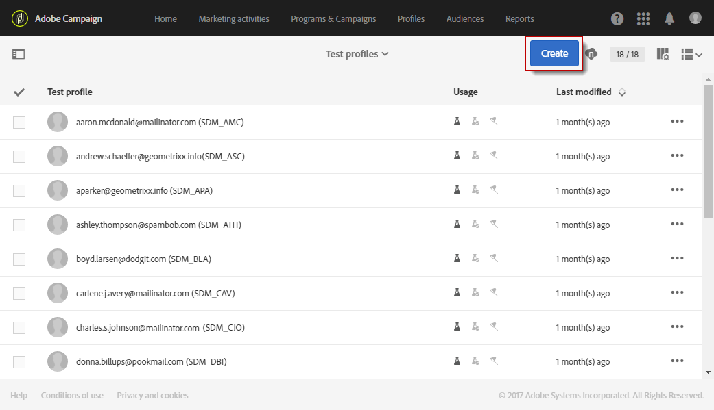

# Hantera testprofiler {#managing-test-profiles}

## Om testprofiler {#about-test-profiles}

Med testprofilerna kan du rikta in dig på fler mottagare som inte matchar de definierade målinriktningskriterierna. De läggs till i målgruppen för ett meddelande för att upptäcka om mottagardatabasen används på ett bedrägligt sätt eller för att säkerställa att e-postmeddelandena kommer fram i inkorgen.

Du kan hantera dina testprofiler på den avancerade menyn **[!UICONTROL Profiles & audiences > Test profiles]**.

En testprofil innehåller fiktiv kontaktinformation, eller kontaktinformation som styrs av avsändaren, som sedan kan användas i ett meddelande i följande sammanhang:

* För att skicka **korrektur**: Korrekturmeddelandet är ett specifikt meddelande som används för att kontrollera meddelandet innan den slutliga leveransen skickas till mottagarna. En provprofil för korrektur ansvarar för att kontrollera leveransen med avseende på dess innehåll och format. Se [Skicka korrektur](../../sending/using/sending-proofs.md).
* För **e-poståtergivning**: Testprofilen för e-poståtergivning används för att kontrollera hur ett meddelande visas enligt den meddelandeinkorg som tar emot det. Exempel: webbpost, meddelandetjänst, mobil osv. Se [E-poståtergivning](../../sending/using/email-rendering.md).

   Användningen av **e-poståtergivning** är skrivskyddad. Testprofiler med den här användningen är bara tillgängliga i Adobe Campaign.

* Som en **svällning**: Meddelandet skickas till testprofilen på samma sätt som det skickas till huvudmålet. Se [Använda svällningar](../../sending/using/using-traps.md).
* Så här **förhandsgranskar** du meddelanden: Du kan välja en testprofil när du förhandsgranskar ett meddelande för att testa personaliseringselementen. Se [Förhandsvisa meddelanden](/help/sending/using/previewing-messages.md).

## Skapa testprofiler {#creating-test-profiles}

1. På den avancerade menyn, via Adobe Campaign-logotypen, väljer du **Profiler och målgrupper > Testprofiler** för att få tillgång till listan med testprofiler.

   

1. Klicka på **[!UICONTROL Test profiles]** Skapa **på kontrollpanelen**.

   

1. Ange data för den här profilen.

   

1. Välj den användning du vill använda för din testprofil.

   

1. Ange kontaktkanalerna **[!UICONTROL Email, Telephone, Mobile, Mobile app]** och vid behov testprofilens adress.

   >[!NOTE]
   >
   >Du kan definiera ett e-postformat: **[!UICONTROL Text]** eller **[!UICONTROL HTML]**.

1. Ange en händelsetyp och data för den här händelsen om du vill använda den här testprofilen för att testa personaliseringen av ett transaktionsmeddelande.
1. Klicka **[!UICONTROL Create]** för att spara testprofilen.

Testprofilen läggs sedan till i listan med profiler.

**Relaterat ämne:**

[Skapa en video med testprofiler](https://docs.adobe.com/content/help/en/campaign-learn/campaign-standard-tutorials/profiles-and-audiences/test-profiles.html)

## Redigera testprofiler {#editing-test-profiles}

Så här redigerar du en testprofil och läser data som är länkade till den, eller ändrar den:

1. Välj den testprofil som du vill redigera genom att klicka på bilden.
1. Läs eller ändra fälten.

   

1. Klicka **[!UICONTROL Save]** om du har angett ändringarna eller markera namnet på testprofilen och gå sedan tillbaka till kontrollpanelen för testprofiler **[!UICONTROL Test profiles]** i avsnittet längst upp på skärmen.
