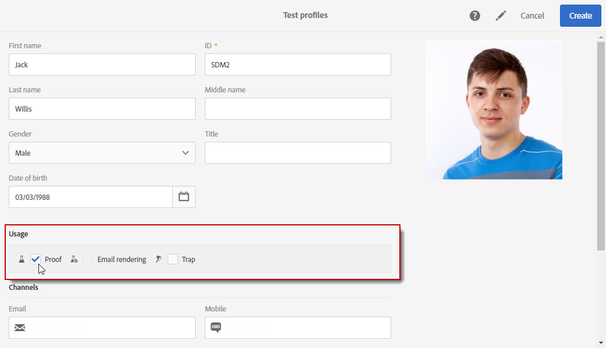

# Hantera testprofiler {#managing-test-profiles}

## Om testprofiler {#about-test-profiles}

Med testprofilerna kan du rikta in dig på fler mottagare som inte matchar de definierade målinriktningskriterierna. De läggs till i målgruppen för ett meddelande för att upptäcka om mottagardatabasen används på ett bedrägligt sätt eller för att säkerställa att e-postmeddelandena kommer till inkorgen.

 [Upptäck den här funktionen i en video](#video)

Du kan hantera dina testprofiler på den avancerade menyn **[!UICONTROL Profiles & audiences > Test profiles]**.

En testprofil innehåller fiktiv kontaktinformation, eller kontaktinformation som styrs av avsändaren, som sedan kan användas i ett meddelande i följande sammanhang:

* Skicka **korrekturläsningar**: Korrekturläsningen är ett specifikt meddelande som används för att kontrollera meddelandet innan den slutliga leveransen skickas till mottagarna. En testprofil för korrekturläsning kontrollerar leveransens innehåll och format. Se [Skicka korrekturläsningar](../../sending/using/sending-proofs.md).
* För **e-poståtergivning**: Testprofilen för e-poståtergivning används för att kontrollera hur ett meddelande visas i den mottagande meddelandeinkorgen. Exempel: webbpost, meddelandetjänst, mobil, o.s.v. Se [E-poståtergivning](../../sending/using/email-rendering.md).

  Användningen av **E-poståtergivning** är skrivskyddat. Testprofiler med den här tillämpningen är bara tillgängliga i Adobe Campaign.

* Som en **Trap**: Meddelandet skickas till testprofilen på samma sätt som det skickas till huvudmålet. Se [Använda traps](../../sending/using/using-traps.md).
* Så här **förhandsgranskar** du meddelanden: Du kan välja en testprofil när du förhandsgranskar ett meddelande för att testa anpassningselementen. Se [Förhandsvisa meddelanden](/help/sending/using/previewing-messages.md).

## Skapa testprofiler {#creating-test-profiles}

1. På den avancerade menyn, via Adobe Campaign-logotypen, väljer du **Profiler och målgrupper > Testprofiler** för att få tillgång till listan med testprofiler.

   

1. Klicka på **Skapa** på **[!UICONTROL Test profiles]**-kontrollpanelen.

   

1. Ange data för den här profilen.

   

1. Välj den tillämpning du vill använda för din testprofil.

   

1. Ange kontaktkanalerna **[!UICONTROL Email, Telephone, Mobile, Mobile app]** och vid behov testprofilens adress.

   >[!NOTE]
   >
   >Du kan definiera ett e-postformat: **[!UICONTROL Text]** eller **[!UICONTROL HTML]**.

1. Ange en händelsetyp och data för den här händelsen om du vill använda den här testprofilen för att testa anpassningen av ett transaktionsmeddelande.
1. Klicka på **[!UICONTROL Create]** för att spara testprofilen.

Testprofilen läggs sedan till i listan med profiler.

## Redigera testprofiler {#editing-test-profiles}

Så här redigerar du en testprofil och läser data som är kopplade till den, eller ändrar den:

1. Välj den testprofil som du vill redigera genom att klicka på bilden.
1. Läs eller ändra fälten.

   

1. Klicka på **[!UICONTROL Save]** om du har angett ändringarna eller markera namnet på testprofilen och sedan **[!UICONTROL Test profiles]** i avsnittet högst upp på skärmen för att gå tillbaka till kontrollpanelen för testprofiler.

## Självstudievideo {#video}

I den här videon visas hur du skapar en testprofil.

>[!VIDEO](https://video.tv.adobe.com/v/24094?quality=12)

Ytterligare Campaign Standard om instruktionsvideor finns [här](https://experienceleague.adobe.com/docs/campaign-standard-learn/tutorials/overview.html?lang=sv).
