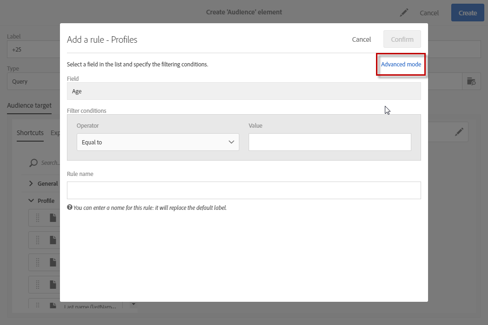
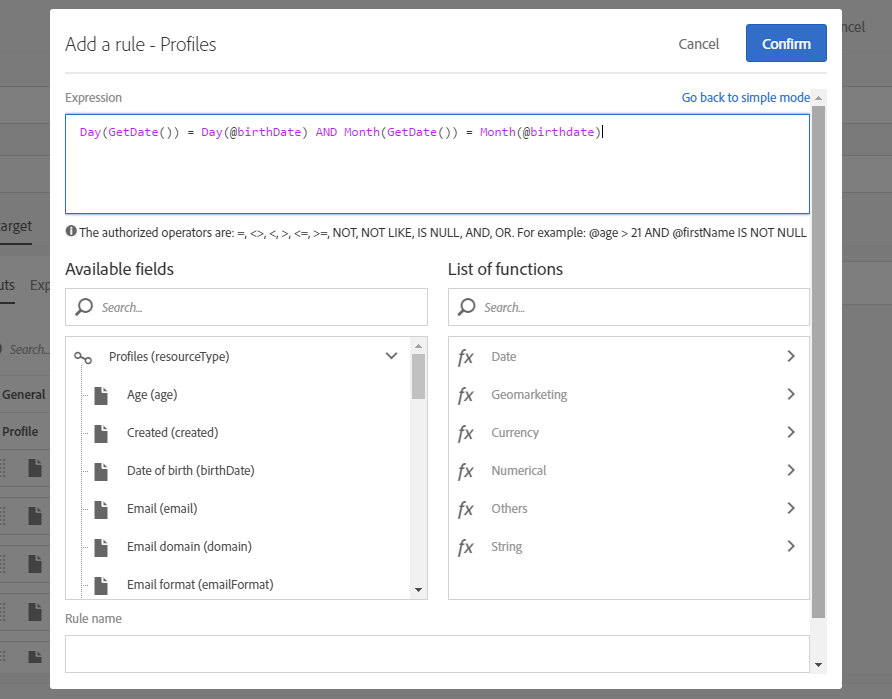

# Avancerad redigering av uttryck{#advanced-expression-editing}

## Om avancerad redigering av uttryck {#about-advanced-expression-editing}

När du redigerar ett uttryck måste du ange villkor manuellt för att skapa en regel.

I det här läget kan du använda avancerade funktioner. Med de här funktionerna kan du ändra de värden som används för att utföra specifika frågor, som att ändra datum, strängar, numeriska fält, sortering, o.s.v.

Det går också att använda arbetsflödenas händelsevariabler när du redigerar uttryck. Mer information om detta hittar du i avsnittet [Anpassa aktiviteter med händelsevariabler](../../automating/using/customizing-workflow-external-parameters.md).

Du kan redigera uttryck för att:

* definiera en fråga via alternativet **[!UICONTROL Advanced mode]** som är tillgängligt när en regel läggs till.

  

* redigera ett uttryck i ett arbetsflöde. Om du till exempel vill lägga till ytterligare data i en aktivitet.
* Redigera ett synlighetsvillkor för att definiera hur ett block i HTML-redigeraren ska visas. I det här fallet redigeras uttrycket i JavaScript-format och erbjuder inte avancerade funktioner som standard.

## Redigera ett uttryck {#edit-an-expression}

Med versionen för avancerade uttryck kan du manuellt definiera ett uttryck som passar dina behov.

Du kan använda redigering av uttryck i fönstret Målgrupp när du skapar ett e-postmeddelande eller i en frågeaktivitet när du skapar ett arbetsflöde.

1. Du kommer åt redigeringsfönstret för uttryck via någon av metoderna som beskrivs i avsnittet [Om redigering av avancerade uttryck](../../automating/using/advanced-expression-editing.md#about-advanced-expression-editing). Det innehåller följande element:

   * Ett inmatningsfält där uttrycket är definierat.
   * Listan med tillgängliga fält som kan användas i uttrycket och som motsvarar måldimensionen för frågan (se [Måldimensioner och resurser](../../automating/using/query.md#targeting-dimensions-and-resources)).
   * Listan med tillgängliga funktioner, sorterade efter kategori.

   

1. Redigera uttrycket genom att ange ett uttryck direkt i motsvarande fält eller genom att använda listorna med tillgängliga fält och funktioner.

   Om du dubbelklickar på ett fält eller ett uttryck läggs det till i det uttryck där markören är placerad.

   Du kan använda arbetsflödenas händelsevariabler för att skapa ett uttryck. Mer information om detta hittar du i avsnittet [Anpassa aktiviteter med händelsevariabler](../../automating/using/customizing-workflow-external-parameters.md).

1. Ge regeln ett specifikt namn om det behövs. Det angivna namnet visas som regelnamn på arbetsytan för frågeredigeraren.

Om du redigerar ett uttryck kan du anpassa målgruppsuttrycket för att anpassa målgruppen efter behov.

**Relaterade ämnen:**

* [Uttryckssyntax](../../automating/using/advanced-expression-editing.md#expression-syntax)
* [Lista över funktioner](../../automating/using/list-of-functions.md)

## Uttryckssyntax {#expression-syntax}

### Standardsyntax {#standard-syntax}

Standarduttrycken består av ett eller flera villkor som överensstämmer med följande syntaxelement:

* Varje villkor har formatet **&lt;value1> &lt;comparison operator> &lt;value2>** där:

   * **&lt;value1>** är ett fält eller en funktion. Exempel: **@created** för datum då en profil skapades eller **Year(@created)** för året då en profil skapades.
   * **&lt;comparison operator>** är en av operatörerna i avsnittet [Jämförelseoperatörer](../../automating/using/advanced-expression-editing.md#comparison-operators). Den här operatören definierar jämförelsemetoden mellan **&lt;value1>** och **&lt;value2>**.
   * **&lt;value2>** är ett fält, en funktion eller ett värde som matas in manuellt.

  >[!NOTE]
  >
  >Typdata för **&lt;value1>** och **&lt;value2>** måste vara identiska. Om till exempel **&lt;value1>** är ett datum måste även **&lt;value2>** vara ett datum.

* Om du vill använda flera villkor kan de kombineras med logiska operatörer.

   * **[!UICONTROL AND]**: Två villkor korsas.
   * **[!UICONTROL OR]**: Två villkor kombineras.

Exempel:

```
Year(@created) = Year(GetDate()) AND Month(@created) = Month(GetDate())
```

I det här exemplet används de profiler vars skapandedatum är den aktuella månaden och det aktuella året.

### JavaScript syntax {#javascript-syntax}

När du definierar synlighetsvillkoren för ett textblock i HTML-redigeraren måste du använda ett uttryck med JavaScript-typsyntax.

JavaScript-uttryck består av ett eller flera villkor och de använder följande syntaxelement:

* Varje villkor har formatet **&lt;context> &lt;comparison operator> &lt;value2>** där:

   * **&lt;context>** är ett fält eller en funktion som gör att du kan ange kontexten. Till exempel **context.profile.@email** för en profils e-postadress eller **context.profile.firstName.length()** för antalet tecken i en profils förnamn.
   * **&lt;comparison operator>** är en av operatörerna i avsnittet [Jämförelseoperatörer](../../automating/using/advanced-expression-editing.md#comparison-operators). Den här operatören definierar jämförelsemetoden mellan **&lt;context>** och **&lt;value2>**.
   * **&lt;value2>** är ett fält, en funktion eller ett värde som matas in manuellt.

  >[!NOTE]
  >
  Typdata för **&lt;context>** och **&lt;value2>** måste vara identiska. Om till exempel **&lt;context>** är ett datum måste även **&lt;value2>** vara ett datum.

* Om du vill använda flera villkor kan de kombineras med logiska operatörer.

   * **[!UICONTROL &&]**: Två villkor korsas.
   * **[!UICONTROL ||]**: Två villkor kombineras.

Exempel:

```
context.profile.age > 21 && context.profile.firstName.length() > 0
```

I det här exemplet används profiler som är äldre än 21 år och vars förnamn har angetts (symboliseras av att fältet **firstName** innehåller minst ett tecken).

## Jämförelseoperatorer {#comparison-operators}

För vissa regler kan du med frågeredigeraren välja ett värde som definierar villkoret.

Villkoren måste kopplas till värden med någon av följande operatörer.

<table> 
 <thead> 
  <tr> 
   <th> Operatör<br /> </th> 
   <th> Standardsyntax<br /> </th> 
   <th> JavaScript-syntax<br /> </th> 
   <th> Beskrivning<br /> </th> 
   <th> Exempel<br /> </th> 
  </tr> 
 </thead> 
 <tbody> 
  <tr> 
   <td> <span class="uicontrol">Equal to</span> <br /> </td> 
   <td> =<br /> </td> 
   <td> ==<br /> </td> 
   <td> Det första värdet måste vara helt identiskt med det andra värdet.<br /> </td> 
   <td> <strong>@lastName = Martin</strong> hämtar profiler vars efternamn är Martin, med endast dessa identiska tecken.<br /> </td> 
  </tr> 
  <tr> 
   <td> <span class="uicontrol">Greater than</span> <br /> </td> 
   <td> &gt;<br /> </td> 
   <td> &gt;<br /> </td> 
   <td> Det första värdet måste kategoriserat vara större än det andra värdet.<br /> </td> 
   <td> <strong>@age &gt; 50</strong> hämtar profiler som är äldre än "50", så "51", "52", o.s.v.<br /> </td> 
  </tr> 
  <tr> 
   <td> <span class="uicontrol">Less than</span> <br /> </td> 
   <td> &lt;<br /> </td> 
   <td> &lt;<br /> </td> 
   <td> Det första värdet måste vara mindre än det andra värdet.<br /> </td> 
   <td> <strong>@created &lt; DaysAgo(100)</strong> hämtar alla profiler som skapats i databasen för mindre än 100 dagar sedan.<br /> </td> 
  </tr> 
  <tr> 
   <td> <span class="uicontrol">Greater than or equal to</span> <br /> </td> 
   <td> &gt;=<br /> </td> 
   <td> &gt;=<br /> </td> 
   <td> Det första värdet måste vara större än eller lika med det andra värdet.<br /> </td> 
   <td> <strong>@age &gt;= 30</strong> hämtar profiler som är 30 år eller äldre.<br /> </td> 
  </tr> 
  <tr> 
   <td> <span class="uicontrol">Less than or equal to</span> <br /> </td> 
   <td> &lt;=<br /> </td> 
   <td> &lt;=<br /> </td> 
   <td> Det första värdet måste vara mindre än eller lika med det andra värdet.<br /> </td> 
   <td> <strong>@age &lt;= 60</strong> hämtar profiler som är 60 år eller yngre.<br /> </td> 
  </tr> 
  <tr> 
   <td> <span class="uicontrol">Different </span> <br /> </td> 
   <td> !=<br /> </td> 
   <td> !=<br /> </td> 
   <td> Det första värdet måste vara ett annat än det andra värdet.<br /> </td> 
   <td> <strong>@language != English</strong> hämtar profiler som inte har definierats som engelska.<br /> </td> 
  </tr> 
  <tr> 
   <td> <span class="uicontrol">Contains</span> <br /> </td> 
   <td> IN<br /> </td> 
   <td> N/A<br /> </td> 
   <td> Det första värdet måste innehålla det andra värdet.<br /> </td> 
   <td> <strong>@domain IN mail</strong>. Här returneras alla domännamn med värdet "mail" i resultatet. Därför utgör domännamnet "gmail.com" en del av det returnerade resultatet.<br /> </td> 
  </tr> 
  <tr> 
   <td> <span class="uicontrol">Like</span> <br /> </td> 
   <td> LIKE<br /> </td> 
   <td> N/A<br /> </td> 
   <td> <span class="uicontrol">Like</span> är mycket lik operatören <span class="uicontrol">Contains</span>. Du kan infoga ett <span class="uicontrol">%</span>-jokertecken i värdet som eftersöks.<br /> </td> 
   <td> <strong>@lastName LIKE Mart%n</strong>. Här fungerar ersättningstecknet <strong>%</strong> som ett "jokertecken" för att hitta namnet "Martin" i det hypotetiska fallet att stavningen inte är korrekt.<br /> </td> 
  </tr> 
  <tr> 
   <td> <span class="uicontrol">Not like</span> <br /> </td> 
   <td> NOT<br /> </td> 
   <td> N/A<br /> </td> 
   <td> Liknar <span class="uicontrol">Like</span>. Du kan inte återställa det angivna värdet. Även här måste det angivna värdet innehålla jokertecknet <span class="uicontrol">%</span>.<br /> </td> 
   <td> <strong>@lastName NOT Smi%h</strong>. Här motsvarar mottagarna namnet "Smi%h" (så Smith, o.s.v.) returneras inte som ett resultat.<br /> </td> 
  </tr> 
  <tr> 
   <td> <span class="uicontrol">Is empty</span> <br /> </td> 
   <td> IS NULL<br /> </td> 
   <td> N/A<br /> </td> 
   <td> Det första värdet måste motsvara ett tomt värde.<br /> </td> 
   <td> <strong>@mobilePhone IS NULL</strong> hämtar alla profiler vars mobiltelefonnummer inte har angetts.<br /> </td> 
  </tr> 
 </tbody> 
</table>
