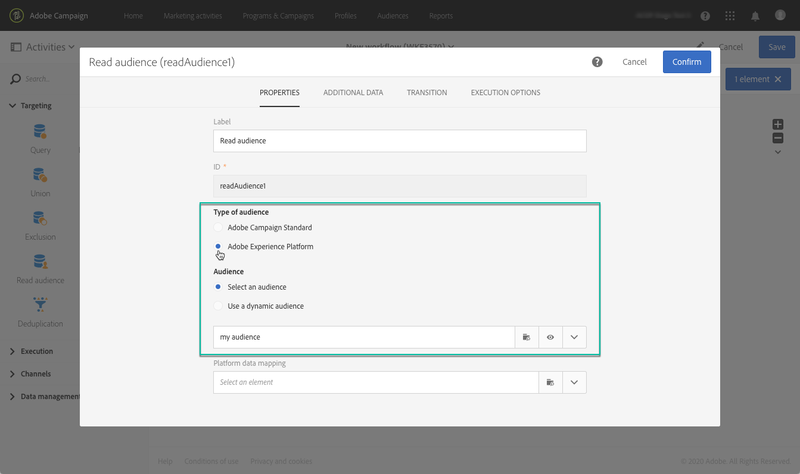

# Målgrupper med Adobe Experience Platform {#targeting-aep-audiences}

>[!IMPORTANT]
>
>Målgruppstjänsten är för närvarande i betaversion, som kan uppdateras ofta utan föregående meddelande. Kunderna måste vara värdbaserade på Azure (för närvarande endast betaversioner för Nordamerika) för att få tillgång till dessa funktioner. Kontakta Adobes kundtjänst om du vill ha tillgång till tjänsten.

När ni har skapat en publik [på](../../audiences/using/aep-about-audience-destinations-service.md) Adobe Experience Platform med segmentverktyget för enhetlig profil kan ni använda det på samma sätt som ni skulle göra för en Campaign-målgrupp inom arbetsflöden att personalisera och skicka meddelanden.

Så här aktiverar du en Adobe Experience Platform-användare i dina arbetsflöden:

1. Lägg till en **[!UICONTROL Read audience]** aktivitet i arbetsflödet och öppna den.

1. Välj **[!UICONTROL Adobe Experience Platform]** alternativet under **[!UICONTROL Type of audience]** och lägg sedan till önskad målgrupp.

   

1. (Valfritt) När målgruppen har valts kan du klicka på ögonknappen för att granska och/eller redigera segmentdefinitionen (se till att spara ändringarna igen).

   Om du klickar på ögonknappen dirigeras du till verktyget Enhetligt segment (på en annan flik) som är kopplat till den valda målgruppen i Campaign.

1. Välj ett **[!UICONTROL Platform data mapping]** element för att ange önskad måldimension för den valda Adobe Experience Platform-publiken.

   Som standard är primärnyckeln (t.ex. iRecipientID för profiltabellen, iAppSubscriptionID för AppSubscription-tabellen) som används för avstämning automatiskt tillgänglig i listrutan. Om du vill ange ett mål utanför primärnyckeln måste du skapa ett anpassat **namnutrymme**.

   >[!NOTE]
   >
   >För mål utanför primärnyckeln måste du också skapa en anpassad målmappning som motsvarar det anpassade namnutrymmet. Mer information om målmappning finns i [det här avsnittet](../../administration/using/target-mappings-in-campaign.md).

   

   Den här listan innehåller alla XDM-mappningar (Experience Data Model) som har konfigurerats på din instans. Mer information om Adobe Experience Platform Data Connector finns i [det här dedikerade dokumentet](../../developing/using/aep-about-data-connector.md).

   

1. När målgrupps- och målgruppsdimensionerna är korrekt konfigurerade klickar du på **[!UICONTROL Confirm]** knappen för att spara ändringarna.

Du kan nu konfigurera ditt arbetsflöde med andra aktiviteter. Du kan till exempel länka en aktivitet för att skicka ett e-postmeddelande till den valda målgruppen. **[!UICONTROL Email delivery]**

>[!NOTE]
>
>Med Campaign Standard kan ni inrikta er på målgrupper i Adobe Experience Platform inom alla leveranskanaler: E-post, SMS-meddelanden, direktmeddelanden, push-meddelanden och meddelanden i appen.
>
>*Obs! För alla push- och in-app-meddelanden stöder Campaign Standard endast leveranser för kända profiler.

Mer information om hur du använder arbetsflöden och leveranser finns i följande avsnitt:

* [Identifiera arbetsflöden](../../automating/using/get-started-workflows.md)
* [Bygga ett arbetsflöde](../../automating/using/building-a-workflow.md)
* [Identifiera kommunikationskanaler](../../channels/using/get-started-communication-channels.md)
* [Om kanalaktiviteter](../../automating/using/about-channel-activities.md)
