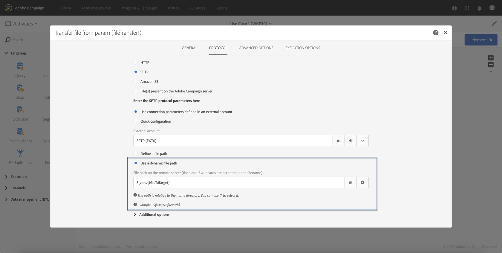

# Anropa ett arbetsflöde med externa parametrar{#calling-a-workflow-with-external-parameters}

Med Campaign Standard kan du anropa ett arbetsflöde med parametrar (ett målgruppsnamn, ett filnamn som ska importeras, en del av meddelandeinnehållet osv.). På så sätt kan ni enkelt integrera era Campaign-automatiseringar med ert externa system.

Låt oss ta följande exempel, där vi vill skicka e-post direkt från ett CMS-system. I så fall kan du konfigurera systemet så att målgruppen och e-postinnehållet väljs i CMS-systemet. När du klickar på Skicka anropas sedan ett Campaign-arbetsflöde med de här parametrarna, vilket gör att du kan använda dem i arbetsflödet för att definiera målgruppen och URL-innehållet som ska användas i leveransen.

Processen för att anropa ett arbetsflöde med parametrar är följande:

1. Deklarera parametrarna i **[!UICONTROL External signal]** aktiviteten. Se [Deklarera parametrarna i den externa signalaktiviteten](../../automating/using/calling-a-workflow-with-external-parameters.md#declaring-the-parameters-in-the-external-signal-activity).
1. Konfigurera **[!UICONTROL End]** aktiviteten eller API-anropet för att definiera parametrarna och utlösa **[!UICONTROL External signal]** arbetsflödesaktiviteten.

När arbetsflödet har utlösts hämtas parametrarna in i arbetsflödets händelsevariabler och kan användas i arbetsflödet. Se [Anpassa ett arbetsflöde med externa parametrar](../../automating/using/calling-a-workflow-with-external-parameters.md#customizing-a-workflow-with-external-parameters).


## Deklarera parametrarna i den externa signalaktiviteten {#declaring-the-parameters-in-the-external-signal-activity}

Det första steget för att anropa ett arbetsflöde med parametrar är att deklarera dem i en **[!UICONTROL External signal]** aktivitet.

1. Open the **[!UICONTROL External signal]** activity, then select the **[!UICONTROL Parameters]** tab.
1. Klicka på **[!UICONTROL Create element]** knappen och ange sedan namn och typ för varje parameter.

   >[!CAUTION]
   >
   >Kontrollera att parameterns namn och antal är identiska med vad som är definierat när arbetsflödet anropas (se [Definiera parametrar när arbetsflödet](../../automating/using/calling-a-workflow-with-external-parameters.md#defining-the-parameters-when-calling-the-workflow)anropas). Parametrarnas typer måste dessutom vara konsekventa med de förväntade värdena.

   

1. När parametrarna har deklarerats slutför du arbetsflödeskonfigurationen och kör den.

## Definiera parametrarna när arbetsflödet anropas {#defining-the-parameters-when-calling-the-workflow}

I det här avsnittet beskrivs hur du definierar parametrar när du anropar ett arbetsflöde. Mer information om hur du utför den här åtgärden från ett API-anrop finns i dokumentationen [för](../../api/using/triggering-a-signal-activity.md)REST API:er.

Innan du definierar parametrarna bör du kontrollera att:

* Parametrarna har deklarerats i **[!UICONTROL External Signal]** aktiviteten. Se [Deklarera parametrarna i den externa signalaktiviteten](../../automating/using/calling-a-workflow-with-external-parameters.md#declaring-the-parameters-in-the-external-signal-activity).
* Arbetsflödet som innehåller signalaktiviteten körs.

Följ stegen nedan för att konfigurera **[!UICONTROL End]** aktiviteten:

1. Open the **[!UICONTROL End]** activity, then select the **[!UICONTROL External signal]** tab.
1. Välj arbetsflödet och den externa signalaktivitet som du vill anropa.
1. Klicka på **[!UICONTROL Create element]** knappen för att lägga till en parameter och fyll sedan i dess namn och värde.

   * **[!UICONTROL Name]**: Det namn som har deklarerats i **[!UICONTROL External signal]** aktiviteten (se [Deklarera parametrarna i den externa signalaktiviteten](../../automating/using/calling-a-workflow-with-external-parameters.md#declaring-the-parameters-in-the-external-signal-activity)).
   * **[!UICONTROL Value]**: värdet som du vill tilldela parametern. Värdet ska följa **standardsyntaxen** som beskrivs i [det här avsnittet](../../automating/using/advanced-expression-editing.md#standard-syntax).
   

   >[!CAUTION]
   >
   >Kontrollera att alla parametrar har deklarerats i **[!UICONTROL External signal]** aktiviteten. Annars inträffar ett fel när aktiviteten körs.

1. Bekräfta aktiviteten när parametrarna har definierats och spara sedan arbetsflödet.

## Övervaka händelsevariabler {#monitoring-the-events-variables}

Det är möjligt att övervaka de händelsevariabler som är tillgängliga i arbetsflödet, inklusive de deklarerade externa parametrarna. Gör så här:

1. Markera aktiviteten som följer **[!UICONTROL External signal]** aktiviteten och klicka sedan på **[!UICONTROL Log and tasks]** knappen.
1. Klicka på **[!UICONTROL Tasks]** knappen på  fliken.

   

1. Körningskontexten för uppgiften visas (ID, status, varaktighet osv.), inklusive alla händelsemariabler som nu är tillgängliga för användning i arbetsflödet.

   

## Anpassa ett arbetsflöde med externa parametrar {#customizing-a-workflow-with-external-parameters}

När arbetsflödet har utlösts hämtas parametrarna in i händelsevariablerna och kan användas för att anpassa arbetsflödets aktiviteter.

De kan till exempel användas för att definiera vilken målgrupp som ska läsas i **[!UICONTROL Read audience]** aktiviteten, namnet på filen som ska överföras i **[!UICONTROL Transfer file]** aktiviteten osv.

Aktiviteter som kan anpassas med händelsevariabler beskrivs i [det här avsnittet](../../automating/using/calling-a-workflow-with-external-parameters.md#customizing-activities-with-events-variables).

### Använda händelsevariabler {#using-events-variables}

Händelsevariabler används i ett uttryck som måste respektera **[standardsyntaxen](../../automating/using/advanced-expression-editing.md#standard-syntax)**.

Syntaxen för att använda händelsevariabler måste följa formatet nedan och använda parameternamnet som har definierats i **[!UICONTROL External signal]** aktiviteten (se [Deklarera parametrarna i den externa signalaktiviteten](../../automating/using/calling-a-workflow-with-external-parameters.md#declaring-the-parameters-in-the-external-signal-activity)):

```
$(vars/@parameterName)
```

I den här syntaxen returnerar **$** -funktionen **strängdatatypen** . Om du vill ange en annan typ av data använder du följande funktioner:

* **$long**: heltal.
* **$float**: decimaltal.
* **$boolesk**: true/false.
* **$datetime**: tidsstämpel.

När du använder en variabel i en aktivitet får du hjälp att anropa den i gränssnittet.


* : välj händelsemariabeln bland alla variabler som är tillgängliga i arbetsflödet (se ).

   

* : redigera uttryck genom att kombinera variabler och funktioner. Mer information om uttrycksredigeraren finns i [det här avsnittet](../../automating/using/advanced-expression-editing.md).

   

**Relaterade ämnen:**

* [Redigera ett uttryck](../../automating/using/advanced-expression-editing.md#edit-an-expression)
* [Standardsyntax](../../automating/using/advanced-expression-editing.md#standard-syntax)
* [Lista över funktioner](../../automating/using/list-of-functions.md)

### Anpassa aktiviteter med händelsevariabler {#customizing-activities-with-events-variables}

Händelsevariabler kan användas för att anpassa flera aktiviteter, som listas i avsnittet nedan. Mer information om hur du anropar en variabel från en aktivitet finns i [det här avsnittet](../../automating/using/calling-a-workflow-with-external-parameters.md#using-events-variables).

**[!UICONTROL Read audience]** aktivitet: Definiera målgruppen baserat på händelsevariabler.

Mer information om hur du använder aktiviteten finns i det [dedikerade avsnittet](../../automating/using/read-audience.md).


**[!UICONTROL Test]** aktivitet: skapa villkor baserade på händelsevariabler.

Mer information om hur du använder aktiviteten finns i det [dedikerade avsnittet](../../automating/using/test.md).


**[!UICONTROL Transfer file]** aktivitet: anpassa filen som ska överföras baserat på händelsevariabler.

Mer information om hur du använder aktiviteten finns i det [dedikerade avsnittet](../../automating/using/transfer-file.md).


**[!UICONTROL Query]** aktivitet: parametrar kan refereras i en fråga genom att använda uttryck som kombinerar händelsevariabler och funktioner. Om du vill göra det lägger du till en regel och klickar sedan på **[!UICONTROL Advanced mode]** länken för att öppna redigeringsfönstret för uttryck (se [Avancerad redigering](../../automating/using/advanced-expression-editing.md)av uttryck).

Mer information om hur du använder aktiviteten finns i det [dedikerade avsnittet](../../automating/using/query.md).


**[!UICONTROL Channels]** verksamhet: personalisera leveranser baserat på händelsevariabler.

>[!NOTE]
>
>Värdena för leveransparametrarna hämtas varje gång leveransen förbereds.
>
>Förberedelse för återkommande leveranser baseras på **leveransaggregeringsperioden**. Om t.ex. aggregeringsperioden är &quot;per dag&quot; förbereds leveransen endast en gång per dag. Om värdet för en leveransparameter ändras under dagen uppdateras det inte i leveransen, eftersom det redan har förberetts en gång.
>
>Om du planerar att anropa arbetsflödet flera gånger om dagen ska du använda [!UICONTROL No aggregation] alternativet så att leveransparametrarna uppdateras varje gång. Mer information om konfiguration av återkommande leveranser finns i [det här avsnittet](/help/automating/using/email-delivery.md#configuration).

Om du vill anpassa en leverans baserat på händelsevariabler måste du först deklarera variablerna som du vill använda i leveransaktiviteten:

1. Markera aktiviteten och klicka sedan på  knappen för att komma åt inställningarna.
1. Välj **[!UICONTROL General]** fliken och lägg sedan till de händelsevariabler som ska vara tillgängliga som personaliseringsfält i leveransen.

   

1. Klicka på **[!UICONTROL Confirm]** knappen.

Deklarerade händelsevariabler är nu tillgängliga i listan över personaliseringsfält. Du kan använda dem i leveransen för att utföra följande åtgärder:

* Definiera namnet på mallen som ska användas för leveransen.

   >[!NOTE]
   >
   >Den här åtgärden är endast tillgänglig för **återkommande** leveranser.

   

* Anpassa leveransen: När du väljer ett personaliseringsfält för att konfigurera en leverans är händelsevariabler tillgängliga i **[!UICONTROL Workflow parameters]** elementet. Du kan använda dem som vilket personaliseringsfält som helst, t.ex. för att definiera leveransämnet, avsändaren osv.

   Leveranspersonalisering beskrivs i [det här avsnittet](../../designing/using/personalization.md).

   

**Segmentkoder**: Definiera segmentkoden baserat på händelsevariabler.

>[!NOTE]
>
>Den här åtgärden kan utföras från alla aktiviteter som gör att du kan definiera en segmentkod som till exempel **[!UICONTROL Query]** eller **[!UICONTROL Segmentation]** aktiviteter.


**Leveransetikett**: Definiera leveransetiketten baserat på händelsevariabler.


## Använd skiftläge {#use-case}

I exemplet nedan visas hur du anropar arbetsflöden med parametrar i dina arbetsflöden.

Målet är att utlösa ett arbetsflöde från ett API-anrop med externa parametrar. Det här arbetsflödet läser in data i databasen från en fil och skapar en associerad målgrupp. När målgruppen har skapats aktiveras ett andra arbetsflöde för att skicka ett meddelande som är anpassat med de externa parametrar som definierats i API-anropet.

För att kunna utföra det här användningsfallet måste du utföra åtgärderna nedan:

1. **Gör ett API-anrop** för att utlösa arbetsflöde 1 med externa parametrar. Se [steg 1: Konfigurerar API-anropet](../../automating/using/calling-a-workflow-with-external-parameters.md#step-1--configuring-the-api-call).
1. **Bygg arbetsflöde 1**: arbetsflödet överför en fil och läser in den i databasen. Sedan testas om data är tomma eller inte och slutligen sparas profilerna i en målgrupp. Slutligen utlöses arbetsflöde 2. Se [steg 2: Konfigurerar arbetsflöde 1](../../automating/using/calling-a-workflow-with-external-parameters.md#step-2--configuring-workflow-1).
1. **Bygg arbetsflöde 2**: arbetsflödet läser målgruppen som har skapats i arbetsflöde 1 och skickar sedan ett anpassat meddelande till profilerna, med en segmentkod som är anpassad efter parametrarna. Se [steg 3: Konfigurerar arbetsflöde 2](../../automating/using/calling-a-workflow-with-external-parameters.md#step-3--configuring-workflow-2).


### Förutsättningar {#prerequisites}

Innan du konfigurerar arbetsflödena måste du skapa arbetsflöden 1 och 2 med en **[!UICONTROL External signal]** aktivitet i varje. På så sätt kan du rikta in dig på dessa signalaktiviteter när du anropar arbetsflödena.

### Steg 1: Konfigurera API-anropet {#step-1--configuring-the-api-call}

Gör ett API-anrop för att utlösa arbetsflöde 1 med parametrar. Mer information om API-anropssyntaxen finns i dokumentationen [till](../../api/using/triggering-a-signal-activity.md)Campaign Standard REST API:er.

I det här fallet vill vi anropa arbetsflödet med parametrarna nedan:

* **fileToTarget**: namnet på filen som ska importeras till databasen.
* **rabattDesc**: den beskrivning som vi vill visa i rabattleveransen.

```
-X POST https://mc.adobe.io/<ORGANIZATION>/campaign/<TRIGGER_URL>
-H 'Authorization: Bearer <ACCESS_TOKEN>' 
-H 'Cache-Control: no-cache' 
-H 'X-Api-Key: <API_KEY>' 
-H 'Content-Type: application/json;charset=utf-8' 
-H 'Content-Length:79' 
-i
-d {
-d "source:":"API",
-d "parameters":{
-d "fileToTarget":"profile.txt",
-d "discountDesc":"Running shoes"
-d } 
```

### Steg 2: Konfigurerar arbetsflöde 1 {#step-2--configuring-workflow-1}

Arbetsflöde 1 byggs enligt nedan:

* **[!UICONTROL External signal]** aktivitet: där de externa parametrarna måste deklareras för att kunna användas i arbetsflödet.
* **[!UICONTROL Transfer file]** aktivitet: importerar filen med det namn som definieras i parametrarna.
* **[!UICONTROL Load file]** aktivitet: läser in data från den importerade filen till databasen.
* **[!UICONTROL Update data]** aktivitet: infogar eller uppdaterar databasen med data från den importerade filen.
* **[!UICONTROL Test]** aktivitet: kontrollerar om data har importerats.
* **[!UICONTROL Save audience]** aktivitet: om filen innehåller data, sparar profilerna i en målgrupp.
* **[!UICONTROL End activity]** aktivitet: anropar Workflow 2 med de parametrar som du vill använda i det.


Konfigurera arbetsflödet genom att följa stegen nedan:

1. Deklarera de parametrar som har definierats i API-anropet. Det gör du genom att öppna **[!UICONTROL External signal]** aktiviteten och sedan lägga till parameternamn och typer.

   

1. Lägg till en **[!UICONTROL Transfer file]** aktivitet för att importera data till databasen.Det gör du genom att dra och släppa aktiviteten, öppna den och sedan välja **[!UICONTROL Protocol]** fliken.
1. Markera **[!UICONTROL Use a dynamic file path]** alternativet och använd sedan parametern **fileToTarget** som den fil som ska överföras:

   ```
   $(vars/@fileToTarget)
   ```

   

1. Läs in data från filen i databasen.

   Det gör du genom att dra och släppa en **[!UICONTROL Load file]** aktivitet i arbetsflödet och sedan konfigurera den efter behov.

1. Infoga och uppdatera databasen med data från den importerade filen.

   Det gör du genom att dra och släppa en **[!UICONTROL Update data]** aktivitet och sedan välja **[!UICONTROL Identification]** fliken för att lägga till ett avstämningsvillkor (i vårt fall **e-postfältet** ).

   

1. Markera **[!UICONTROL Fields to update]** fliken och ange sedan fälten som ska uppdateras i databasen (i vårt fall **för- och** e-postfälten **** ).

   

1. Kontrollera om data har hämtats från filen. Det gör du genom att dra och släppa en **[!UICONTROL Test]** aktivitet i arbetsflödet och sedan klicka på **[!UICONTROL Add an element]** knappen för att lägga till ett villkor.
1. Namnge och definiera villkoret. I det här fallet vill vi testa om den utgående övergången innehåller data med syntaxen nedan:

   ```
   $long(vars/@recCount)>0
   ```

   

1. Om data hämtas sparar du dem i en målgrupp. Det gör du genom att lägga till en aktivitet i övergången **[!UICONTROL Save audience]** Mål som inte är tom **** och sedan öppna den.
1. Markera **[!UICONTROL Use a dynamic label]** alternativet och använd sedan **parametern fileToTarget** som målgruppens etikett:

   ```
   $(vars/@fileToTarget)
   ```

   

1. Dra och släpp en aktivitet som anropar arbetsflöde 2 med parametrar och öppna den sedan. **[!UICONTROL End]**
1. Markera **[!UICONTROL External signal]** fliken och ange sedan arbetsflödet som ska utlösas och dess tillhörande signalaktivitet.
1. Definiera de parametrar som du vill använda i arbetsflöde 2 och deras associerade värden.

   I det här fallet vill vi skicka de parametrar som ursprungligen definierades i API-anropet (**fileToTarget** och **rabattDesc**) och ytterligare en **segmentCode** -parameter med ett konstant värde (&quot;20 % rabatt&quot;).

   

Arbetsflöde 1 är konfigurerat och du kan nu skapa arbetsflöde 2. For more on this, refer to [this section](../../automating/using/calling-a-workflow-with-external-parameters.md#step-3--configuring-workflow-2).

### Steg 3: Konfigurera arbetsflöde 2 {#step-3--configuring-workflow-2}

Arbetsflöde 2 byggs enligt nedan:

* **[!UICONTROL External signal]** aktivitet: där parametrarna måste deklareras för att kunna användas i arbetsflödet.
* **[!UICONTROL Read audience]** aktivitet: läser målgruppen som sparats i arbetsflöde 1.
* **[!UICONTROL Email delivery]** aktivitet: skickar ett återkommande meddelande till målgruppen, anpassat med parametrar.


Konfigurera arbetsflödet genom att följa stegen nedan:

1. Deklarera parametrarna som har definierats i Arbetsflöde 1.

   Det gör du genom att öppna **[!UICONTROL External signal]** aktiviteten och sedan lägga till namn och typ för varje parameter som definieras i **[!UICONTROL End]** aktiviteten för Arbetsflöde 1.

   

1. Använd målgruppen som har sparats i arbetsflöde 1. Det gör du genom att dra och släppa en **[!UICONTROL Read audience]** aktivitet i arbetsflödet och sedan öppna den.
1. Markera **[!UICONTROL Use a dynamic audience]** alternativet och använd sedan **parametern fileToTarget** som namn på målgruppen som ska läsas:

   ```
   $(vars/@fileToTarget)
   ```

   

1. Namnge den utgående övergången enligt parametern **segmentCode** .

   Om du vill göra det väljer du **[!UICONTROL Transition]** fliken och sedan **[!UICONTROL Use a dynamic segment code]** alternativet.

1. Använd parametern **segmentCode** som namn på den utgående övergången:

   ```
   $(vars/@segmentCode)
   ```

   

1. Dra och släpp en **[!UICONTROL Email delivery]** aktivitet för att skicka ett meddelande till publiken.
1. Identifiera de parametrar som ska användas i meddelandet för att anpassa det med parametern **rabattDesc** . Det gör du genom att öppna aktivitetens avancerade alternativ och sedan lägga till parameternamnet och värdet.

   

1. Du kan nu konfigurera meddelandet. Öppna aktiviteten och välj sedan **[!UICONTROL Recurring email]**.

   

1. Välj den mall som ska användas och definiera sedan e-postegenskaperna efter dina behov.
1. Använd parametern **rabattDesc** som ett anpassningsfält. Det gör du genom att välja det i listan med anpassningsfält.

   

1. Nu kan du slutföra konfigurationen av meddelandet och sedan skicka det som vanligt.

   

### Köra arbetsflöden {#executing-the-workflows}

När arbetsflödena har byggts kan du köra dem. Kontrollera att de två arbetsflödena har startats innan du utför API-anropet.
