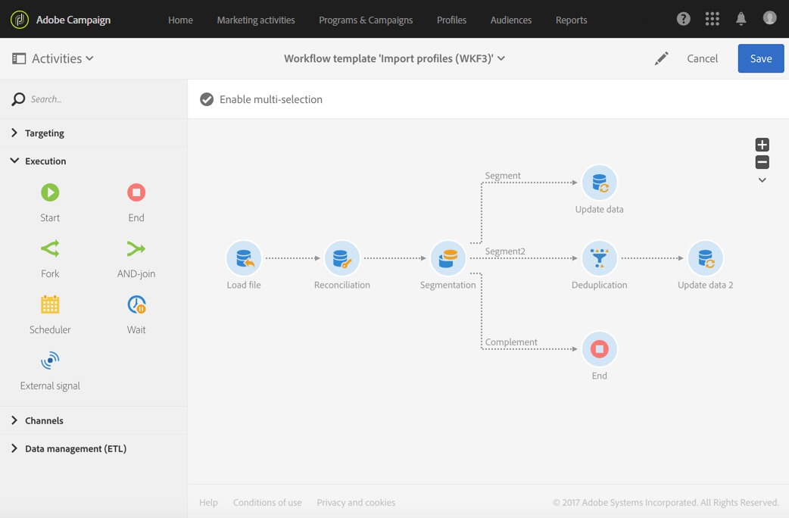
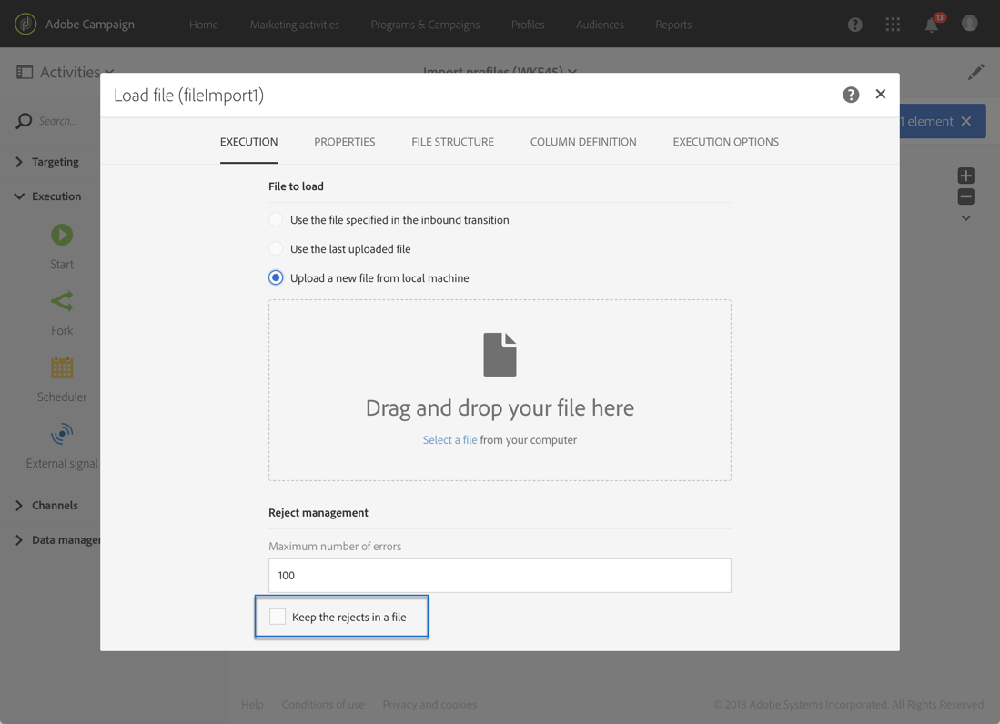
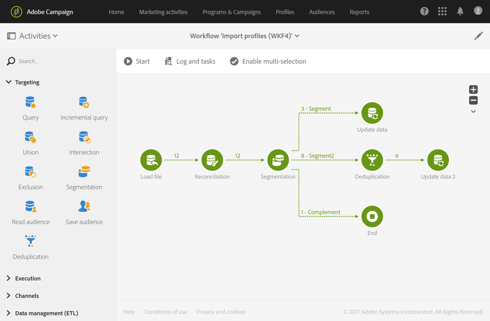

# Skapa arbetsflödesmallar för import av data {#import-workflow-template}

Det är bäst att använda en importmall om du behöver importera filer med samma struktur regelbundet.

I det här exemplet visas hur du anger ett förinställt arbetsflöde som kan återanvändas för import av profiler från en CRM i Adobe Campaign-databasen.

1. Skapa en ny arbetsflödesmall från **[!UICONTROL Resources > Templates > Workflow templates]**.
1. Lägg till följande aktiviteter:

   * **[!UICONTROL Load file]**: Definiera den förväntade strukturen för filen som innehåller de data som ska importeras.

      >[!NOTE]
      >
      >Du kan bara importera data från en enda fil. Om arbetsflödet har flera **[!UICONTROL Load file]** aktiviteter används samma fil varje gång.

   * **[!UICONTROL Reconciliation]**: Stäm av importerade data med databasdata.
   * **[!UICONTROL Segmentation]**: Skapa filter för att bearbeta poster på olika sätt beroende på om de kan förenas eller inte.
   * **[!UICONTROL Deduplication]**: Deduplicera data från den inkommande filen innan den infogas i databasen.
   * **[!UICONTROL Update data]**: Uppdatera databasen med de importerade profilerna.

   

1. Konfigurera **[!UICONTROL Load file]** aktiviteten:

   * Definiera den förväntade strukturen genom att överföra en exempelfil. Exempelfilen bör bara innehålla några få rader, men alla kolumner som behövs för importen. Kontrollera och redigera filformatet för att säkerställa att typen av varje kolumn är korrekt: text, datum, heltal osv. Exempel:

      ```
      lastname;firstname;birthdate;email;crmID
      Smith;Hayden;23/05/1989;hayden.smith@mailtest.com;123456
      ```

   * I **[!UICONTROL File to load]** avsnittet markerar du **[!UICONTROL Upload a new file from the local machine]** och lämnar fältet tomt. Varje gång ett nytt arbetsflöde skapas från den här mallen kan du här ange vilken fil du vill ha, så länge den motsvarar den definierade strukturen.

      Du kan använda något av alternativen, men du måste ändra mallen därefter. Om du till exempel väljer **[!UICONTROL Use the file specified in the inbound transition]** kan du lägga till en **[!UICONTROL Transfer file]** aktivitet innan du hämtar filen som ska importeras från en FTP-/SFTP-server.

      Om du vill att användarna ska kunna hämta en fil som innehåller fel som inträffade under en import markerar du **[!UICONTROL Keep the rejects in a file]** alternativet och anger **[!UICONTROL File name]**.

      

1. Konfigurera **[!UICONTROL Reconciliation]** aktiviteten. Syftet med den här aktiviteten i det här sammanhanget är att identifiera inkommande data.

   * På **[!UICONTROL Relations]** fliken markerar **[!UICONTROL Create element]** och definierar du en länk mellan importerade data och mottagarna som anger måldimension (se [Måldimensioner och resurser](../../automating/using/query.md#targeting-dimensions-and-resources)). I det här exemplet används det anpassade fältet **CRM ID** för att skapa kopplingsvillkoret. Använd fältet eller kombinationen av fält som du behöver så länge det går att identifiera unika poster.
   * Låt alternativet vara omarkerat på **[!UICONTROL Identification]** fliken **[!UICONTROL Identify the document from the working data]** .

   

1. Konfigurera aktiviteten för att hämta avstämda mottagare i en övergång och mottagare som inte kunde avstämas men som har tillräckligt med data i en andra övergång. **[!UICONTROL Segmentation]**

   Övergången med avstämda mottagare kan sedan användas för att uppdatera databasen. Övergången med okända mottagare kan sedan användas för att skapa nya mottagarposter i databasen om det finns en minimiuppsättning information i filen.

   Mottagare som inte kan förenas och som inte har tillräckligt med data markeras i en komplementövergång och kan exporteras i en separat fil eller helt enkelt ignoreras.

   * På aktivitetens **[!UICONTROL General]** flik anger du värdet **[!UICONTROL Resource type]** till **[!UICONTROL Temporary resource]** och väljer **[!UICONTROL Reconciliation]** som måluppsättning.
   * På **[!UICONTROL Advanced options]** fliken markerar du **[!UICONTROL Generate complement]** alternativet för att se om det inte går att infoga en post i databasen. Om du behöver kan du använda ytterligare bearbetning för kompletterande data: export av filer, uppdatering av listor osv.
   * I det första segmentet på **[!UICONTROL Segments]** fliken lägger du till ett filtreringsvillkor i den inkommande populationen för att endast markera poster där profilens CRM-ID inte är lika med 0. På så sätt markeras data från filen som är avstämda med profiler från databasen i den delmängden.

      

   * Lägg till ett andra segment som markerar ej avstämda poster som har tillräckligt med data för att infogas i databasen. Till exempel: e-postadress, förnamn och efternamn. Poster som inte är avstämda har en profils CRM ID-värde som är lika med 0.

      

   * Alla poster som inte är markerade i de två första delmängderna markeras i **[!UICONTROL Complement]**.

1. Konfigurera den **[!UICONTROL Update data]** aktivitet som finns efter den första utgående övergången för den **[!UICONTROL Segmentation]** aktivitet som konfigurerats tidigare.

   * Välj **[!UICONTROL Update]** som **[!UICONTROL Operation type]** eftersom den inkommande övergången bara innehåller mottagare som redan finns i databasen.
   * På **[!UICONTROL Identification]** fliken väljer du **[!UICONTROL Using reconciliation criteria]** och definierar en nyckel mellan **[!UICONTROL Dimension to update]** - profiler i det här fallet - och länken som skapas i **[!UICONTROL Reconciliation]** aktiviteten. I det här exemplet används det anpassade fältet **CRM ID** .

      

   * På fliken **[!UICONTROL Fields to update]** anger du fälten från dimensionen Profiler som ska uppdateras med värdet för motsvarande kolumn från filen. Om namnen på filkolumnerna är identiska eller nästan identiska med namnen på mottagarnas dimensionsfält kan du använda trollstavsknappen för att automatiskt matcha de olika fälten.

      

      >[!NOTE]
      >
      >Om du planerar att skicka direktreklam till dessa profiler måste du ange en postadress eftersom informationen är viktig för direktreklamleverantören. Kontrollera även att **[!UICONTROL Address specified]** rutan i profilinformationen är markerad. Om du vill uppdatera det här alternativet från ett arbetsflöde lägger du bara till ett element i de fält som ska uppdateras, anger **1** som **[!UICONTROL Source]** och väljer `postalAddress/@addrDefined` fältet som **[!UICONTROL Destination]**. Mer information om direktreklam och hur du använder **[!UICONTROL Address specified]** alternativet finns i [det här dokumentet](../../channels/using/about-direct-mail.md#recommendations).

1. Konfigurera den **[!UICONTROL Deduplication]** aktivitet som finns efter övergången och som innehåller ej avstämda profiler:

   * På **[!UICONTROL Properties]** fliken ställer du in **[!UICONTROL Resource type]** till den temporära resurs som genereras från arbetsflödets **[!UICONTROL Reconciliation]** aktivitet.

      

   * I det här exemplet används e-postfältet för att hitta unika profiler. Du kan använda vilket fält som helst som du är säker på är ifyllt och ingår i en unik kombination.
   * Välj en **[!UICONTROL Deduplication method]**. I det här fallet avgör programmet automatiskt vilka register som ska sparas om det finns dubbletter.

   

1. Konfigurera den **[!UICONTROL Update data]** aktivitet som finns efter den **[!UICONTROL Deduplication]** aktivitet som konfigurerats tidigare.

   * Välj **[!UICONTROL Insert only]** som **[!UICONTROL Operation type]** eftersom den inkommande övergången bara innehåller profiler som inte finns i databasen.
   * På **[!UICONTROL Identification]** fliken väljer du **[!UICONTROL Using reconciliation criteria]** och definierar en nyckel mellan **[!UICONTROL Dimension to update]** - profiler i det här fallet - och länken som skapas i **[!UICONTROL Reconciliation]** aktiviteten. I det här exemplet används det anpassade fältet **CRM ID** .

      

   * På fliken **[!UICONTROL Fields to update]** anger du fälten från dimensionen Profiler som ska uppdateras med värdet för motsvarande kolumn från filen. Om namnen på filkolumnerna är identiska eller nästan identiska med namnen på mottagarnas dimensionsfält kan du använda trollstavsknappen för att automatiskt matcha de olika fälten.

      

      >[!NOTE]
      >
      >Om du planerar att skicka direktreklam till dessa profiler måste du ange en postadress eftersom informationen är viktig för direktreklamleverantören. Kontrollera även att **[!UICONTROL Address specified]** rutan i profilinformationen är markerad. Om du vill uppdatera det här alternativet från ett arbetsflöde lägger du bara till ett element i de fält som ska uppdateras, anger **1** som **[!UICONTROL Source]** och väljer fältet **[mailAddress/@addrDefined]** som **[!UICONTROL Destination]**. Mer information om direktreklam och hur du använder **[!UICONTROL Address specified]** alternativet finns i [det här dokumentet](../../channels/using/about-direct-mail.md#recommendations).

1. Efter den tredje övergången av **[!UICONTROL Segmentation]** aktiviteten lägger du till en **[!UICONTROL Extract file]** aktivitet och en **[!UICONTROL Transfer file]** aktivitet om du vill hålla reda på data som inte har infogats i databasen. Konfigurera de aktiviteterna för att exportera den kolumn du behöver och för att överföra filen till en FTP- eller SFTP-server där du kan hämta den.
1. Lägg till en **[!UICONTROL End]** aktivitet och spara arbetsflödesmallen.

Mallen kan nu användas och är tillgänglig för alla nya arbetsflöden. Allt som behövs är då att ange filen som innehåller de data som ska importeras i **[!UICONTROL Load file]** aktiviteten.


