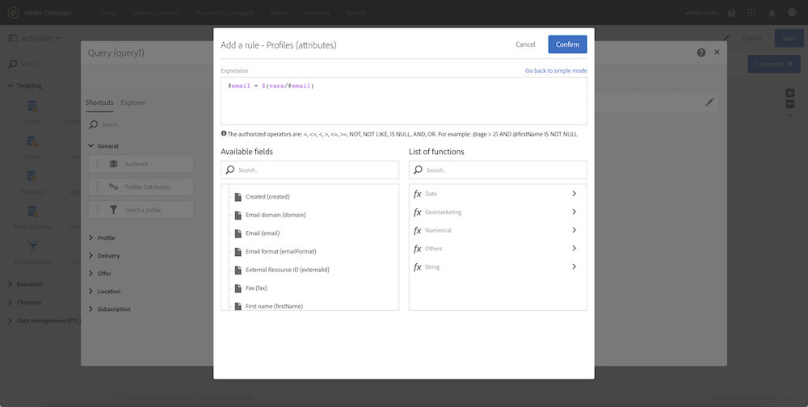
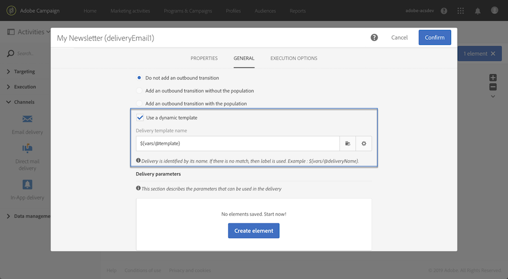

# Anpassa ett arbetsflöde med externa parametrar {#customizing-a-workflow-with-external-parameters}

När arbetsflödet har utlösts hämtas parametrarna in i händelsevariablerna och kan användas för att anpassa arbetsflödets aktiviteter.

De kan till exempel användas för att definiera vilken målgrupp som ska läsas i aktiviteten **[!UICONTROL Read audience]**, namnet på filen som ska överföras i aktiviteten **[!UICONTROL Transfer file]** osv. (se [den här sidan](../../automating/using/customizing-workflow-external-parameters.md)).

## Använda händelsevariabler {#using-events-variables}

Händelsevariabler används i ett uttryck som måste respektera [standardsyntaxen](../../automating/using/advanced-expression-editing.md#standard-syntax).

Syntaxen för att använda händelsevariabler måste följa formatet nedan och använda parameternamnet som har definierats i **[!UICONTROL External signal]**-aktiviteten (se [Deklarera parametrarna i den externa signalaktiviteten](../../automating/using/declaring-parameters-external-signal.md)):

```
$(vars/@parameterName)
```

I den här syntaxen returnerar funktionen **$** datatypen **sträng**. Om du vill ange en annan typ av data använder du följande funktioner:

* **$long**: heltal.
* **$float**: decimaltal.
* **$boolesk**: true/false.
* **$datetime**: tidsstämpel.

När du använder en variabel i en aktivitet får du hjälp att anropa den i gränssnittet.


* : välj händelsvariabeln bland alla variabler som är tillgängliga i arbetsflödet.

   

* : redigera uttryck genom att kombinera variabler och funktioner (se  [den här sidan](../../automating/using/advanced-expression-editing.md)).

   

   Den här listan innehåller funktioner som gör att du kan utföra komplex filtrering. Dessa funktioner beskrivs i [det här avsnittet](../../automating/using/list-of-functions.md).

   Du kan dessutom använda funktionerna nedan, som är tillgängliga i alla aktiviteter som gör att du kan använda händelsevariabler efter att du har anropat ett arbetsflöde med externa parametrar (se [det här avsnittet](../../automating/using/customizing-workflow-external-parameters.md#customizing-activities-with-events-variables)):

   | Namn | Beskrivning | Syntax |
   ---------|----------|---------
   | EndWith | Anger om en sträng (första parametern) slutar med en specifik sträng (andra parametern). | EndWith(&lt;String>,&lt;String>) |
   | startWith | Anger om en sträng (första parametern) börjar med en viss sträng (andra parametern). | startWith(&lt;String>,&lt;String>) |
   | Extract | Returnerar de första tecknen i en sträng med en avgränsare. | Extract(&lt;String>,&lt;Separator>) |
   | ExtractRight | Returnerar de sista tecknen i en sträng med en avgränsare. | ExtractRight(&lt;String>,&lt;Separator>) |
   | DateFormat | Formaterar ett datum med det format som anges i den andra parametern (exempel:  &#39;%4Y%2M%2D&#39;) | DateFormat(&lt;Date>,&lt;Format>) |
   | FileName | Returnerar namnet på en filsökväg. | FileName(&lt;String>) |
   | FileExt | Returnerar tillägget för en filsökväg. | FileExt(&lt;String>) |
   | GetOption | Returnerar värdet för den angivna funktionen. | GetOption(&lt;alternativnamn>) |
   | IsNull | Anger om en sträng eller ett datum är null. | IsNull(&lt;String/date>) |
   | UrlUtf8Encode | Kodar en URL i UTF8. | UrlUtf8Encode(&lt;String>) |

## Anpassa aktiviteter med händelsevariabler {#customizing-activities-with-events-variables}

Händelsevariabler kan användas för att anpassa flera aktiviteter, som listas i avsnittet nedan. Mer information om hur du anropar en variabel från en aktivitet finns i [det här avsnittet](../../automating/using/customizing-workflow-external-parameters.md#using-events-variables).

**[!UICONTROL Read audience]** aktivitet: Definiera målgruppen baserat på händelsevariabler. Mer information om hur du använder aktiviteten finns i [det här avsnittet](../../automating/using/read-audience.md).


**[!UICONTROL Test]** aktivitet: skapa villkor baserade på händelsevariabler. Mer information om hur du använder aktiviteten finns i [det här avsnittet](../../automating/using/test.md).


**[!UICONTROL Transfer file]** aktivitet: anpassa filen som ska överföras baserat på händelsevariabler. Mer information om hur du använder aktiviteten finns i [det här avsnittet](../../automating/using/transfer-file.md).


**[!UICONTROL Query]** aktivitet: parametrar kan refereras i en fråga genom att använda uttryck som kombinerar händelsevariabler och funktioner. Om du vill göra det lägger du till en regel och klickar sedan på länken **[!UICONTROL Advanced mode]** för att öppna redigeringsfönstret för uttryck (se [Avancerad uttrycksredigering](../../automating/using/advanced-expression-editing.md)).

Mer information om hur du använder aktiviteten finns i [det här avsnittet](../../automating/using/query.md).



**[!UICONTROL Channels]** verksamhet: personalisera leveranser baserat på händelsevariabler.

>[!NOTE]
>
>Värdena för leveransparametrarna hämtas varje gång leveransen förbereds.
>
>Förberedelsen för återkommande leveranser baseras på leveransmängden **aggregeringsperioden**. Om t.ex. aggregeringsperioden är &quot;per dag&quot; förbereds leveransen endast en gång per dag. Om värdet för en leveransparameter ändras under dagen uppdateras det inte i leveransen, eftersom det redan har förberetts en gång.
>
>Om du planerar att anropa arbetsflödet flera gånger om dagen ska du använda alternativet [!UICONTROL No aggregation] så att leveransparametrarna uppdateras varje gång. Mer information om konfiguration av återkommande leveranser finns i [det här avsnittet](/help/automating/using/email-delivery.md#configuration).

Om du vill anpassa en leverans baserat på händelsevariabler måste du först deklarera variablerna som du vill använda i leveransaktiviteten:

1. Markera aktiviteten och klicka sedan på knappen  för att komma åt inställningarna.
1. Välj fliken **[!UICONTROL General]** och lägg sedan till de händelsevariabler som ska vara tillgängliga som personaliseringsfält i leveransen.

   

1. Klicka på knappen **[!UICONTROL Confirm]**.

Deklarerade händelsevariabler är nu tillgängliga i listan över personaliseringsfält. Du kan använda dem i leveransen för att utföra följande åtgärder:

* Definiera namnet på mallen som ska användas för leveransen.

   >[!NOTE]
   >
   >Den här åtgärden är endast tillgänglig för **återkommande** leveranser.

   

* Anpassa leveransen: När du väljer ett anpassningsfält för att konfigurera en leverans är händelsevariabler tillgängliga i **[!UICONTROL Workflow parameters]**-elementet. Du kan använda dem som vilket personaliseringsfält som helst, t.ex. för att definiera leveransämnet, avsändaren osv.

   Leveranspersonalisering beskrivs i [det här avsnittet](../../designing/using/personalization.md).

   

**Segmentkoder**: Definiera segmentkoden baserat på händelsevariabler.

>[!NOTE]
>
>Den här åtgärden kan utföras från vilken aktivitet som helst som gör att du kan definiera en segmentkod som till exempel aktiviteter i **[!UICONTROL Query]** eller **[!UICONTROL Segmentation]**.


**Leveransetikett**: Definiera leveransetiketten baserat på händelsevariabler.


