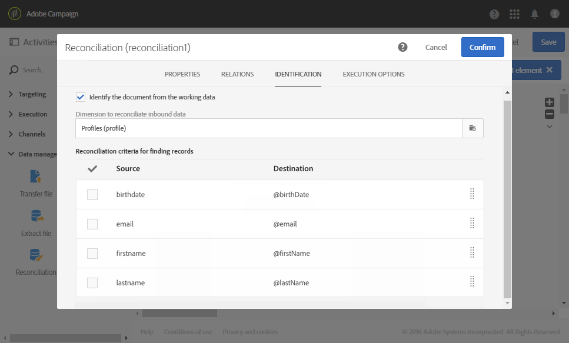

# Datauppdatering med avstämning {#data-update-reconciliation}

I följande exempel visas ett arbetsflöde som skapar en publik med profiler direkt från en importerad fil som innehåller nya klienter.  Den består av följande verksamheter:


* A [Läs in fil](../../automating/using/load-file.md) -aktivitet som läser in och identifierar data i filen som ska importeras. Den importerade filen innehåller följande data:

  ```
  lastname;firstname;email;dateofbirth
  jackman;megan;megan.jackman@testmail.com;07/08/1975
  phillips;edward;phillips@testmail.com;09/03/1986
  weaver;justin;justin_w@testmail.com;11/15/1990
  martin;babeth;babeth_martin@testmail.net;11/25/1964
  reese;richard;rreese@testmail.com;02/08/1987
  cage;nathalie;cage.nathalie227@testmail.com;07/03/1989
  xiuxiu;andrea;andrea.xiuxiu@testmail.com;09/12/1992
  grimes;daryl;daryl_890@testmail.com;12/06/1979
  tycoon;tyreese;tyreese_t@testmail.net;10/08/1971
  ```

* A [Avstämning](../../automating/using/reconciliation.md) -aktivitet, som länkar varje kolumn i den inlästa filen till en profildimensionskolumn. Filposterna som inte kan identifieras (data saknas, inkompatibel datatyp etc.)  ignoreras för att bevara integriteten i den slutliga målgruppsinformationen.

  

* A [Spara målgrupper](../../automating/using/save-audience.md) -aktivitet, vilket sparar åt publiken med profiler.

  
