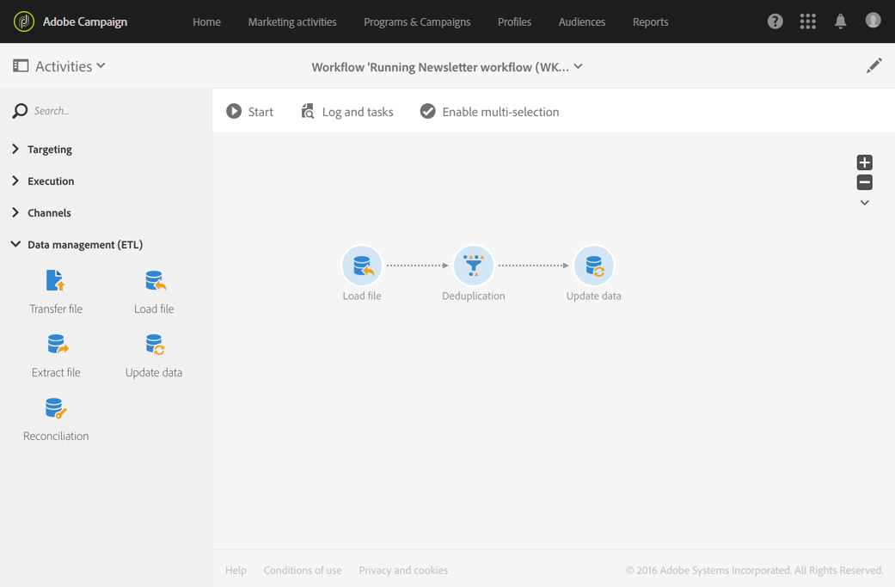

# Deduplicera data från en importerad fil {#deduplicating-the-data-from-an-imported-file}

Det här exemplet beskriver hur du tar bort dubbletter av data från en fil som importerats innan data lästes in i databasen. Den här proceduren förbättrar kvaliteten på de data som läses in i databasen.

Arbetsflödet består av:



* En fil som innehåller en lista med profiler importeras med en [Läs in fil](../../automating/using/load-file.md) -aktivitet. I det här exemplet är den importerade filen i CSV-format och innehåller 10 profiler:

  ```
  lastname;firstname;dateofbirth;email
  Smith;Hayden;23/05/1989;hayden.smith@example.com
  Mars;Daniel;17/11/1987;dannymars@example.com
  Smith;Clara;08/02/1989;hayden.smith@example.com
  Durance;Allison;15/12/1978;allison.durance@example.com
  Lucassen;Jody;28/03/1988;jody.lucassen@example.com
  Binder;Tom;19/01/1982;tombinder@example.com
  Binder;Tommy;19/01/1915;tombinder@example.com
  Connor;Jade;10/10/1979;connor.jade@example.com
  Mack;Clarke;02/03/1985;clarke.mack@example.com
  Ross;Timothy;04/07/1986;timross@example.com
  ```

  Den här filen kan också användas som exempelfil för att identifiera och definiera kolumnformatet. Kontrollera att varje kolumn i den importerade filen är korrekt konfigurerad på fliken **[!UICONTROL Column definition]**.

  

* En [borttagning av dubbletter](../../automating/using/deduplication.md)-aktivitet. Deduplicering utförs direkt efter att filen har importerats och innan data infogas i databasen. Den ska därför baseras på **[!UICONTROL Temporary resource]** av **[!UICONTROL Load file]**-aktiviteten.

  I det här exemplet vill vi behålla en enda post per unik e-postadress som finns i filen. Identifiering av dubbletter utförs därför på **e-postkolumnen** för den tillfälliga resursens. Men filen innehåller två e-postadresser. Två rader kommer därför att betraktas som dubbletter.

  

* Med en [Uppdatera data](../../automating/using/update-data.md)-aktivitet kan du infoga data från dedupliceringsprocessen i databasen. Importerade data identifieras endast som associerad med profildimensionen när dessa data uppdateras.

  Här vill vi **[!UICONTROL Insert only]** profilerna som inte redan finns i databasen. Vi gör detta genom att använda filens e-postkolumn och e-postfältet från **profildimensionen** som avstämningsnyckeln.

  

  Ange mappningarna mellan filens kolumner som du vill infoga data från och databasfälten från fliken **[!UICONTROL Fields to update]**.

  

Starta sedan arbetsflödet. Posterna som sparas från dedupliceringsprocessen läggs sedan till i profilerna i databasen.
