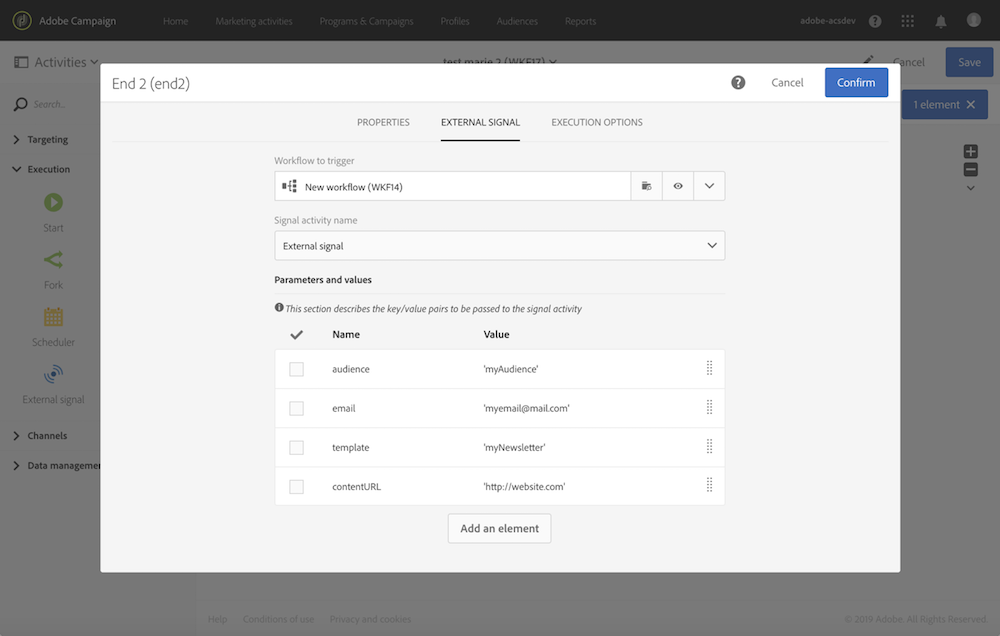

# Definiera parametrarna när arbetsflödet anropas {#defining-the-parameters-when-calling-the-workflow}

I det här avsnittet beskrivs hur du definierar parametrar när du anropar ett arbetsflöde. Mer information om hur du utför den här åtgärden från ett API-anrop finns i dokumentationen för [REST API:er](../../api/using/triggering-a-signal-activity.md).

Innan du definierar parametrarna bör du kontrollera att:

* Parametrarna har deklarerats i aktiviteten **[!UICONTROL External Signal]**. Läs [den här sidan](../../automating/using/declaring-parameters-external-signal.md).
* Arbetsflödet som innehåller signalaktiviteten körs.

Så här konfigurerar du aktiviteten **[!UICONTROL End]**:

1. Öppna aktiviteten **[!UICONTROL End]** och välj sedan fliken **[!UICONTROL External signal]**.
1. Välj arbetsflödet och den externa signalaktivitet som du vill anropa.
1. Klicka på knappen **[!UICONTROL Create element]** för att lägga till en parameter och fyll sedan i dess namn och värde.

   * **[!UICONTROL Name]**: namnet som har deklarerats i aktiviteten **[!UICONTROL External signal]** (se [den här sidan](../../automating/using/declaring-parameters-external-signal.md)).
   * **[!UICONTROL Value]**: det värde som du vill tilldela parametern. Värdet ska följa **standardsyntaxen** som beskrivs i [det här avsnittet](../../automating/using/advanced-expression-editing.md#standard-syntax).

   

   >[!CAUTION]
   >
   >Kontrollera att alla parametrar har deklarerats i aktiviteten **[!UICONTROL External signal]**. Annars inträffar ett fel när aktiviteten körs.

1. När parametrarna har definierats bekräftar du aktiviteten och sparar sedan arbetsflödet.
