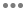

# Direktleverans av e-post{#direct-mail-delivery}

## Beskrivning {#description}

Med den här **[!UICONTROL Direct mail delivery]** aktiviteten kan du konfigurera och förbereda en fil som innehåller profildata som du vill använda för en direktreklamkampanj. Det kan vara en direktreklam som bara används en gång eller en **återkommande** direktreklam.

Standardmejl skickas en gång.

Med återkommande e-postmeddelanden kan du skicka samma direktreklam flera gånger till olika mål under en angiven period. Du kan samla leveranser per period för att få rapporter som motsvarar dina behov.

## Kontext för användning {#context-of-use}

Aktiviteten används vanligtvis för att automatisera förberedelsen av en fil som innehåller profildata **[!UICONTROL Direct mail delivery]** . Den här filen kan sedan skickas till en partner/leverantör som ansvarar för utskicket.

När du är länkad till en schemaläggare kan du definiera återkommande direkta e-postmeddelanden.

Mottagare av direktreklam definieras uppströms aktiviteten i samma arbetsflöde, via målinriktade aktiviteter som frågor, skärningar osv. Profiler vars utskicksadress inte anges exkluderas automatiskt när direktutskick förbereds.

Meddelandeförberedelsen utlöses enligt arbetsflödets körningsparametrar. På meddelandekontrollpanelen kan du välja om du vill begära eller inte få en manuell bekräftelse för att skicka meddelandet (krävs som standard). Du kan starta arbetsflödet manuellt eller placera en schemaläggningsaktivitet i arbetsflödet för att automatisera körningen.

## Konfiguration {#configuration}

1. Dra och släpp en **[!UICONTROL Direct mail delivery]** aktivitet i arbetsflödet.
1. Markera aktiviteten och öppna den sedan med knappen  bland de snabbåtgärder som visas.

   >[!NOTE]
   >
   >Du kan komma åt de allmänna egenskaperna och de avancerade alternativen för aktiviteten (och inte för själva leveransen) via  knappen från aktivitetens snabbåtgärder. Den här knappen är specifik för kanalaktiviteterna. Du kommer åt egenskaperna för direktreklam via åtgärdsfältet på kontrollpanelen för direktreklam.

1. Välj direktreklam:

   * **[!UICONTROL Direct mail]**: direktreklamen skickas en gång. Här kan du ange om du vill lägga till en utgående övergång till aktiviteten eller inte. De olika övergångstyperna beskrivs närmare i steg 7 i den här proceduren.
   * **[!UICONTROL Recurring direct mail]**: direktreklamen skickas flera gånger, enligt den frekvens som anges i en **[!UICONTROL Scheduler]** aktivitet. Välj aggregeringsperioden för utskicken. På så sätt kan du gruppera om alla meddelanden som inträffar under den angivna perioden i en enda direktutskick som också kallas **återkommande körning** och som kan nås från programmets lista över marknadsföringsaktiviteter.

      Om du till exempel har en återkommande födelsedagskalender, som behandlas varje dag, kan du välja att samla in varje månad. På så sätt kan du få rapporter om leveransen på månadsbasis även om posten behandlas varje dag.

      >[!NOTE]
      >
      >För återkommande direkta e-postmeddelanden skapas en ny fil vid varje körning av arbetsflödet. Den valda aggregeringsperioden har ingen effekt på det här beteendet.

1. Välj en typ av direktreklam. De direkta e-posttyperna kommer från mallar som definieras på menyn **[!UICONTROL Resources]** > **[!UICONTROL Templates]** > **[!UICONTROL Delivery templates]** .
1. Ange de allmänna egenskaperna för direktmeddelandet. Du kan även bifoga den till en befintlig kampanj. Etiketten för arbetsflödets leveransaktivitet uppdateras med etiketten för direktreklam.
1. Definiera innehållet i direktreklam. Se avsnittet om [innehållsredigering](../../designing/using/personalization.md).
1. Som standard innehåller aktiviteten **[!UICONTROL Direct mail delivery]** inga utgående övergångar. Om du vill lägga till en utgående övergång till din **[!UICONTROL Direct mail delivery]** aktivitet går du till **[!UICONTROL General]** fliken med de avancerade aktivitetsalternativen (  knappen i aktivitetens snabbåtgärder) och markerar något av följande alternativ:

   * **[!UICONTROL Add outbound transition without the population]**: Detta gör att du kan generera en utgående övergång som innehåller exakt samma population som den inkommande övergången. Övergången innehåller den fil som genereras av direktreklamaktiviteten och den råa-ifyllning som togs emot av direktpostaktiviteten.
   * **[!UICONTROL Add outbound transition with the population]**: Detta gör att du kan generera en utgående övergång som innehåller den population som direktmeddelandet ska skickas till. Målmedlemmarna uteslöts under färdigställandet av direktreklam (karantän, ogiltig adress osv.) är undantagna från denna övergång. Övergången innehåller även filen som genereras av direktmeddelandet.

1. Bekräfta aktivitetens konfiguration och spara arbetsflödet.

När du öppnar aktiviteten igen dirigeras du direkt till kontrollpanelen för direktreklam. Det är bara innehållet som kan redigeras.

Som standard utlöses meddelandeförberedelsen endast när ett leveransarbetsflöde startas. Meddelanden som skapats från ett arbetsflöde måste fortfarande bekräftas när arbetsflödet har startats. Men via meddelandekontrollpanelen, och endast om meddelandet skapades från ett arbetsflöde, kan du inaktivera **[!UICONTROL Request confirmation before sending messages]** alternativet. Genom att avmarkera det här alternativet skickas meddelanden utan föregående meddelande när beredningen är klar.

## Anmärkningar {#remarks}

Leveranser som skapas i ett arbetsflöde kan nås i programmets lista över marknadsföringsaktiviteter. Du kan visa arbetsflödets körningsstatus med kontrollpanelen. Länkarna i rutan för sammanfattning av direktreklam ger dig direktåtkomst till länkade element (arbetsflöde, kampanj, överordnad leverans om du har återkommande direktreklam).

Körningarna av återkommande leveranser maskeras som standard. Om du vill visa dem markerar du **[!UICONTROL Show recurring executions]** alternativet i marknadsföringsaktiviteternas sökpanel.

I de överordnade leveranserna, som du kommer åt från listan över marknadsföringsaktiviteter eller direkt via de associerade återkommande körningarna, kan du visa det totala antalet e-postmeddelanden som har bearbetats (enligt den aggregeringsperiod som angavs när **[!UICONTROL Direct mail delivery]** aktiviteten konfigurerades). Det gör du genom att öppna detaljvyn för den överordnade leveransens **[!UICONTROL Deployment]** block genom att markera  knappen.

## Exempel {#example}

Ett exempel på **[!UICONTROL Direct mail delivery]** finns i kapitlet [Direktreklam](../../channels/using/example-of-direct-mail-in-a-workflow.md) .
