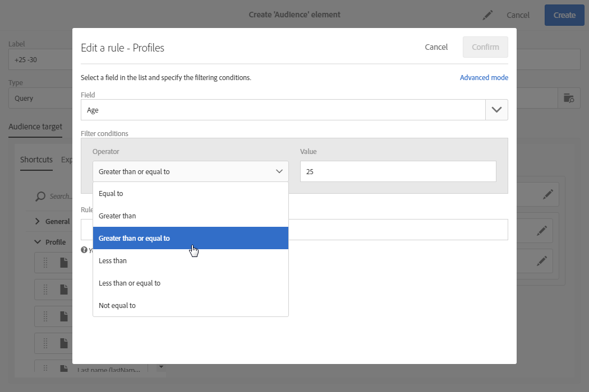

# Redigera frågor{#editing-queries}

## Om frågeredigeraren {#about-query-editor}

Frågeredigeraren är en guide som du använder för att filtrera data i Adobe Campaign-databasen.

Med den här funktionen kan du skapa en population som bättre riktar sig till mottagarna tack vare fördefinierade filter och regler.

Flera programfunktioner använder den för att:

* Skapa **frågetyp** för **målgrupper**
* Definiera mål för **e-post**
* Definiera populationer i **arbetsflödesaktiviteter**

## Frågeredigeringsgränssnitt {#query-editor-interface}

Frågeredigeraren består av en **palett** och en **arbetsyta**.

### Palett {#palette}

Paletten, som finns till vänster om redigeraren, är uppdelad i två flikar, som innehåller element indelade i tematiska block. Följande flikar är:

* Kortkommandon ****, som är tillgängliga som standard eller skapade av instansadministratören. Här hittar du fält, noder, grupperingar, 1-1-länkar, 1-N-länkar och andra fördefinierade filter.
* Med **Utforskaren** kan du komma åt alla tillgängliga fält i målresursen: noder, grupperingselement, länkar (1-1 och 1-N).

Elementen på flikarna måste flyttas till arbetsytan för att kunna konfigureras och tas med i beräkningen för frågan. Beroende på vilken måldimension som har valts (se [Måldimensioner och resurser](../../automating/using/query.md#targeting-dimensions-and-resources)) kan du:

* Välj målgrupper eller profiler en i taget
* Använd fördefinierade filter
* Definiera enkla regler för olika fält
* Definiera avancerade regler som gör att du kan tillämpa funktioner på vissa fält

### Arbetsyta {#workspace}

Arbetsytan är den centrala zon där du kan konfigurera och kombinera regler, målgrupper och fördefinierade filter som läggs till från paletten.

När du flyttar ett element från paletten till arbetsytan öppnas ett nytt fönster och du kan börja [skapa frågor](#creating-queries).

## Skapa frågor {#creating-queries}

Frågeredigeraren kan användas för att definiera en målgrupp eller testprofil i ett meddelande, en ifyllning i ett arbetsflöde och för att skapa en frågetyp.

Frågor kan definieras i **[!UICONTROL Audience]** fönstret när en leverans skapas eller i en **Query** -aktivitet när ett arbetsflöde skapas.

1. Flytta ett element från paletten till arbetsytan. Fönstret där du redigerar regeln öppnas.

   * För en sträng eller ett numeriskt **fält** anger du jämförelseoperatorn och värdet.

      

   * För ett datum- eller datum- och **tidsfält** kan du välja att definiera ett specifikt datum, ett intervall mellan två datum eller en period som är relativ till frågans körningsdatum.

      

   * För ett booleskt **fält** markerar du de rutor som är länkade till fältets möjliga värden.
   * För ett **grupperingsfält** väljer du grupperingsfältet som du vill skapa regeln för och definierar sedan villkoret på samma sätt som för de andra fälten.

      

   * För en **1-1** -länk med en annan databasresurs väljer du ett värde direkt från måltabellen.

      

   * För en **1-N** -länk med en annan databasresurs kan du definiera en underfråga i fälten för den här andra resursen.

      Du behöver inte ange något undervillkor.

      Du kan till exempel bara välja operatorn **[!UICONTROL Exists]** i profilspårningsloggarna och godkänna regeln. Regeln returnerar alla profiler som det finns spårningsloggar för.

      

   * För ett **fördefinierat filter** anger eller väljer du de element du vill ha enligt villkoren.

      Administratörer kan skapa filter för att underlätta komplexa och repetitiva frågor. Dessa visas i frågeredigeraren i form av förkonfigurerade regler och de begränsar antalet steg som användaren behöver utföra.

      

1. Du kan ange ett namn för regeln. Det visas sedan som regelnamn på arbetsytan. Om regeln inte får ett namn visas en automatisk beskrivning av villkoren.
1. Om du vill kombinera arbetsytelementen låser du ihop dem till varandra för att skapa olika grupper och/eller gruppnivåer. Du kan sedan välja en logisk operator för att kombinera element på samma nivå:

   * **[!UICONTROL AND]**: en korsning av två kriterier. Endast de element som uppfyller varje kriterium beaktas.
   * **[!UICONTROL OR]**: en förening av två kriterier. Element som matchar minst ett av de två villkoren beaktas.
   * **[!UICONTROL EXCEPT]**: uteslutningskriterier. Element som matchar det första kriteriet beaktas såvida de inte också matchar det andra kriteriet.

1. Nu kan du beräkna och förhandsgranska antalet element som frågan avser med hjälp av knapparna  och  i åtgärdsfältet.

   

Om du vill ändra ett element i frågan klickar du på redigeringsikonen. Regeln öppnas som den var konfigurerad tidigare och du kan sedan göra nödvändiga justeringar.

Dina frågor har nu skapats och definierats, vilket gör att du kan skapa en population som bättre anpassar dina leveranser.

**Relaterade ämnen:**

* [Avancerade funktioner](../../automating/using/advanced-expression-editing.md)
* [Definiera filter](../../developing/using/configuring-filter-definition.md)
* [Användningsfall: Skapa en e-postleverans en gång i veckan](../../automating/using/workflow-weekly-offer.md)
* [Användningsfall: Skapa en leverans segmenterad på plats](../../automating/using/workflow-segmentation-location.md)
* [Användningsfall: Skapa leveranser med ett komplement](../../automating/using/workflow-created-query-with-complement.md)
* [Användningsfall: Omdirigeringsarbetsflöde som skickar en ny leverans till icke-öppnare](../../automating/using/workflow-cross-channel-retargeting.md)
