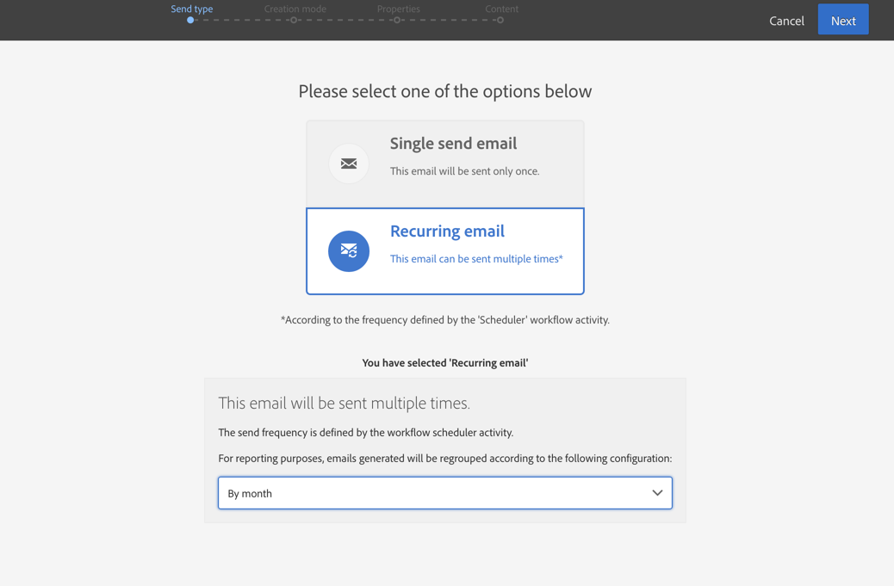

# E-postleverans{#email-delivery}

## Beskrivning {#description}

Med den här **[!UICONTROL Email delivery]** aktiviteten kan du konfigurera sändning av e-post i ett arbetsflöde. Det kan vara ett **enda skicka** -e-postmeddelande som skickas bara en gång, eller ett **återkommande** e-postmeddelande.

E-postmeddelanden som skickas en gång är standardmeddelanden.

Med återkommande e-postmeddelanden kan du skicka samma e-postmeddelande flera gånger till olika mål under en angiven period. Du kan samla leveranser per period för att få rapporter som motsvarar dina behov.

## Kontext för användning {#context-of-use}

Aktiviteten används vanligtvis för att automatisera sändning av e-post till ett mål som beräknas i samma arbetsflöde. **[!UICONTROL Email delivery]**

När du är länkad till en schemaläggare kan du definiera återkommande e-postmeddelanden.

E-postmottagare definieras uppströms aktiviteten i samma arbetsflöde, via målinriktade aktiviteter som frågor, skärningar osv.

Meddelandeförberedelsen utlöses enligt arbetsflödets körningsparametrar. På meddelandekontrollpanelen kan du välja om du vill begära eller inte få en manuell bekräftelse för att skicka meddelandet (krävs som standard). Du kan starta arbetsflödet manuellt eller placera en schemaläggningsaktivitet i arbetsflödet för att automatisera körningen.

## Konfiguration {#configuration}

1. Dra och släpp en **[!UICONTROL Email delivery]** aktivitet i arbetsflödet.
1. Markera aktiviteten och öppna den sedan med knappen  bland de snabbåtgärder som visas.

   >[!NOTE]
   >
   >Du kan komma åt de allmänna egenskaperna och de avancerade alternativen för aktiviteten (och inte för själva leveransen) via  knappen från aktivitetens snabbåtgärder. Den här knappen är specifik för **[!UICONTROL Email delivery]** aktiviteten. Du kommer åt e-postens egenskaper via åtgärdsfältet i e-postinstrumentpanelen.

1. Välj e-postläge:

   * **[!UICONTROL Email]**: e-postmeddelandet skickas en gång. Här kan du ange om du vill lägga till en utgående övergång till aktiviteten eller inte. De olika övergångstyperna beskrivs närmare i steg 7 i den här proceduren.
   * **[!UICONTROL Recurring email]**: e-postmeddelandet skickas flera gånger, enligt den frekvens som definieras i en **[!UICONTROL Scheduler]** aktivitet. Välj aggregeringsperioden för utskicken. Detta gör att du kan gruppera om alla meddelanden som inträffar under den angivna perioden i ett enda e-postmeddelande som också kallas **återkommande körning** och som kan nås från programmets lista över marknadsföringsaktiviteter.

      Om du till exempel har en återkommande födelsedag, som skickas varje dag, kan du välja att samla in varje månad. Detta gör att du kan få rapporter om leveransen månadsvis, även om e-postmeddelandet skickas varje dag.
   >[!NOTE]
   >
   >Återkommande leveranser förbereds baserat på **aggregeringsperioden**. Om t.ex. aggregeringsperioden är &quot;per dag&quot; förbereds leveransen endast en gång per dag. Om du planerar att anropa det här arbetsflödet flera gånger om dagen kan du använda [!UICONTROL No aggregation].

1. Välj en e-posttyp. E-posttyperna kommer från e-postmallar som definieras på menyn **[!UICONTROL Resources]** > **[!UICONTROL Templates]** > **[!UICONTROL Delivery templates]** .
1. Ange de allmänna egenskaperna för e-postmeddelandet. Du kan även bifoga den till en befintlig kampanj. Etiketten för arbetsflödets leveransaktivitet uppdateras med e-postetiketten.
1. Definiera e-postinnehållet. Se avsnittet om [innehållsredigering](../../designing/using/designing-content-in-adobe-campaign.md).
1. Som standard innehåller aktiviteten **[!UICONTROL Email delivery]** inga utgående övergångar. Om du vill lägga till en utgående övergång till din **[!UICONTROL Email delivery]** aktivitet går du till **[!UICONTROL General]** fliken med de avancerade aktivitetsalternativen (  knappen i aktivitetens snabbåtgärder) och markerar något av följande alternativ:

   * **[!UICONTROL Add outbound transition without the population]**: Detta gör att du kan generera en utgående övergång som innehåller exakt samma population som den inkommande övergången.
   * **[!UICONTROL Add outbound transition with the population]**: Detta gör att du kan generera en utgående övergång som innehåller den population som e-postmeddelandet skickades till. Målmedlemmar som uteslöts under leveransförberedelsen (karantän, ogiltig e-post osv.) är undantagna från denna övergång.

1. Bekräfta aktivitetens konfiguration och spara arbetsflödet.

När du öppnar aktiviteten igen dirigeras du direkt till e-postinstrumentpanelen. Det är bara innehållet som kan redigeras.

Som standard utlöses meddelandeförberedelsen endast när ett leveransarbetsflöde startas. Meddelanden som skapats från ett arbetsflöde måste fortfarande bekräftas när arbetsflödet har startats. Men via meddelandekontrollpanelen, och endast om meddelandet skapades från ett arbetsflöde, kan du inaktivera **[!UICONTROL Request confirmation before sending messages]** alternativet. Genom att avmarkera det här alternativet skickas meddelanden utan föregående meddelande när beredningen är klar.

## Anmärkningar {#remarks}

Leveranser som skapas i ett arbetsflöde kan nås i programmets lista över marknadsföringsaktiviteter. Du kan visa arbetsflödets körningsstatus med kontrollpanelen. Länkarna i rutan för e-postsammanfattning ger dig direktåtkomst till länkade element (arbetsflöde, kampanj, överordnad leverans om det finns ett återkommande e-postmeddelande).

Körningarna av återkommande leveranser maskeras som standard. Om du vill visa dem markerar du **[!UICONTROL Show recurring executions]** alternativet i marknadsföringsaktiviteternas sökpanel.

I de överordnade leveranserna, som du kommer åt från listan över marknadsföringsaktiviteter eller direkt via de associerade återkommande körningarna, kan du visa det totala antalet skickade meddelanden som har bearbetats (enligt den aggregeringsperiod som angavs när **[!UICONTROL Email delivery]** aktiviteten konfigurerades). Det gör du genom att öppna detaljvyn för den överordnade leveransens **[!UICONTROL Deployment]** block .

## Exempel {#example}

Det här exemplet är ett födelsedagsarbetsflöde. Varje dag skickas ett e-postmeddelande till profiler vars födelsedag är den dagen. Så här gör du:

* Du kan **[!UICONTROL Scheduler]** starta arbetsflödet varje dag kl. 8.00.

   

* Med den här **[!UICONTROL Query]** aktiviteten kan du beräkna de profiler som har skickat ett e-postmeddelande och vars födelsedag är den aktuella dagen, varje gång arbetsflödet körs. Födelsedagsberäkningen utförs med ett fördefinierat filter som finns på paletten i frågeredigeringsverktyget.

   

* Det **[!UICONTROL Email]** är återkommande. Sändningarna sammanställs per månad. Alla e-postmeddelanden som skickas en månad sammanställs alltså i en enda vy. På ett år utförs 365 leveranser, men de grupperas sedan in i 12 vyer (kallas även **återkommande körningar**) i Adobe Campaign-gränssnittet. Historik och rapportinformation visas varje månad och inte för varje sändning.

   

**Relaterade ämnen**

* [Användningsfall: Skapa en e-postleverans en gång i veckan](../../automating/using/workflow-weekly-offer.md)
* [Användningsfall: Skapa en leverans segmenterad på plats](../../automating/using/workflow-segmentation-location.md)
* [Användningsfall: Skapa leveranser med ett komplement](../../automating/using/workflow-created-query-with-complement.md)
* [Användningsfall: Omdirigeringsarbetsflöde som skickar en ny leverans till icke-öppnare](../../automating/using/workflow-cross-channel-retargeting.md)