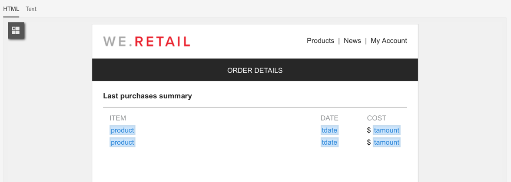

# Berika profildata med data som finns i en fil {#enriching-profile-data-with-data-contained-in-a-file}

I det här exemplet visas hur du förbättrar profildata med inköpsdata som finns i en fil. Vi räknar här med att inköpsdata lagras i ett tredjepartssystem. Varje profil kan innehålla flera köp i filen. Arbetsflödets sista mål är att skicka ett e-postmeddelande till målprofilerna som har köpt minst två objekt för att tacka dem för deras lojalitet.

Arbetsflödet är konfigurerat på följande sätt:


* En [Fråga](../../automating/using/query.md)-aktivitet som riktar sig till de profiler som ska ta emot meddelandet.
* En [Läs in fil](../../automating/using/load-file.md)-aktivitet som läser in inköpsdata. Exempel:

  ```
  tcode;tdate;customer;product;tamount
  aze123;21/05/2017;dannymars@example.com;TV;799
  aze124;28/05/2017;dannymars@example.com;Headphones;8
  aze125;31/07/2017;john.smith@example.com;Headphones;8
  aze126;14/12/2017;john.smith@example.com;Plastic Cover;4
  aze127;02/01/2018;dannymars@example.com;Case Cover;79
  aze128;04/03/2017;clara.smith@example.com;Phone;149
  ```

  Använd e-postadressen för att stämma av data med databasprofilerna med den här exempelfilen. Du kan även aktivera unika ID:n enligt beskrivningen i [det här dokumentet](../../developing/using/configuring-the-resource-s-data-structure.md#generating-a-unique-id-for-profiles-and-custom-resources).

* En [anrikningsaktivitet](../../automating/using/enrichment.md) som skapar en länk mellan transaktionsdata som lästs in från filen och de profiler som valts i **[!UICONTROL Query]**. Länken definieras på aktivitetens flik **[!UICONTROL Advanced relations]**. Länken baseras på övergången från **[!UICONTROL Load file]**-aktiviteten. Det använder e-postfältet för profilresursen och kundkolumnen för den importerade filen som avstämningskriterier.

  

  När länken har skapats läggs två uppsättningar **[!UICONTROL Additional data]** till:

   * En samling med två rader som motsvarar de två sista transaktionerna i varje profil. För den här samlingen läggs produktnamn, transaktionsdatum och pris på produkten till som ytterligare data. En fallande sortering används för datan. Så här skapar du samlingen på fliken **[!UICONTROL Additional data]**:

     Markera länken som tidigare definierats på aktivitetens flik **[!UICONTROL Advanced relations]**.

     

     Kontrollera **[!UICONTROL Collection]** och ange antalet rader som ska hämtas (2 i det här exemplet). På den här skärmen kan du anpassa **[!UICONTROL Alias]** och **[!UICONTROL Label]** av samlingen. Dessa värden visas i följande aktiviteter i arbetsflödet när de refererar till denna samling.

     

     Så att **[!UICONTROL Data]** kan behålla samlingen väljer du de kolumner som ska användas i den slutliga leveransen.

     

     Använd en fallande sortering för transaktionsdatum för att se till att hämta de senaste transaktionerna.

     

   * En sammanställning som räknar det totala antalet transaktioner för varje profil. Sammanställningen används senare för att filtrera profiler som har minst två transaktioner registrerade. Så här skapar du sammanställningen på fliken **[!UICONTROL Additional data]**:

     Markera länken som tidigare definierats på aktivitetens flik **[!UICONTROL Advanced relations]**.

     

     Välj **[!UICONTROL Aggregate]**.

     

     För att **[!UICONTROL Data]** behålla sammanställningen **Totalsumma** som ska behållas. Om det behövs kan du ange ett anpassat alias för att hitta det snabbare i följande aktiviteter.

     

* En [segmenteringsaktivitet](../../automating/using/segmentation.md) med endast ett segment, som hämtar profiler för det ursprungliga målet som har minst två transaktioner registrerade. Profiler med endast en transaktion exkluderas. För att göra detta skapas förfrågningen om segmenteringen på den mängd som tidigare definierats.

  

* En [e-postleveransaktivitet](../../automating/using/email-delivery.md) som använder ytterligare data som definierats i **[!UICONTROL Enrichment]** för att dynamiskt hämta de två senaste inköpen som gjorts av profilen. Ytterligare data finns i noden **Ytterligare data (TargetData)** när du lägger till ett personaliserat fält.

  

**Relaterat ämne:**

* [Förbättra kundprofiler med externa data](https://helpx.adobe.com/se/campaign/kb/simplify-campaign-management.html#Managedatatofuelengagingexperiences)
