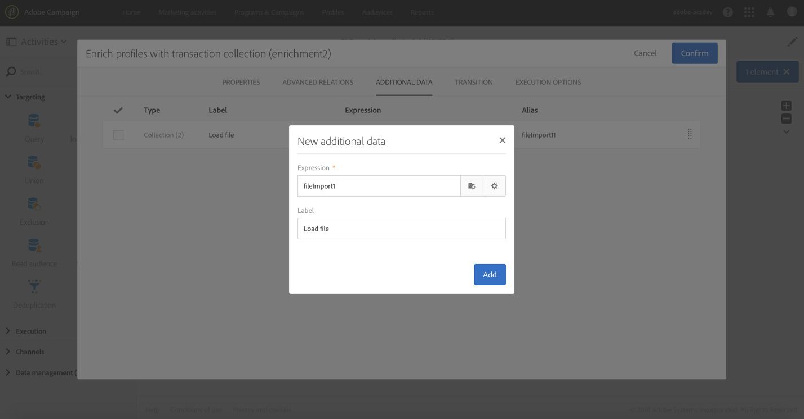

# Förbättra profildata med data i en fil {#enriching-profile-data-with-data-contained-in-a-file}

I det här exemplet visas hur du förbättrar profildata med inköpsdata som finns i en fil.I det här exemplet anser vi att inköpsdata lagras i ett tredjepartssystem. Varje profil kan innehålla flera köp i filen. Arbetsflödets sista mål är att skicka ett e-postmeddelande till målprofilerna som har köpt minst två objekt för att tacka dem för deras lojalitet.

Arbetsflödet är konfigurerat på följande sätt:


* En [Query](../../automating/using/query.md) -aktivitet som anger vilka profiler som ska ta emot meddelandet som mål.
* En [Läs in filaktivitet](../../automating/using/load-file.md) som läser in inköpsdata. Exempel:

   ```
   tcode;tdate;customer;product;tamount
   aze123;21/05/2017;dannymars@example.com;TV;799
   aze124;28/05/2017;dannymars@example.com;Headphones;8
   aze125;31/07/2017;john.smith@example.com;Headphones;8
   aze126;14/12/2017;john.smith@example.com;Plastic Cover;4
   aze127;02/01/2018;dannymars@example.com;Case Cover;79
   aze128;04/03/2017;clara.smith@example.com;Phone;149
   ```

   Med den här exempelfilen använder vi e-postadressen för att stämma av data med databasprofilerna. Du kan även aktivera unika ID:n enligt beskrivningen i [det här dokumentet](../../developing/using/configuring-the-resource-s-data-structure.md#generating-a-unique-id-for-profiles-and-custom-resources).

* En [anrikningsaktivitet](../../automating/using/enrichment.md) som skapar en länk mellan transaktionsdata som läses in från filen och de profiler som valts i **[!UICONTROL Query]**. Länken definieras på aktivitetens **[!UICONTROL Advanced relations]** flik. Länken baseras på övergången från **[!UICONTROL Load file]** aktiviteten. Det använder e-postfältet för profilresursen och kundkolumnen för den importerade filen som avstämningskriterier.

   

   När länken har skapats läggs två uppsättningar **[!UICONTROL Additional data]** till:

   * En samling med två rader som motsvarar de två sista transaktionerna i varje profil. För den här samlingen läggs produktnamn, transaktionsdatum och pris på produkten till som ytterligare data. En fallande sortering används på data. Så här skapar du samlingen på **[!UICONTROL Additional data]** fliken:

      Markera länken som tidigare definierats på aktivitetens **[!UICONTROL Advanced relations]** flik.

      

      Kontrollera **[!UICONTROL Collection]** och ange antalet rader som ska hämtas (2 i det här exemplet). På den här skärmen kan du anpassa samlingen **[!UICONTROL Alias]** och **[!UICONTROL Label]** samlingens utseende. Dessa värden visas i följande aktiviteter i arbetsflödet när de refererar till den här samlingen.

      

      För **[!UICONTROL Data]** att behålla samlingen väljer du de kolumner som ska användas i den slutliga leveransen.

      

      Använd en fallande sortering på transaktionsdatumet för att se till att hämta de senaste transaktionerna.

      

   * En sammanställning som räknar det totala antalet transaktioner för varje profil. Sammanställningen används senare för att filtrera profiler som har minst två transaktioner registrerade. Så här skapar du sammanställningen på **[!UICONTROL Additional data]** fliken:

      Markera länken som tidigare definierats på aktivitetens **[!UICONTROL Advanced relations]** flik.

      

      Välj **[!UICONTROL Aggregate]**.

      

      Definiera **[!UICONTROL Data]** sammanställningen **Antal alla** som ska behållas. Om du behöver kan du ange ett anpassat alias för att hitta det snabbare i följande aktiviteter.

      

* En [segmenteringsaktivitet](../../automating/using/segmentation.md) med bara ett segment, som hämtar profiler för det ursprungliga målet som har minst två transaktioner registrerade. Profiler med endast en transaktion exkluderas. För att göra det görs frågan om segmenteringen på den mängd som definierats tidigare.

   

* En [e-postleveransaktivitet](../../automating/using/email-delivery.md) som använder de ytterligare data som definierats i **[!UICONTROL Enrichment]** för att dynamiskt hämta de två senaste inköpen som gjorts av profilen. Ytterligare data finns i noden **Ytterligare data (TargetData)** när du lägger till ett personaliseringsfält.

   

**Relaterat ämne:**

* [Förbättra kundprofiler med externa data](https://helpx.adobe.com/campaign/kb/simplify-campaign-management.html#Managedatatofuelengagingexperiences)
