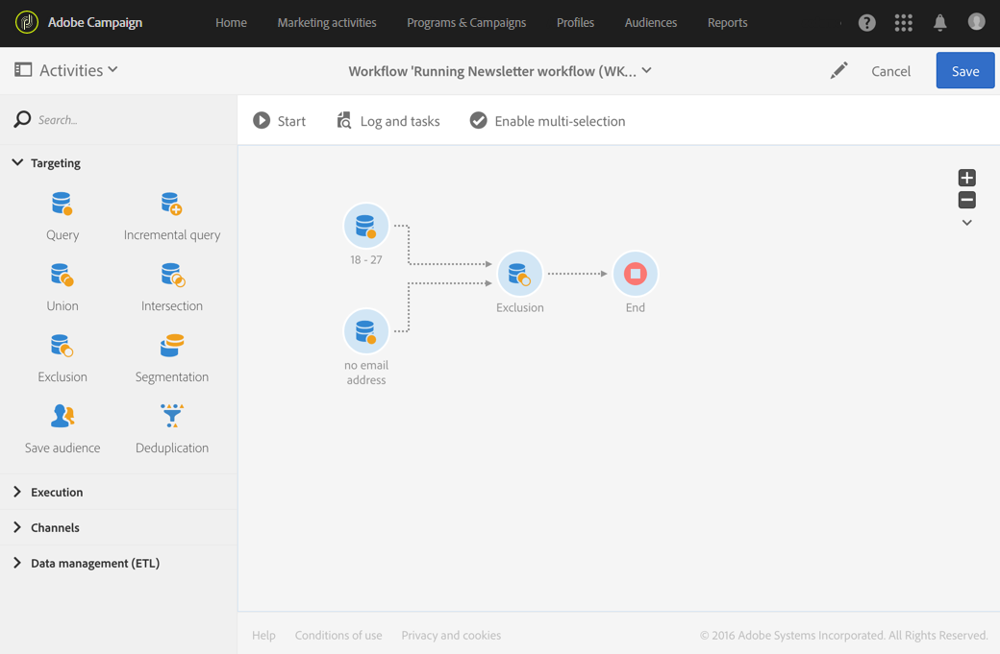

# Uteslutning{#exclusion}

## Beskrivning {#description}

Med aktiviteten **[!UICONTROL Exclusion]** kan du utesluta element från en population enligt vissa kriterier.

## Kontext för användning {#context-of-use}

Aktiviteten **[!UICONTROL Exclusion]** används främst för att utföra ytterligare filtrering på inkommande övergångspopulationer.

En primär uppsättning definieras bland inkommande övergångar. Medlemmar i andra inkommande övergångar utesluts från den primära uppsättningen. Utgående övergång för uteslutningsaktiviteten innehåller bara de medlemmar i den primära uppsättningen som inte påträffades i andra inkommande övergångar.

## Konfiguration {#configuration}

1. Dra och släpp en **[!UICONTROL Exclusion]**-aktivitet i arbetsflödet.
1. Markera aktiviteten och öppna den sedan med knappen  bland de snabbåtgärder som visas.
1. Välj **[!UICONTROL Primary set]** bland de inkommande övergångarna. Detta är den uppsättning från vilken element utesluts. De andra uppsättningarna matchar element innan de utesluts från den primära uppsättningen.

   >[!NOTE]
   >
   >De inkommande övergångarna måste innehålla samma typ av population. Om den primära uppsättningen till exempel innehåller testprofiler måste de andra övergångarna även innehålla testprofiler.

1. Hantera vid behov aktivitetens [övergångar](../../automating/using/activity-properties.md) för åtkomst till de avancerade alternativen för den utgående populationen.
1. Bekräfta aktivitetens konfiguration och spara arbetsflödet.

## Exempel {#example}

I följande exempel visas två frågeaktiviteter som konfigurerats för att filtrera profiler från Adobe Campaign-databasen som är mellan 18 och 27 år gamla och som har en ogiltig e-postadress. Profilerna med ogiltiga e-postadresser tas sedan inte med i den första uppsättningen. På så sätt kan du till exempel skicka ett e-postmeddelande.

