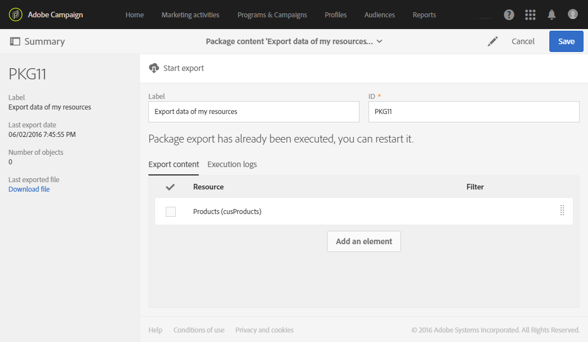

# Exportera/importera anpassade resurser {#exporting-importing-custom-resources}

I den här självstudiekursen beskrivs hur du exporterar och importerar ett paket med anpassade resurser från en utvecklingsmiljö till en produktionsmiljö.

Det här exemplet riktar sig till funktionsadministratörer som är kopplade till Adobe Campaign.

Förutsättningarna är:

* **En eller flera anpassade resurser** som är tillgängliga och publicerade.

   Dessutom måste du ha definierat en unik nyckel för de här resurserna eftersom de automatiska primärnycklarna inte exporteras i paketen. Resursen kan därför ha en primärnyckel och en extra unik nyckel för att garantera att posterna är unika.
* **Nödvändiga rättigheter** för att skapa och exportera ett paket.

Ytterligare resurser:

* [Hantera paket](../../automating/using/managing-packages.md)
* [Distribuera paket: Verksamhetsprincip](../../developing/using/data-model-concepts.md)
* [Lägga till eller utöka en resurs](../../developing/using/key-steps-to-add-a-resource.md)

## Exportera strukturen {#exporting-the-structure}

I det här avsnittet ska vi utföra en första paketexport som beskriver den fysiska strukturen för anpassade resursdata.

Det här exemplet har två anpassade resurser: **Produkter** och **beställningar**.

1. Gå till menyn **[!UICONTROL Administration]** / **[!UICONTROL Deployment]** / **[!UICONTROL Package exports]** .

   Vi ska skapa ett nytt paket för att exportera det **[!UICONTROL Custom resource (cusResource)]** filtrerade paketet med de två anpassade resurserna,&quot;Produkter&quot; och&quot;Beställningar&quot;.

1. Klicka på **[!UICONTROL Package exports]** sidan **[!UICONTROL Create]** för att skapa ett nytt paket.
1. Fyll i etiketten och klicka sedan **[!UICONTROL Create element]**.

   

1. Sök efter och välj **[!UICONTROL Custom resource (cusResource)]**.

   

1. Konfigurera informationen för **[!UICONTROL Custom resource]** genom att välja de två resurserna, **Produkter** och **Beställningar**, i filtreringsvillkoren.

   Glöm inte att ändra den logiska operatorn. Värdet måste anges till **OR** så att produktresursens struktur och orderresursen integreras i paketet.

   

1. Bekräfta och spara paketdefinitionen.

Nu kan du klicka **[!UICONTROL Start export]**.

Paketet som skapas finns i mappen Downloads. Namnet på zip-filen genereras slumpmässigt. Du kan byta namn på den.

## Exportera data {#exporting-the-data}

Den andra exporten gör att vi kan exportera data från anpassade resurser för **Produkter** och **Beställningar** .

Baserat på samma typ av export som strukturexporten kommer du att skapa ett andra paket som innehåller data.

1. Klicka på **[!UICONTROL Package exports]** sidan **[!UICONTROL Create]** för att skapa ett nytt paket.
1. Fyll i etiketten och klicka **[!UICONTROL Export data of my resources]** sedan **[!UICONTROL Create element]** på **[!UICONTROL Export content]** fliken.
1. Sök efter och välj **produktresursen** .

   

1. Konfigurera ett avancerat **filtreringsvillkor** med **@Label ÄR INTE NULL**.

   

1. Kontrollera antalet.

   

1. Upprepa samma åtgärd för den anpassade **orderresursen** .

   

1. Bekräfta och spara paketdefinitionen.

Nu kan du klicka **[!UICONTROL Start export]**.

Paketet som skapas finns i mappen Downloads. Namnet på zip-filen genereras slumpmässigt. Du kan byta namn på den.

## Importera strukturen {#importing-the-structure}

### Importera paketet {#importing-the-structure-package}

1. Anslut till den **målinstans** som du vill importera de nyligen skapade paketen till.
1. Gå till menyn **[!UICONTROL Administration]** / **[!UICONTROL Deployment]** / **[!UICONTROL Package imports]** för att skapa ett nytt paket som du vill importera filen från den första exporten.
1. Dra och släpp **strukturfilen** i den zon som är avsedd för detta. Formaten är ZIP eller XML.

   

1. Ändra etiketten, till exempel **Importera struktur**, och klicka sedan på **[!UICONTROL Save]**.
1. Klicka på **[!UICONTROL Start import]**.

   

### Publicera {#publish-structure}

1. Gå till menyn **[!UICONTROL Administration]** / **[!UICONTROL Development]** / **[!UICONTROL Publication]** .
1. Klicka **[!UICONTROL Prepare publication]** sedan **[!UICONTROL Publish]** för att uppdatera instansen med data från de nya anpassade resurserna.
1. De menyalternativ som motsvarar det installerade paketet kommer att infogas på **[!UICONTROL Client data]** menyn.

   

## Importera data {#importing-the-data}

I det här avsnittet ska vi **importera de data** som är länkade till paketet som installerades på instansen i föregående steg.

På samma sätt som i föregående steg delas den upp i två delar: importera paketet och publicera.

### Importera paketet {#importing-the-data-package}

1. Gå till menyn **[!UICONTROL Administration]** / **[!UICONTROL Deployment]** / **[!UICONTROL Package imports]** för att skapa ett nytt paket för att importera filen som innehåller data.
1. Dra och släpp datafilen i den zon som har angetts för detta. Formaten är ZIP eller XML.
1. Ändra etiketten, till exempel&quot;Importera data&quot;, och klicka sedan på **[!UICONTROL Save]**.
1. Klicka på **[!UICONTROL Start import]**.

   

### Publicera {#publish-data}

1. Gå till menyn **[!UICONTROL Administration]** / **[!UICONTROL Development]** / **[!UICONTROL Publication]** .
1. Klicka **[!UICONTROL Prepare publication]** sedan **[!UICONTROL Publish]** för att uppdatera instansen med data från anpassade resurser.
