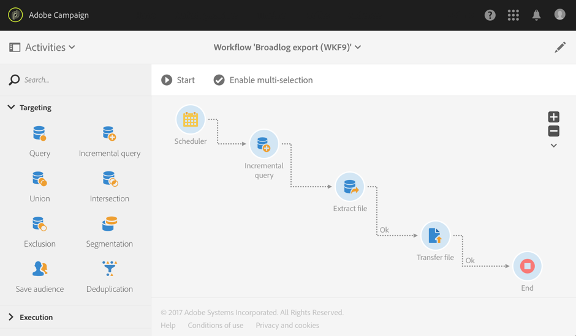

# Exportera loggar{#exporting-logs}

Loggdata kan exporteras via ett enkelt arbetsflöde, oavsett om de är relaterade till leveranser eller prenumerationer. Det gör att ni kan analysera resultatet av era kampanjer i ert eget rapporterings- eller BI-verktyg.

>[!CAUTION]
>
>Endast funktionell [administratörer](../../administration/using/users-management.md#functional-administrators), med **[!UICONTROL Administration]** roll och åtkomst till **Alla** kan komma åt loggar, meddelandeloggar, spårningsloggar, undantags- och prenumerationsloggar. En icke-admin-användare kan ha loggarna som mål, men med början i en länkad tabell (profiler, leverans).

Genom att använda en **[!UICONTROL Incremental query]** som bara hämtar nya loggar varje gång arbetsflödet körs och en enkel **[!UICONTROL Extract file]** för att definiera utdatakolumner kan du hämta en fil med det format och alla data du behöver. Använd sedan en **[!UICONTROL Transfer file]** aktivitet för att hämta den slutliga filen. Varje arbetsflödeskörning planeras av en **[!UICONTROL Scheduler]**.

Exportloggsåtgärden kan utföras av standardanvändare. Privata resurser som: programloggar, spårningsloggar, undantagsloggar prenumerationsloggar och loggar över prenumerationshistorik **Profiler** kan bara hanteras av funktionsadministratören.

1. Skapa ett nytt arbetsflöde enligt informationen i [det här avsnittet](../../automating/using/building-a-workflow.md#creating-a-workflow).
1. Lägg till en **[!UICONTROL Scheduler]** och anpassa den efter dina behov. Nedan visas ett exempel på en månatlig exekvering.

   

1. Lägg till en **[!UICONTROL Incremental query]** -aktiviteten och konfigurera den så att den väljer de loggar du behöver. Om du till exempel vill välja alla nya eller uppdaterade utsändningsloggar (profilleveransloggar):

   * I **[!UICONTROL Properties]** ändra målresursen till **Leveransloggar** (broadLogRcp).

      

   * I **[!UICONTROL Target]** anger du ett villkor för att hämta alla leveransloggar som motsvarar leveranser som skickats 2016 eller senare. Mer information finns i [Redigera frågor](../../automating/using/editing-queries.md#creating-queries) -avsnitt.

      

   * I **[!UICONTROL Processed data]** flik, välja **[!UICONTROL Use a date field]** och väljer **lastModified** fält. Vid nästa körning av arbetsflödet hämtas endast loggar som har ändrats eller skapats efter den senaste körningen.

      

      Efter den första körningen av arbetsflödet kan du på den här fliken se det senaste körningsdatumet som ska användas för nästa körning. Den uppdateras automatiskt varje gång arbetsflödet körs. Du kan fortfarande åsidosätta det här värdet genom att ange ett nytt värde manuellt så att det passar dina behov.

1. Lägg till en **[!UICONTROL Extract file]** aktivitet som exporterar data som efterfrågas i en fil:

   * I **[!UICONTROL Extraction]** anger du filens namn.

      Om du väljer **[!UICONTROL Add date and time to the file name]** det här namnet fylls i automatiskt med exportdatumet för att säkerställa att alla extraherade filer är unika. Markera de kolumner som du vill exportera i filen. Du kan välja här data som kommer från relaterade resurser som leverans- eller profilinformation.

      >[!NOTE]
      >
      >Om du vill exportera en unik identifierare för varje logg väljer du **[!UICONTROL Delivery log ID]** -element.

      Om du vill ordna den slutliga filen kan du använda en sortering. Till exempel på loggdatumet, vilket visas i exemplet nedan.

      

   * I **[!UICONTROL File structure]** definierar du formatet för utdatafilen efter dina behov.

      Markera alternativet **[!UICONTROL Export labels instead of internal values of enumerations]** om du vill exportera uppräkningsvärden.  Med det här alternativet kan motta kortare etiketter som är enkla att förstå i stället för ID:n.

1. Lägg till en **[!UICONTROL Transfer file]** -aktiviteten och konfigurera den så att den överför den nyligen skapade filen från Adobe Campaign-servern till en annan plats där du kan komma åt den, till exempel en SFTP-server.

   * I **[!UICONTROL General]** flik, välja **[!UICONTROL File upload]** eftersom syftet är att skicka filen från Adobe Campaign till en annan server.
   * I **[!UICONTROL Protocol]** anger du överföringsparametrarna och väljer [externt konto](../../administration/using/external-accounts.md#creating-an-external-account) att använda.

1. Lägg till en **[!UICONTROL End]** aktiviteten för att säkerställa att den avslutas på rätt sätt och att arbetsflödet sparas.

   

Du kan nu köra arbetsflödet och hämta utdatafilen på den externa servern.

**Relaterat ämne:**

[Arbetsflöden](../../automating/using/get-started-workflows.md)
