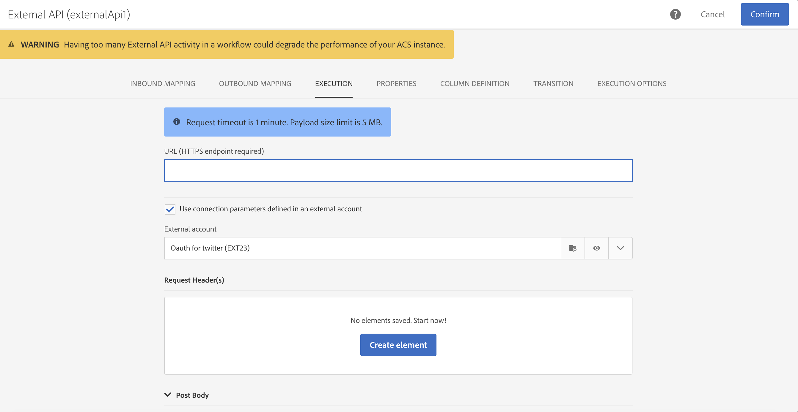
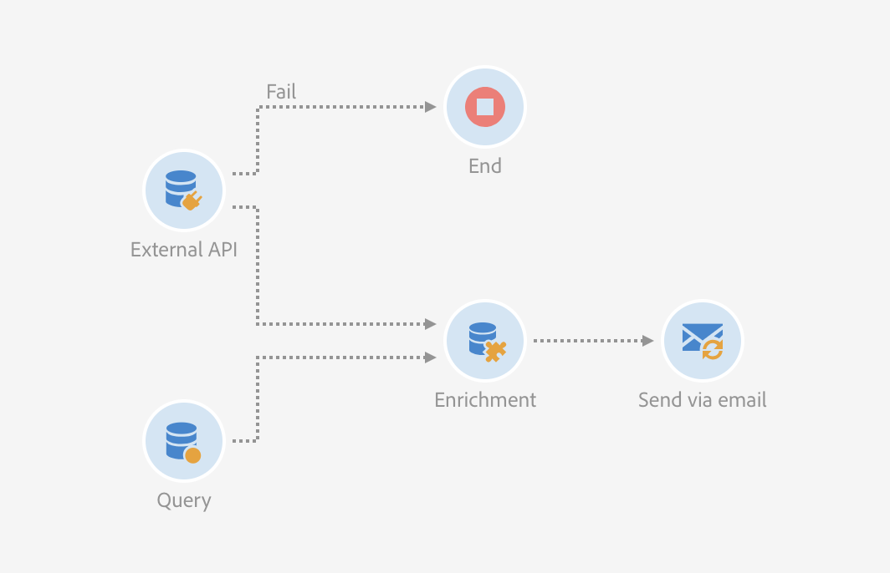

# Externt API {#external-api}

## Beskrivning {#description}

Aktiviteten **[!UICONTROL External API]** hämtar data till arbetsflödet från ett **externt system** via ett **HTTP API**-anrop.

De externa systemslutpunkterna kan vara offentliga API-slutpunkter, kundhanteringssystem eller serverlösa programinstanser (t.ex. [Adobe I/O Runtime](https://www.adobe.io/apis/experienceplatform/runtime.html)) för att nämna några kategorier.

>[!NOTE]
>
>Av säkerhetsskäl stöds inte JSSP:er i Campaign Standard. Om du behöver köra kod kan du anropa en Adobe I/O Runtime-instans via aktiviteten External API.

De viktigaste egenskaperna för denna aktivitet är:

* Möjlighet att skicka data i ett JSON-format till en REST API-slutpunkt från tredje part
* Möjlighet att få ett JSON-svar tillbaka, mappa det till utdatatabeller och skicka det vidare till andra arbetsflödesaktiviteter.
* Felhantering med en utgående specifik övergång

### Meddelanden om bakåtkompatibilitet {#from-beta-to-ga}

I Campaign Standard 20.4 har http-svarets datastorleksgräns och tidsgränsskydd sänkts för att passa in i bästa praxis - se [Begränsningar och skyddsutkast](#guardrails). Dessa skyddsändringar träder ej i kraft för befintliga externa API-aktiviteter. Vi rekommenderar därför att du ersätter befintliga externa API-aktiviteter med nya versioner i alla arbetsflöden.

När du ersätter Extern API-aktiviteter lägger du till den nya Extern API-aktiviteten i arbetsflödet, kopierar manuellt över konfigurationsinformationen och tar sedan bort den gamla aktiviteten.

>[!NOTE]
>
>Du kan inte kopiera över aktivitetsspecifika rubrikvärden eftersom de är maskerade i aktiviteten.

### Begränsningar och skyddsräcken {#guardrails}

Följande skydd gäller för den här aktiviteten:

* 5 MB gräns för datastorlek på http-svar (Obs! Detta är en ändring från gränsen på 50 MB i föregående version)
* Tidsgränsen för begäran är 1 minut (Obs! Detta är en ändring från tidsgränsen på 10 minuter i föregående version)
* HTTP-omdirigeringar tillåts inte
* URL:er som inte är HTTPS nekas
* Begäranderubriken &quot;Acceptera: application/json&quot; och svarsrubriken &quot;Innehållstyp: application/json&quot; är tillåtna

Särskilda skydd har införts:

* **Maximalt JSON-djup**: Begränsa det maximala djupet för en anpassad kapslad JSON som kan bearbetas till 10 nivåer.
* **Maximal längd på JSON-nyckel**: Begränsa maxlängden för den interna nyckel som genereras till 255. Den här nyckeln är kopplad till kolumn-ID:t.
* **Maximalt antal tillåtna JSON-dubblettnycklar**: Begränsa det maximala antalet dubbla JSON-egenskapsnamn, som används som kolumn-ID, till 150.

>[!CAUTION]
>
>Den externa API-aktiviteten är avsedd att hämta kampanjomfattande data (senaste erbjudanden och senaste poängen o.s.v.) och inte att hämta specifik information för varje profil eftersom det kan leda till att stora mängder data överförs. Om användningsfallet kräver detta ska aktiviteten [Överför fil](../../automating/using/transfer-file.md) användas.

## Konfiguration {#configuration}

Dra och släpp en **[!UICONTROL External API]**-aktivitet i arbetsflödet och öppna aktiviteten för att starta konfigurationen.

### Inkommande mappning

Inkommande mappning är en tillfällig tabell som genereras av en tidigare inkommande aktivitet som visas och skickas som JSON i användargränssnittet.
Utifrån den här tillfälliga tabellen kan användaren ändra inkommande data.

I listrutan **Inkommande resurs** kan du välja den frågeaktivitet som ska skapa det tillfälliga registret.

Kryssrutan **Lägg till antalparameter** lägger du till ett räkningsvärde för varje rad som kommer från den tillfälliga tabellen. Observera att den här kryssrutan endast är tillgänglig om den inkommande aktiviteten genererar en tillfällig tabell.

I avsnittet **Inkommande kolumner** kan användaren lägga till fält från den inkommande övergångstabellen. De markerade kolumnerna är nycklarna i dataobjektet. Dataobjektet i JSON blir en matrislista som innehåller data för markerade kolumner från varje rad i tabellen för inkommande övergångar.

I textrutan **Anpassa parametrar** kan du lägga till en giltig JSON med ytterligare data som behövs för det externa API:t. Dessa ytterligare data läggs till i params-objektet i den genererade JSON:n.

### Utgående mappning

På den här fliken kan du definiera exempelstrukturen för **JSON** som returneras av API-anropet.

JSON-tolkaren är utformad för att rymma JSON-standardstrukturmönstertyper, med några undantag. Ett exempel på ett standardmönster är:`{“data”:[{“key”:“value”}, {“key”:“value”},...]}`

JSON-exempeldefinitionen måste ha **följande egenskaper**:

* **Matriselement** måste innehålla egenskaper på första nivån (djupare nivåer stöds inte).
   **Egenskapsnamn** blir till kolumnnamn för utdatabladet i den tillfälliga utdatatabellen.
* **JSON-element** som ska hämtas måste vara på 10 eller färre kapslingsnivåer inom JSON-svaret.
* **Kolumnnamnsdefinitionen** baseras på det första elementet i matrisen &quot;data&quot;.
Kolumndefinition (lägg till/ta bort) och egenskapens typvärde kan redigeras på fliken **Kolumndefinition**.

Beteende **Förenkla kryssrutan**:

Förenkla kryssrutan (standard: omarkerad) tillhandahålls för att ange om JSON ska förenklas till en nyckel/värdekarta eller inte.

* När **kryssrutan är inaktiverad** (avmarkerad) tolkas JSON-exempelfilen så att den söker efter ett matrisobjekt. Användaren måste ange en trimmad version av JSON-formatet för API-svarsexemplet så att Adobe Campaign kan avgöra exakt vilken matris som användaren är intresserad av att använda. Vid redigering av arbetsflödet bestäms och registreras sökvägen till det kapslade matrisobjektet så att den kan användas vid körning för att komma åt det matrisobjektet från JSON-svarstexten som tas emot från API-anropet.

* När **kryssrutan är aktiverad** (markerad) förenklas JSON-exempelfilen och alla egenskaper som anges i det angivna exemplet JSON används för att skapa kolumner i den tillfälliga utdatatabellen och visas på fliken Kolumndefinitioner. Observera att om det finns ett matrisobjekt i JSON-exempelfilen, kommer även alla element i dessa matrisobjekt att förenklas.

Om **tolkningen valideras** visas ett meddelande som uppmanar dig att anpassa datamappningen på fliken Kolumndefinition. I andra fall visas ett felmeddelande.

### Körning

Med den här fliken kan du definiera anslutningens slutpunkt. I fältet **[!UICONTROL URL]** kan du definiera den **HTTPS-slutpunkt** som Campaign Standarden ska kommunicera med.

Om slutpunkten så kräver finns det två typer av autentiseringsmetoder:

* Grundläggande autentisering: Ange användarnamn/lösenord i avsnittet **[!UICONTROL Request Header(s)]**.

* OAuth-autentisering: Genom att klicka på **[!UICONTROL Use connection parameters defined in an external account]** i ett externt konto kan du välja ett externt konto där OAuth-autentiseringen definieras. Se avsnittet [Externa konton](../../administration/using/external-accounts.md) för mer information.

### Egenskaper

På den här fliken kan du styra **allmänna egenskaper** för den externa API-aktiviteten, som t.ex. etiketten som visas i gränssnittet. Det interna ID:t kan inte anpassas.

### Kolumndefinition

>[!NOTE]
>
>Den här fliken visas när **svarsdataformatet** har slutförts och validerats på fliken Utgående mappning.

På fliken **Kolumndefinition** kan du ange datastrukturen exakt för varje kolumn för att importera data som inte innehåller några fel och få dem att matcha de typer som redan finns i Adobe Campaign-databasen för framtida åtgärder.

Du kan till exempel ändra etiketten för en kolumn och välja dess typ (sträng, heltal, datum, etc.) eller specificera felbearbetning.

Mer information finns i avsnittet [Läs in fil](../../automating/using/load-file.md).

### Övergång

På den här fliken kan du aktivera den **utgående övergången** och dess etikett. Den här specifika övergången är användbar vid **timeout** eller om nyttolasten överskrider **datastorleksgränsen**.

### Körningsalternativ

Den här fliken är tillgänglig i de flesta arbetsflödesaktiviteter. Mer information finns i avsnittet [Aktivitetsegenskaper](../../automating/using/activity-properties.md).

## Testning

Om du vill testa den externa API-funktionen med en enkel testslutpunkt kan du använda Postman Echo: https://docs.postman-echo.com.

## Felsökning

Två typer av loggmeddelanden har lagts till i den nya arbetsflödesaktiviteten: information och fel. De kan hjälpa dig att felsöka potentiella problem.

### Information

Dessa loggmeddelanden används för att logga information om användbara kontrollpunkter när arbetsflödesaktiviteten körs.
<table> 
 <thead> 
  <tr> 
   <th> Meddelandeformat  </th> 
   <th> Exempel  </th> 
  </tr> 
 </thead> 
 <tbody> 
  <tr> 
   <td> Invoking API URL '%s'.</td> 
   <td> 
Anropar API-URL:en "https://example.com/api/v1/web-coupon?count=2".
</td> 
  </tr> 
  <tr> 
   <td> Retrying API URL '%s' due to %s in %d ms, attempt %d.</td> 
   <td> 
Försöker igen med API-URL 'https://example.com/api/v1/web-coupon?count=0' på grund av HTTP - 401 på 2364 ms, försök 2.
</td>
  </tr> 
  <tr> 
   <td> Transferring content from '%s' (%s / %s).</td> 
   <td> 
Överför innehåll från "https://example.com/api/v1/web-coupon?count=2" (1234/1234).
</td> 
  </tr>
  <tr> 
   <td> Using cached access token for provider ID '%s'.</td> 
   <td> 
Använder cachelagrad åtkomsttoken för leverantörs-ID 'EXT25'. Obs! EXT25 är ID-numret (eller namnet) på det externa kontot. 
</td> 
  </tr>
  <tr> 
   <td> Fetched access token from server for provider ID '%s'.</td> 
   <td> 
Åtkomsttoken för leverantörs-ID 'EXT25’ har hämtats från servern. Obs! EXT25 är ID-numret (eller namnet) på det externa kontot.
</td> 
  </tr>
  <tr> 
   <td> Refreshing OAuth access token due to error (HTTP: '%d').</td> 
   <td> 
Uppdatera OAuth-åtkomsttoken på grund av fel (HTTP: '401').
</td> 
  </tr>
  <tr> 
   <td> Error refreshing OAuth access token (error: '%d'). </td> 
   <td> 
Fel vid uppdatering av OAuth-åtkomsttoken (fel: '404').
</td> 
  </tr>
  <tr> 
   <td> Failed to fetch the OAuth access token using the specified external account on attempt %d, retrying in %d ms.</td> 
   <td> 
Det gick inte att hämta OAuth-åtkomsttoken med det angivna externa kontot på försök 1. Ett nytt försök görs om 1387 ms.
</td> 
  </tr>
 </tbody> 
</table>

### Fel

Dessa loggmeddelanden används för att logga information om oväntade feltillstånd som kan göra att arbetsflödesaktiviteten misslyckas.

<table> 
 <thead> 
  <tr> 
   <th> Kod – Meddelandeformat  </th> 
   <th> Exempel  </th> 
  </tr> 
 </thead> 
 <tbody> 
  <tr> 
   <td> WKF-560250 - API request body exceeded limit (limit: '%d').</td> 
   <td> 
API-begärans brödtext överskreds (gräns: "5242880").
</td> 
  </tr> 
  <tr> 
   <td> WKF-560239 -  API response exceeded limit (limit: '%d').</td> 
   <td> 
API-svaret överskrider gränsen (gräns: "5242880").
</td> 
  </tr> 
  <tr> 
   <td> WKF-560245 - API URL could not be parsed (error: '%d').</td> 
   <td> 
API-URL kunde inte tolkas (fel: "-2010").

   
 Obs! Det här felet loggas när API-URL:en inte stöder verifieringsregler.
</td>
  </tr> 
  <tr>
   <td> WKF-560244 - API URL host must not be 'localhost', or IP address literal (URL host: '%s').</td> 
   <td> 
API-URL-värden får inte vara localhost eller bokstavlig IP-adress (URL-värd: "localhost").

    
API-URL-värden får inte vara localhost eller bokstavlig IP-adress (URL-värd: "192.168.0.5").

    
API-URL-värden får inte vara localhost eller bokstavlig IP-adress (URL-värd: [2001]).
</td>
  </tr> 
  <tr> 
   <td> WKF-560238 - API URL must be a secure URL (https) (requested URL: '%s').</td> 
   <td> 
API-URL:en måste vara en säker URL (https) (begärd URL: "https://example.com/api/v1/web-coupon?count=2").
</td> 
  </tr> 
  <tr> 
   <td> WKF-560249 – Det gick inte att skapa JSON för begärandetext. Error when adding '%s'.</td> 
   <td> 
Det gick inte att skapa JSON för begärandetext. Ett fel uppstod när "params" skulle läggas till.

    
Det gick inte att skapa JSON för begärandetext. Ett fel uppstod när "data" skulle läggas till.
</td>
  </tr> 
  <tr> 
   <td> WKF-560246 - HTTP header key is bad (header key: '%s').</td> 
   <td> 
HTTP header key is bad (header key: '%s').

   
 Obs! Det här felet loggas när den anpassade rubriknyckeln inte kan valideras enligt <a href="https://tools.ietf.org/html/rfc7230#section-3.2.html">RFC</a>
</td> 
  </tr>
 <tr> 
   <td> WKF-560248 - HTTP header key is not allowed (header key: '%s').</td> 
   <td> 
HTTP-rubriknyckeln tillåts inte (rubriknyckeln: "Godkänn").
</td> 
  </tr> 
  <tr> 
   <td> WKF-560247 - Ett HTTP-rubrikvärde är felaktigt (rubrikvärde: '%s').</td> 
   <td> 
HTTP-rubrikvärdet är felaktigt (rubrikvärde: '%s'). 

    
Obs! Det här felet loggas när det anpassade rubrikvärdet inte kan valideras enligt <a href="https://tools.ietf.org/html/rfc7230#section-3.2.html">RFC</a>
</td> 
  </tr> 
  <tr> 
   <td> WKF-560240 - JSON payload has bad property '%s'.</td> 
   <td> 
JSON-nyttolasten har den felaktiga egenskapen "blah".
</td>
  </tr> 
  <tr>
   <td> WKF-560241 - Malformed JSON or unacceptable format.</td> 
   <td> 
Felformaterad JSON eller ogiltigt format.

   
Obs! Det här meddelandet gäller endast för tolkning av svarstexten från det externa API:t, och loggas när du försöker validera om svarstexten uppfyller det JSON-format som krävs för den här aktiviteten.
</td>
  </tr>
  <tr> 
   <td> WKF-560246 - Activity failed (reason: '%s').</td> 
   <td> 
När aktiviteten misslyckas på grund av HTTP 401-felsvar – Aktiviteten misslyckades (orsak: HTTP – 401)

        
När aktiviteten misslyckas på grund av ett misslyckat internt anrop – Aktiviteten misslyckades (orsak: "iRc – -Nn").

        
När aktiviteten misslyckas på grund av en ogiltig rubrik av innehållstyp. – Aktiviteten misslyckades (orsak: "Innehållstyp – application/html").
</td> 
  </tr>
  <tr> 
   <td> WKF-560278 - "Error initializing OAuth helper (error: '%d')" .</td> 
   <td> 
Detta fel indikerar att aktiviteten inte kunde initiera den interna hjälpfunktionen för OAuth2.0 på grund av ett fel i att använda attributen som har konfigurerats på det externa kontot för att initiera hjälpfunktionen.
</td>
  </tr>
  <tr> 
   <td> WKF-560279 - "HTTP header key is not allowed (header key: '%s')."</td> 
   <td> 
Det här varningsmeddelandet (inte felmeddelandet) anger att det externa OAuth 2.0-kontot har konfigurerats för att lägga till en referens som HTTP-rubrik men rubriknyckeln som används tillåts inte eftersom det är en reserverad rubriknyckel.
</td>
  </tr>
  <tr> 
   <td> WKF-560280 - External account of '%s' ID cannot be found.</td> 
   <td> 
Det går inte att hitta det externa kontot med ID-numret 'EXT25'.  Obs! Det här felet indikerar att aktiviteten har konfigurerats för att använda ett externt konto som inte längre kan hittas. Detta inträffar troligast när kontot har tagits bort från databasen och inträffar därför i vanliga fall inte under normala driftförhållanden.
</td>
  </tr>
  <tr> 
   <td> WKF-560281 - External account of '%s' ID is disabled.</td> 
   <td> 
Externt konto med ID-numret 'EXT25' är inaktiverat. Obs! Det här felet indikerar att aktiviteten har konfigurerats för att använda ett externt konto men att kontot har inaktiverats (eller markerats som inaktivt).
</td>
  </tr>
  <tr> 
   <td> WKF-560282 - Protocol not supported.</td> 
   <td> 
Det här felet anger att det externa konto som är associerat med aktiviteten inte är ett externt OAuth2.0-konto. Därför är det osannolikt att det här felet inträffar om det inte finns några skador eller manuella ändringar i aktivitetskonfigurationen.
</td>
  </tr>
  <tr> 
   <td> WKF-560283 - Failed to fetch the OAuth access token.</td> 
   <td> 
Den vanligaste orsaken till det här felet är en felkonfigurering av det externa kontot (såsom att använda det externa kontot utan att testa att anslutningen fungerar). Det kan vara möjligt att webbadressen/autentiseringsuppgifterna för det externa kontot ändrats.
</td>
  </tr>
  <tr> 
   <td> CRL-290199 - Cannot reach page at: %s.</td> 
   <td> 
Det här felmeddelandet visas på skärmen med det externa kontots användargränssnitt när det konfigureras för OAuth. Detta innebär att webbadressen för den externa auktoriseringsservern antingen är felaktig/ändrad eller att svaret från servern är ”Sidan hittades inte”.
</td>
  </tr>
  <tr> 
   <td> CRL-290200 - Incomplete/Incorrect credentials.</td> 
   <td> 
Det här felmeddelandet visas på skärmen med det externa kontots användargränssnitt när det konfigureras för OAuth. Detta innebär att autentiseringsuppgifterna antingen är felaktiga eller att andra nödvändiga autentiseringsuppgifter saknas för att ansluta till autentiseringsservern.

</td>
  </tr>
 </tbody> 
</table>

<!--
## Example: Managing coupons with External API Activity

This example illustrates how to **add coupon value** retrieving by a REST call to profiles and then sending an email containing these coupon values.

The workflow is presented as follows:

1. Drag and drop an **External API** activity
    1. Parse the JSON sample responsa as {"data":[{"code":"value"}]}.
    1. Add the **Rest endpoint URL** and define authentication setting if needed
    
    1. In the **column definition** tab, add a new column called **code** that will store the code value.
        
    1. Enabled an **outbound transition** to manage request failures.
1. Drag and drop a **Query** activity
    1. Configure the **Target** tab to query all the **@adobe.com** email. For different Query samples, refer to the [Query](../../automating/using/query.md) section.
    1. In the **additional data** tab, add a new column based on **rowId()** function. This additional column allows you to reconciliate coupon code with the profile ID..
        

        >[!NOTE]
        >
        >This reconciliation approach means that the profile query number is equal to the number of coupon values returned by the REST call.
1. Once this two activities are configured, drag and drop an **Enrichment** activity to associate coupon values with profiles.
    1. Select the previous Query activity in the **primarySet** field.
        
    1. Create a new relation in the **Advanced relations** tab, and add the following reconciliation criteria:
    1. **@expr1** coming grom the Query activity in the source expression field.
    1. **@lineNum** as an expression that returns the line number for each coupon value in the destination field.
        
        More information on the enrichment activity are available [here](../../automating/using/enrichment.md)

    1. The transition **Data Structure** will contain:
        
1. Finally drag and drop a **Send via Email** activity.
    You can modify your email template by adding the **code** personnalized field.

-->
