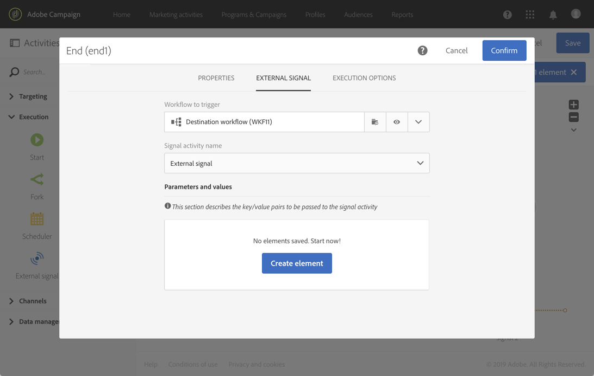

# Extern signal{#external-signal}

## Beskrivning {#description}

Aktiviteten **[!UICONTROL External signal]** utlöser ett arbetsflöde när vissa villkor uppfylls i ett annat arbetsflöde eller från ett REST API-anrop.

## Kontext för användning {#context-of-use}

Aktiviteten **[!UICONTROL External signal]** används för att organisera och samordna olika processer som ingår i samma kundresa till olika arbetsflöden. Det gör att man kan starta ett arbetsflöde från ett annat, vilket ger stöd för mer komplexa kundresor samtidigt som man bättre kan övervaka och reagera vid problem.

Aktiviteten **[!UICONTROL External signal]** är avsedd att placeras som den första aktiviteten i ett arbetsflöde. Den kan utlösas från ett annat arbetsflödes **[!UICONTROL End]**-aktivitet eller från ett REST API-anrop (mer information om detta hittar du i [API-dokumentationen](../../api/using/triggering-a-signal-activity.md)).

När den utlöses kan externa parametrar definieras och vara tillgängliga i variablerna för arbetsflödeshändelser. Processen för hur du anropar ett arbetsflöde med externa parametrar beskrivs i [det här avsnittet](../../automating/using/calling-a-workflow-with-external-parameters.md).

>[!NOTE]
>
>Aktiviteten kan inte utlösas oftare än var 10:e minut.

Observera att en **[!UICONTROL External signal]**-aktivitet kan aktiveras från flera olika händelser. I så fall utlöses **[!UICONTROL External signal]** så snart ett av källarbetsflödena eller API-anropet har körts. Alla källarbetsflöden behöver inte vara slutförda.

**Relaterade ämnen**

* [Användningsfall: Extern signalaktivitet och dataimport](../../automating/using/external-signal-data-import.md).
* [Användningsfall: Anropa ett arbetsflöde för att skapa en målgrupp från en fil med hjälp av externa parametrar](../../automating/using/use-case-calling-workflow.md)

## Konfiguration {#configuration}

När du konfigurerar en extern signal är det viktigt att först konfigurera **[!UICONTROL External signal]**-aktiviteten i destinationsarbetsflödet. När konfigurationen är klar blir arbetsflödets **[!UICONTROL External signal]**-aktivitet tillgänglig för att konfigurera källarbetsflödets **[!UICONTROL End]**-aktivitet.

1. Dra och släpp en **[!UICONTROL External signal]**-aktivitet i destinationsarbetsflödet.
1. Markera aktiviteten och öppna den sedan med knappen  bland de snabbåtgärder som visas.
1. Redigera aktivitetens etikett. Den här etiketten behövs när du konfigurerar det källarbetsflöde som utlöser **[!UICONTROL External signal]**.

   Om du vill anropa arbetsflödet med parametrar använder du området **[!UICONTROL Parameters]** för att deklarera dem. Mer information finns på [den här sidan](../../automating/using/declaring-parameters-external-signal.md).

   

1. Bekräfta aktivitetens konfiguration, lägg till andra aktiviteter och spara arbetsflödet.

   >[!NOTE]
   >
   >Om du vill utlösa destinationsarbetsflödet från ett annat arbetsflöde fortsätter du med följande steg. Om du vill utlösa destinationsarbetsflödet från ett REST API-anrop kan du få mer information i [API-dokumentationen](../../api/using/triggering-a-signal-activity.md).

1. Öppna källarbetsflödet och välj en **[!UICONTROL End]**-aktivitet. Om det inte finns någon tillgänglig **[!UICONTROL End]**-aktivitet lägger du till en efter den sista aktiviteten i en gren av arbetsflödet.

   Vissa aktiviteter har ingen utgående övergång som standard. På fliken **[!UICONTROL Properties]** för dessa aktiviteter kan du lägga till en utgående övergång.

   I en **[!UICONTROL Update data]**-aktivitet går du till exempel till fliken **[!UICONTROL Transitions]** och markerar alternativet **[!UICONTROL Add an outbound transition without the population]**. Med det här alternativet kan du lägga till en övergång som inte innehåller några data och som inte tar upp onödigt utrymme i systemet. Den används bara för att ansluta den extra **[!UICONTROL End]**-aktiviteten som utlöser destinationsarbetsflödet.

   

1. Välj destinationsarbetsflödet samt den **[!UICONTROL External signal]**-aktivitet som ska utlösas i arbetsflödet på fliken **[!UICONTROL External signal]** för **[!UICONTROL End]**-aktiviteten.

   När du anger en **[!UICONTROL End]**-aktivitet som ska utlösa ett annat arbetsflöde uppdateras dess ikon med en extra signatursymbol.

   Om du vill anropa arbetsflödet med parametrar använder du området **[!UICONTROL Parameters and values]**. Mer information finns på [den här sidan](../../automating/using/defining-parameters-calling-workflow.md).

   

1. Spara källarbetsflödet.

När **[!UICONTROL End]**-aktiviteten för källarbetsflödet eller REST API-anropet körs, utlöses destinationsarbetsflödet automatiskt från **[!UICONTROL External signal]**-aktiviteten.

>[!NOTE]
>
>Destinationsarbetsflödet måste startas manuellt innan det kan aktiveras. När programmet startas aktiveras **[!UICONTROL External activity]** och väntar på signalen från källarbetsflödet.
