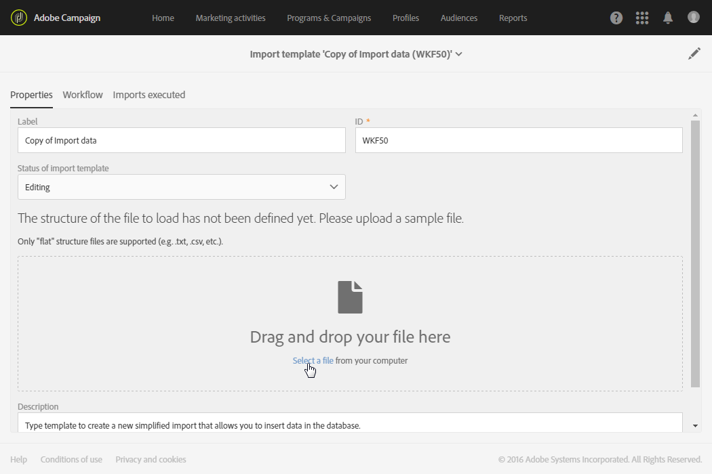

# Importera data med importmallar{#importing-data-with-import-templates}

När du importerar data kan du samla in data för att mata Campaigns databas.

I stället för [arbetsflöden](../../automating/using/get-started-workflows.md) erbjuder Adobe Campaign en förenklad importfunktion som användaren kan använda för att hantera vissa typer av import som definierats av en administratör.

Följande arbetsprincip gäller: En **administratör** definierar och hanterar importmallar (se [Definiera importmallar](../../automating/using/importing-data-with-import-templates.md#setting-up-import-templates)). Dessa importmallar är sedan tillgängliga för användare med förenklade vyer på menyn **[!UICONTROL Profiles & audiences]** > **[!UICONTROL Imports]**.

Dessa användare behöver därför bara välja vilken typ av import de vill utföra och överföra filen med de data som ska importeras. Det arbetsflöde som definieras av administratören körs transparent för användaren, som kan komma åt information om resultatet av importen när den är klar.

>[!NOTE]
>
>Funktionen Importera data kan hanteras av användare med rollerna **[!UICONTROL GENERIC IMPORT (import)]** och **[!UICONTROL WORKFLOW (workflow)]**. Mer information om roller finns i [det här avsnittet](../../administration/using/list-of-roles.md).

Import kan filtreras efter den mall som de kördes från, deras körningsdatum och deras körningsstatus.

1. Klicka på knappen **[!UICONTROL Create]** i importöversikten. Guiden öppnas.
1. Välj vilken typ av import du vill utföra. Importtyperna motsvarar de tillgängliga importmallarna.
1. Hämta vid behov exempelfilen som är kopplad till mallen till datorn för att visa de datatyper som förväntas i filen som ska importeras.
1. Hämta filen som innehåller de data som ska importeras i guiden.
1. Starta importen. Guiden stängs och tar dig tillbaka till listan över importer som har utförts med mallen som används.
1. Uppdatera sidan och välj den import du just har utfört för att visa körningsinformationen.

   

Information om importkörningen är nu tillgänglig. Både filen som importerades och filen som innehåller avvisade data (data som inte importerades) kan hämtas till datorn.

## Konfigurera importmallar {#setting-up-import-templates}

Med importeringsmallar kan administratören fördefiniera ett visst antal tekniska importkonfigurationer.  Mallarna kan sedan göras tillgängliga för standardanvändare så att de kan skicka ut och överföra filer.

En importeringsmall definieras av den funktionella administratören och kan hanteras i menyn **[!UICONTROL Resources]** > **[!UICONTROL Templates]** > **[!UICONTROL Import templates]**.

Det finns tre skrivskyddade standardmallar:

* **[!UICONTROL Update Direct mail quarantines and delivery logs]**: den här mallen kan fungera som grund för ny import för att uppdatera karantäner och leveransloggar för direktmeddelanden. Mallens arbetsflöde innehåller följande aktiviteter:
* **[!UICONTROL Import data]**: den här mallen kan fungera som grund för en ny importering för att infoga data från en fil i databasen.  Den här mallens arbetsflöde innehåller följande aktiviteter:

   * **[!UICONTROL Load file]**: Med den här aktiviteten kan du överföra en fil till Adobe Campaign-servern.
   * **[!UICONTROL Update data]**: Med den här aktiviteten kan du infoga data från filen i databasen.

* **[!UICONTROL Import list]**: den här mallen kan fungera som grund för nya importeringar för att skapa en **Lista** med målgruppstyper i en fil.  Den här mallens arbetsflöde innehåller följande aktiviteter:

   * **[!UICONTROL Load file]**: Med den här aktiviteten kan du överföra en fil till Adobe Campaign-servern.
   * **[!UICONTROL Reconciliation]**: Med den här aktiviteten kan du länka en måldimension till importerade data.  Då kan du skapa en målgrupp av typen **Lista**.  Om måldimensionen för den importerade datan inte är känd är målgruppen **fil** typ.  Se [Målinställningar och resurser](../../automating/using/query.md#targeting-dimensions-and-resources).
   * **[!UICONTROL Save audience]**: Med den här aktiviteten kan du spara data som importerats i form av en **Lista** med måltypsgrupper.  Namnet på den sparade målgruppen motsvarar namnet på filen som importerats av användaren. Ett suffix som anger datum och tid för importen läggs till i filnamnet.  Som exempelvis: &#39;profiles_20150406_151448&#39;.

Standardmallarna är skrivskyddade och visas inte för standardanvändare.  För att skapa en mall som är tillgänglig för användare följer du dessa steg:

1. Duplicera en standardmall.  Den duplicerade mallen innehåller tre flikar:

   * **[!UICONTROL Properties]**: importeringsmallens allmänna parametrar.  I den här fliken kan du aktivera mallen och överföra en exempelfil.
   * **[!UICONTROL Workflow]**: arbetsflöde för import.  I den här fliken kan du definiera arbetsflödesaktiviteter.  Dessa aktiviteter syns inte vid förenklad importering som användarna genomför.
   * **[!UICONTROL Executed imports]**: förteckning över importering som gjorts med denna mall.  Du kan visa status, information och resultat för varje importering som har utförts med den här mallen.  Du har direkt åtkomst till arbetsflödet (som utförs på ett transparent sätt för användaren) i den här listan.

1. Byt namn på mallen i **[!UICONTROL Properties]**-fliken och lägg till en beskrivning.  Användarna kan visa beskrivningen när mallen är tillgänglig.

   

1. Gå till fliken **[!UICONTROL Workflow]**. Härifrån kan du förbättra arbetsflödet som erbjuds som standard genom att lägga till nya aktiviteter efter dina behov.

   Mer information om hur du konfigurerar arbetsflödesaktiviteter finns i användningsexemplet som beskrivs i det här avsnittet: [Exempel: Importera mall för arbetsflöde](../../automating/using/creating-import-workflow-templates.md).  Det här användningsexemplet hjälper dig att skapa ett arbetsflöde som kan återanvändas för att importera profiler från en CRM i Adobe Campaign-databasen.

1. Spara mallen så att arbetsflödets konfiguration korrekt tas i beaktning.
1. Överför en exempelfil från fliken **[!UICONTROL Properties]**.  Den överförda filen kan endast innehålla kolumner som är nödvändiga för framtida importering eller exempeldata.  Med data i exempelfilen kan du testa den förenklade importeringen när arbetsflödet har definierats.

   

   Exempelfilen blir då tillgänglig för användare som använder mallen för att utföra en importering.  De kommer att kunna ladda ned den till sin dator exempelvis för att fylla den med data som ska importeras.  Tänk på detta när du lägger till en exempelfil.

1. Spara mallen.  Exempelfilen tas nu med i beräkningen.  Du kan när som helst ladda ned den till datorn för att kontrollera innehållet eller ändra den genom att markera alternativ **[!UICONTROL Drop a new sample file]**.

   

1. Gå tillbaka till fliken **[!UICONTROL Workflow]** och öppna aktiviteten **[!UICONTROL Load file]** för att kontrollera och justera kolumnkonfigurationen för exempelfilen som överfördes i föregående steg.
1. Testa importeringen genom att starta arbetsflödet.  Exempelfilen som överfördes i steg **5** måste innehålla data.

   Data från exempelfilen importeras sedan på riktigt.  Kontrollera att de data som används är små och fiktiva så att databasen inte äventyras.

1. Gå till arbetsflödets körningslogg som finns i åtgärdsfältet.  Om du råkar ut för ett fel kontrollerar du att aktiviteterna är korrekt konfigurerade.

   

1. På fliken **[!UICONTROL Properties]** ställer du in **[!UICONTROL Import template status]** till **[!UICONTROL Available]** och sparar sedan mallen.  Om du vill sluta använda den här mallen kan du ange **[!UICONTROL Import template status]** till **[!UICONTROL Archived]**.

Du kan ändra mallen för arbetsflödet genom att överföra exempelfilen igen och kontrollera konfigurationen **[!UICONTROL Load file]**.

importeringsmallen är nu tillgänglig för användarna och kan användas för att överföra filer.

**Relaterade ämnen:**

* [Arbetsflöden](../../automating/using/get-started-workflows.md)
* [Exempel: Importera mall för arbetsflöde](../../automating/using/creating-import-workflow-templates.md)
