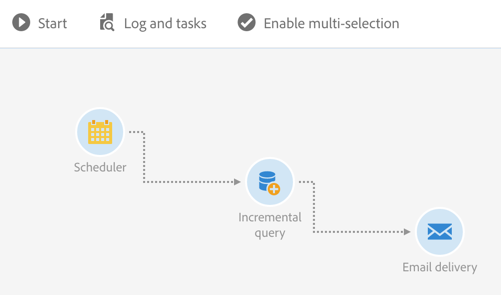

# Inkrementell fråga om prenumeranter på en tjänst {#example--incremental-query-on-subscribers-to-a-service}

I följande exempel visas konfigurationen av en **[!UICONTROL Incremental query]**-aktivitet som filtrerar profilerna i Adobe Campaign-databasen som prenumererar på tjänsten **Köra nyhetsbrev** så att de kan skicka ett välkomstmeddelande med en kampanjkod.

Arbetsflödet består av följande element:

* A [Schemaläggare](../../automating/using/scheduler.md) för att köra arbetsflödet varje måndag klockan 6.

  

* An [Inkrementell fråga](../../automating/using/incremental-query.md) som riktar sig till alla nuvarande prenumeranter under det första utförandet, och sedan endast till de nya prenumeranterna i den veckan under följande körningar.

  

* An [E-postleverans](../../automating/using/email-delivery.md) aktivitet. Arbetsflödet körs en gång i veckan, men du kan sammanställa skickade e-postmeddelanden och resultat per månad, t.ex. för att generera rapporter över en hel månad och inte bara en vecka.

  Det gör du genom att välja att skapa en **[!UICONTROL Recurring email]** här som grupperar om e-postmeddelanden och resultaten **[!UICONTROL By month]**.

  Definiera innehållet i e-postmeddelandet och infoga koden för välkomstkampanjen. Mer information finns i [Definiera e-postinnehåll](../../designing/using/personalization.md) -avsnitt.

Starta sedan arbetsflödets körning. Varje vecka får de nya prenumeranterna ett välkomstmeddelande med kampanjkoden.
