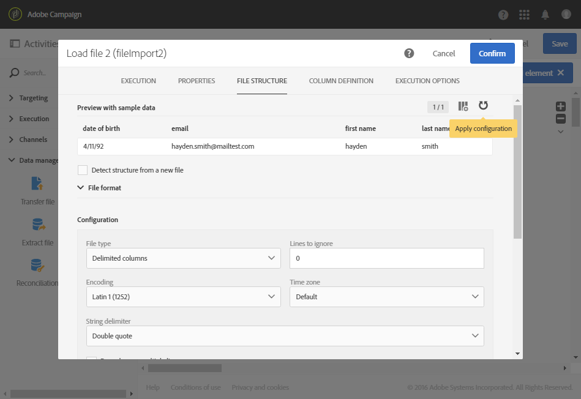

# Läs in fil {#load-file}

## Beskrivning {#description}

>[!CAUTION]
>
>Tänk på begränsningarna för SFTP-lagring, DB-lagring och aktiv profil enligt ditt Adobe Campaign-kontrakt när du använder den här funktionen.

Med den här **[!UICONTROL Load file]** aktiviteten kan du importera data i ett strukturerat formulär och använda dessa data i Adobe Campaign. Data importeras tillfälligt och en annan aktivitet är nödvändig för att den ska kunna integreras slutgiltigt i Adobe Campaign-databasen.

## Kontext för användning {#context-of-use}

Det sätt som data extraheras på definieras när aktiviteten konfigureras. Filen som ska läsas in kan till exempel vara en lista med kontakter.

>[!CAUTION]
>
>Endast &quot;platta&quot; strukturfiler beaktas, t.ex. .txt-, .csv-filer.

Du kan:

* Använd filstrukturen för att tillämpa den på data från en annan fil (återskapat med hjälp av **[!UICONTROL Transfer file]** aktiviteten) eller
* Använd strukturen och data från filen för att importera den till Adobe Campaign.

**Relaterade ämnen:**

* [Användningsfall: Uppdatera databasen med externa data](../../automating/using/update-database-file.md)
* [Användningsfall: Uppdatera data baserat på en automatisk filhämtning](../../automating/using/update-data-automatic-download.md)
* [Användningsfall: Skicka ett e-postmeddelande med fördjupade fält](../../automating/using/sending-email-enriched-fields.md)
* [Användningsfall: Städa av en filpublik med databasen](../../automating/using/reconcile-file-audience-with-database.md)

## Konfiguration {#configuration}

Aktivitetskonfigurationen omfattar två steg. Först måste du definiera den förväntade filstrukturen genom att överföra en exempelfil. När du är klar kan du ange ursprunget för filen vars data ska importeras.

>[!NOTE]
>
>Data i exempelfilen används för att konfigurera aktiviteten, men importeras inte. Vi rekommenderar att du använder en exempelfil som innehåller lite data.

1. Dra och släpp en **[!UICONTROL Load file]** aktivitet i arbetsflödet.
1. Markera aktiviteten och öppna den sedan med knappen  bland de snabbåtgärder som visas.
1. Överför exempelfilen så att du kan definiera den förväntade strukturen när du importerar den slutliga filen.

   

   När datafilen har överförts visas två nya flikar i aktiviteten: **[!UICONTROL File structure]** och **[!UICONTROL Column definition]**.

1. Gå till **[!UICONTROL File structure]** fliken för att visa strukturen som identifieras automatiskt från exempelfilen.

   Om filstrukturen identifierades felaktigt har du flera alternativ för att korrigera eventuella fel:

   * Du kan välja att använda strukturen för en annan fil genom att markera **[!UICONTROL Detect structure from a new file]** alternativet.
   * Du kan ändra standardparametrarna för identifiering för att anpassa dem till filen. I **[!UICONTROL File type]** fältet kan du ange om den fil du vill importera består av kolumner med fast längd. I så fall måste du också ange maximalt antal tecken för varje kolumn på **[!UICONTROL Column definition]** fliken.

      Alla identifieringsalternativ som krävs för att korrekt återskapa data från filen grupperas om i **[!UICONTROL File format]**. Du kan ändra dem och sedan upptäcka strukturen på den senast inlästa filen i aktiviteten igen genom att ta hänsyn till dessa nya inställningar. Använd **[!UICONTROL Apply configuration]** knappen för att göra detta. Du kan till exempel ange en annan kolumnavgränsare.

      >[!NOTE]
      >
      >Den här åtgärden tar hänsyn till den senaste filen som lästes in i aktiviteten. Om filen som identifieras är stor visas bara de första 30 raderna i förhandsvisningen.

      

      I **[!UICONTROL File format]** avsnittet kan du med **[!UICONTROL Check columns from file against column definitions]** alternativet verifiera att kolumnerna i filen som du överför motsvarar kolumndefinitionen.

      Om antalet kolumner och/eller namnet inte matchar kolumndefinitionen visas ett felmeddelande när arbetsflödet körs. Om alternativet inte är aktiverat visas varningar i loggfilen.

      

1. Gå till **[!UICONTROL Column definition]** fliken för att kontrollera dataformatet för varje kolumn och justera parametrarna om det behövs.

   På fliken **[!UICONTROL Column definition]** kan du specificera datastrukturen för varje kolumn för att importera data som inte innehåller några fel (till exempel med null-hantering) och få den att matcha de typer som redan finns i Adobe Campaign-databasen för framtida åtgärder.

   Du kan till exempel ändra etiketten för en kolumn och välja dess typ (sträng, heltal, datum osv.) eller specificera felbearbetning.

   Mer information finns i avsnittet [Kolumnformat](#column-format) .

   

1. Ange på **[!UICONTROL Execution]** fliken om filen ska bearbetas för inläsning av data:

   * Kommer från en inkommande övergång i arbetsflödet.
   * Är den som du överförde under föregående steg.
   * Är en ny fil som ska överföras från den lokala datorn. Alternativet visas **[!UICONTROL Upload a new file from local machine]** om du redan har överfört en första fil i arbetsflödet. På så sätt kan du överföra en annan fil som ska bearbetas om den aktuella filen inte passar dina behov.

      

1. Om filen som du vill läsa in data från är komprimerad till en GZIP-fil (.gz) väljer du **[!UICONTROL Decompression]** alternativet i **[!UICONTROL Add a pre-processing step]** fältet. På så sätt kan du packa upp filen innan du läser in data. Det här alternativet är bara tillgängligt om filen kommer från aktivitetens ingående övergång.

   I **[!UICONTROL Add a pre-processing step]** fältet kan du även dekryptera en fil innan du importerar den till databasen. Mer information om hur du arbetar med krypterade filer finns i [det här avsnittet](../../automating/using/managing-encrypted-data.md)

1. Med det här **[!UICONTROL Keep the rejects in a file]** alternativet kan du hämta en fil som innehåller fel som inträffade under importen och använda den i ett steg efter bearbetningen. När alternativet är aktiverat får den utgående övergången namnet&quot;Avvisa&quot;.

   >[!NOTE]
   >
   >Med det här **[!UICONTROL Add date and time to the file name]** alternativet kan du lägga till en tidsstämpel i namnet på filen som innehåller de avvisade.

   

1. Bekräfta aktivitetens konfiguration och spara arbetsflödet.

Om något fel inträffar med aktiviteten efter att arbetsflödet har körts finns mer information om felaktiga värden i filen i loggarna. For more on workflows logs, refer to [this section](../../automating/using/monitoring-workflow-execution.md).

## Kolumnformat {#column-format}

När du läser in en exempelfil identifieras kolumnformatet automatiskt med standardparametrarna för varje datatyp. Du kan ändra de här standardparametrarna för att ange vilka processer som ska tillämpas på dina data, särskilt när det finns ett fel eller ett tomt värde.

Det gör du genom att välja **[!UICONTROL Edit properties]** bland snabbåtgärderna i den kolumn vars format du vill definiera. Detaljfönstret för kolumnformat öppnas.

Du kan sedan ändra formateringen för varje kolumn.

Med kolumnformateringen kan du definiera värdebearbetningen för varje kolumn:

* **[!UICONTROL Ignore column]**: bearbetar inte den här kolumnen under datainläsning.
* **[!UICONTROL Data type]**: Anger den typ av data som förväntas för varje kolumn.
* **[!UICONTROL Format and separators]**, **Egenskaper**: Ange egenskaperna för en text, tid, datum och numeriskt värdeformat samt avgränsaren som anges av kolumnkontexten.

   * **[!UICONTROL Maximum number of characters]**: Anger maximalt antal tecken för strängtypskolumner.

      Det här fältet måste fyllas i när filer som består av kolumner med fast längd läses in.

   * **[!UICONTROL Letter case management]**: definierar om en teckenskiftsprocess måste tillämpas för **textdata** .
   * **[!UICONTROL White space management]**: anger om vissa mellanslag måste ignoreras i en sträng för **textdata** .
   * **[!UICONTROL Time format]**, **[!UICONTROL Date format]**: Ange formatet för **datum**-, **tid** - och **datum** - och tidsdata.
   * **[!UICONTROL Format]**: I kan du definiera formatet för numeriska värden för **heltal** - och **flyttal** .
   * **[!UICONTROL Separator]**: definierar avgränsaren som anges av kolumnkontexten (tusentalsavgränsare eller decimalavgränsare för numeriska värden, avgränsare för datum och tid) för **Datum**, **Tid**, **Datum och tid**, **Heltal** och **Flyttal** .

* **[!UICONTROL Remapping of values]**: det här fältet är bara tillgängligt i kolumndetaljkonfigurationen. Du kan omforma vissa värden när du importerar dem. Du kan till exempel omvandla &quot;tre&quot; till &quot;3&quot;.
* **[!UICONTROL Error processing]**: definierar beteendet om ett fel påträffas.

   * **[!UICONTROL Ignore the value]**: värdet ignoreras. En varning genereras i arbetsflödets körningslogg.
   * **[!UICONTROL Reject the line]**: hela raden inte bearbetas.
   * **[!UICONTROL Use a default value]**: ersätter det värde som orsakar felet med ett standardvärde som definieras i **[!UICONTROL Default value]** fältet.
   * **[!UICONTROL Use a default value in case the value is not remapped]**: ersätter det värde som orsakar felet med ett standardvärde, som definieras i **[!UICONTROL Default value]** fältet, såvida inte en mappning har definierats för det felaktiga värdet (se **[!UICONTROL Remapping of values]** alternativet ovan).
   * **[!UICONTROL Reject the line when there is no remapping value]**: hela raden inte bearbetas om inte en mappning har definierats för det felaktiga värdet (se alternativet ovan **[!UICONTROL Remapping of values]** ).

   >[!NOTE]
   >
   >**[!UICONTROL Error processing]** gäller fel avseende värden i den importerade filen. En felaktig datatyp har påträffats (&quot;fyra&quot; alla med bokstäver för en heltalskolumn), en sträng som innehåller fler tecken än det tillåtna maxtalet, ett datum med felaktiga avgränsare osv. Det här alternativet gäller dock inte fel som genereras av tom värdehantering.

* **[!UICONTROL Default value]**: anger standardvärdet enligt vald felbearbetning.
* **[!UICONTROL Empty value management]**: används för att ange hur tomma värden ska hanteras vid inläsning av data.

   * **[!UICONTROL Generate an error for numerical fields]**: genererar ett fel endast för numeriska fält, annars infogas ett NULL-värde.
   * **[!UICONTROL Insert NULL in the corresponding field]**: anger tomma värden. Värdet NULL infogas därför.
   * **[!UICONTROL Generate an error]**: genererar ett fel om ett värde är tomt.
