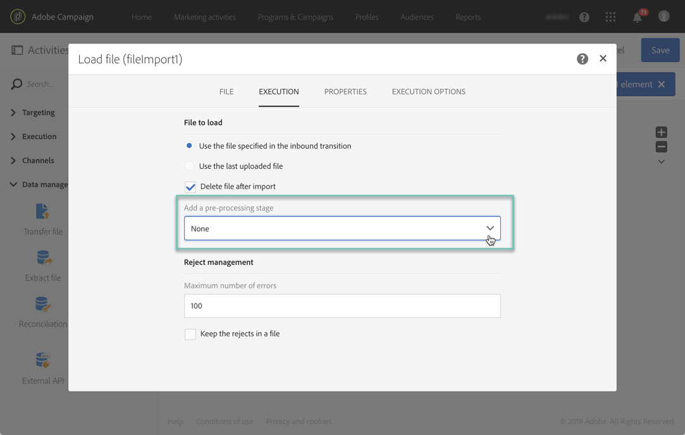
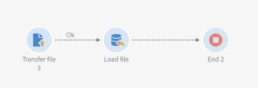
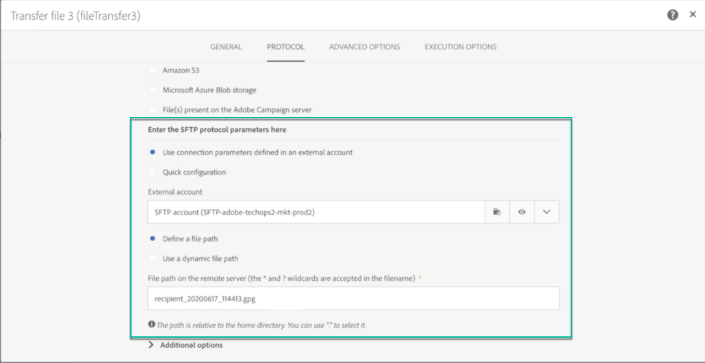
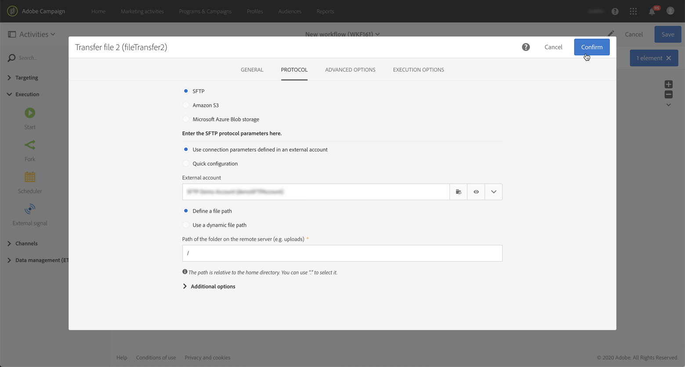

# Hantera krypterade data {#managing-encrypted-data}

## Om förbearbetningsfaser {#about-preprocessing-stages}

I vissa fall kan data som du vill importera Campaign-servrar behöva krypteras, till exempel om de innehåller PII-data.

Om du vill kunna kryptera utgående data eller dekryptera inkommande data måste du hantera GPG-nycklar med [Kontrollpanelen](https://experienceleague.adobe.com/docs/control-panel/using/instances-settings/gpg-keys-management.html?lang=sv).

>[!NOTE]
>
>Kontrollpanelen är tillgänglig för alla kunder som har AWS som värd (med undantag för kunder som har sina marknadsföringsinstanser på plats).

Om du inte är berättigad att använda Kontrollpanelen måste du kontakta Adobe kundtjänst så att de kan ge din instans de krypterings-/dekrypteringskommandon som behövs. Om du vill göra det skickar du en förfrågan med följande uppgifter:

* **label** som ska visas i Campaign-gränssnittet för att använda kommandot. Till exempel&quot;Kryptera fil&quot;.
* Det **kommando** som ska installeras på din instans.

När begäran har bearbetats är krypterings-/dekrypteringskommandona tillgängliga i fältet **[!UICONTROL Pre-processing stage]** från aktiviteterna **[!UICONTROL Load file]** och **[!UICONTROL Extract file]**. Du kan använda dem för att dekryptera eller kryptera de filer som du vill importera eller exportera.

**Relaterade ämnen:**

* [Ladda fil](../../automating/using/load-file.md)
* [Extrahera fil](../../automating/using/extract-file.md)

## Användningsfall: Importera data som krypterats med en nyckel som genererats av Kontrollpanelen {#use-case-gpg-decrypt}

I det här fallet skapar du ett arbetsflöde för att importera data som har krypterats i ett externt system med hjälp av en nyckel som genererats på Kontrollpanelen.

 [Upptäck den här funktionen i en video](#video)

Så här utför du det här användningsfallet:

1. Använd Kontrollpanelen för att generera ett nyckelpar (public/private). Detaljerade steg finns i [dokumentationen för Kontrollpanelen](https://experienceleague.adobe.com/docs/control-panel/using/instances-settings/gpg-keys-management.html?lang=sv-SE#decrypting-data).

   * Den offentliga nyckeln delas med det externa systemet, som kommer att använda den för att kryptera data som ska skickas till Campaign.
   * Den privata nyckeln används av Campaign för att dekryptera inkommande krypterade data.

   

1. I det externa systemet använder du den offentliga nyckel som hämtats från Kontrollpanelen för att kryptera de data som ska importeras till Campaign Standard.

1. Bygg ett arbetsflöde i Campaign Standard för att importera krypterade data och dekryptera dem med den privata nyckel som har installerats via Kontrollpanelen. Du kan göra detta genom att skapa ett arbetsflöde enligt följande:

   

   * **[!UICONTROL Transfer file]**-aktivitet: Överför filen från en extern källa till Campaign. I det här exemplet vill vi överföra filen från en SFTP-server.
   * **[!UICONTROL Load file]**-aktivitet: Läser in data från filen i databasen och dekrypterar den med den privata nyckel som genereras på Kontrollpanelen.

1. Öppna aktiviteten **[!UICONTROL Transfer file]** och konfigurera den efter dina behov. Globala koncept för hur du konfigurerar aktiviteten finns i [det här avsnittet](../../automating/using/load-file.md).

   På fliken **[!UICONTROL Protocol]** anger du information om den sftp-server och den krypterade GPG-fil som du vill överföra.

   

1. Öppna aktiviteten **[!UICONTROL Load file]** och konfigurera den sedan efter dina behov. Globala koncept för hur du konfigurerar aktiviteten finns i [det här avsnittet](../../automating/using/load-file.md).

   Lägg till en förbearbetningsfas i aktiviteten för att dekryptera inkommande data. Om du vill göra det väljer du alternativet **[!UICONTROL Decryption GPG]** i listan.

   >[!NOTE]
   >
   >Observera att du inte behöver ange den privata nyckel som ska användas för att dekryptera data. Den privata nyckeln lagras på Kontrollpanelen, som automatiskt identifierar den nyckel som ska användas för att dekryptera filen.

   

1. Klicka på **[!UICONTROL OK]** för att bekräfta aktivitetskonfigurationen.

1. Du kan nu köra arbetsflödet.

## Användningsfall: Kryptera och exportera data med en tangent som är installerad på Kontrollpanelen {#use-case-gpg-encrypt}

I det här fallet skapar du ett arbetsflöde för att kryptera och exportera data med en nyckel som är installerad på Kontrollpanelen.

 [Upptäck den här funktionen i en video](#video)

Så här utför du det här användningsfallet:

1. Generera ett GPG-nyckelpar (public/private) med ett GPG-verktyg och installera sedan den offentliga nyckeln på Kontrollpanelen. Detaljerade steg finns i [dokumentationen för Kontrollpanelen](https://experienceleague.adobe.com/docs/control-panel/using/instances-settings/gpg-keys-management.html?lang=sv-SE#encrypting-data).

   

1. Bygg ett arbetsflöde i Campaign Standard för att exportera data och kryptera dem med den privata nyckel som har installerats via Kontrollpanelen. Du kan göra detta genom att skapa ett arbetsflöde enligt följande:

   

   * **[!UICONTROL Query]**-aktivitet: I det här exemplet vill vi köra en fråga som mål för data från den databas som vi vill exportera.
   * **[!UICONTROL Extract file]**-aktivitet: Krypterar och extraherar data till en fil.
   * **[!UICONTROL Transfer file]**-aktivitet: Överför filen som innehåller krypterade data till en SFTP-server.

1. Konfigurera aktiviteten **[!UICONTROL Query]** för att ange önskade data från databasen som mål. Mer information om detta finns i [det här avsnittet](../../automating/using/query.md).

1. Öppna aktiviteten **[!UICONTROL Extract file]** och konfigurera den efter dina behov (utdatafil, kolumner, format osv.). Globala koncept för hur du konfigurerar aktiviteten finns i [det här avsnittet](../../automating/using/extract-file.md).

   Lägg till en förbearbetningsfas i aktiviteten för att kryptera de data som ska extraheras. Om du vill göra det väljer du den GPG-krypteringsnyckel som ska användas för att kryptera data.

   

   >[!NOTE]
   >
   >Värdet inom parentes är den **kommentar** som du definierade när du genererade nyckelparet med GPG-krypteringsverktyget. Se till att du väljer rätt matchande nyckel, annars kan mottagaren inte dekryptera filen.

1. Öppna aktiviteten **[!UICONTROL Transfer file]** och ange sedan den SFTP-server som du vill skicka filen till. Globala koncept för hur du konfigurerar aktiviteten finns i [det här avsnittet](../../automating/using/transfer-file.md).

   

1. Du kan nu köra arbetsflödet. När den har körts exporteras datamål som omfattas av frågan till SFTP-servern till en krypterad GPG-fil.

## Självstudievideor {#video}

I den här videon visas hur du använder en GPG-nyckel för att dekryptera data.

>[!VIDEO](https://video.tv.adobe.com/v/35753?quality=12)

I den här videon visas hur du använder en GPG-nyckel för att kryptera data.

>[!VIDEO](https://video.tv.adobe.com/v/36380?quality=12)

Ytterligare Campaign Standard instruktionsvideor finns [här](https://experienceleague.adobe.com/docs/campaign-standard-learn/tutorials/overview.html?lang=sv).
