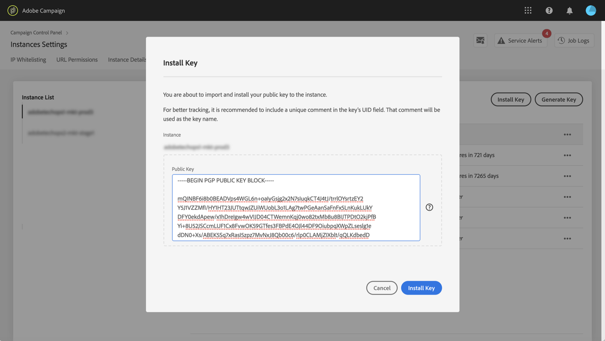

# Hantera krypterade data {#managing-encrypted-data}

## Om förbearbetningsfaser {#about-preprocessing-stages}

I vissa fall kan data som du vill importera Campaign-servrar behöva krypteras, till exempel om de innehåller PII-data.

Om du vill kunna importera eller exportera krypterade filer måste du först kontakta Adobes kundtjänst så att de ger instansen de krypterings-/dekrypteringskommandon som behövs.

Om du vill göra det skickar du en förfrågan med följande uppgifter:

* Den **etikett** som ska visas i Campaign-gränssnittet för att använda kommandot. Till exempel&quot;Kryptera fil&quot;.
* Det **kommando** som ska installeras på instansen.

När begäran har bearbetats är krypterings-/dekrypteringskommandona tillgängliga i **[!UICONTROL Pre-processing stage]** fältet från **[!UICONTROL Load file]** och **[!UICONTROL Extract file]** aktiviteterna. Du kan använda dem för att dekryptera eller kryptera de filer som du vill importera eller exportera.

>[!NOTE]
>
>Observera att GPG-nycklar kan läggas till i din instans med Kontrollpanelen, som är tillgänglig för alla kunder som har AWS som värd (förutom för kunder som har sina marknadsföringsinstanser som lokala).
>
>Mer information finns i dokumentationen [för](https://docs.adobe.com/content/help/en/control-panel/using/control-panel-home.html)Kontrollpanelen.

**Relaterade ämnen:**

* [Läs in fil](../../automating/using/load-file.md)
* [Extrahera fil](../../automating/using/extract-file.md)

## Användningsfall: Importera data krypterade med en nyckel som genererats av Kontrollpanelen {#use-case-gpg-decrypt}

I det här fallet skapar vi ett arbetsflöde för att importera data som har krypterats i ett externt system med hjälp av en nyckel som genererats på Kontrollpanelen.

Så här utför du det här användningsfallet:

1. Använd Kontrollpanelen för att generera ett nyckelpar (public/private). Detaljerade steg finns i dokumentationen för [Kontrollpanelen](https://docs.adobe.com/content/help/en/control-panel/using/instances-settings/gpg-keys-management.html#decrypting-data).

   * Den offentliga nyckeln delas med det externa systemet, som kommer att använda den för att kryptera data som ska skickas till Campaign.
   * Den privata nyckeln används av Campaign för att dekryptera inkommande krypterade data.
   

1. I det externa systemet använder du den offentliga nyckel som hämtats från Kontrollpanelen för att kryptera de data som ska importeras till Campaign Standarden.

   

1. Bygg ett arbetsflöde i Campaign Standard för att importera krypterade data och dekryptera dem med den privata nyckel som har installerats via Kontrollpanelen. För att göra detta ska vi skapa ett arbetsflöde enligt följande:

   

   * **[!UICONTROL Transfer file]** aktivitet: Överför filen från en extern källa till Campaign. I det här exemplet vill vi överföra filen från en SFTP-server.
   * **[!UICONTROL Load file]** aktivitet: Läser in data från filen i databasen och dekrypterar den med den privata nyckel som genereras på Kontrollpanelen.

1. Öppna **[!UICONTROL Transfer file]** aktiviteten och konfigurera den efter dina behov. Globala koncept för hur du konfigurerar aktiviteten finns i [det här avsnittet](../../automating/using/load-file.md).

   På **[!UICONTROL Protocol]** fliken anger du information om sftp-servern och den krypterade GPG-filen som du vill överföra.

   

1. Öppna **[!UICONTROL Load file]** aktiviteten och konfigurera den efter dina behov. Globala koncept för hur du konfigurerar aktiviteten finns i [det här avsnittet](../../automating/using/load-file.md).

   Lägg till en förbearbetningsfas i aktiviteten för att dekryptera inkommande data. Det gör du genom att välja **[!UICONTROL Decryption GPG]** alternativet i listan.

   >[!NOTE]
   >
   >Observera att du inte behöver ange den privata nyckel som ska användas för att dekryptera data. Den privata nyckeln lagras på Kontrollpanelen, som automatiskt identifierar den nyckel som ska användas för att dekryptera filen.

   

1. Klicka **[!UICONTROL OK]** för att bekräfta aktivitetskonfigurationen.

1. Du kan nu köra arbetsflödet.

## Användningsfall: Kryptera och exportera data med en tangent som är installerad på Kontrollpanelen {#use-case-gpg-encrypt}

I det här fallet skapar vi ett arbetsflöde för att kryptera och exportera data med en nyckel som installeras på Kontrollpanelen.

Så här utför du det här användningsfallet:

1. Generera ett GPG-nyckelpar (public/private) med ett GPG-verktyg och installera sedan den offentliga nyckeln på Kontrollpanelen. Detaljerade steg finns i dokumentationen för [Kontrollpanelen](https://docs.adobe.com/content/help/en/control-panel/using/instances-settings/gpg-keys-management.html#encrypting-data).

   

1. Bygg ett arbetsflöde i Campaign Standard för att exportera data och exportera dem med den privata nyckel som har installerats via Kontrollpanelen. För att göra detta ska vi skapa ett arbetsflöde enligt följande:

   

   * **[!UICONTROL Query]** aktivitet: I det här exemplet vill vi köra en fråga för att rikta data från den databas som vi vill exportera.
   * **[!UICONTROL Extract file]** aktivitet: Krypterar och extraherar data till en fil.
   * **[!UICONTROL Transfer file]** aktivitet: Överför filen som innehåller krypterade data till en SFTP-server.

1. Konfigurera **[!UICONTROL Query]** aktiviteten för att ange önskade data från databasen som mål. For more on this, refer to [this section](../../automating/using/query.md).

1. Öppna **[!UICONTROL Extract file]** aktiviteten och konfigurera den efter behov (utdatafil, kolumner, format osv.). Globala koncept för hur du konfigurerar aktiviteten finns i [det här avsnittet](../../automating/using/extract-file.md).

   Lägg till en förbearbetningsfas i aktiviteten för att kryptera de data som ska extraheras. Om du vill göra det väljer du den GPG-krypteringsnyckel som ska användas för att kryptera data.

   

   >[!NOTE]
   >
   >Värdet inom parentes är den **kommentar** du definierade när du genererade nyckelparet med GPG-krypteringsverktyget. Se till att du väljer rätt matchande nyckel, annars kan mottagaren inte dekryptera filen.

1. Öppna **[!UICONTROL Transfer file]** aktiviteten och ange sedan den SFTP-server som du vill skicka filen till. Globala koncept för hur du konfigurerar aktiviteten finns i [det här avsnittet](../../automating/using/transfer-file.md).

   

1. Du kan nu köra arbetsflödet. När den har körts exporteras datamål som omfattas av frågan till SFTP-servern till en krypterad GPG-fil.

   
