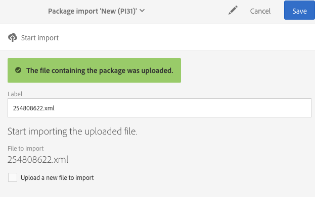

# Hantera paket{#managing-packages}

Administratörer kan definiera paket för utbyte av resurser mellan olika Adobe Campaign-instanser via strukturerade XML-filer. Dessa kan vara konfigurationsparametrar eller data.

Detta kan vara användbart för överföring av data från en server till en annan eller för replikering av konfigurationen av en instans.

Paket finns i menyn **[!UICONTROL Administration]** > **[!UICONTROL Deployment]** > **[!UICONTROL Package exports]** eller **[!UICONTROL Package imports]**.  De två menyerna fungerar liknande.

Elementen i varje lista visas som standard beroende på deras modifierings- eller installationsdatum från det senaste till det tidigaste.

Om du vill visa och ändra innehållet i ett element klickar du på dess etikett.  Se avsnitten [Exportera ett paket](#exporting-a-package) och [Importera ett paket](#importing-a-package) .

## Exportera paket {#package-exports}

### Standardpaket {#standard-packages}

**[!UICONTROL Platform]** och **[!UICONTROL Administration]** är två inbyggda paket som båda innehåller en fördefinierad lista med resurser som ska exporteras.  De kan öppnas i skrivskyddat läge och är endast lämpliga för export.

>[!IMPORTANT]
>
>Export av paket tillåts inte om de exporterade resurserna har ett standard-ID.  Därför måste ID:t för exporterbara resurser ändras med ett namn som skiljer sig från mallarna som tillhandahålls som standard i Adobe Campaign Standard.  Om du exempelvis vill exportera testprofiler får du inte använda ett ID som innehåller värdet &quot;SDM&quot; eller &quot;sdm&quot;.
>
>När du försöker exportera paket som innehåller ett standard-ID kan du se fel som &quot;Enhetstypen Varumärke (varumärket) använder ett standard-ID (BRD1) som kan orsaka en konflikt när paketet importeras.  Ändra det här namnet och upprepa åtgärden.&quot;

De olika stegen för export av paket beskrivs i avsnittet [Exportera ett paket](#exporting-a-package).

* **[!UICONTROL Platform]**-paketet grupperar samtliga resurser som lagts till under den tekniska konfigurationen: anpassade resurser, anpassade resursuppsättningar, utlösare och programalternativ med typen **[!UICONTROL System]**.
* **[!UICONTROL Administration]**-paketet grupperar alla objekt som lagts till under företagskonfigurationen som exempelvis: kampanjmallar, innehållsmallar, leveransmallar, mallar för landningssidor, programmallar och mallar för arbetsflöden.

   Den innehåller även följande objekt: innehållsblock, målmappningar, externa konton, organisationsenheter, programalternativ med typen **[!UICONTROL User]**, roller, typologier, typologiregler och användare.

>[!NOTE]
>
>Innehållet i dessa två paket kan inte ändras.  De här paketen innehåller däremot alltid den mest aktuella datan som finns.  Du kan [skapa egna paket](#creating-a-package) för att exportera specifika element.

### Skapa ett paket {#creating-a-package}

Du måste skapa ett paket om du behöver exportera specifika uppsättningar av data.

För att skapa ett paket behöver du administrationsbehörighet.

1. Från **[!UICONTROL Administration]** > **[!UICONTROL Deployment]** > **[!UICONTROL Package exports]** så klickar du på knappen **[!UICONTROL Create]** i listan med paketinnehåll.

   Elementet skapas direkt.  Om du inte vill skapa den går du tillbaka till listan och markerar motsvarande ruta för att ta bort den.

1. Ange ett namn och ett ID i paketets innehållsskärm.
1. Klicka på knappen **[!UICONTROL Edit properties]** om du vill lägga till en beskrivning och begränsa åtkomsten för vissa användare.

   

1. Använd knappen **[!UICONTROL Create element]** på fliken **[!UICONTROL Export content]** för att välja de resurser du vill exportera.

   

1. Resurserna visas i alfabetisk ordning och kan filtreras efter namn.  Deras tekniska namn visas inom parentes.  Markera ett element i listan och bekräfta sedan.

   

1. Resursnamnet visas på fliken **[!UICONTROL Export content]**.    Om du vill ändra en resurs markerar du motsvarande ruta och använder knappen **[!UICONTROL Show detail of the element selected]**.

   

1. Med förfrågningsredigeraren kan du filtrera elementen som ska exporteras.  Mer information om detta hittar du i avsnittet [Redigera förfrågningar](../../automating/using/editing-queries.md#creating-queries) .

   

   >[!NOTE]
   >
   >Du kan exportera upp till 5 000 objekt per resurs.

1. Spara ditt alternativ när du har angett alla resurser som ska exporteras.

Paketet har nu skapats och kan exporteras.

### Exportera ett paket {#exporting-a-package}

När du exporterar ett paket kan du spara ett specifikt tillstånd av en resurs som du kan återimportera till en annan instans eller senare i samma instans.

>[!CAUTION]
>
>Export av paket är inte tillåtet om de exporterade resurserna har användar-ID:n.  Därför måste ID:t för exporterbara resurser ändras med ett namn som skiljer sig från mallarna som tillhandahålls som standard i Adobe Campaign Standard. Om du exempelvis vill exportera testprofiler får du inte använda ett ID som innehåller värdet &quot;SDM&quot; eller &quot;sdm&quot;.

1. Från **[!UICONTROL Administration]** > **[!UICONTROL Deployment]** > **[!UICONTROL Package exports]** markerar du ett paket för att komma åt informationen.
1. Kontrollera att paketet innehåller den data som du behöver.
1. Klicka på knappen **[!UICONTROL Start export]**.

Den exporterade filen lagras i den nedladdningsmapp som används av webbläsaren.  Det får automatiskt namnet &quot;package_xxx.xml&quot; där&quot;xxx&quot; motsvarar paket-ID:t.

När åtgärden är klar visas flera avsnitt:

* **[!UICONTROL Export status]**: I det här avsnittet visas om åtgärden har utförts på rätt sätt.

   

* Du kan se de olika stegen av exporten via fliken **[!UICONTROL Log]**.    Detta innehåller statusvärden för alla tidigare exporter.

   

>[!NOTE]
>
>När du väljer ett element i listan med paketinnehåll som redan har exporterats är flikarna **[!UICONTROL Log]** och **[!UICONTROL Last export]** fortfarande tillgängliga.

## Paketimporteringar {#package-imports}

### Systemuppdateringar {#system-updates}

Listan med paketimporteringar ovan innehåller den automatiska importen som är länkad till uppdateringar som har utförts av Adobe.

Alla importeringssteg lagras i fliken **[!UICONTROL Execution logs]**.  Den allmänna informationen visas i en sidopanel.

>[!NOTE]
>
>Dessa element är tillgängliga i skrivskyddat läge.

### Importera ett paket {#importing-a-package}

En administratör kan importera ett paket som kommer från en export som tidigare manuellt har utförts från en Adobe Campaign-instans.  Mer information om detta hittar du i avsnittet [Paketexport](#package-exports) .

Den manuella paketimporteringen består av två steg. I det första steget måste du överföra en fil och sedan importera dess innehåll.

1. Från **[!UICONTROL Administration]** > **[!UICONTROL Deployment]** > **[!UICONTROL Package imports]** klickar du på knappen **[!UICONTROL Create]** i listan för paketimportering.

   Elementet skapas direkt. Om du inte vill skapa den går du tillbaka till listan och markerar motsvarande ruta för att ta bort den.

1. Ange ett namn och ett ID för den nya importen.
1. Markera den fil som du vill överföra genom att dra och släppa den eller genom att klicka på länken **[!UICONTROL Select from folder]**.

   Importerade filer måste antingen vara i XML eller ZIP-format (ZIP-filen ska då innehålla en XML-fil).

   

   >[!NOTE]
   >
   >Om du vill ersätta det uppladdade dokumentet börjar du med att ta bort filen via X-ikonen till höger om namnet och upprepar sedan åtgärden.

1. När filen har överförts importerar du dess innehåll till databasen med hjälp av knappen **[!UICONTROL Start import]**.

   

När åtgärden är klar visas flera avsnitt:

* **[!UICONTROL Import status]**: I det här avsnittet visas om åtgärden har utförts på rätt sätt.
* Du kan se de olika stegen i importen via fliken **[!UICONTROL Execution logs]**.  Detta är speciellt viktigt för att se eventuella fel.

   

När ett paket har importerats kan du inte importera det igen från samma element.  Du kan endast ändra etiketten och ID:t.

Om du vill importera om samma paket måste du gå tillbaka till listan med paketimporteringar, skapa ett element och sedan överföra den valda filen igen.
