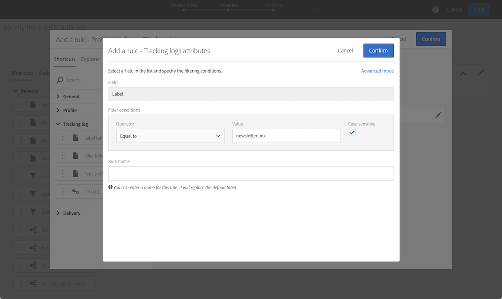

# Frågeexempel {#query-samples}

I det här avsnittet visas ett användbart exempel för en **[!UICONTROL Query]** aktivitet. Mer information om hur du använder en **[!UICONTROL Query]** aktivitet finns i [det här avsnittet](../../automating/using/query.md).

## Målinriktning mot enkla profilattribut {#targeting-on-simple-profile-attributes}

I följande exempel visas en frågeaktivitet som är konfigurerad att rikta sig till män mellan 18 och 30 år i London.

## Riktning på e-postattribut {#targeting-on-email-attributes}

I följande exempel visas en frågeaktivitet som har konfigurerats för målprofiler med e-postadressdomänen orange.co.uk.

I följande exempel visas en frågeaktivitet som konfigurerats för målprofiler vars e-postadress har angetts.

## Målprofiler vars födelsedag är idag {#targeting-profiles-whose-birthday-is-today}

I följande exempel visas en frågeaktivitet som konfigurerats för målprofiler vars födelsedag är idag.

1. Dra **[!UICONTROL Birthday]** filtret i frågan.

   

1. Ange **[!UICONTROL Filter type]** som **[!UICONTROL Relative]** och markera **[!UICONTROL Today]**.

   

## Målprofiler som öppnade en viss leverans {#targeting-profiles-who-opened-a-specific-delivery}

I följande exempel visas en frågeaktivitet som konfigurerats för att filtrera profiler som öppnade leveransen med etiketten Sommartid.

1. Dra **[!UICONTROL Opened]** filtret i frågan.

   

1. Välj leverans och klicka sedan på **[!UICONTROL Confirm]**.

   

## Målprofiler för vilka leveranser misslyckades av en viss anledning {#targeting-profiles-for-whom-deliveries-failed-for-a-specific-reason}

I följande exempel visas en frågeaktivitet som konfigurerats för att filtrera profiler för vilka leveranser misslyckades på grund av att deras postlåda var full. Frågan är bara tillgänglig för användare med administrationsrättigheter och som tillhör **[!UICONTROL All (all)]** organisationsenheterna (se [det här avsnittet](../../administration/using/organizational-units.md)).

1. Markera **[!UICONTROL Delivery logs]** resursen för att filtrera direkt i leveransloggtabellen (se [Använda andra resurser än måldimensioner](../../automating/using/using-resources-different-from-targeting-dimensions.md)).

   

1. Dra **[!UICONTROL Nature of failure]** filtret i frågan.

   

1. Välj den typ av fel som du vill ha som mål. I vårt fall **[!UICONTROL Mailbox full]**.

   

## Målprofiler som inte kontaktats under de senaste 7 dagarna {#targeting-profiles-not-contacted-during-the-last-7-days}

I följande exempel visas en frågeaktivitet som konfigurerats för att filtrera profiler som inte kontaktats under de senaste 7 dagarna.

1. Dra **[!UICONTROL Delivery logs (logs)]** filtret i frågan.

   

   Välj **[!UICONTROL Does not exist]** i listrutan och dra sedan **[!UICONTROL Delivery]** filtret.

   

1. Konfigurera filtret enligt nedan.

   

## Målprofiler som klickade på en specifik länk {#targeting-profiles-who-clicked-a-specific-link-}

1. Dra **[!UICONTROL Tracking logs (tracking)]** filtret i frågan.

   

1. Dra **[!UICONTROL Label (urlLabel)]** filtret.

   

1. I **[!UICONTROL Value]** fältet skriver du den etikett som definierades när länken infogades i leveransen och bekräftar sedan.

   
