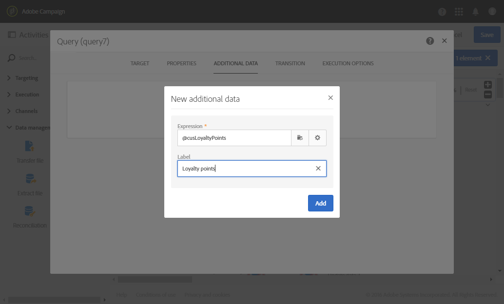
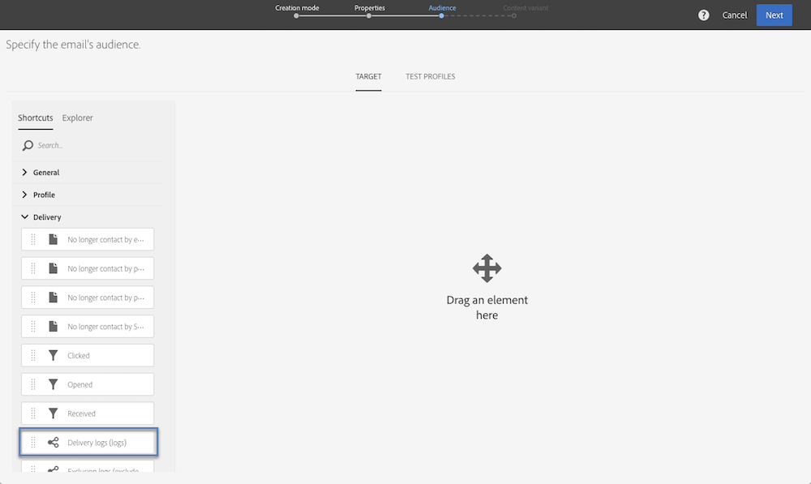

# Fråga{#query}

## Beskrivning {#description}

Med hjälp av den här **[!UICONTROL Query]** aktiviteten kan du filtrera och extrahera en grupp element från Adobe Campaign-databasen. Du kan definiera **[!UICONTROL Additional data]** för målpopulationen via en dedikerad flik. Dessa data lagras i ytterligare kolumner och kan bara användas för det aktuella arbetsflödet.

Aktiviteten använder frågeredigeringsverktyget. Det här verktyget beskrivs i ett [särskilt avsnitt](../../automating/using/editing-queries.md#about-query-editor).

## Kontext för användning {#context-of-use}

Aktiviteten kan **[!UICONTROL Query]** användas för olika typer av användning:

* Segmentera individer för att definiera målet för ett meddelande, en målgrupp osv.
* Förbättra data i hela Adobe Campaign-databastabellen.
* Exporterar data.

## Konfiguration {#configuration}

1. Dra och släpp en **[!UICONTROL Query]** aktivitet i arbetsflödet.
1. Markera aktiviteten och öppna den sedan med knappen  bland de snabbåtgärder som visas. Som standard är aktiviteten förkonfigurerad för att söka efter profiler.
1. Om du vill köra en fråga på en annan resurs än profilresursen går du till aktivitetens **[!UICONTROL Properties]** flik och väljer en **[!UICONTROL Resource]** och en **[!UICONTROL Targeting dimension]**.

   Med **[!UICONTROL Resource]** den här funktionen kan du förfina de filter som visas på paletten, medan **[!UICONTROL Targeting dimension]** kontextuell för den valda resursen motsvarar den typ av population som du vill få (identifierade profiler, leveranser, data som är länkade till den valda resursen osv.).

   Mer information finns i [Målinställningar och resurser](#targeting-dimensions-and-resources).

1. På fliken **[!UICONTROL Target]** kör du frågan genom att definiera och kombinera regler.
1. Du kan definiera **[!UICONTROL Additional data]** för målpopulationen via en dedikerad flik. Dessa data lagras i ytterligare kolumner och kan bara användas för det aktuella arbetsflödet. Du kan i synnerhet lägga till data från Adobe Campaign-databastabeller som är länkade till frågans måldimension. Mer information finns i avsnittet [Förbättra data](#enriching-data) .

   >[!NOTE]
   >
   >Alternativet är som standard markerat i **[!UICONTROL Remove duplicate rows (DISTINCT)]** slutet **[!UICONTROL Advanced options]** av **[!UICONTROL Additional data]** frågefliken. Om aktiviteten innehåller många (från 100) ytterligare data som definierats bör du avmarkera det här alternativet av prestandaskäl. **[!UICONTROL Query]** Om du avmarkerar det här alternativet kan dubbletter hämtas, beroende på vilka data som efterfrågas.

1. På **[!UICONTROL Transition]** fliken kan du med **[!UICONTROL Enable an outbound transition]** alternativet lägga till en utgående övergång efter frågeaktiviteten, även om inga data hämtas.

   Segmentkoden för den utgående övergången kan anpassas med hjälp av ett standarduttryck och händelsevariabler (se [Anpassa aktiviteter med händelsevariabler](../../automating/using/calling-a-workflow-with-external-parameters.md#customizing-activities-with-events-variables)).

1. Bekräfta aktivitetens konfiguration och spara arbetsflödet.

## Målinriktade dimensioner och resurser {#targeting-dimensions-and-resources}

Med måldimensionerna och resurserna kan du definiera på vilka element en fråga ska baseras för att avgöra målet för en leverans.

Måtten definieras i målmappningar. For more on this, refer to [this section](../../administration/using/target-mappings-in-campaign.md).

### Definiera måldimension och -resurs för en fråga {#defining-the-targeting-dimension-and-resource-of-a-query}

Måldimensioner och resurser definieras när du skapar ett arbetsflöde på fliken **[!UICONTROL Properties]** i en Query-aktivitet.

>[!NOTE]
>
>Målinriktningsdimensionen kan också definieras när du skapar en målgrupp (se [det här avsnittet](../../audiences/using/creating-audiences.md)).

Måtten och resurserna är länkade. De tillgängliga måldimensionerna beror därför på den valda resursen.

Följande måldimensioner är tillgängliga för resursen **[!UICONTROL Profiles (profile)]**:

I **[!UICONTROL Deliveries (delivery)]** stället innehåller listan följande måldimensioner:

När måldimensionen och målresursen har angetts är olika filter tillgängliga i frågan.

Exempel på tillgängliga filter för **[!UICONTROL Profiles (profile)]** resursen:

Exempel på tillgängliga filter för **[!UICONTROL Deliveries (delivery)]** resursen:

### Använda andra resurser än målinriktade dimensioner {#using-resources-different-from-targeting-dimensions}

Måldimensionen och målresursen anges som standard för målprofiler.

Det kan dock vara användbart att använda en annan resurs än måldimensionen om du vill söka efter en viss post i en annan tabell.

**Exempel 1: Identifiera profiler som är avsedda för leveransen med etiketten&quot;Välkommen tillbaka!&quot;**.

* I det här fallet vill vi ha målprofiler. Vi sätter målgruppsdimensionen till **[!UICONTROL Profiles (profile)]**.
* Vi vill filtrera de valda profilerna enligt leveransetiketten. Vi kommer därför att sätta resursen till **[!UICONTROL Delivery logs]**. På så sätt filtreras vi direkt i leveransloggtabellen, som ger bättre prestanda.

**Exempel 2: Identifiera profiler som inte var avsedda för leverans med etiketten&quot;Välkommen tillbaka!&quot;**

I föregående exempel använde vi en annan resurs än måldimensionen. Den här åtgärden är bara möjlig om du vill hitta en post som **finns** i den fjärranslutna tabellen (leveransloggar i vårt exempel).

Om vi vill hitta en post som inte **finns** i den distinkta tabellen (till exempel profiler som inte var målinriktade av en viss leverans) måste du använda samma resurs- och måldimension, eftersom posten inte finns i den distinkta tabellen (leveransloggar).

* I det här fallet vill vi ha målprofiler. Vi sätter målgruppsdimensionen till **[!UICONTROL Profiles (profile)]**.
* Vi vill filtrera de valda profilerna enligt leveransetiketten. Det går inte att filtrera direkt på leveransloggar eftersom vi söker efter en post som inte finns i leveransloggtabellen. Vi ställer därför in resursen på **[!UICONTROL Profile (profile)]** och bygger vår fråga på profiltabellen.

## Förbättra data {#enriching-data}

På fliken **[!UICONTROL Additional data]** i **[!UICONTROL Query]** och **[!UICONTROL Incremental query]****[!UICONTROL Enrichment]** aktiviteterna kan du utöka måldata och överföra dessa data till följande arbetsflödesaktiviteter, där de kan användas. Du kan särskilt lägga till:

* Enkla data
* Aggregat
* Samlingar

För aggregat och samlingar definieras en **[!UICONTROL Alias]** automatiskt så att ett tekniskt ID tilldelas till ett komplext uttryck. Detta alias, som måste vara unikt, gör att aggregaten och samlingarna enkelt kan hittas efteråt. Du kan ändra den så att den får ett namn som är lätt att känna igen.

>[!NOTE]
>
>Alias måste följa följande syntaxregler: Endast alfanumeriska tecken och &quot;_&quot;-tecken tillåts. Aliasen är skiftlägeskänslig. Aliaset måste börja med tecknet&quot;@&quot;. Tecknet omedelbart efter &quot;@&quot; får inte vara numeriskt. Till exempel: @myAlias_1 och @_1Alias är korrekta; @myAlias#1 och @1Alias är felaktiga.

När du har lagt till ytterligare data kan du använda en extra filternivå för de data som ursprungligen var målinriktade genom att skapa villkor som baseras på de ytterligare data som har definierats.

>[!NOTE]
>
>Alternativet är som standard markerat i **[!UICONTROL Remove duplicate rows (DISTINCT)]** slutet **[!UICONTROL Advanced options]** av **[!UICONTROL Additional data]** frågefliken. Om aktiviteten innehåller många (från 100) ytterligare data som definierats bör du avmarkera det här alternativet av prestandaskäl. **[!UICONTROL Query]** Om du avmarkerar det här alternativet kan dubbletter hämtas, beroende på vilka data som efterfrågas.

### Lägga till ett enkelt fält {#adding-a-simple-field}

Genom att lägga till ett enkelt fält som ytterligare data blir det fältet direkt synligt i aktivitetens utgående övergång. På så sätt kan användaren till exempel kontrollera att data från frågan är de önskade data.

1. Lägg till ett nytt element på **[!UICONTROL Additional data]** fliken.
1. I det fönster som öppnas, i **[!UICONTROL Expression]** fältet, väljer du ett av fälten som är tillgängliga direkt i måldimensionen eller i en av de länkade dimensionerna. Du kan redigera uttryck och använda funktioner eller enkla beräkningar (förutom aggregat) från dimensionsfälten.

   En **[!UICONTROL Alias]** skapas automatiskt om du redigerar ett uttryck som inte är en enkel XPATH-sökväg (till exempel: &quot;Year(&lt;@bornDate>)&quot;). Om du vill kan du ändra den. Om du bara markerar ett fält (till exempel: &quot;@age&quot;) behöver du inte definiera en **[!UICONTROL Alias]**.

1. Välj **[!UICONTROL Add]** för att bekräfta att du vill lägga till fältet till ytterligare data. När frågan körs finns ytterligare en kolumn som motsvarar det tillagda fältet i aktivitetens utgående övergång.

### Lägga till en sammanställning {#adding-an-aggregate}

Aggregat tillåter att värden beräknas från fält i måldimensionen eller från fält med dimensioner som är kopplade till måldimensionen. Till exempel: det genomsnittliga belopp som köpts av en profil.
När du använder sammanställning med fråga kan dess funktion återgå till noll, vilket sedan betraktas som NULL. Använd fliken **[!UICONTROL Output filtering]** i frågan för att filtrera det aggregerade värdet:

* om du vill ha nollvärden ska du filtrera på **[!UICONTROL is null]**.
* om du inte vill ha ett nollvärdesfilter på **[!UICONTROL is not null]**.

Observera, att om du behöver använda sortering på din mängd bör du filtrera bort nollvärden, annars visas NULL-värdet som det största talet.

1. Lägg till ett nytt element på **[!UICONTROL Additional data]** fliken.
1. I det fönster som öppnas väljer du den samling som du vill använda för att skapa sammanställningen i **[!UICONTROL Expression]** fältet.

   En **[!UICONTROL Alias]** skapas automatiskt. Om du vill kan du ändra den genom att gå tillbaka till frågans **[!UICONTROL Additional data]** flik.

   Sammanställningsdefinitionsfönstret öppnas.

1. Definiera en mängd på **[!UICONTROL Data]** fliken. Beroende på vilken typ av sammanställning du har valt är endast de element vars data är kompatibla i **[!UICONTROL Expression]** fältet. En summa kan till exempel bara beräknas med numeriska data.

   

   Du kan lägga till flera aggregat för fälten i den valda samlingen. Se till att definiera explicita etiketter för att skilja de olika kolumnerna i detaljerna för aktivitetens utgående data.

   Du kan också ändra de alias som definieras automatiskt för varje mängd.

   

1. Om det behövs kan du lägga till ett filter för att begränsa vilka data som ska tas med i beräkningen.

   Se avsnittet [Filtrera tillagda data](#filtering-added-data) .

1. Välj **[!UICONTROL Confirm]** att lägga till aggregat.

>[!NOTE]
>
>Du kan inte skapa ett uttryck som innehåller en mängd direkt från **[!UICONTROL Expression]** fältet i **[!UICONTROL New additional data]** fönstret.

### Lägga till en samling {#adding-a-collection}

1. Lägg till ett nytt element på **[!UICONTROL Additional data]** fliken.
1. I det fönster som öppnas väljer du den samling som du vill lägga till i **[!UICONTROL Expression]** fältet. En **[!UICONTROL Alias]** skapas automatiskt. Om du vill kan du ändra den genom att gå tillbaka till frågans **[!UICONTROL Additional data]** flik.
1. Välj **[!UICONTROL Add]**. Ett nytt fönster öppnas där du kan förfina de samlingsdata som du vill visa.
1. Markera **[!UICONTROL Parameters]** och definiera antalet rader i samlingen som du vill lägga till på **[!UICONTROL Collection]** fliken. Om du t.ex. vill få de tre senaste inköpen utförda av varje profil anger du &quot;3&quot; i **[!UICONTROL Number of lines to return]** fältet.

   >[!NOTE]
   >
   >Du måste ange ett tal som är större än eller lika med 1.

1. På **[!UICONTROL Data]** fliken definierar du fälten i samlingen som du vill visa för varje rad.

   

1. Om du vill kan du lägga till ett filter för att begränsa vilka samlingsrader som ska tas med i beräkningen.

   Se avsnittet [Filtrera tillagda data](#filtering-added-data) .

1. Om du vill kan du definiera en datasortering.

   Om du t.ex. har markerat tre rader som ska returneras på **[!UICONTROL Parameters]** fliken och vill bestämma de tre senaste inköpen, kan du definiera en fallande sortering i fältet &quot;date&quot; i samlingen som motsvarar transaktionerna.

1. Se avsnittet [Sortera ytterligare data](#sorting-additional-data) .
1. Välj **[!UICONTROL Confirm]** att lägga till samlingen.

### Filtrera tillagda data {#filtering-added-data}

När du lägger till en mängd eller en samling kan du ange ytterligare ett filter för att begränsa vilka data som ska visas.

Om du till exempel bara vill bearbeta samlingsrader med transaktioner som är 50 dollar eller högre kan du lägga till ett villkor i fältet som motsvarar transaktionsbeloppet på **[!UICONTROL Filter]** fliken.

### Sortera ytterligare data {#sorting-additional-data}

När du lägger till en mängd eller en samling i data för en fråga kan du ange om du vill använda en sortering - vare sig den är stigande eller fallande - baserat på värdet för fältet eller det definierade uttrycket.

Om du till exempel bara vill spara den transaktion som utfördes senast av en profil, anger du &quot;1&quot; i **[!UICONTROL Number of lines to return]** fältet på **[!UICONTROL Parameters]** fliken och använder en fallande sortering i fältet som motsvarar transaktionsdatumet via **[!UICONTROL Sort]** fliken.

### Filtrera måldata enligt ytterligare data {#filtering-the-targeted-data-according-to-additional-data}

När du har lagt till ytterligare data visas en ny **[!UICONTROL Output filtering]** flik i **[!UICONTROL Query]**. På den här fliken kan du använda ytterligare ett filter på data som ursprungligen var avsedda för på **[!UICONTROL Target]** fliken, genom att ta hänsyn till tillagda data.

Om du t.ex. har angett alla profiler som utförde minst en transaktion och ett aggregat som beräknar det genomsnittliga transaktionsbeloppet som utfördes för varje profil har lagts till i **[!UICONTROL Additional data]** kan du förfina populationen som ursprungligen beräknades med detta genomsnitt.

Om du vill göra det lägger du bara till ett villkor för dessa ytterligare data på fliken **[!UICONTROL Output filtering]** .

### Exempel: personalisera ett e-postmeddelande med ytterligare data {#example--personalizing-an-email-with-additional-data}

I följande exempel visas hur du lägger till olika typer av ytterligare data i en fråga och hur de används som ett anpassningsfält i ett e-postmeddelande.

I det här exemplet används [anpassade resurser](../../developing/using/data-model-concepts.md) :

* Resursen för **profilen** utökades för att lägga till ett fält som gör att varje profils förmånspoäng kan sparas.
* En **transaktionsresurs** skapades och identifierar alla inköp som utförs av profilerna i databasen. Datum, pris och produkt som köpts sparas för varje transaktion.
* En **produktresurs** skapades och refererar till produkter som är tillgängliga för inköp.

Målet är att skicka ett e-postmeddelande till de profiler för vilka minst en transaktion har sparats. Via det här mejlet får kunderna en påminnelse om den senaste transaktionen samt en översikt över alla sina transaktioner: antalet köpta produkter, totalt förbrukade produkter, en påminnelse om det totala antalet förmånspoäng som de har ackumulerat.

Arbetsflödet presenteras på följande sätt:

1. Lägg till en **[!UICONTROL Query]** aktivitet som gör att du kan rikta in profilerna som har utfört minst en transaktion mot målet.

   

   Ange de olika data som ska visas i det slutliga e-postmeddelandet på fliken **[!UICONTROL Additional data]** i frågan:

   * Det enkla fältet i **profildimensionen** som motsvarar förmånspoängen. Se avsnittet [Lägga till ett enkelt fält](#adding-a-simple-field) .
   * Två aggregat baserade på transaktionssamlingen: antalet köpta produkter och det totala beloppet som använts. Du kan lägga till dem från fliken **[!UICONTROL Data]** i det aggregerade konfigurationsfönstret med hjälp av aggregaten **Count** och **Sum** . Se avsnittet [Lägga till en sammanställning](#adding-an-aggregate) .
   * En samling som returnerar använt belopp, datum och produkt för den senaste transaktionen.

      För att göra detta måste du lägga till de olika fält som du vill visa på fliken **[!UICONTROL Data]** i fönstret för samlingskonfiguration.

      Om du bara vill returnera den senaste transaktionen måste du ange &quot;1&quot; för **[!UICONTROL Number of lines to return]** och tillämpa en fallande sortering i fältet **Datum** i samlingen från **[!UICONTROL Sort]** fliken.

      Mer information finns i avsnitten [Lägga till en samling](#adding-a-collection) och [Sortera ytterligare data](#sorting-additional-data) .
   

   Om du vill kontrollera att data överförs korrekt av aktivitetens utgående övergång startar du arbetsflödet för första gången (utan **[!UICONTROL Email delivery]** aktiviteten) och öppnar frågans utgående övergång.

   

1. Lägg till en **[!UICONTROL Email delivery]** aktivitet. I e-postinnehållet infogar du de anpassningsfält som motsvarar de data som beräknas i frågan. Du hittar den via länken **[!UICONTROL Additional data (targetData)]** till utforskaren för anpassningsfält.

   

Arbetsflödet är nu klart att köras. Profilerna som frågan riktar sig till får ett anpassat e-postmeddelande som innehåller data som beräknas utifrån deras transaktioner.

## Frågeexempel {#query-samples}

### Målinriktning mot enkla profilattribut {#targeting-on-simple-profile-attributes}

I följande exempel visas en frågeaktivitet som är konfigurerad att rikta sig till män mellan 18 och 30 år i London.

### Riktning på e-postattribut {#targeting-on-email-attributes}

I följande exempel visas en frågeaktivitet som har konfigurerats för målprofiler med e-postadressdomänen orange.co.uk.

I följande exempel visas en frågeaktivitet som konfigurerats för målprofiler vars e-postadress har angetts.

### Målprofiler vars födelsedag är idag {#targeting-profiles-whose-birthday-is-today}

I följande exempel visas en frågeaktivitet som konfigurerats för målprofiler vars födelsedag är idag.

1. Dra **[!UICONTROL Birthday]** filtret i frågan.

   

1. Ange **[!UICONTROL Filter type]** som **[!UICONTROL Relative]** och markera **[!UICONTROL Today]**.

   

### Målprofiler som öppnade en viss leverans {#targeting-profiles-who-opened-a-specific-delivery}

I följande exempel visas en frågeaktivitet som konfigurerats för att filtrera profiler som öppnade leveransen med etiketten Sommartid.

1. Dra **[!UICONTROL Opened]** filtret i frågan.

   

1. Välj leverans och klicka sedan på **[!UICONTROL Confirm]**.

   

### Målprofiler för vilka leveranser misslyckades av en viss anledning {#targeting-profiles-for-whom-deliveries-failed-for-a-specific-reason}

I följande exempel visas en frågeaktivitet som konfigurerats för att filtrera profiler för vilka leveranser misslyckades på grund av att deras postlåda var full. Frågan är bara tillgänglig för användare med administrationsrättigheter och som tillhör **[!UICONTROL All (all)]** organisationsenheterna (se [det här avsnittet](../../administration/using/organizational-units.md)).

1. Markera **[!UICONTROL Delivery logs]** resursen för att filtrera direkt i leveransloggtabellen (se [Använda andra resurser än måldimensioner](#using-resources-different-from-targeting-dimensions)).

   

1. Dra **[!UICONTROL Nature of failure]** filtret i frågan.

   

1. Välj den typ av fel som du vill ha som mål. I vårt fall **[!UICONTROL Mailbox full]**.

   

### Målprofiler som inte kontaktats under de senaste 7 dagarna {#targeting-profiles-not-contacted-during-the-last-7-days}

I följande exempel visas en frågeaktivitet som konfigurerats för att filtrera profiler som inte kontaktats under de senaste 7 dagarna.

1. Dra **[!UICONTROL Delivery logs (logs)]** filtret i frågan.

   

   Välj **[!UICONTROL Does not exist]** i listrutan och dra sedan **[!UICONTROL Delivery]** filtret.

   

1. Konfigurera filtret enligt nedan.

   

### Målprofiler som klickade på en specifik länk {#targeting-profiles-who-clicked-a-specific-link-}

1. Dra **[!UICONTROL Tracking logs (tracking)]** filtret i frågan.

   

1. Dra **[!UICONTROL Label (urlLabel)]** filtret.

   

1. I **[!UICONTROL Value]** fältet skriver du den etikett som definierades när länken infogades i leveransen och bekräftar sedan.

   

