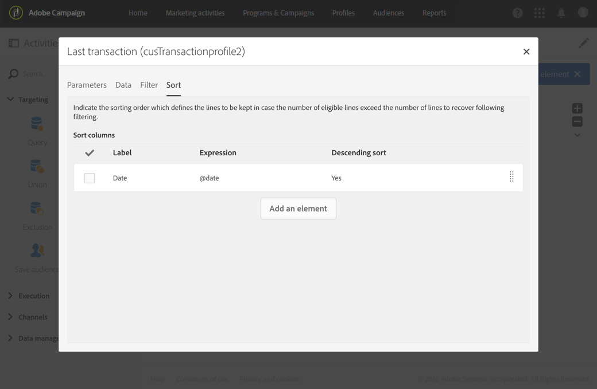
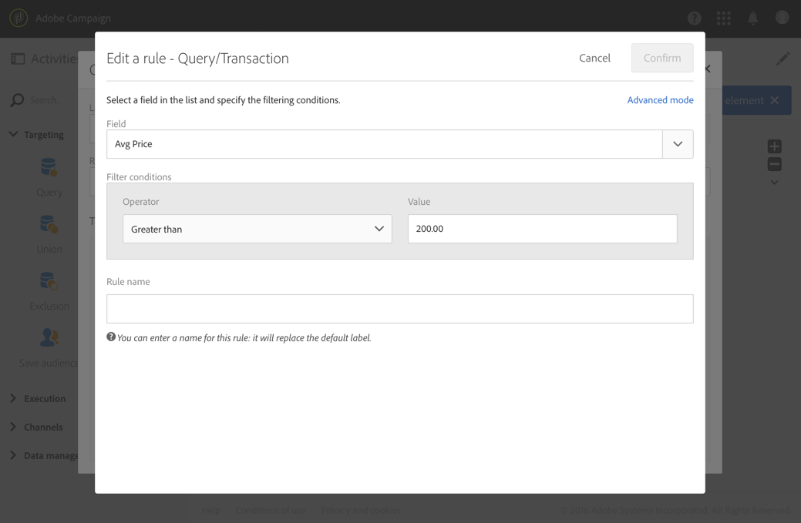

# Fråga{#query}

## Beskrivning {#description}

Med **[!UICONTROL Query]**-aktiviteten kan du filtrera och extrahera ett populations-element från Adobe Campaign-databasen. Du kan definiera **[!UICONTROL Additional data]** målpopulationen via en dedikerad flik. Dessa data lagras i ytterligare kolumner och kan bara användas för det aktuella arbetsflödet.

Aktiviteten använder förfrågningsredigerings-verktyget. Mer detaljer gällande verktyget hittar du i verktygets [dedikerade avsnitt](../../automating/using/editing-queries.md#about-query-editor).

**Relaterade ämnen:**

* [Exempel på frågor](../../automating/using/query-samples.md)
* [Användningsfall: Omdirigera arbetsflöde som skickar en ny leverans till icke-öppnare](../../automating/using/workflow-cross-channel-retargeting.md)

## Kontext för användning {#context-of-use}

Aktiviteten **[!UICONTROL Query]** kan användas för olika typer av användning:

* Segmentera individer för att definiera målet för ett meddelande, en målgrupp osv.
* Berika datan i hela Adobe Campaign-databastabellen.
* Exportera data.

## Konfiguration {#configuration}

1. Dra och släpp en **[!UICONTROL Query]**-aktivitet i arbetsflödet.
1. Markera aktiviteten och öppna den sedan med  knappen bland de snabbåtgärder som visas. Som standard så är aktiviteten förkonfigurerad för att söka efter profiler.
1. Om du vill köra en förfrågan på en annan resurs än profilen så går du till aktivitets-fliken **[!UICONTROL Properties]** och väljer en **[!UICONTROL Resource]** och en **[!UICONTROL Targeting dimension]**.

   Med **[!UICONTROL Resource]** kan du förfina de filter som visas på paletten, medan **[!UICONTROL Targeting dimension]**, kontextuellt för den valda resursen, motsvarar den typ av population som du vill hämta (identifierade profiler, leveranser, data som är kopplade till den valda resursen osv.).

   Mer information om detta hittar du i [Målinställningar och resurser](#targeting-dimensions-and-resources).

1. På fliken **[!UICONTROL Target]** kör du frågan genom att definiera och kombinera regler.

   >[!NOTE]
   >
   >Observera att målgruppens definition inte refereras när målgruppen är målgrupp, men **kopieras** till frågan. Om du ändrar målgruppen efter att den har angetts som mål i en fråga måste du konfigurera frågan igen så att den nya definitionen beaktas.

1. Du kan definiera **[!UICONTROL Additional data]** målpopulationen via en dedikerad flik. Dessa data lagras i ytterligare kolumner och kan bara användas för det aktuella arbetsflödet. Du kan t.ex. lägga till data från Adobe Campaign-databastabeller som är länkade till frågans måldimension.  Mer information finns i avsnittet [Berikningsdata](#enriching-data) .

   >[!NOTE]
   >
   >Alternativet är som standard markerat i **[!UICONTROL Remove duplicate rows (DISTINCT)]** slutet **[!UICONTROL Advanced options]** av **[!UICONTROL Additional data]** förfrågningsfliken. Om **[!UICONTROL Query]**-aktiviteten innehåller mycket (från 100) ytterligare data som definierats så bör du avmarkera detta alternativ av prestandaskäl. Om du avmarkerar det här alternativet kan dubbletter hämtas, beroende på vilken data som efterfrågas.

1. Under **[!UICONTROL Transition]**-fliken kan du med **[!UICONTROL Enable an outbound transition]**-alternativet lägga till en utgående övergång efter förfrågnings-aktiviteten, även om ingen data hämtats.

   Segmentkoden för den utgående övergången kan anpassas med hjälp av ett standarduttryck och händelsevariabler (se [den här sidan](../../automating/using/customizing-workflow-external-parameters.md)).

1. Bekräfta aktivitetens konfiguration och spara arbetsflödet.

## Måldimensioner och resurser {#targeting-dimensions-and-resources}

Med måldimensionerna och resurserna kan du definiera vilka element en fråga ska baseras på för att avgöra målet för en leverans.

De konfigureras i [målmappningar](../../administration/using/target-mappings-in-campaign.md) och definieras när du skapar ett arbetsflöde på fliken **[!UICONTROL Properties]** för en Query-aktivitet.

>[!NOTE]
>
>Måldimensionen kan också definieras när du skapar en målgrupp (se [detta avsnitt](../../audiences/using/creating-audiences.md)).

Måldimensionen och resurserna är länkade.  De tillgängliga måldimensionerna avgörs därför av den valda resursen.

Följande måldimensioner är tillgängliga för resursen **[!UICONTROL Profiles (profile)]**:

I **[!UICONTROL Deliveries (delivery)]** stället innehåller listan följande måldimensioner:

När måldimensionen och målresursen har angetts så finns olika filter tillgängliga i förfrågningen.

Exempel på tillgängliga filter för **[!UICONTROL Profiles (profile)]**-resursen:

Exempel på tillgängliga filter för **[!UICONTROL Deliveries (delivery)]**-resursen:

Måldimensionen och målresursen anges som standard för målprofiler. Det kan dock vara användbart att använda en annan resurs än måldimensionen om du vill söka efter en viss post i en annan tabell.

Mer information finns i följande exempel: [Använda andra resurser än måldimensioner](../../automating/using/using-resources-different-from-targeting-dimensions.md)

## Berika data {#enriching-data}

På fliken **[!UICONTROL Additional data]** i **[!UICONTROL Query]** och **[!UICONTROL Incremental query]****[!UICONTROL Enrichment]**­aktiviteterna kan du utöka måldata och överföra denna data till följande arbetsflödesaktiviteter där de kan användas.  Du kan mer specifikt lägga till:

* Enkel data
* Sammanställningar
* Samlingar

För sammanställningar och samlingar så definieras en **[!UICONTROL Alias]** automatiskt så att ett tekniskt ID tilldelas till ett komplext uttryck.  Detta alias, som måste vara unikt, gör att sammanställningarna och samlingarna enkelt kan hittas efteråt.  Du kan ändra den så att den får ett namn som är lätt att känna igen.

>[!NOTE]
>
>Alias måste följa följande syntaxregler: Endast alfanumeriska tecken och &quot;_&quot;-tecken tillåts.  Ett alias är skiftlägeskänsligt.  Ett alias måste börja med tecknet &quot;@&quot;.  Tecknet omedelbart efter &quot;@&quot; får inte vara numeriskt.  Till exempel: @myAlias_1 och @_1Alias är korrekta. @myAlias#1 och @1Alias är inkorrekta.

När du har lagt till ytterligare data kan du använda en extra filternivå för den data som ursprungligen var målinriktad genom att skapa villkor som baseras på den ytterligare data som har definierats.

>[!NOTE]
>
>Alternativet är som standard markerat i **[!UICONTROL Remove duplicate rows (DISTINCT)]** slutet **[!UICONTROL Advanced options]** av **[!UICONTROL Additional data]** förfrågningsfliken. Om **[!UICONTROL Query]**-aktiviteten innehåller mycket (från 100) ytterligare data som definierats så bör du avmarkera detta alternativ av prestandaskäl. Om du avmarkerar det här alternativet kan dubbletter hämtas, beroende på vilken data som efterfrågas.

Ett användningsexempel om hur du anpassar ett e-postmeddelande med ytterligare data finns i [det här avsnittet](../../automating/using/personalizing-email-with-additional-data.md).

### Lägga till ett enkelt fält {#adding-a-simple-field}

Genom att lägga till ett enkelt fält som ytterligare data så blir det fältet direkt synligt i aktivitetens utgående övergång.  På så sätt kan användaren till exempel kontrollera att data från förfrågan är den önskade datan.

1. Lägg till ett nytt element under **[!UICONTROL Additional data]**-fliken.
1. I det fönster som öppnas, alltså i **[!UICONTROL Expression]**-fältet, så väljer du ett av fälten som är tillgängliga direkt i måldimensionen eller i en av de länkade dimensionerna.  Du kan redigera uttryck och använda funktioner eller enkla beräkningar (förutom sammanställningar) i dimensionsfälten.

   En **[!UICONTROL Alias]** skapas automatiskt om du redigerar ett uttryck som inte är en enkel XPATH-sökväg (till exempel: &quot;Year(&lt;@birthDate>)&quot;).  Om du vill kan du ändra den.  Om du endast markerar ett fält (till exempel: &quot;@age&quot; ) så behöver du inte definiera en **[!UICONTROL Alias]**.

1. Välj **[!UICONTROL Add]** för att bekräfta att du vill lägga till fältet till ytterligare data.  När frågan körs så finns ytterligare en kolumn som motsvarar det tillagda fältet i aktivitetens utgående övergång.

### Lägga till en sammanställning {#adding-an-aggregate}

Sammanställningar tillåter att värden beräknas från fält i måldimensionen eller från fält med dimensioner som är kopplade till måldimensionen.  Till exempel: det genomsnittliga beloppet som köpts av en profil.
När du använder sammanställning med en förfrågan så kan dess funktion återgå till noll, vilket sedan betraktas som NULL.  Använd fliken **[!UICONTROL Output filtering]** i förfrågan för att filtrera det aggregerade värdet:

* om du vill ha nollvärden ska du filtrera på **[!UICONTROL is null]**.
* om du inte vill ha ett nollvärde så filtrera på **[!UICONTROL is not null]**.

Observera att om du behöver använda sortering på ditt aggregerade värde så bör du filtrera bort nollvärden. Annars så visas NULL-värdet som det största talet.

1. Lägg till ett nytt element under **[!UICONTROL Additional data]**-fliken.
1. I det fönster som öppnas så väljer du den samling som du vill använda för att skapa sammanställningen i **[!UICONTROL Expression]**-fältet.

   En **[!UICONTROL Alias]** skapas automatiskt. Om du vill kan du ändra den genom att gå tillbaka till frågans **[!UICONTROL Additional data]**-flik.

   Fönstret för den aggregerade definitionen öppnas.

1. Definiera en mängd under **[!UICONTROL Data]**-fliken.  Beroende på vilken typ av sammanställning du har valt så är endast de element vars data är kompatibla i **[!UICONTROL Expression]**-fältet.  En summa kan till exempel endast beräknas med numerisk data.

   

   Du kan lägga till flera sammanställningar för fälten i den valda samlingen.  Se till att definiera explicita etiketter för att skilja på de olika kolumnerna i detaljerna för aktivitetens utgående data.

   Du kan också ändra de alias som definieras automatiskt för varje mängd.

   

1. Om det behövs kan du lägga till ett filter för att begränsa vilken data som ska tas med i beräkningen.

   Se avsnittet [Filtrera tillagd data](#filtering-added-data) .

1. Välj **[!UICONTROL Confirm]** för att lägga till sammanställningar.

>[!NOTE]
>
>Du kan inte skapa ett uttryck som innehåller en mängd direkt från **[!UICONTROL Expression]**-fältet i **[!UICONTROL New additional data]**-fönstret.

### Lägg till en samling {#adding-a-collection}

1. Lägg till ett nytt element under **[!UICONTROL Additional data]**-fliken.
1. I det fönster som öppnas så väljer du den samling som du vill lägga till i **[!UICONTROL Expression]**-fältet.  En **[!UICONTROL Alias]** skapas automatiskt. Om du vill kan du ändra den genom att gå tillbaka till frågans **[!UICONTROL Additional data]**-flik.
1. Välj **[!UICONTROL Add]**.  Ett nytt fönster öppnas där du kan förfina den samlingsdata som du vill visa.
1. Markera **[!UICONTROL Parameters]** och definiera antalet rader i samlingen som du vill lägga till under **[!UICONTROL Collection]**-fliken.  Om du t.ex. vill få fram de tre senaste inköpen utförda av varje profil så anger du &quot;3&quot; i **[!UICONTROL Number of lines to return]**-fältet.

   >[!NOTE]
   >
   >Du måste ange ett tal som är större än eller lika med 1.

1. Under **[!UICONTROL Data]**-fliken så definierar du fälten i samlingen som du vill visa för varje rad.

   

1. Om du vill kan du lägga till ett filter för att begränsa vilka samlingsrader som ska tas med i beräkningen.

   Se avsnittet [Filtrera tillagd data](#filtering-added-data) .

1. Om du vill kan du definiera en datasortering.

   Om du exempelvis har markerat 3 rader som ska visas under **[!UICONTROL Parameters]**-fliken och vill bestämma de tre senaste inköpen kan du definiera en fallande sortering i fältet &quot;date&quot; i samlingen som motsvarar transaktionerna.

1. Se avsnittet [Sortera ytterligare data](#sorting-additional-data) .
1. Välj **[!UICONTROL Confirm]** att lägga till samlingen.

### Filtrera tillagd data {#filtering-added-data}

När du lägger till en aggregerad mängd eller en samling kan du ange ytterligare ett filter för att begränsa vilken data som ska visas.

Om du till exempel bara vill bearbeta samlingsrader med transaktioner som är 50 dollar eller högre kan du lägga till ett villkor i fältet som motsvarar transaktionsbeloppet under **[!UICONTROL Filter]**-fliken.

### Sortera ytterligare data {#sorting-additional-data}

När du lägger till en mängd eller en samling data för en förfrågan kan du ange om du vill använda en sortering, vare sig om den är stigande eller fallande, baserat på värdet för fältet eller det definierade uttrycket.

Om du till exempel bara vill spara den transaktion som utfördes senast av en profil så anger du &quot;1&quot; i **[!UICONTROL Number of lines to return]**-fältet under **[!UICONTROL Parameters]**-fliken och använder en fallande sortering i fältet som motsvarar transaktionsdatumet via **[!UICONTROL Sort]**-fliken.

### Filtrera måldata enligt ytterligare data {#filtering-the-targeted-data-according-to-additional-data}

När du har lagt till ytterligare data så visas en ny **[!UICONTROL Output filtering]**-flik i **[!UICONTROL Query]**.  I den här fliken kan du använda ytterligare ett filter för data, som ursprungligen var avsedd för **[!UICONTROL Target]**-fliken, genom att även ta med tillagd data.

Om du t.ex. har angett alla profiler som utförde minst en transaktion och en sammanställning som beräknar det genomsnittliga transaktionsbeloppet som utfördes för varje profil som har lagts till i **[!UICONTROL Additional data]** kan du förfina populationen som ursprungligen beräknades med detta genomsnitt.

För att göra detta lägger du bara till ett villkor för den ytterligare datan på fliken **[!UICONTROL Output filtering]** .

