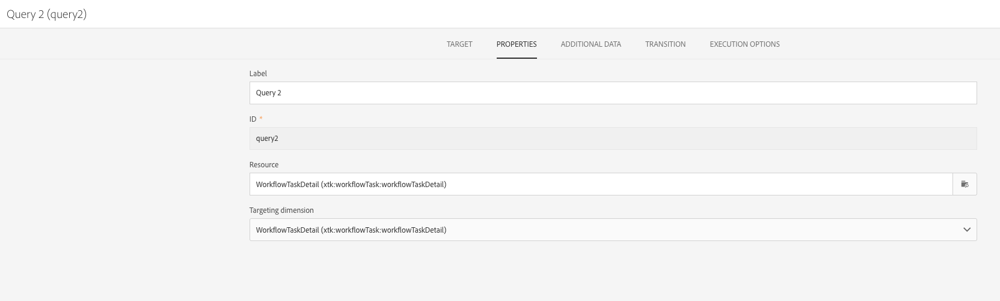

# Överlappande körning av schemalagda arbetsflöden{#preventing-overlapping-execution-of-scheduled-workflows}

## Körning av schemalagda arbetsflöden

I Campaign Standard garanterar arbetsflödesmotorn att en arbetsflödesinstans endast körs av en process. Genom att blockera aktiviteter som import, långvariga frågor eller skrivningar i databasen kan du förhindra att andra åtgärder utförs när du kör dem.

Icke-blockerande aktiviteter blockerar däremot inte utförandet av andra uppgifter (vanligen aktiviteter som väntar på en händelse som **[!UICONTROL Scheduler]** aktivitet).

Detta kan leda till ett scenario där ett schemabaserat arbetsflöde kan börja köras även när den tidigare körningen av samma arbetsflöde ännu inte har slutförts, vilket kan leda till oväntade dataproblem.

När du utformar ett schemalagt arbetsflöde som innehåller flera aktiviteter måste du därför se till att arbetsflödet inte schemaläggs om förrän det är klart. För att göra detta måste du konfigurera arbetsflödet för att förhindra att det körs om en eller flera uppgifter från en tidigare körning fortfarande väntar.

## Konfigurera arbetsflödet

Om du vill kontrollera om en eller flera uppgifter från en tidigare arbetsflödeskörning fortfarande väntar måste du använda en **[!UICONTROL Query]** och **[!UICONTROL Test]** aktivitet.

1. Lägg till en **[!UICONTROL Query]** aktivitet efter **[!UICONTROL Scheduler]** och konfigurera den sedan enligt följande.

1. Ändra aktivitetens resurs till **[!UICONTROL WorkflowTaskDetail]**, vilket innebär att arbetsflödets aktuella uppgifter anges som mål.

   

1. Konfigurera frågan med reglerna nedan:

   

   * Den första regeln filtrerar bort den aktuella aktiviteten (fråga2) samt nästa schemauppgift (schema2) som hör till det aktuella arbetsflödet.

     >[!NOTE]
     >
     >När en **[!UICONTROL Scheduler]** aktiviteten startar lägger den omedelbart till en annan schemauppgift som ska köras vid nästa schemalagda tillfälle och starta arbetsflödet. Därför är det viktigt att filtrera både frågan och schemalägga aktiviteter när du söker efter väntande aktiviteter från en tidigare körning.

   * Den andra regeln avgör om några uppgifter från en tidigare körning av arbetsflödet fortfarande är aktiva (väntande), vilket motsvarar körningsstatusen 0.

1. Lägg till en **[!UICONTROL Test]** aktivitet för att kontrollera antalet väntande uppgifter som returneras av **[!UICONTROL Query]** aktivitet. Det gör du genom att konfigurera två utgående övergångar.

   

   * Den första övergången fortsätter att köra arbetsflödet om det inte finns några väntande uppgifter,
   * Den andra övergången avbryter arbetsflödets körning om det finns några väntande uppgifter.

   

Nu kan du konfigurera resten av arbetsflödet efter behov. Om arbetsflödets körning avbryts på grund av väntande uppgifter kan arbetsflödet gå igenom dessa steg när det körs igen enligt schemat. Detta garanterar att arbetsflödets körning bara fortsätter om det inte finns några aktiva (väntande) uppgifter från en tidigare körning.
