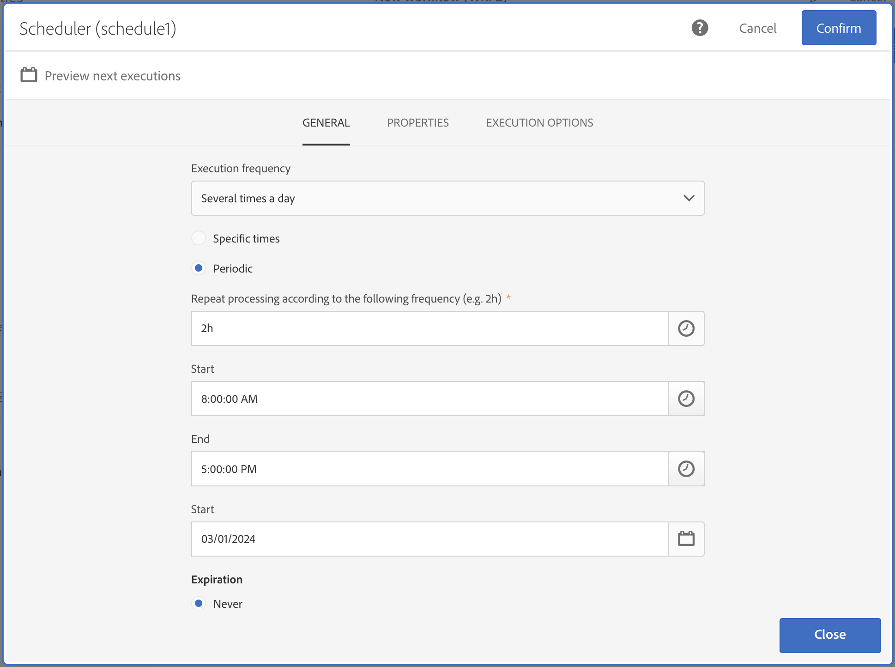

# Schemaläggare{#scheduler}

## Beskrivning {#description}

Med den här **[!UICONTROL Scheduler]**-aktiviteten kan du schemalägga när ett arbetsflöde eller en aktivitet ska starta.

## Kontext för användning {#context-of-use}

**[!UICONTROL Scheduler]**-aktiviteten bör betraktas som en planerad start.  Reglerna för aktivitetspositionering i diagrammet är desamma som för **[!UICONTROL Start]**-aktiviteten.  Den här aktiviteten får inte ha en inkommande övergång.

När du skapar arbetsflödet ska du endast använda en **[!UICONTROL Scheduler]**-aktivitet per gren och ange en tidszon.  På så sätt kan du starta arbetsflödet vid en viss tidszon. Annars körs arbetsflödet i den tidszon som definieras i egenskaperna för arbetsflödet (se [Skapa ett arbetsflöde](../../automating/using/building-a-workflow.md)).

>[!CAUTION]
>
>Aktivitetens **[!UICONTROL Repetition frequency]** får inte vara under 10 minuter.  Detta innebär att ett arbetsflöde inte kan köras automatiskt mer än en gång var 10:e minut.

När du utformar ett schemalagt arbetsflöde som innehåller flera aktiviteter måste du se till att arbetsflödet inte schemaläggs om förrän det är klart. För att göra detta måste du konfigurera arbetsflödet för att förhindra att det körs om en eller flera uppgifter från en tidigare körning fortfarande väntar. Mer information finns på [den här sidan](../../automating/using/scheduled-workflows-execution.md).

**Relaterade ämnen:**

* [Användningsfall: Skapa leveranser på profilens skapandedatum](../../automating/using/workflow-creation-date-query.md)
* [Användningsexempel: Skapa en e-postleverans varje tisdag](../../automating/using/workflow-weekly-offer.md)

## Konfiguration {#configuration}

1. Dra och släpp en **[!UICONTROL Scheduler]**-aktivitet i arbetsflödet.
1. Markera aktiviteten och öppna den sedan med -knappen bland de snabbåtgärder som visas.
1. Ange **[!UICONTROL Execution frequency]**:

   * **[!UICONTROL Once]**: arbetsflödet körs en enda gång.
   * **[!UICONTROL Several times a day]**: arbetsflödet körs regelbundet flera gånger om dagen.
   * **[!UICONTROL Daily]**: arbetsflödet körs vid en viss tidpunkt en gång om dagen.
   * **[!UICONTROL Weekly]**: arbetsflödet körs vid ett angivet tillfälle en eller flera gånger i veckan.
   * **[!UICONTROL Monthly]**: arbetsflödet körs vid ett angivet tillfälle en eller flera gånger i månaden.  Du kan välja de månader du vill att arbetsflödet ska köras.  Du kan också ställa in körningar på vissa veckodagar i månaden som till exempel den andra tisdagen i månaden.
   * **[!UICONTROL Yearly]**: arbetsflödet körs vid ett angivet tillfälle en eller flera gånger per år.

1. Konfigurera körningsinställningarna så att de passar dina behov. Tillgängliga alternativ kan variera beroende på vald körningsfrekvens (körningstid eller dagar, upprepningsfrekvens osv.).

   >[!NOTE]
   >
   >Fältet **[!UICONTROL Repetition frequency]** som är tillgängligt för körningsfrekvenserna Dagligen och Månadsvis gör att du kan ta bort de tidpunkter då arbetsflödet aktiveras. Om du exempelvis väljer en daglig körningsperiod och repetitionsfrekvensen är inställd på **2** dagar så kommer arbetsflödet att aktiveras varannan dag.  Det får inte vara under 10 minuter.  Om repetitionsfrekvensen anges till **&#x200B;**&#x200B;(även standardvärdet), beaktas inte det här alternativet och arbetsflödet körs enligt den angivna körningsfrekvensen.

   När du anger körningsfrekvensen till **[!UICONTROL Several times a day]** kan du välja mellan att köra arbetsflödet vid specifika tidpunkter på dagen eller regelbundet under dagen.

+++ Lär dig hur du konfigurerar en **[!UICONTROL "Several times a day"]**-körningsfrekvens

   * Om du vill köra arbetsflödet flera gånger under en viss tid på dagen aktiverar du alternativet **[!UICONTROL Specific times]** och klickar sedan på **[!UICONTROL Add an element]** för att ange önskad körningstid. Lägg till så många gånger som behövs för att anpassa er efter era behov.

   * Om du vill köra arbetsflödet regelbundet under dagen aktiverar du alternativet **[!UICONTROL Periodic]** och konfigurerar sedan körningsintervallet:

      1. I fältet **[!UICONTROL Repeat processing according to the following frequency (e.g. 2h)]** anger du intervallet som arbetsflödet ska köras med (t.ex. var 30:e minut, varannan timme).

         >[!NOTE]
         >
         >Det här alternativet tillåter även dagliga, månatliga eller årliga repetitionsfrekvenser. Observera att i det här fallet kommer arbetsflödet inte att köras flera gånger om dagen, utan snarare enligt den frekvens som du har angett i det här fältet.
         >
         > Om ditt arbetsflöde inte kräver flera körningar inom en dag, utan i stället måste köras varje dag, månad eller år, bör du använda alternativen **[!UICONTROL Daily]**, **[!UICONTROL Monthly]** eller **[!UICONTROL Yearly]** som finns i listrutan **[!UICONTROL Execution frequency]**.

      1. I tidsfälten **[!UICONTROL Start]**/**[!UICONTROL End]** anger du den tidpunkt då arbetsflödeskörningen ska starta och avslutas.

         Om ingen sluttid anges avslutas körningen kl. 02.00 och nästa körning startar nästa dag vid den angivna starttiden.:00:

      1. I datumfältet **[!UICONTROL Start]** väljer du det datum då den första körningen ska börja.

   I exemplet nedan är aktiviteten konfigurerad att köra arbetsflödet varannan timme mellan 08:00 och 17:00 den 1 mars.

   

+++

1. Ange när körningen ska upphöra:

   * **[!UICONTROL Never]**: arbetsflödet kommer att utföras enligt angiven frekvens och utan begränsningar av tidsramen eller antalet iterationer.
   * **[!UICONTROL After a certain number of iterations]**: arbetsflödet kommer att köras enligt den angivna frekvensen tills gränsen på **X** uppnås.  **[!UICONTROL Number of iterations]** kommer därför att behöva anges.
   * **[!UICONTROL On a specific date]**: arbetsflödet kommer att utföras enligt angiven frekvens fram till ett visst datum.  Tidsfristen för körningen måste av den anledningen anges.

1. Kontrollera schemat för de kommande tio körningarna av ditt arbetsflöde genom att klicka på **[!UICONTROL Preview next executions]**.

1. I **[!UICONTROL Execution options]**-fliken så anger du tidzonen för schemaläggaren i **[!UICONTROL Time zone]**-fältet.

   Mer information om hur du skickar leveranser beroende på mottagarens tidszon hittar du i det här [avsnittet](../../sending/using/sending-messages-at-the-recipient-s-time-zone.md), eller i det här [exemplet](../../automating/using/recurring-push-notifications.md) på ett återkommande arbetsflöde.

1. Bekräfta aktivitetens konfiguration och spara arbetsflödet.

## Exempel {#example}

I följande exempel är aktiviteten konfigurerad så att den startar arbetsflödet på veckobasis varannan måndag klockan 07:00 med obestämd varaktighet.

