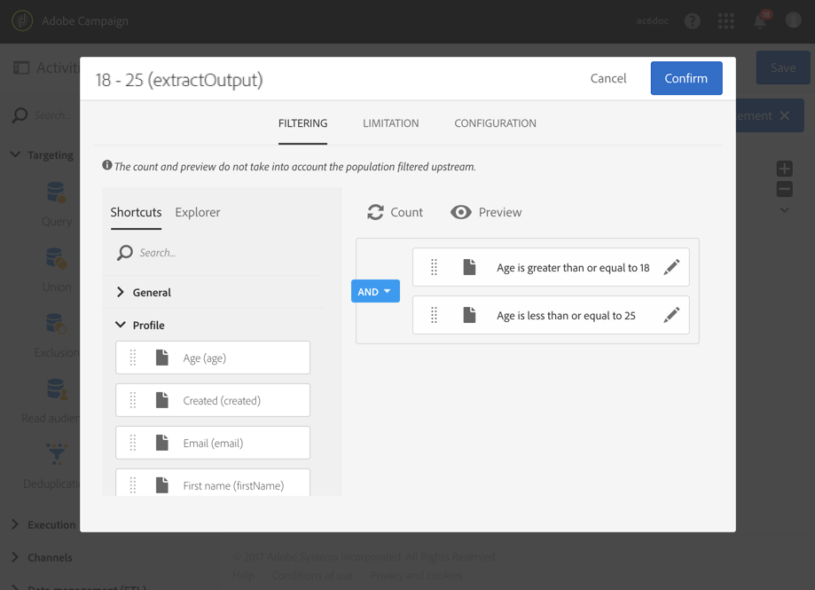

# Segmentering per åldersgrupp {#segmentation-age-groups}

I följande exempel visas en segmentering av databasprofiler utifrån deras åldersgrupp.  

Målet med arbetsflödet är att skicka ett specifikt e-postmeddelande till varje åldersgrupp.  Med tanke på att det här arbetsflödet är en del av en testkampanj så kan varje segment endast innehålla maximalt 100 profiler som väljs slumpmässigt för att både använda begränsade och representativa målgrupper.

Arbetsflödet består av följande element:

* En [schemaläggaraktivitet](../../automating/using/segmentation.md) som anger arbetsflödets körningsdatum.
* En [Fråga](../../automating/using/query.md)-aktivitet till målprofiler för personer vars födelsedag och e-postadress har angetts.
* En [segmenteringsaktivitet](../../automating/using/segmentation.md) som skapar tre segment indelade i olika utgående övergångar: 18-25 år gamla, 26-32 år gamla och profiler som är över 32 år gamla. Segmenten definieras enligt följande parametrar:

   

   * Ett filter på sidan som definierar segmentets åldersgrupp

      

   * En typgräns **[!UICONTROL Random sampling]** som är länkad till en gräns **[!UICONTROL Maximum size]** på 100

      

* En [e-postleveransaktivitet](../../automating/using/email-delivery.md) per segment.
